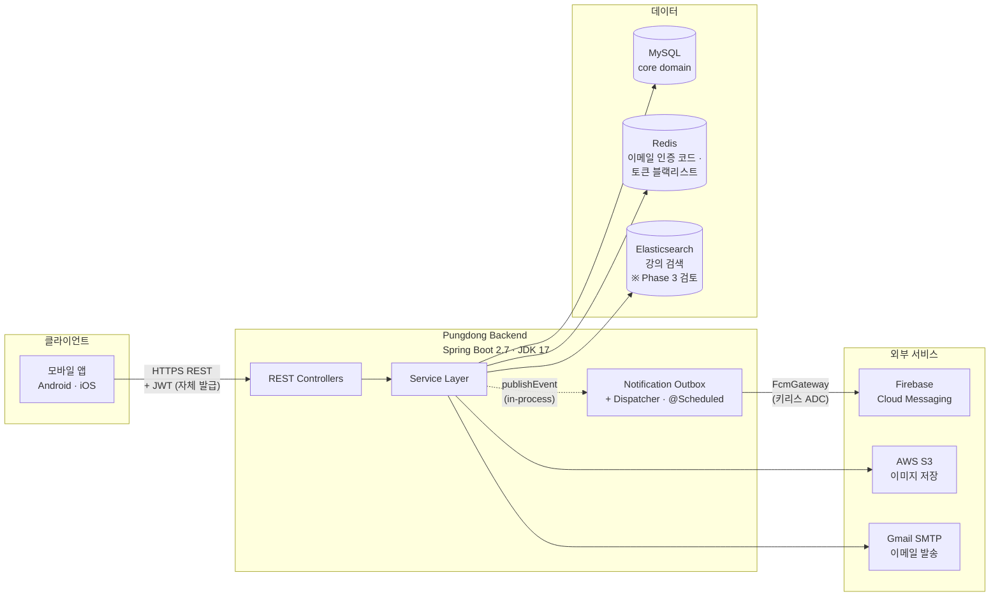

# Pungdong (풍덩) — 프리 다이빙 강의 예약 백엔드

프리 다이빙 강사와 수강생을 온라인으로 매칭시켜주는 서비스의 백엔드 API. 강사가 강의/스케줄을 개설하고, 수강생이 예약, 후기까지 한 곳에서.

> **2026-04월부터 진행 중인 단순화 작업.** 외부 OAuth 서버 / Eureka / QueryDSL / Spring Cloud Hoxton / Kafka 모두 제거됨. 알림은 in-process Spring Events + DB outbox + 워커 + FCM 으로 직결. 단계별 진행 현황과 의도는 [CLAUDE.md](CLAUDE.md) 참고.

## 아키텍처 (현재 상태)



**핵심 설계 결정:**

- **알림은 도메인 이벤트 → 아웃박스 → 발송 워커.** 비즈니스 트랜잭션과 같이 outbox에 기록 (롤백 시 같이 롤백). 워커가 주기적으로 픽업해서 FCM 호출. 실패는 자동 재시도 (exp backoff, 10회 한도). 자세한 의도는 [PR #9](../../pull/9), [PR #10](../../pull/10).
- **JWT 자체 발급.** 외부 OAuth 서버 분리되어 있던 거 흡수 완료 ([PR #7](../../pull/7)).
- **시크릿 외부화.** 평문 시크릿 git에서 제거, 환경변수 기반 ([PR #8](../../pull/8)). FCM 인증은 keyless ADC ([PR #11](../../pull/11)) — 운영 시 Workload Identity Federation으로 확장.

## 기술 스택

| 영역 | |
|---|---|
| 런타임 | Java 17, Spring Boot 2.7.18, Gradle 7.6 |
| 인증 | Spring Security 5.7 + JWT (자체 발급, HS256) |
| 데이터 | MySQL (운영) / H2 (테스트), JPA + Spring Data Specifications |
| 캐시 | Redis (이메일 인증, 토큰 블랙리스트) |
| 검색 | Elasticsearch (강의 검색 — Phase 3에서 제거 검토) |
| 푸시 알림 | Firebase Cloud Messaging — outbox 패턴 + 자동 재시도 |
| 파일 저장 | AWS S3 (`io.awspring.cloud:spring-cloud-starter-aws`) |
| 메일 | Gmail SMTP (이메일 인증 코드 발송) |
| API 문서 | Spring REST Docs (Asciidoctor 2.4) |
| 테스트 | JUnit 5, Mockito, embedded Redis (codemonstur fork) |

## 개발 시작하기

상세 가이드는 **[CLAUDE.md](CLAUDE.md)** 참고. 빠른 시작:

```bash
# 1) 로컬 의존성 (MySQL + Redis + Elasticsearch) 띄우기
docker compose up -d

# 2) 외부 yml 파일 1회 카피 (실제 값은 본인 환경에 맞춰 수정 가능)
cp src/main/resources/database.yml.example src/main/resources/database.yml
cp src/main/resources/redis.yml.example    src/main/resources/redis.yml
cp src/main/resources/aws.yml.example      src/main/resources/aws.yml

# 3) 테스트 실행 (도커 + yml 카피 없이도 동작 — H2 + 임베디드 Redis)
JAVA_HOME=$(/usr/libexec/java_home -v 17) ./gradlew test

# 4) 로컬 서버 부팅 (도커 + yml + .env.local 필요)
JAVA_HOME=$(/usr/libexec/java_home -v 17) ./gradlew bootRun
```

테스트는 `application-test.yml` + 임베디드 Redis로 자체 완결. 도커 + yml 카피는 `bootRun`(실제 서버 띄우기)에 필요. `.env.local` 셋업은 `.env.example` 참고.

## 진행 중인 단순화 phase

```
✅ Phase 0  Boot 2.3 → 2.7, JDK 11 → 17, Gradle 6 → 7, QueryDSL/Eureka 제거
✅ Phase 1  외부 Auth Server 흡수, SecurityFilterChain, 시크릿 외부화
🔄 Phase 2  Kafka → Spring Events + Outbox + FCM (2-A/B/C 완료, 2-D outbox cleanup 남음)
   Phase 3  Elasticsearch 제거 결정 (트래픽 측정 후)
   Phase 4  배포 재설계 (Docker / ECS / WIF 등)
   Phase 5  CI/CD 재설계 (staging/prod 분리)
   Phase 6  Boot 3 + JDK 21 (jakarta 마이그레이션)
```

각 phase 의도와 결정 근거는 [CLAUDE.md](CLAUDE.md)의 "Workflow & conventions" 섹션 + PR 본문에 기록.
