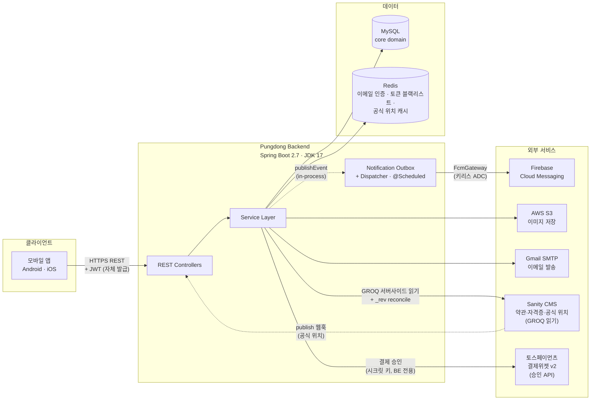

# Pungdong (풍덩) — 프리 다이빙 강의 예약 백엔드

[](https://github.com/pungdong/Pungdong-Backend/actions/workflows/ci.yml)

프리 다이빙 강사와 수강생을 온라인으로 매칭시켜주는 서비스의 백엔드 API. 강사가 강의/스케줄을 개설하고, 수강생이 예약, 후기까지 한 곳에서.

> **2026-04월부터 진행 중인 단순화 작업.** 외부 OAuth 서버 / Eureka / QueryDSL / Spring Cloud Hoxton / Kafka 모두 제거됨. 알림은 in-process Spring Events + DB outbox + 워커 + FCM 으로 직결. 단계별 진행 현황과 의도는 [CLAUDE.md](CLAUDE.md) 참고.

## 아키텍처 (현재 상태)



**핵심 설계 결정:**

- **알림은 도메인 이벤트 → 아웃박스 → 발송 워커.** 비즈니스 트랜잭션과 같이 outbox에 기록 (롤백 시 같이 롤백). 워커가 주기적으로 픽업해서 FCM 호출. 실패는 자동 재시도 (exp backoff, 10회 한도). 자세한 의도는 [PR #9](../../pull/9), [PR #10](../../pull/10).
- **JWT 자체 발급.** 외부 OAuth 서버 분리되어 있던 거 흡수 완료 ([PR #7](../../pull/7)).
- **시크릿 외부화.** 평문 시크릿 git에서 제거, 환경변수 기반 ([PR #8](../../pull/8)). FCM 인증은 keyless ADC ([PR #11](../../pull/11)) — 운영 시 Workload Identity Federation으로 확장.
- **결제는 토스페이먼츠 결제위젯 v2.** 강사 수락 → 결제 → 확정. 승인은 BE 가 시크릿 키로(`/v1/payments/confirm`), FE 엔 클라이언트 키만. 금액은 서버 권위값(클라 신뢰 안 함). 로컬 stub, staging/prod 만 실연동. 정책은 [docs/features/payment.md](docs/features/payment.md).

### 전체 그림 더 보기

위 토폴로지를 포함해 **요청 처리 계층 · 도메인 맵 · 핵심 유스케이스(개설→수강신청→알림) · 알림 아웃박스 파이프라인 · Sanity 읽기 기조** 까지 5가지 관점의 다이어그램을 한 곳에 모은 발표용 문서: **[docs/architecture/system-overview.md](docs/architecture/system-overview.md)**.

### 도메인별 줌인

한 단계 더 들어가서 도메인별 컴포넌트 / 흐름 / 데이터 모델을 보려면 [docs/architecture/](docs/architecture/) 참고. 각 문서는 `@DisplayName` 시나리오 테스트로 이어지는 포인터를 함께 제공한다.

## 기술 스택

| 영역 | |
|---|---|
| 런타임 | Java 17, Spring Boot 2.7.18, Gradle 7.6 |
| 인증 | Spring Security 5.7 + JWT (자체 발급, HS256) |
| 데이터 | MySQL (운영) / H2 (테스트), JPA + Spring Data Specifications |
| 캐시 | Redis (이메일 인증, 토큰 블랙리스트) |
| 검색 | MySQL (JpaSpecification — 제목·강사명 LIKE). 구 Elasticsearch 는 Phase 3에서 제거 |
| 푸시 알림 | Firebase Cloud Messaging — outbox 패턴 + 자동 재시도 |
| 파일 저장 | AWS S3 (`io.awspring.cloud:spring-cloud-starter-aws`) |
| 메일 | Gmail SMTP (이메일 인증 코드 발송) |
| API 문서 | Spring REST Docs (Asciidoctor JVM 3.3) |
| 테스트 | JUnit 5, Mockito, embedded Redis (codemonstur fork) |

## 개발 시작하기

상세 가이드는 **[CLAUDE.md](CLAUDE.md)** 참고.

### 최초 1회 셋업

| 항목 | 명령 / 위치 |
|---|---|
| OrbStack (또는 Docker Desktop) 설치 | `brew install --cask orbstack` |
| direnv 설치 (env vars 자동 로드용) | `brew install direnv` + `~/.zshrc` 에 `eval "$(direnv hook zsh)"` 추가 |
| 외부 yml 카피 | `cp src/main/resources/{database,redis,aws}.yml.example src/main/resources/{database,redis,aws}.yml` |
| `.env.local` 작성 | `.env.example` 참고. `direnv allow` 까지 |

### 일상 dev 흐름

```bash
# 서버 기동 / 재기동 — 한 방
./scripts/dev.sh
```

`scripts/dev.sh` 가 알아서: ① 8080 점유 프로세스 정리(=재기동 겸함) → ② `docker compose up -d` (의존성, 이미 떠 있으면 무시) → ③ `.env.local` 로드 → ④ JDK 17 로 `bootRun`. 종료는 `Ctrl+C`, 재시작도 같은 명령.

`Started PungdongApplication` 로그가 뜨고 터미널이 멈춰있으면 정상. 다른 터미널에서 확인:
```bash
curl "http://localhost:8080/sign/check/nickName?nickName=test"
# → {"exists":false, ...}
```

<details>
<summary>스크립트 없이 수동으로</summary>

```bash
docker compose up -d                                          # 의존성 (MySQL + Redis)
JAVA_HOME=$(/usr/libexec/java_home -v 17) ./gradlew bootRun   # 다른 터미널, Ctrl+C 종료
```
</details>

### Docker 명령어

```bash
docker compose ps                # 컨테이너 상태 확인
docker compose logs -f mysql     # MySQL 로그 실시간 (서비스명 변경 가능)
docker compose stop              # 정지 (데이터 유지)
docker compose down              # 정지 + 컨테이너 삭제 (볼륨/데이터 유지)
docker compose down -v           # 볼륨까지 삭제 (DB 초기화)
docker compose restart mysql     # 한 서비스만 재시작
```

DB 직접 접속:
```bash
docker compose exec mysql mysql -upungdong -ppungdongpw pungdong
docker compose exec redis redis-cli
```

### Gradle 명령어

```bash
# 매번 JAVA_HOME 입력 귀찮으면 ~/.zshrc 에 한 줄:
#   alias gw='JAVA_HOME=$(/usr/libexec/java_home -v 17) ./gradlew'

JAVA_HOME=$(/usr/libexec/java_home -v 17) ./gradlew test         # 전체 테스트 (도커 / yml 불필요 — 임베디드 H2 + Redis)
JAVA_HOME=$(/usr/libexec/java_home -v 17) ./gradlew bootRun      # 로컬 서버
JAVA_HOME=$(/usr/libexec/java_home -v 17) ./gradlew clean test   # 캐시 비우고 테스트
JAVA_HOME=$(/usr/libexec/java_home -v 17) ./gradlew test --tests com.diving.pungdong.usecase.AuthUseCaseTest
```

> **참고**: 테스트는 `application-test.yml` + 임베디드 Redis로 자체 완결 — 도커 / yml 카피 / env vars 없어도 동작. 도커 + yml + `.env.local` 은 `bootRun`(실제 서버) 에만 필요.

### 컨테이너 (Docker 이미지)

배포(Phase 4)용 멀티스테이지 [`Dockerfile`](Dockerfile): **JDK17 로 빌드 → JRE 런타임**, 비루트 유저, `/actuator/health` 헬스체크. 이미지 빌드는 **패키징만**(`-x test -x asciidoctor`) — 테스트/문서는 CI([ci.yml](.github/workflows/ci.yml))가 책임이라 배포가 테스트 실행에 묶이지 않는다.

`database.yml`/`redis.yml`/`aws.yml` 과 시크릿은 **이미지에 굽지 않고 런타임 주입** — `SPRING_CONFIG_LOCATION` env 로 `PungdongApplication` 의 기본 config 위치를 덮어쓴다(staging/prod 는 SSM, Phase 4 후속).

```bash
docker build -t pungdong:local .

# 로컬 docker MySQL·Redis 에 붙여 실행 (config 는 마운트 + env 주입)
docker run --rm -p 8080:8080 --network pungdong-backend_default \
  -e SPRING_CONFIG_LOCATION='classpath:application.yml,file:/cfg/database.yml,file:/cfg/redis.yml,file:/cfg/aws.yml' \
  -e JWT_SECRET=... -e ADMIN_MAIL_ID=... -e ADMIN_MAIL_PASSWORD=... \
  -e STORAGE_S3_ENABLED=true \
  -v /path/to/config:/cfg:ro \
  pungdong:local
# → Started PungdongApplication, GET /actuator/health = {"status":"UP"}
```

## 진행 중인 단순화 phase

```
✅ Phase 0  Boot 2.3 → 2.7, JDK 11 → 17, Gradle 6 → 7, QueryDSL/Eureka 제거
✅ Phase 1  외부 Auth Server 흡수, SecurityFilterChain, 시크릿 외부화 (+ 이메일 인증/토큰 정책 완성)
✅ Phase 2  Kafka → Spring Events + Outbox + FCM (2-A~D 완료)
✅ Phase 3  Elasticsearch 제거 (검색 = MySQL JpaSpecification 으로 치환)
   구조    layered → domain-based(package-by-feature) 전환 중 (account/notification 완료)
🔨 Phase 4  배포 재설계 (Docker / ECS / WIF 등) — 진행 중: Dockerfile ✅, 다음 = Terraform/ECS
   Phase 5  CI/CD 재설계 (staging/prod 분리)
   Phase 6  Boot 3 + JDK 21 (jakarta 마이그레이션)
```

각 phase 의도와 결정 근거는 [CLAUDE.md](CLAUDE.md)의 "Workflow & conventions" 섹션 + PR 본문에 기록.
