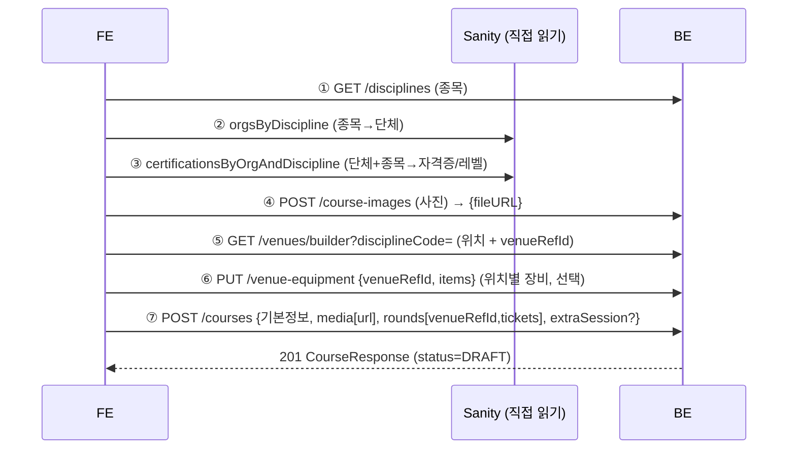

# FE 핸드오프 — 강의 생성 (course-create)

> FE 가 강의 생성 화면을 연동할 때 읽는 **흐름·오리엔테이션** 문서. **필드(요청/응답) 단일 출처는
> [`types.ts`](types.ts)**, 구현/모델은 [`docs/architecture/course.md`](../architecture/course.md) ·
> [`docs/architecture/venue.md`](../architecture/venue.md), 정책/왜는
> [`docs/features/course-create.md`](../features/course-create.md). 여기선 그 메커니즘을 복붙하지 않고
> **순서와 cross-cutting 주의**만 다룬다(drift 방지).

## 0. 공통 규칙
- **타입 단일 출처**: `https://raw.githubusercontent.com/pungdong/Pungdong-Backend/master/docs/api-clients/types.ts`
- **Authorization = raw JWT** (`Bearer ` 접두어 없음): `Authorization: <accessToken>`
- 에러(4xx/5xx) = `{ success:false, code, msg }`. **"예상된 부정"**(중복·없음 등)은 에러가 아니라 `200 + 결과필드`.
- HAL 응답(`_embedded`/`_links`) — `_links` 무시 가능.

## 1. 로그인 후 화면 분기 (임시 강사/수강생 탭뷰 대체)
- `GET /account` 응답의 **`roles`** 로 분기. **강사 = `roles.includes('INSTRUCTOR')`**(수강생과 공존).
- ⚠️ **JWT 클레임으로 분기 금지** — role 은 additive + 서버가 매 요청 재계산이라, 강사 승인 직후에도 토큰 클레임은 stale. `GET /account` 가 권위 소스.

## 2. 강의 생성 흐름



> **순서 핵심**: 종목(①)이 먼저 → 그 값으로 단체·자격증·위치를 필터. 종목 없이는 코스 생성 불가(400).

## 3. 엔드포인트 (필드는 types.ts)

| 용도 | API |
|---|---|
| 종목 목록 | `GET /disciplines` (public) |
| 사진 업로드 | `POST /course-images` (multipart `image`) → `{fileURL}` |
| 위치 목록(통합) | `GET /venues/builder?disciplineCode=&type=` — `_embedded.venues[]`, 각 `venueRefId`·`scope` |
| 커스텀 위치 추가 | `POST /venues` (빌더에 없을 때) |
| 장비 가격표 | `GET`·`PUT /venue-equipment?venueRefId=` — 목록 키 `_embedded.extensions[]` |
| 코스 | `POST /courses` · `GET /courses/mine` · `GET /courses/{id}` · `PUT /courses/{id}` · `PATCH /courses/{id}/status` |

## 4. 종목 → 단체 → 자격증 캐스케이드
- ① **종목**: `GET /disciplines` → `code`(FREEDIVING/SCUBA/MERMAID).
- ② **단체**: Sanity `orgsByDiscipline({disciplineCode})` → 그 종목 단체만.
- ③ **자격증(레벨)**: Sanity `certificationsByOrgAndDiscipline({code, disciplineCode})` → `{level, displayName}`. **표시 = `displayName`("AIDA 2"), 저장 = `level`(LEVEL_1~4/INSTRUCTOR).**
- → 코스 생성 시 `disciplineCode` + (CERTIFICATION이면) `organizationCode` + `levels[]`.

## 5. Sanity 직접 읽기 (BE 경유 X)
```ts
import { createClient } from '@sanity/client'
const sanity = createClient({ projectId: 'rc448mwo', dataset: 'production', apiVersion: '2024-01-01', useCdn: true })
```
- GROQ 문자열은 [`sanity/queries.ts`](../../sanity/queries.ts) 복사: `orgsByDiscipline`, `certificationsByOrgAndDiscipline`, (공식위치 *공개표시*용) `officialVenuesByDiscipline`.
- **코스 작성의 위치 선택은 Sanity 직접이 아니라 `GET /venues/builder`** — official+custom 합쳐서 `venueRefId` 와 함께 옴. Sanity 직접 읽기는 단체/자격증 + 공식위치 *공개 표시* 용.

## 6. 핵심 개념 & 주의
- **`venueRefId` 가 연결고리**: `"CUSTOM:<pk>"`/`"OFFICIAL:<sanityId>"`. 빌더에서 받은 값을 그대로 ⑥장비·⑦코스 회차에. 코스는 이 토큰으로 위치를 가리킴.
- **`CourseKind`**: `CERTIFICATION`만 `organizationCode`+`levels` 필수. `TRIAL`/`TRAINING`은 레벨 없음.
- **패키지**: `levels` 2개↑ → `isPackage:true`(서버 파생, 토글 없음).
- **회차**: `rounds` 개수 = `totalRounds`(불일치 400). 1회차 `platformConfirmed:true`. 추가세션 = `extraSession`(무료 N회 + 이후 회당가 → EXTRA 회차).
- **장비**: 위치별·강사 전역(코스와 독립). `GET /courses/{id}` 의 `rounds[].venues[].equipment` 에 그 위치 가격표가 **합성**돼 옴(목록 `/mine` 은 null). 사이즈 프리셋 자동(핀=신발mm/슈트=S~XL), override 가능. **사진만**(영상 후속).
- **입장료/이용권 가격은 위치(빌더 응답)에 들어있음** — 코스가 정하지 않음. 강사가 정하는 건 수강료 + 장비뿐.
- **상태**: `DRAFT`/`OPEN`/`CLOSED` (`PATCH /courses/{id}/status`), 강의별 검수 없음.

## 7. 새 FE 세션 부트스트랩 프롬프트
```
백엔드 API 타입 단일 출처:
https://raw.githubusercontent.com/pungdong/Pungdong-Backend/master/docs/api-clients/types.ts
흐름: docs/api-clients/course-create-handoff.md

로그인 후 GET /account 의 roles 로 강사/수강생 분기 (JWT 클레임 아님).
강의 생성: ①GET /disciplines ②Sanity orgsByDiscipline ③Sanity certificationsByOrgAndDiscipline
④POST /course-images ⑤GET /venues/builder ⑥PUT /venue-equipment ⑦POST /courses
규칙: Authorization=raw JWT(Bearer 없음), 에러={success,code,msg},
위치=venueRefId("CUSTOM:pk"/"OFFICIAL:sanityId"), 단체/자격증=Sanity 직접(projectId rc448mwo,useCdn:true),
CourseKind=CERTIFICATION만 organizationCode+levels 필수(2개↑=패키지), 회차수=totalRounds, 1회차 platformConfirmed.
```

## 본인(BE) 측 선행 — Sanity Studio 재배포
자격증 카탈로그 스키마는 머지됐지만 **호스티드 Studio 는 마지막 `sanity deploy` 시점 스키마**로 동작 → 단체별 "자격증(등급) 카탈로그" 필드가 안 보이면 `cd sanity && pnpm deploy`(또는 로컬 `pnpm dev`). 자격증은 별도 페이지가 아니라 **각 `자격증 발급 단체` 문서 안 중첩 필드**.
