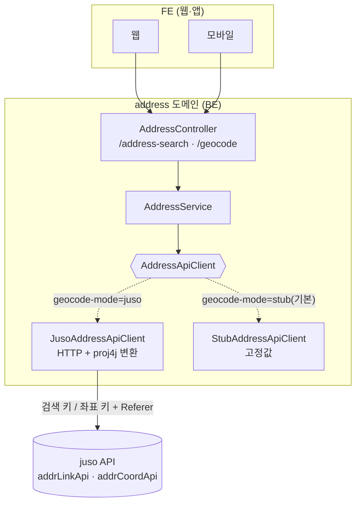
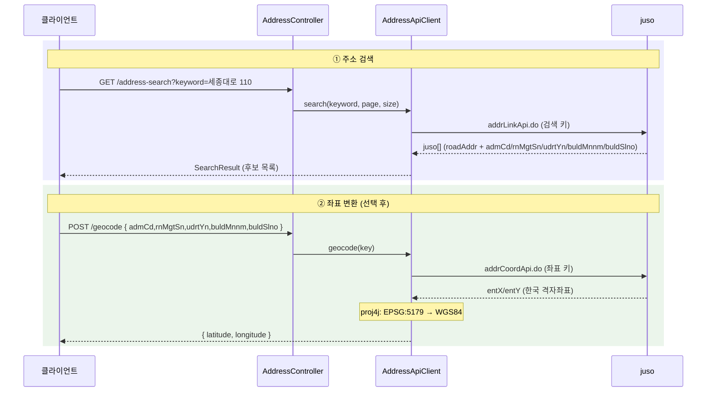

# 주소·위치정보 (address) 도메인

## 1. 한 줄 요약

**주소 검색 + 주소→좌표(geocoding)** 를 외부 juso(주소기반산업지원서비스) API 로 처리하되, **juso 통합을 BE 한 곳에 가두는** 도메인. FE(웹·앱)는 juso 를 직접 호출하지 않고(승인키 은닉 + 모바일 BFF 부재) 이 도메인의 `GET /address-search`·`POST /geocode` 만 거친다. 영속 상태 없는 **외부 경계 도메인** — `consent`(Sanity)·`identity-verification` 과 같은 "interface + 구현 교체" 패턴.

## 2. 컴포넌트 지도

- **키는 BE 밖으로 안 나감** — FE 는 BE 만 호출. juso 호출은 `JusoAddressApiClient` 만.
- 소비자: `venue` 커스텀 위치 생성(주소→좌표)·admin 공식 위치(Sanity write 전 좌표)·향후 주소 입력 화면. → venue 전용이 아니라 공용 도메인.

## 3. 핵심 흐름

juso `errorCode != "0"`(검색어 짧음·키 오류 등) → `BadRequestException`(400). 전송 실패 → `IllegalStateException`(500). 로컬은 stub 라 juso 미호출(결정적).

## 4. 데이터 모델 (영속 없음 — DTO·juso 매핑)

엔티티 없음(외부 경계). 핵심은 검색 결과의 키를 좌표 API 로 그대로 넘기는 것.

| record / dto | 필드 | 비고 |
|---|---|---|
| `AddressItem`(검색 결과) | roadAddr·jibunAddr·zipNo·bdNm·siNm·sggNm·emdNm + **admCd·rnMgtSn·udrtYn·buldMnnm·buldSlno** | 뒤 5개 = 좌표 변환 키 |
| `SearchResult` | totalCount·page·countPerPage·items[] | |
| `GeocodeKey`/`GeocodeRequest` | admCd·rnMgtSn·udrtYn·buldMnnm·buldSlno | juso 좌표제공 요청과 1:1 |
| `Coordinate` | latitude·longitude | **WGS84**(변환 후) |

juso 응답 `entX/entY` 는 한국 격자좌표(**EPSG:5179**, 실호출 검증 완료 §6) → proj4j 로 WGS84 변환.

## 5. 보안 / 권한 매트릭스

| 엔드포인트 | 인증 | 비고 |
|---|---|---|
| `GET /address-search` | 필요(authenticated) | keyword 필수(빈값 400) |
| `POST /geocode` | 필요(authenticated) | admCd/rnMgtSn/udrtYn/buldMnnm 필수 |

매처는 `global/security/SecurityConfiguration`. 승인키는 서버 env(`JUSO_SEARCH_KEY`/`JUSO_COORD_KEY`) — FE 노출 없음.

## 6. 알려진 설계 간극

- 🟢 **좌표계 = EPSG:5179 (검증 완료, 2026-06-13)** — 서울시청(세종대로 110) 실호출 `entX/entY`(953875, 1951999)를 EPSG:5179→WGS84 변환 시 37.5662/126.9777 로 일치(pyproj·proj4j 둘 다 확인). 기본 `source-crs` 그대로. (다른 후보 5174/5181/5186 은 만주로 튐.)
- 🟢 **실 juso 검증됨 (로컬, 2026-06-13)** — staging 키 + `Referer: <등록 URL>` 로 **로컬에서 검색·좌표 둘 다 errorCode 0**. 좌표제공은 개발키가 없어도 **referer 헤더면 로컬 실호출 가능**(`JusoAddressApiClient` 가 referer 세팅). 운영 배포 시 prod 키로 동일.
- 🟢 **캐싱 없음** — 같은 주소 반복 좌표 요청 시 juso 재호출. 필요해지면 캐시.
- 🟢 **rate limit / IP 차단** — juso 가 과다 호출/특수문자에 IP 차단(E0007). 검색어 필터링·호출 빈도 주의.

## 7. 더 깊게: 테스트로 보기

`usecase/AddressUseCaseTest` (실 H2 + 시큐리티 체인, **stub 모드** — 외부 juso 미호출, 결정적):
- `S1` `GET /address-search` → stub 후보(서울시청) + 좌표키 반환
- `S2` `POST /geocode` → stub 고정 WGS84 위경도
- `V1`·`V2` 빈 검색어 / 좌표 필수필드 누락 → 400
- `T1` 인증 없이 → 401

> ⚠️ Authorization 헤더는 **raw JWT**(Bearer prefix 없음). 실 juso(검색+좌표+EPSG:5179 변환)는 staging 키 + referer 로 **로컬 검증 완료**(§6).
