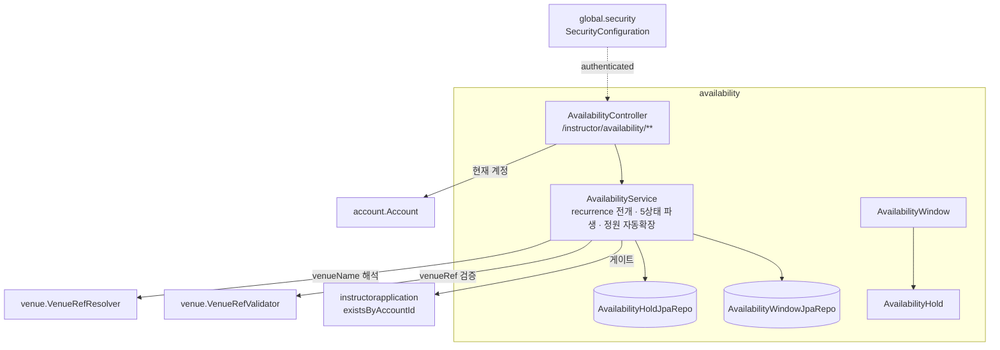
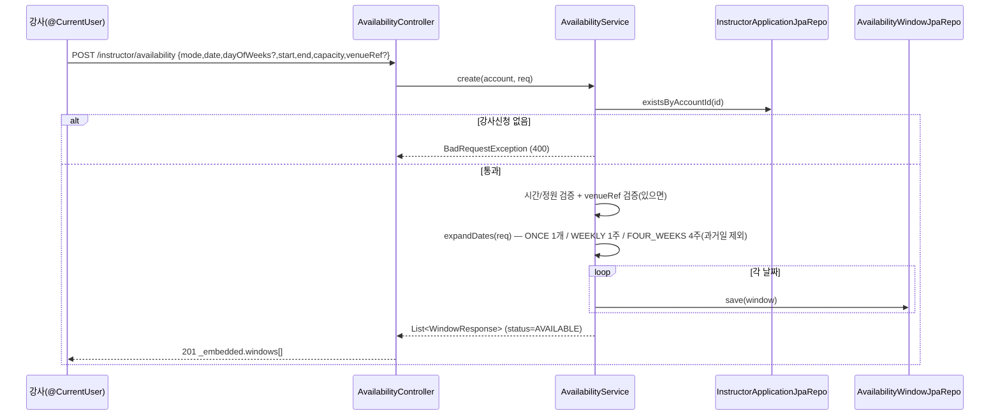
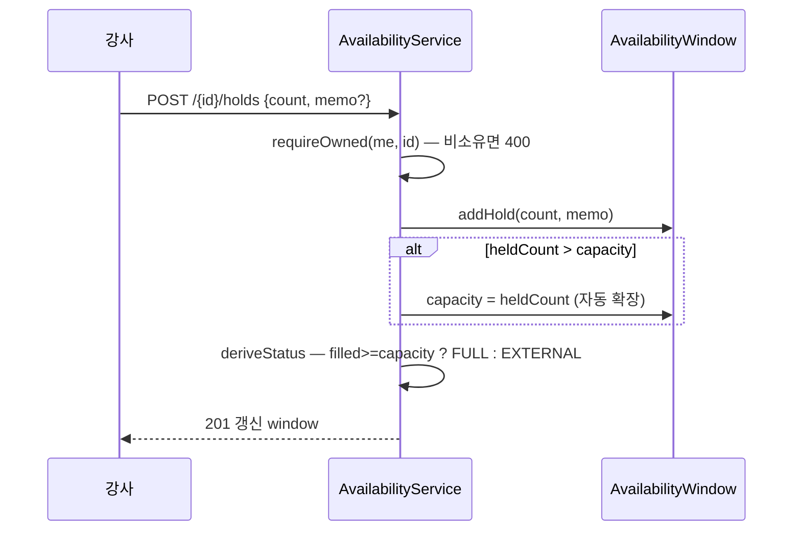
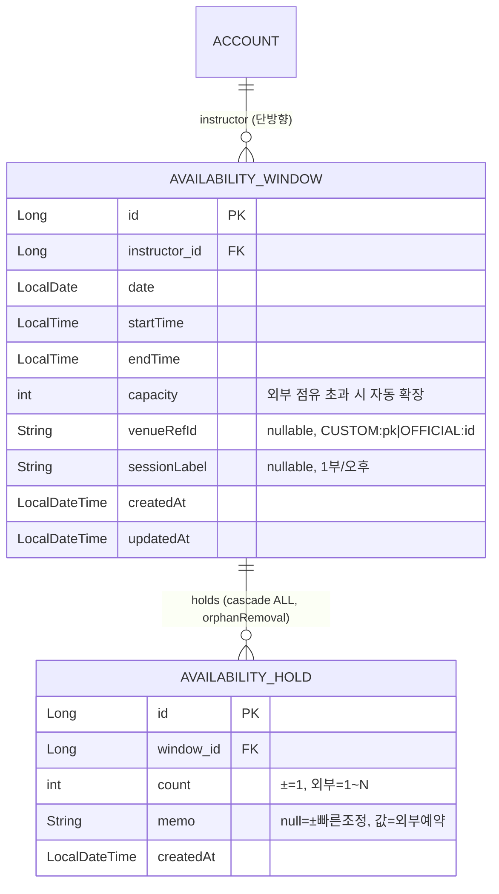

# availability — 강사 가용시간 캘린더

## 1. 한 줄 요약

강사가 가용시간(window)을 열고, 외부/수동 점유(hold)를 직접 기입해 한 캘린더에서 관리하는 도메인. **2층 모델**(window=이론적 가능성 / 점유=실제)과 **5상태 파생**(저장값 아님)이 핵심 invariant. **v1 BE-소유 코어** — 풍덩 수강생 점유(`pending`/`confirmed`/`applicants[]`)는 enrollment 도메인 산물이라 미연동(항상 0/빈 배열), 응답 모양만 forward-compatible. 정책·히스토리는 [docs/features/instructor-availability.md](../features/instructor-availability.md).

## 2. 컴포넌트 지도

의존 방향은 단방향 — availability → (account · instructorapplication · venue). 역참조 없음.

## 3. 흐름

### 3-1. 가용시간 생성 (recurrence 전개)

### 3-2. 점유 추가 (외부예약 / ± 빠른조정) + 정원 자동확장

## 4. 데이터 모델

**의도된 설계**: `venueRefId`/`sessionLabel` nullable — 빈 가용시간은 위치 없이 시간만. 점유는 hold 단일 테이블에 `memo` 로 두 조정 방식 흡수. `SlotStatus`·`filled`·`externalCount` 는 **저장 안 함** — 읽기 시 파생.

**의도적 미구현**: 풍덩 enrollment 와의 관계(미래 `AVAILABILITY_WINDOW ||--o{ ENROLLMENT`)는 booking 도메인이 생길 때. v1 응답의 `confirmedCount`/`pendingCount`/`applicants[]` 는 그 자리만 잡아둔 placeholder.

## 5. 보안 / 권한 매트릭스

매처: `/instructor/availability/**` → `authenticated` (`SecurityConfiguration`). 게이트는 서비스에서.

| 엔드포인트 | 인증 | 추가 게이트 | 소유권 |
|---|---|---|---|
| POST `/instructor/availability` | ✅ | 강사신청 보유(`existsByAccountId`) | instructor=현재 계정 |
| GET `/instructor/availability?from&to` | ✅ | — | 내 window 만 조회 |
| GET `/instructor/availability/{id}` | ✅ | — | 비소유 = 400(존재 숨김) |
| PUT `/instructor/availability/{id}` | ✅ | — | 비소유 = 400 / 정원<점유 = 400 |
| DELETE `/instructor/availability/{id}` | ✅ | — | 비소유 = 400 |
| POST `/instructor/availability/{id}/holds` | ✅ | — | 비소유 = 400 / count<1 = 400 |
| DELETE `/.../{id}/holds/{holdId}` | ✅ | — | 비소유/없는 hold = 400 |

## 6. 알려진 설계 간극

- 🟡 **enrollment 미연동** — `pending`/`confirmed`/`applicants[]` 는 항상 0/빈 배열. booking 도메인 생길 때 `deriveStatus` 의 confirmed/pending 인자만 채우면 동작(해결안: enrollment → window FK + 집계 주입).
- 🟡 **OFFICIAL venueRef 이름 해석** — `VenueRefResolver` 가 Sanity 캐시(`OfficialVenueCache`)에서 읽음. BE 의 OFFICIAL 동기화가 미완이면 `venueName=null` 가능(토큰은 보존). 해결안: [[venue-sanity-sync-design]].
- 🟢 **정원 축소 자동화 없음** — hold 제거 시 자동 확장된 capacity 는 안 줄임(강사가 수정으로 직접). 의도된 단순화.
- 🟢 **겹치는 window 허용** — 같은 날 시간 겹치는 window 를 막지 않음(디자인상 1부/2부 분할 등 합법 케이스 다수). 충돌 판단은 강사 몫(디자인 원칙 "사실은 보여주고 판단은 강사가").

## 7. 더 깊게: 테스트로 보기

- `src/test/.../usecase/AvailabilityUseCaseTest` — 실 H2 + 시큐리티 체인. 그룹 S/H/G/R/V. `@DisplayName` 을 위에서 아래로 읽으면 사양.
  - S1~S6: ONCE/WEEKLY/FOUR_WEEKS 생성·전개 개수, 범위 읽기, 수정, 삭제
  - H1~H3: 외부예약 점유→EXTERNAL, 정원 초과→자동확장→FULL, ±조정 추가/제거→AVAILABLE 복귀
  - G0/G1: 인증 401, 강사신청 없는 사용자 400
  - R1/R2: 남의 window 조회·점유 400
  - V1~V4: 시간 역전·정원<1·요일 빈 WEEKLY·정원 축소(점유 미만) 400
- REST Docs `document(...)` 컨트롤러 테스트는 venue/course 와 동일하게 미작성(후속).
