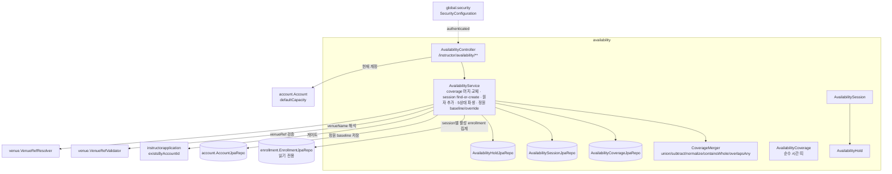
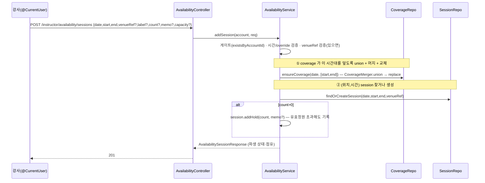
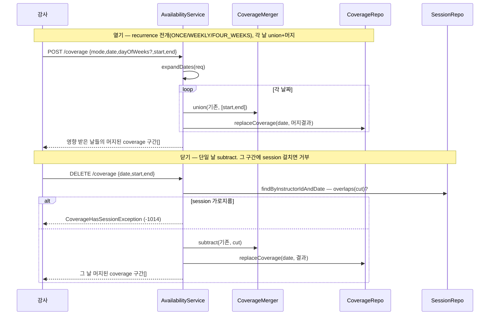
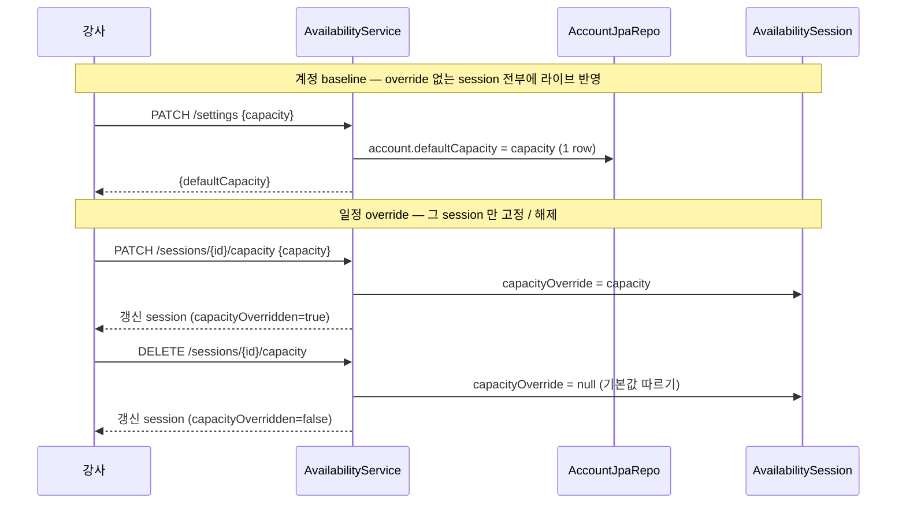
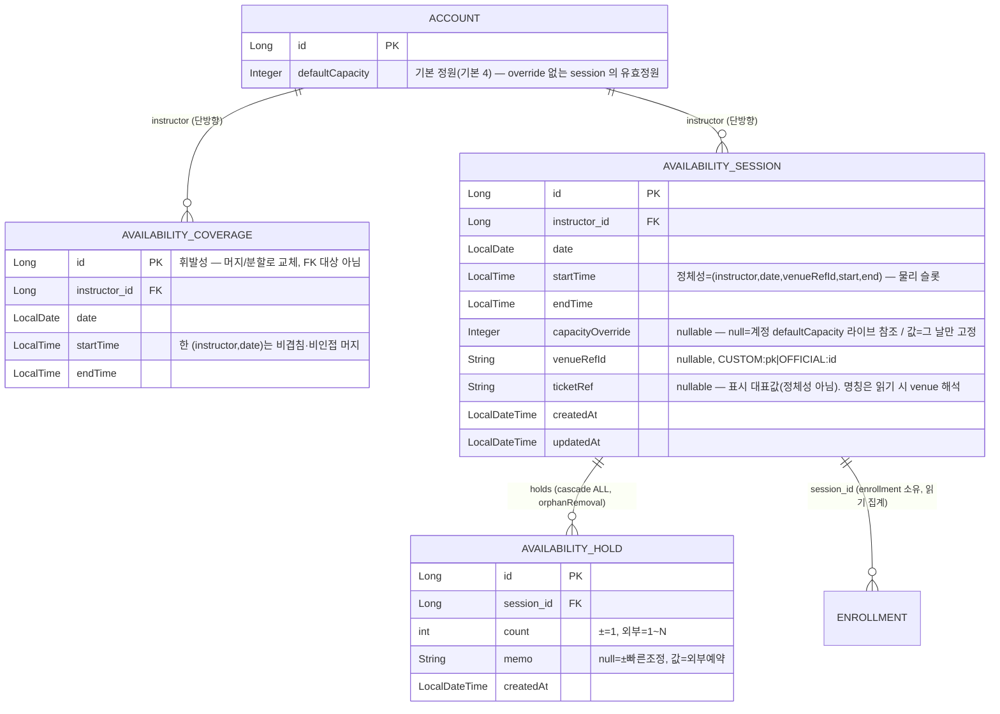

# availability — 강사 가용시간 캘린더

## 1. 한 줄 요약

강사가 **예약가능시간(coverage)**을 열고, 그 위에 **일정(session)**을 놓아 위치·정원·외부점유까지 한 캘린더에서 관리하는 도메인. **coverage/session 2층 모델**(coverage=순수 시간 띠 / session=위치·정원·점유)과 **5상태 파생**(저장값 아님)이 핵심 invariant. coverage 는 항상 비겹침·비인접으로 **머지**돼 저장되고, session 은 그 시간 안에 놓이며 결합은 **시간 포함 판정뿐**(FK 없음). 풍덩 수강생 점유(`pending`/`confirmed`/`applicants[]`)는 enrollment 도메인이 채운다(연동됨). 정책·히스토리는 [docs/features/instructor-availability.md](../features/instructor-availability.md).

## 2. 컴포넌트 지도

의존 방향은 단방향 — availability → (account · instructorapplication · venue · enrollment[repo, 읽기 전용]). enrollment repo 읽기는 캘린더가 풍덩 점유를 집계하기 위함.

**coverage↔session 결합(요약)**: coverage row id 는 머지/분할로 휘발성이라 session 이 FK 로 참조하지 않는다 — 두 레이어는 **시간 포함 판정**으로만 묶인다. 모든 session 은 어떤 coverage 구간에 ⊆(원자 일정추가가 보장, coverage 닫기는 session 가로지르면 거부).

**정원 모델(요약)**: 정원은 `Account.defaultCapacity`(기본 4)에 종속. session 은 `capacityOverride==null` 이면 그 값을 라이브 참조(`effectiveCapacity = override ?? account.defaultCapacity`), 그 날만 ±로 고정하면 override. baseline 변경은 account 1 row update 뿐(override 없는 session 은 저장 없이 따라감 — 전파 write 0). 정책·왜는 [features/instructor-availability.md](../features/instructor-availability.md) "정원" 절.

## 3. 흐름

### 3-1. 일정 원자 추가 (coverage 확장 + session find-or-create + hold)

### 3-2. 예약가능시간 열기/닫기 (머지 / 닫기 시 session 보호)

### 3-3. 정원 조정 (계정 baseline / 일정 override)

## 4. 데이터 모델

**의도된 설계**: coverage 는 위치/정원/사람 없는 **순수 시간 띠** — id 가 휘발성이라(머지/분할 때마다 그 날 row 통째 삭제 후 재생성) 아무도 FK 로 참조 안 한다. session 은 `(instructor,date,venueRefId,start,end)` 정체성으로 find-or-create — **물리 (위치,시간) 슬롯**, 같은 (위치,시간)이면 점유만 누적, 정원 공유. `ticketRef` 는 **정체성 아님**(같은 시간이 두 이용권 밑에 있어도 한 세션 — 쪼개면 정원 이중계산). `ticketRef`(표시 대표값)만 저장하고 응답 `sessionLabel` 은 그걸 venue 에서 해석한 이용권명(단일 출처, `venueName` 과 동일 패턴). `venueRefId`/`ticketRef` nullable(위치 없는 점유 = ± 일반 바쁨). 점유는 hold 단일 테이블에 `memo` 로 두 조정 방식 흡수. `SlotStatus`·`filled`·`externalCount`·**유효정원**(`effectiveCapacity`)는 **저장 안 함** — 읽기 시 파생. 정원의 출처는 `ACCOUNT.defaultCapacity`, `capacityOverride` 는 sparse — 안 건드린 session 은 계정 값을 라이브로 따라 baseline 변경에 전파 write 가 필요 없다.

**의도된 결합**: `AVAILABILITY_SESSION ||--o{ ENROLLMENT` 은 enrollment 도메인이 소유(`enrollment.session_id`). availability 는 그걸 **읽어서만** 집계(`confirmedCount`/`pendingCount`/`applicants[]` + `deriveStatus`).

## 5. 보안 / 권한 매트릭스

매처: `/instructor/availability/**` → `authenticated` (`SecurityConfiguration`). 게이트는 서비스에서.

| 엔드포인트 | 인증 | 추가 게이트 | 소유권 / 검증 |
|---|---|---|---|
| GET `/instructor/availability/settings` | ✅ | 강사신청 보유(`existsByAccountId`) | 현재 계정 defaultCapacity |
| PATCH `/instructor/availability/settings` | ✅ | 강사신청 보유 | capacity<1 = 400 |
| POST `/instructor/availability/coverage` | ✅ | 강사신청 보유 | 시간 역전/빈 전개 = 400 |
| DELETE `/instructor/availability/coverage` | ✅ | 강사신청 보유 | session 가로지르면 -1014 |
| GET `/instructor/availability?from&to` | ✅ | — | 내 coverage[]+sessions[] 만 |
| POST `/instructor/availability/sessions` | ✅ | 강사신청 보유 | 시간 역전/override<1/venueRef 무효 = 400 |
| GET `/instructor/availability/sessions/{id}` | ✅ | — | 비소유 = 400(존재 숨김) |
| DELETE `/instructor/availability/sessions/{id}` | ✅ | — | 비소유 = 400 / 활성(PENDING·CONFIRMED) 신청 있으면 400 |
| PATCH `/instructor/availability/sessions/{id}/capacity` | ✅ | — | 비소유 = 400 / capacity<1 = 400 |
| DELETE `/instructor/availability/sessions/{id}/capacity` | ✅ | — | 비소유 = 400 (override 해제) |
| POST `/instructor/availability/sessions/{id}/holds` | ✅ | — | 비소유 = 400 / count<1 = 400 |
| DELETE `/.../sessions/{id}/holds/{holdId}` | ✅ | — | 비소유/없는 hold = 400 |

## 6. 알려진 설계 간극

- 🟡 **OFFICIAL venueRef 이름 해석** — `VenueRefResolver` 가 Sanity 캐시(`OfficialVenueCache`)에서 읽음. BE 의 OFFICIAL 동기화가 미완이면 `venueName=null` 가능(토큰은 보존). 해결안: [[venue-sanity-sync-design]].
- 🟡 **coverage 닫기 = 수동 정리 의존** — 닫기가 session 을 가로지르면 -1014 로 거부하고 BE 가 자동 정리하지 않는다(CS 유발 회피). 강사가 일정을 먼저 지워야 닫힌다. 해결안: FE 가드 + (필요 시) "일정 함께 정리" 확인 플로우.
- 🟢 **유효정원 < 점유 허용(확정 바닥)** — baseline/override 를 점유보다 낮춰도 막지 않음. 확정 점유는 유지(취소 없음), 새 신청 수락만 차단. 옛 "정원 자동확장"을 대체한 의도된 단순화.
- 🟢 **"새 baseline 을 기존 일정에 일괄 적용" 버튼 미구현** — 라이브 참조라 override 없는 session 은 자동 반영되므로 불필요하지만, override 한 session 까지 일괄로 되돌리는 액션은 후속(필요 시).
- 🟢 **겹치는 session 허용** — 같은 날 시간 겹치는 session 을 막지 않음(1부/2부 분할 등 합법 케이스 다수). coverage 는 머지되지만 session 정체성에 venueRefId 가 들어가 같은 시간 다른 위치 session 공존 가능. 충돌 판단은 강사 몫(디자인 원칙 "사실은 보여주고 판단은 강사가").

## 7. 더 깊게: 테스트로 보기

- `src/test/.../usecase/AvailabilityUseCaseTest` — 실 H2 + 시큐리티 체인. 그룹 CV/SS/CAL/C/G/V/R. `@DisplayName` 을 위에서 아래로 읽으면 사양.
  - CV1~CV*: coverage 열기 머지(10–12 + 12–14 → 10–14), 닫기 분할/축소, 닫기가 session 가로지름 → -1014
  - SS1~SS*: 일정 원자 추가(coverage 자동 확장+머지), 같은 (위치,시간) 누적 join, 활성 신청 있는 session 삭제 거부, 외부 점유 정원 초과해도 기록→FULL
  - CAL1~CAL*: `?from&to` 두 레이어 분리 읽기(coverage[]+sessions[])
  - C1~C*: 기본 정원 4, baseline 변경 라이브 전파, override 격리(baseline 무영향), override 해제, 유효정원<점유 시 확정 유지
  - G0/G1: 인증 401, 강사신청 없는 사용자 400
  - V1~V*: 시간 역전·정원<1·요일 빈 WEEKLY·기본정원<1·override<1 400
  - R1/R2: 남의 session 조회·점유 400
- REST Docs `document(...)` 컨트롤러 테스트는 venue/course 와 동일하게 미작성(후속).
