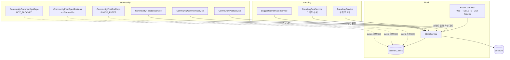
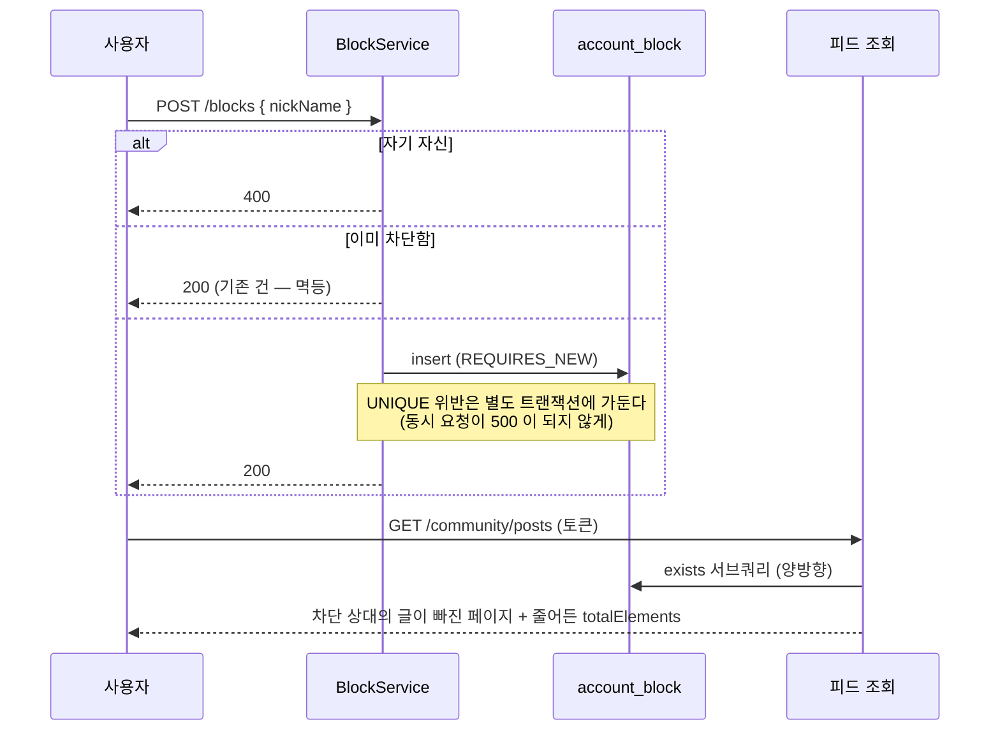
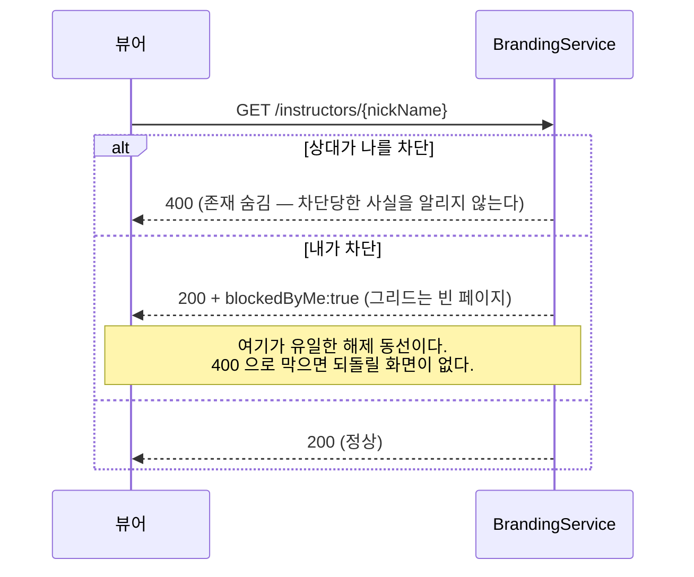
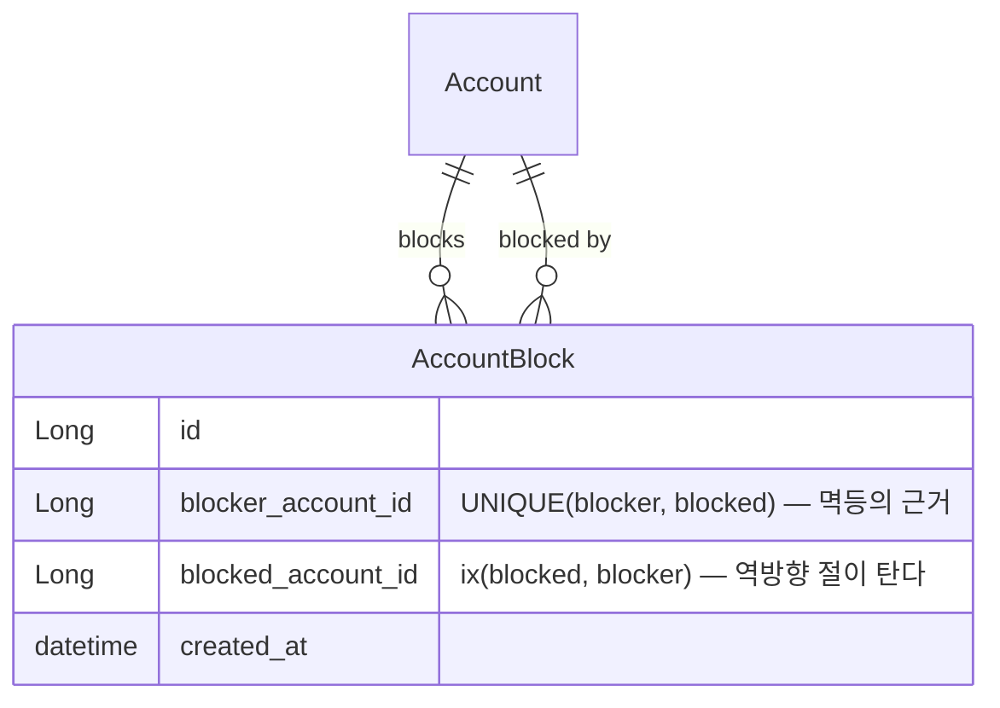

# block (유저 차단)

> 정책·왜·결정 히스토리는 [features/moderation.md](../features/moderation.md) 가 소유한다. 여기는 *어떻게* — 구조·쿼리·권한.

## 1. 한 줄

**계정 쌍의 관계 한 행**(`account_block`)으로 커뮤니티 표면에서 서로를 지운다. 핵심 invariant 셋:
**필터는 서버가 쿼리 안에서 건다**(클라이언트가 목록에서 빼면 페이징이 거짓이 된다),
**효과는 양방향이다**(내가 차단하면 상대도 내 글을 못 본다),
**거래 관계는 건드리지 않는다**(강의·수강·결제·단체 채팅은 차단과 무관하다).

이 도메인은 `account` 만 단방향 참조한다. 커뮤니티·브랜딩이 **둘 다** 차단을 읽어야 하는데
`branding` 은 `community` 를 import 할 수 없어서, 커뮤니티 안에 두면 브랜딩이 쓸 수 없다 —
`content_report` 가 정확히 그 문제를 겪었다([features/post-surfaces.md](../features/post-surfaces.md)).

## 2. 컴포넌트 지도

점선(`-.->`)이 **페이징되는 조회**다 — 서비스를 거치지 않고 쿼리 안에서 직접 거른다.
실선이 **단건·비페이징 경로**로, 여기서만 `BlockService` 의 판정 메서드를 쓴다.

## 3. 흐름

### 3-1. 차단 → 피드에서 사라짐

### 3-2. 프로필의 두 방향 비대칭

## 4. 데이터 모델

설계 의도 / 함정:

- **인덱스가 두 방향인 게 필수다.** 필터 술어가
  `(blocker=뷰어 and blocked=작성자) or (blocked=뷰어 and blocker=작성자)` 로 양방향이라,
  뒤 절을 받는 `ix_account_block_reverse` 가 없으면 피드 한 페이지마다 `account_block` 풀스캔이 붙는다.
- **`(blocker, blocked)` UNIQUE 가 멱등성의 근거다** — 좋아요·북마크·신고와 같은 규칙. 중복 차단은 200 이다.
- **FK 는 `ON DELETE CASCADE`.** 탈퇴는 soft delete + 익명화라 계정 행이 사라지는 정상 경로는 없지만,
  관리자 정리·시드 재생성에서 지우면 고아 행이 남는다. 정리 책임은 DB 한 곳에 둔다.
- **자기 자신 차단 방지는 DB CHECK 이 아니라 서비스 가드**다(레포 관례 — 기대되는 거절은 400 메시지로).

## 5. 권한 매트릭스

| 엔드포인트 | 인증 | 역할 | 소유권 |
|---|---|---|---|
| `POST /blocks` | 필요 | 인증만 | 차단자는 세션에서 — 요청은 대상 닉네임만 받는다 |
| `DELETE /blocks/{nickName}` | 필요 | 인증만 | 내 차단 행만 지운다(남의 차단은 조회 자체가 안 된다) |
| `GET /blocks` | 필요 | 인증만 | 내 목록만 |

매처는 `global/security/SecurityConfiguration`. ⚠️ `/blocks` 와 `/blocks/**` 를 **함께** 적는다 —
ant 의 `*` 는 `/` 를 넘지 않아 형제 경로를 빠뜨리면 401 이 난다(커뮤니티에 전례가 있다).

**차단자 신원은 항상 세션에서 온다** — 요청 어디에도 계정 id 가 없다(루트 CLAUDE.md anti-IDOR).
대상도 순차 id 가 아니라 닉네임이다.

## 6. 알려진 설계 간극

- 🟡 **인기 태그는 차단을 반영하지 않는다**(`/community/tags/popular`). 태그 문자열만 세는 전역 집계라
  작성자가 드러나지 않아 의도적으로 뒀다. 차단 유저가 혼자 쓰는 희귀 태그가 사이드바에 남을 수는 있다 —
  해결안: 그 쿼리에도 뷰어 인자를 넣으면 되지만, 위젯 하나 때문에 전역 집계가 뷰어별로 갈린다.
- 🟡 **좋아요·북마크 카운트는 차단을 반영하지 않는다.** 눈에 보이는 목록이 아니라 숫자뿐이라 맞추지 않았다
  (댓글은 목록이 보이므로 맞춘다). 해결안: 필요해지면 댓글과 같은 방식으로 뷰어 인자를 추가.
- 🟡 **레이트리밋이 없다.** UNIQUE 로 멱등이라 연타는 안전하지만 대량 차단을 막지는 않는다.
  커뮤니티 글·댓글도 같은 상태라 별도 인프라가 생길 때 함께 다룬다.
- 🟢 **차단 사유를 받지 않는다.** 사유가 필요한 건 신고이고, 차단은 개인 취향이라 서버가 알 이유가 없다.

## 7. 더 깊게: 테스트로 보기

`src/test/java/com/diving/pungdong/usecase/BlockUseCaseTest.java` — `B1~B16` 을 위에서 아래로 읽으면 사양이다.

- `B1~B3` **세 피드 경로**(최신순 Specification · 인기순 전용쿼리 · 같이가요 전용쿼리)에서 각각 사라진다
- `B4` 양방향 / `B5·B6` 댓글과 **댓글 수가 같은 기준** / `B7` 딥링크 / `B8` 반응 가드
- `B9` 멱등·자기차단 / `B10` 해제 / `B11·B12` 프로필 두 방향 / `B13` 추천 강사 / `B14` 목록
- `B15` **차단해도 강의는 그대로 보인다**(범위 결정의 회귀 방지) / `B16` 비로그인은 무필터
