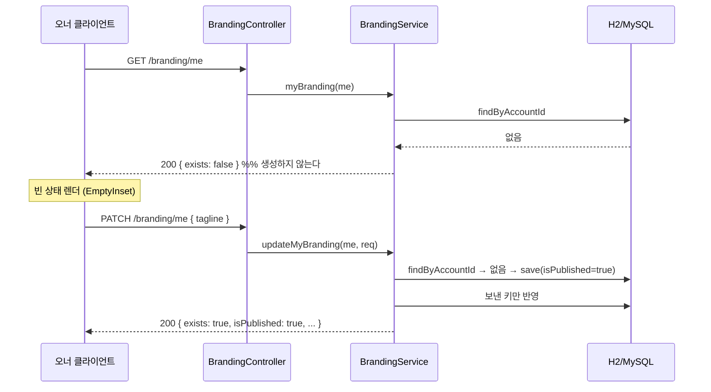
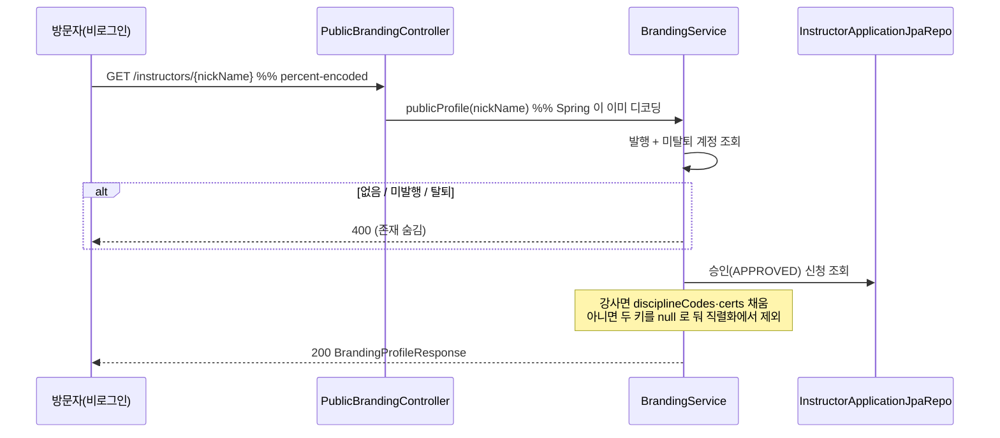

# 브랜딩 (branding) 도메인

## 1. 한 줄 요약

**브랜딩 페이지 = 계정당 1개의 공개 프로필** — 강사에겐 "브랜딩 페이지", 일반 유저에겐 "내 프로필"(워딩만 role 분기). 정체성(tagline·bio·활동지역·아바타) + 공식기록 + 게시물(후속 PR)로 구성되고, **공개 URL 식별자는 순차 id 가 아니라 `nickName`** 이다. 핵심 invariant 둘: **조회는 절대 생성하지 않는다**(생성은 첫 쓰기가 한다), **강사 한정 요소는 소유하지 않고 읽기 시점에 합성한다**(자격·검수상태는 `instructorapplication` 소유).

> 정책·왜·결정 히스토리는 [docs/features/account-branding.md](../features/account-branding.md). 이 문서는 *어떻게(구현)*.

## 2. 컴포넌트 지도

```mermaid
flowchart TB
  subgraph branding["branding 패키지 (BE)"]
    PBC[PublicBrandingController<br/>GET /instructors/&#123;nickName&#125;] --> BS[BrandingService]
    BC[BrandingController<br/>/branding/me/**] --> BS
    BS --> BR[AccountBrandingJpaRepo]
    BR --> E[(AccountBranding<br/>→ BrandingRecord)]
  end
  BS -. 단방향 .-> ACC[account.Account<br/>닉네임·프로필사진]
  BS -. 단방향 .-> IA[instructorapplication<br/>승인 자격·검수상태·승인시각]
  FE["수강생/방문자"] -- "비로그인 조회" --> PBC
  FE2["오너(강사·일반)"] -- "편집·발행" --> BC

  classDef ext fill:#eef
  class ACC,IA ext
```



- **합성 방향은 단방향** — `account`·`instructorapplication` 은 branding 을 모른다. account 가 feature 도메인을 import 하지 않는 루트 규칙 때문에 합성을 별도 패키지로 뺐다(`profile` 패키지가 만든 선례).
- 자격 뱃지(`certs`)·종목·검수상태·승인시각은 **저장하지 않고** 승인된 강사 신청에서 매 조회 시 파생한다.

## 3. 흐름

### 3-1. 첫 쓰기가 곧 생성 (upsert)



**GET 이 생성하지 않는 이유**: 프리페치·재시도·캐시/CDN·브라우저 speculative fetch 가 전부 쓰기를 유발하고, 페이지를 열어보기만 한 계정 전원에게 빈 row 가 생긴다. 레포 규약(reads use GET)도 깨진다.

### 3-2. 공개 조회



## 4. 데이터 모델

```mermaid
erDiagram
  Account ||--o| AccountBranding : "1:1 (account_id UNIQUE)"
  AccountBranding ||--o{ BrandingRecord : records
  AccountBranding ||--o{ BrandingPost : posts
  BrandingPost ||--o{ BrandingPostMedia : media
  BrandingPost ||--o{ BrandingPostTag : tags
  BrandingPost }o--o| Course : "linked_course_id (nullable)"

  AccountBranding {
    Long id
    Long account_id "UNIQUE, FK"
    String tagline "60"
    String bio "500"
    String location_label "60"
    boolean is_published "생성 시 true"
    OffsetDateTime created_at
    OffsetDateTime updated_at
  }
  BrandingRecord {
    enum medal "GOLD|SILVER|BRONZE"
    enum event_code "CWT|FIM|CNF|DYN|DNF|STA"
    String record_value "단위가 종목마다 달라 문자열"
    int sort_order
  }
  BrandingPost {
    String caption "2000"
    String location_label
    boolean pinned
    boolean is_hidden "삭제와 별개, 되돌릴 수 있음"
  }
  BrandingPostMedia { enum kind "PHOTO|VIDEO", String url, int sort_order }
  BrandingPostTag { String tag "30" }
```

설계 의도 / 함정:

- **`account_branding`** — `instructor_` 가 아니다. 일반 유저도 쓴다(D2).
- **`event_code` 는 `discipline.Discipline` 과 다른 축이다.** 종목(FREEDIVING·SCUBA·MERMAID) vs 프리다이빙 경기 세부종목(CWT·FIM·…). 같은 "discipline" 이라 부르면 반드시 사고 나서 이름을 분리했다.
- **`record_value` 컬럼명** — `value` 는 H2(테스트 DB) 예약어라 스키마 생성이 깨진다. API 필드명은 `value` 유지.
- **`linked_course_id` 는 `ON DELETE SET NULL`** — 코스가 지워져도 게시물은 살고 연결만 끊긴다.
- **게시물 3개 테이블은 V17 에서 미리 만들고 엔티티/엔드포인트는 후속 PR** — `hbm2ddl=validate` 는 엔티티에 대응하는 테이블만 보므로 무해하고, 마이그레이션 횟수를 줄인다.
- 🟡 **`account.nick_name` 에 UNIQUE 인덱스가 아직 없다** — §6 참고.

## 5. 보안 / 권한 매트릭스

매처는 `global/security/SecurityConfiguration`. **`/instructors/*` 는 기존 리터럴 `/instructors/public` 보다 뒤에** 둔다(그래야 목록 엔드포인트가 가려지지 않는다). ⚠️ ant 의 `*` 는 `/` 를 넘지 않으므로 하위 경로는 매처를 따로 추가해야 한다.

| 엔드포인트 | 인증 | 역할 | 소유권 |
|---|---|---|---|
| `GET /instructors/{nickName}` | **불필요** | — | `is_published=true` + 미탈퇴만. 그 외 **400(존재 숨김)** |
| `GET /instructors/{nickName}/posts` | **불필요** | — | 위 + `is_hidden=false` 만. 정렬·size 는 서버 고정 |
| `GET /branding-posts/{postId}` | **불필요** | — | 발행 프로필의 숨기지 않은 글만. 그 외 **400** |
| `GET /branding/me` | 필요 | **인증만** | `@CurrentUser` 기준. 미생성이면 `{exists:false}` |
| `PATCH /branding/me` | 필요 | 인증만 | 동일. 미생성이면 생성(upsert) |
| `PATCH /branding/me/publish` | 필요 | 인증만 | 동일. **승인 게이트 없음** |
| `GET /branding/me/posts` | 필요 | 인증만 | 내 것만 — **숨김 포함**. 프로필 미생성이면 빈 페이지 |
| `POST /branding/me/posts` | 필요 | 인증만 | 미생성이면 생성(upsert). 연결 강의는 **내 코스**만 |
| `PUT · DELETE /branding/me/posts/{id}` | 필요 | 인증만 | `post.branding.account.id == me.id` 아니면 **400** |
| `PATCH /branding/me/posts/{id}/pin · /visibility` | 필요 | 인증만 | 동일 |
| `POST /branding-images` | 필요 | 인증만 | multipart → `{fileURL}` |

**왜 `hasRole("INSTRUCTOR")` 가 아닌가** — (a) 일반 유저도 쓰고, (b) 강사도 **승인 전(pending/rejected)에 편집 화면이 존재**한다. 승인 전에는 `ROLE_INSTRUCTOR` 가 없어 role 로 막으면 그 화면이 403 이 된다. 레포도 같은 이유로 `/courses/**` 를 `authenticated()` 로 둔다.

**신원은 항상 세션에서** — account id 를 파라미터로 받지 않는다(anti-IDOR).

## 6. 알려진 설계 간극

- 🔴 **`account.nick_name` UNIQUE 인덱스 부재** — 공개 URL 식별자인데 유일성이 DB 로 보장되지 않는다(중복 방지는 가입 시 애플리케이션 체크뿐이라 레이스로 뚫린다). dedupe 는 **유저에게 보이는 식별자를 바꾸는 동작**이라 실데이터 사전 점검·승인이 선행돼야 하고, 그 조회 경로가 현재 인프라에 없다(ECS Exec 비활성 + 런타임 이미지에 mysql 클라이언트 없음). 그때까지 공개 조회는 **결정적 정렬(가장 오래된 계정) + 첫 건**으로 중복에 안전하게 동작한다. → 별도 PR.
- 🔴 **`/`·`\` 가 든 닉네임은 프로필을 열 수 없다** — Spring Security `StrictHttpFirewall` 이 인코딩된 슬래시 요청을 거부한다(path traversal 방어). 방화벽을 푸는 건 하지 않는다. 신규 입력은 형식 가드로 막고, 기존 보유자는 위 사전 점검에서 함께 리포트한다. 한글·공백·`.`·`+` 는 정상(use-case 테스트로 고정).
- 🟡 **닉네임 형식 가드·예약어 차단 미구현** — `public` 같은 예약어가 기존 계정에 있으면 그 프로필은 리터럴 라우트에 가려 영구히 안 열린다. 위 UNIQUE 작업과 함께.
- 🟡 **파생 통계(`stats`·`products`) 미구현** — 게시물 수·수강생 수·강의 수. 후속 PR.
- 🟡 **게시물·자격 편집 미구현** — 기록 편집(스냅샷 교체)과 게시물 CRUD 는 후속 PR. 자격 자유입력은 폐기됐고(D5) 파생 `certs` 만 노출한다.

## 7. 더 깊게: 테스트로 보기

`usecase/BrandingUseCaseTest` (실 H2 + 실 시큐리티 필터체인). `@DisplayName` 위→아래 = 사양:

- `C1` 조회는 생성하지 않는다(행이 안 생기는 것까지 확인) / `C2` 첫 PATCH 가 생성 + 발행 상태
- `S1` 비로그인 공개 조회 / `S2` 보낸 키만 반영·명시적 null 은 비우기 / `S3` 발행 끄면 공개 차단
- `I1` 강사는 `isInstructor`·종목·자격 뱃지 / `I2` **일반 유저는 그 키가 아예 없음** / `I3` 신청 이력 없으면 검수 키 없음 / `I4` 승인 강사는 `reviewStatus`·`approvedAt`
- `E1` 한글 닉네임 / `E2` 공백·`.`·`+` / **`E3` `/` 는 방화벽이 거부**
- `V1` 없는 닉네임 400 / `V2` 60자 초과 400 + 사용자 문구, 그리고 **검증 실패면 생성도 안 된다**
- `R1` 비로그인 401 / `R2` 강사가 아니어도 편집·발행 가능 / `R3` `/instructors/public` 이 가려지지 않는다
