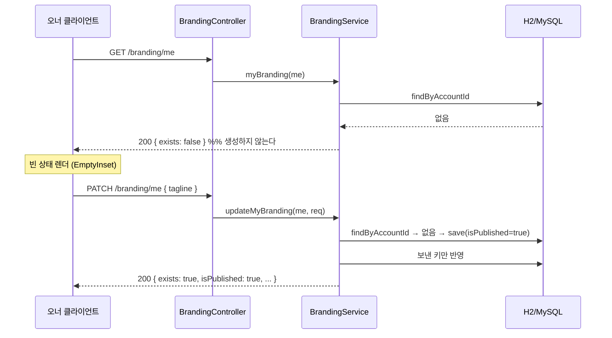
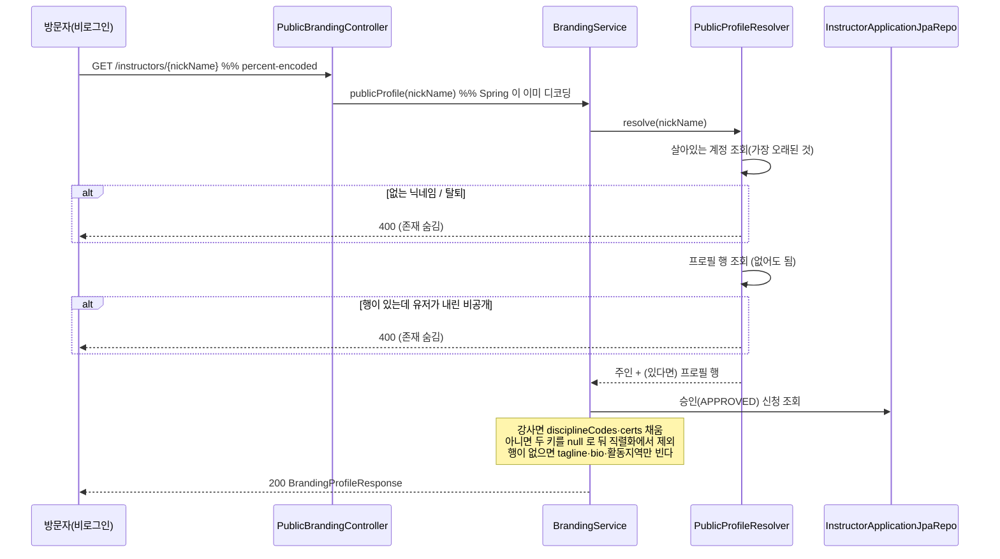

# 브랜딩 (branding) 도메인

## 1. 한 줄 요약

**브랜딩 페이지 = 계정당 1개의 공개 프로필** — 강사에겐 "브랜딩 페이지", 일반 유저에겐 "내 프로필"(워딩만 role 분기). 정체성(tagline·bio·활동지역·아바타) + 공식기록 + 게시물로 구성되고, **공개 URL 식별자는 순차 id 가 아니라 `nickName`** 이다. 핵심 invariant 둘: **조회는 절대 생성하지 않는다**(생성은 첫 쓰기가 한다), **강사 한정 요소는 소유하지 않고 읽기 시점에 합성한다**(자격·검수상태는 `instructorapplication` 소유).

> 정책·왜·결정 히스토리는 [docs/features/account-branding.md](../features/account-branding.md). 이 문서는 *어떻게(구현)*.

## 2. 컴포넌트 지도

```mermaid
flowchart TB
  subgraph branding["branding 패키지 (BE)"]
    PBC[PublicBrandingController<br/>GET /instructors/&#123;nickName&#125;<br/>GET /instructors/suggested<br/>GET /instructors/browse] --> BS[BrandingService]
    PBC --> SIS[SuggestedInstructorService<br/>무작위 추천 강사]
    PBC --> IBS[InstructorBrowseService<br/>필터·검색·정렬 목록]
    SIS --> BR
    IBS --> BR
    BC[BrandingController<br/>/branding/me/**] --> BS
    BS --> BR[AccountBrandingJpaRepo]
    BR --> E[(AccountBranding<br/>→ BrandingRecord)]
    CISA[CourseInstructorSummaryAdapter<br/>강의 상세의 강사 카드] --> BR
  end
  CISA -. implements .-> ISP[course.InstructorSummaryProvider]
  BS -. 단방향 .-> ACC[account.Account<br/>닉네임·프로필사진]
  BS -. 단방향 .-> IA[instructorapplication<br/>승인 자격·검수상태·승인시각]
  IBS -. 단방향 .-> CO[course.Course<br/>공개중 강의 수]
  FE["수강생/방문자"] -- "비로그인 조회" --> PBC
  FE2["오너(강사·일반)"] -- "편집·발행" --> BC

  classDef ext fill:#eef
  class ACC,IA,CO ext
```



- **강사 목록이 셋이고 모수가 전부 다르다** — 이 표를 모르고 고치면 "N명" 이 화면마다 달라진다.

| 엔드포인트 | 모수 | 페이지네이션 | 쓰임 |
|---|---|---|---|
| `/instructors/public` (instructorapplication 패키지) | 승인 강사 전부 — **발행을 안 본다** | ✅ | "몇 명이 검수를 통과했나". 눌러도 400 인 카드가 섞인다 |
| `/instructors/suggested` | 승인 ∧ 발행, **무작위 N명** | ❌(설계) | 사이드바·홈 위젯. 매 요청 다시 뽑는다 |
| `/instructors/browse` | 승인(그 종목) ∧ 발행 | ✅ | **더보기 화면.** 필터·검색·정렬이 되는 유일한 목록 |

- **왜 강사 둘러보기가 instructorapplication 이 아니라 여기 있나** — 모수 조건(`isPublished`)과 카드 필드(`tagline`·`locationLabel`)가 이 도메인 것이고, `openCourseCount` 는 course 를 읽는다. branding 은 그 둘을 단방향 참조해도 되지만 **반대는 순환**이다. `/instructors/suggested` 가 같은 이유로 먼저 여기 있었다 — URL 네임스페이스와 패키지 소유가 일치하지 않는 건 의도다.
- **강사 카드의 `updatedAt` 은 단일 컬럼이 아니라 합성값**(2026-08-22, BE #323) — `max(AccountBranding.updatedAt, 승인된 InstructorApplication 들의 최대 updatedAt)`. 프로필이 6개 테이블에 흩어져 있어서다. `hydrate` 가 **이미 배치로 읽은 두 목록**만 쓰므로 추가 쿼리는 **0** 이고, JPQL 프로젝션은 건드리지 않았다 — `group by` 에 컬럼을 더하면 MySQL `ONLY_FULL_GROUP_BY` 의 함수종속 판정에 기대게 되고 H2 와 갈릴 수 있다(이 레포가 3065 로 이미 밟은 계열의 함정).
  ⚠️ **아바타(`profile_photo`)와 자격증 이미지(`application_certificate`)는 못 잡는다** — 두 테이블에 시각 컬럼 자체가 없다. 웹 sitemap `lastmod` 용으로는 근사가 충분하다는 전제이고(정책은 [features/seo-and-geo.md](../features/seo-and-geo.md)), "마지막 활동" 같은 UI 표기로 전용하면 틀린다.
  ⚠️ **`replaceRecords` 는 `updatedAt` 을 손으로 찍는다** — 기록만 갈아치우면 자식 테이블만 바뀌어 부모 행이 안 더러워지고 `@PreUpdate` 가 **안 뛴다**. 같은 함정이 `BrandingPost` 의 미디어·태그에도 있다(그쪽은 아직 안 고쳤다 — 근사 허용 범위).
- **합성 방향은 단방향** — `account`·`instructorapplication` 은 branding 을 모른다. account 가 feature 도메인을 import 하지 않는 루트 규칙 때문에 합성을 별도 패키지로 뺐다(`profile` 패키지가 만든 선례).
- 자격 뱃지(`certs`)·종목·검수상태·승인시각은 **저장하지 않고** 승인된 강사 신청에서 매 조회 시 파생한다.
- **강의 상세의 강사 카드도 여기서 합성한다**(`CourseInstructorSummaryAdapter`). 인터페이스는 `course` 가 선언하고(`InstructorSummaryProvider`) 구현만 이 패키지에 둔다 — `branding → course` 가 이미 있어서(프로필의 강의 수) `course → branding` 을 더하면 **패키지 순환**이 되기 때문이다. 필요한 쪽이 계약을 선언하고, 양쪽을 다 아는 쪽이 구현한다.
  ⚠️ **그 카드는 브랜딩 행의 존재 여부에 매이지 않는다** — 실리는 값 중 브랜딩이 소유하는 건 tagline·bio 뿐이라 프로필을 만든 적 없는 강사도 나머지(닉네임·아바타·인증마크·자격·강의 수)는 그대로 온다. 공개 프로필(`GET /instructors/{nickName}`)의 400 규칙과 **별개**다.
  ⚠️ **단 tagline·bio 는 발행 여부를 따른다**(2026-08-22) — 유저가 비공개로 내리면 그 둘은 강의 상세에서도 빠진다. 비공개의 뜻이 **"내 포트폴리오를 감춘다"** 로 정의돼 있고(`community.CommunityPostSpecifications.feedVisible` 주석 — 커뮤니티 글이 함께 사라지지 않는 근거) tagline·bio 가 곧 그 포트폴리오 본문이라서다. 규칙은 한 문장 — **값의 소유자가 그 값의 거동을 정한다.**

## 3. 흐름

### 3-1. 첫 쓰기가 곧 생성 (upsert)



**GET 이 생성하지 않는 이유**: 프리페치·재시도·캐시/CDN·브라우저 speculative fetch 가 전부 쓰기를 유발하고, 페이지를 열어보기만 한 계정 전원에게 빈 row 가 생긴다. 레포 규약(reads use GET)도 깨진다.

### 3-2. 공개 조회



## 4. 데이터 모델

```mermaid
erDiagram
  Account ||--o| AccountBranding : "1:1 (account_id UNIQUE)"
  AccountBranding ||--o{ BrandingRecord : records
  AccountBranding ||--o{ BrandingPost : posts
  BrandingPost ||--o{ BrandingPostMedia : media
  BrandingPost ||--o{ BrandingPostTag : tags
  BrandingPost }o--o| Course : "linked_course_id (nullable)"

  AccountBranding {
    Long id
    Long account_id "UNIQUE, FK"
    String tagline "60"
    String bio "500"
    String location_label "60"
    boolean is_published "생성 시 true"
    OffsetDateTime created_at
    OffsetDateTime updated_at
  }
  BrandingRecord {
    enum medal "GOLD|SILVER|BRONZE"
    enum event_code "CWT|FIM|CNF|DYN|DNF|STA"
    String record_value "단위가 종목마다 달라 문자열"
    int sort_order
  }
  BrandingPost {
    String caption "5000"
    String location_label
    boolean pinned
    boolean is_hidden "삭제와 별개, 되돌릴 수 있음"
  }
  BrandingPostMedia { enum kind "PHOTO|VIDEO", String url, int sort_order }
  BrandingPostTag { String tag "30" }
```

설계 의도 / 함정:

- **`account_branding`** — `instructor_` 가 아니다. 일반 유저도 쓴다(D2).
- **`event_code` 는 `discipline.Discipline` 과 다른 축이다.** 종목(FREEDIVING·SCUBA·MERMAID) vs 프리다이빙 경기 세부종목(CWT·FIM·…). 같은 "discipline" 이라 부르면 반드시 사고 나서 이름을 분리했다.
- **`record_value` 컬럼명** — `value` 는 H2(테스트 DB) 예약어라 스키마 생성이 깨진다. API 필드명은 `value` 유지.
- **`linked_course_id` 는 `ON DELETE SET NULL`** — 코스가 지워져도 게시물은 살고 연결만 끊긴다.
- **게시물 3개 테이블은 V17 에서 미리 만들고 엔티티/엔드포인트는 뒤따라 붙였다**(지금은 둘 다 있다) — `hbm2ddl=validate` 는 엔티티에 대응하는 테이블만 보므로 테이블만 먼저 만들어도 무해하고, 마이그레이션 횟수를 줄인다.
- 🟡 **`account.nick_name` 에 UNIQUE 인덱스가 아직 없다** — §6 참고.

### 그리드의 N+1 을 어떻게 피했나

카드마다 `post.getMedia()` 를 건드리면 페이지 크기만큼 쿼리가 나간다. 그래서 **게시물 페이지를 먼저 가져오고 그 id 들의 미디어를 한 번에 모아 메모리에서 그룹핑**한다(`PublicInstructorService` 와 같은 패턴). 카드가 필요로 하는 건 대표 URL 과 장수뿐이라 엔티티 컬렉션을 태울 이유가 없다.

**정렬·페이지 크기는 서버가 고정한다.** 클라이언트의 `sort` 를 `Pageable` 에 태우면 (a) 임의 필드 정렬로 내부 컬럼을 탐색하거나 인덱스 없는 정렬로 풀스캔을 유발할 수 있고 (b) **pinned-우선 규칙이 깨진다.** `size` 상한 50 으로 전수 스크래핑도 막는다.

### 숨김은 삭제가 아니다

`is_hidden` 은 **되돌릴 수 있는** 상태다. 공개 목록·상세·`stats.posts` 에서만 빠지고 **오너 목록에는 남는다** — 안 그러면 숨긴 글을 다시 켤 방법이 없다.

같은 이유로 **상세도 오너 본인에겐 열린다**(숨김·미발행 포함). FE 가 상세 화면에서 바로 "다시 공개"를 누르게 만들어 뒀는데, 숨긴 순간 상세가 오너에게도 막히면 되돌릴 화면이 사라진다. 즉 `GET /branding-posts/{id}` 는 **같은 URL 이 보는 사람에 따라 갈린다** — 비로그인·타인은 400, 오너는 200.

### `stats.posts` 는 오너 응답에서도 "공개" 개수다

두 숫자가 다르다는 걸 알고 써야 한다 — `stats.posts` 는 **숨김을 뺀 공개 개수**이고(오너 응답에서도 마찬가지), 오너 그리드는 **숨김을 포함**해 보여준다. 오너 헤더에 `stats.posts` 를 쓰면 숫자 12 인데 타일이 14 개인 상황이 된다. 그래서 오너 화면의 개수는 `GET /branding/me/posts` 의 `page.totalElements` 를 쓴다. (FE 가 통합 리뷰에서 잡아낸 지점 — 무심코 갈아끼우면 어긋난다.)

### 미디어 lifecycle

저장은 2-phase(업로드 → URL 참조)이고, **저장 시 우리 CDN base 로 시작하는지 검증**한다 — 없으면 본문에 임의 외부 이미지를 심을 수 있고(호스트 추적·콘텐츠 변조) 삭제 로직이 남의 도메인을 지우려 든다. 게시물 삭제·수정으로 빠진 사진은 `S3Uploader.deletePublicObject` 로 함께 지운다(삭제 실패가 게시물 삭제를 막지는 않는다 — 고아 1개가 데이터가 안 지워지는 것보다 낫다).

⚠️ 업로드했지만 게시물에 안 쓰인 사진(작성 중 이탈)은 **아직 자동 정리되지 않는다** — S3 lifecycle rule 은 별도 작업.

### 기록은 왜 스냅샷 교체인가

디자인이 chip **순서 조정**을 요구한다. 드래그로 재정렬한 뒤 항목마다 요청을 쏘면 중간 상태가 노출되고, 일부만 성공하면 순서가 깨진다. 배열을 통째로 받으면 추가·삭제·재정렬이 **한 번의 원자적 호출**로 끝난다(course·venue 와 같은 관례). **`sortOrder` 는 클라이언트가 보내지 않는다** — 요청 배열의 인덱스가 곧 순서다. 중복·구멍 난 sortOrder 가 들어오면 표시 순서가 비결정적이 되므로, 자연스러운 표현 하나만 받는다.

## 5. 보안 / 권한 매트릭스

매처는 `global/security/SecurityConfiguration`. **`/instructors/*` 는 리터럴 `/instructors/public`·`/instructors/suggested`·`/instructors/browse` 보다 뒤에** 둔다(그래야 목록 엔드포인트들이 가려지지 않는다). 같은 이유로 그 세 단어는 **닉네임 예약어**다(`global/validation/NickNamePolicy` — 가입·변경이 400 으로 막힌다. 규칙 전체는 [sign-up.md](sign-up.md) '닉네임 정책') — 안 막으면 그 닉네임을 가진 계정의 프로필이 영영 안 열린다. ⚠️ ant 의 `*` 는 `/` 를 넘지 않으므로 하위 경로는 매처를 따로 추가해야 한다.

| 엔드포인트 | 인증 | 역할 | 소유권 |
|---|---|---|---|
| `GET /instructors/browse?disciplineCode=&…` | **불필요** | — | 승인(그 종목) + **발행**(`is_published=true`) + 미탈퇴. 필터(단체·강의보유)·검색(닉네임)·정렬(최신/강의많은순)·페이지네이션. 400 은 `disciplineCode` 누락과 `sort` 값 오류뿐 — 없는 종목 코드·조건 불일치는 빈 페이지 200. size 상한 50. ⚠️ **프로필 행이 없는 계정은 빠진다** — 상세는 이제 빈 프로필 200 으로 열리지만(아래 행), 이 목록은 `AccountBranding` 행 + 발행을 요구한다 |
| `GET /instructors/suggested?limit=5` | **불필요** | — | 승인 + **발행**된 강사 중 무작위. (발행 조건의 근거가 바뀌었다 — 이제 프로필은 모든 계정에 있어 '갈 곳 없는 카드' 문제는 없다. 남긴 이유는 **추천은 뭔가 남긴 사람이어야** 해서. 행은 첫 쓰기로 생긴다.) 토큰을 실으면 **차단한 강사가 빠진다**(`totalCount` 도) |
| `GET /instructors/{nickName}` | **불필요** | — | **모든 살아있는 계정에 있다** — 프로필 행이 없으면 빈 프로필 200. 400 은 셋뿐: 없는 닉네임·탈퇴 / **유저가 내린 비공개**(`is_published=false`) / 상대가 나를 차단. 차단은 방향에 따라 다르다 — 내가 차단 → **200 + `blockedByMe`**(유일한 해제 동선), 상대가 나를 차단 → **400** ([block.md](block.md)) |
| `GET /instructors/{nickName}/posts` | **불필요** | — | 위 + `is_hidden=false` 만. **프로필 행이 없으면 빈 페이지**(400 아님 — 프로필만 열리고 그리드가 깨지면 화면이 반쪽). 정렬·size 는 서버 고정 |
| `GET /branding-posts/{postId}` | **불필요** | — | 발행 + 미숨김만. **단 오너 본인은 자기 글이면 숨김·미발행이어도 조회 가능**. 그 외 **400** |
| `GET /branding/me` | 필요 | **인증만** | `@CurrentUser` 기준. 미작성이면 `exists:false` — **단 닉네임·아바타·인증마크·자격·검수 상태는 채워서 준다**(계정·강사신청 파생). 비는 건 프로필 행 소유값뿐. `isPublished` 만 키 생략 |
| `PATCH /branding/me` | 필요 | 인증만 | 동일. 미생성이면 생성(upsert) |
| `PUT /branding/me/records` | 필요 | 인증만 | 동일. **스냅샷 교체**(빈 배열 = 전부 삭제) |
| `PATCH /branding/me/publish` | 필요 | 인증만 | 동일. **승인 게이트 없음** |
| `GET /branding/me/posts` | 필요 | 인증만 | 내 것만 — **숨김 포함, `show_on_profile=true` 만**. 프로필 미생성이면 빈 페이지 |
| `POST /branding/me/posts` 🔴레거시 | 필요 | 인증만 | 미생성이면 생성(upsert). 연결 강의는 **내 코스**만. **`category` 필수**(2026-08-18) |
| `PUT · DELETE /branding/me/posts/{id}` 🔴레거시 | 필요 | 인증만 | `post.branding.account.id == me.id` 아니면 **400** |
| `PATCH /branding/me/posts/{id}/pin` | 필요 | 인증만 | 동일. 고정은 **프로필 그리드에만 있는 개념**이라 여기 남는다 |

🔴 **게시물 작성·수정은 커뮤니티의 통합 폼(`POST|PUT /community/posts` + `showOnProfile`)이 주 경로다** — 위 두 줄은 구버전 앱 호환으로만 남긴다. 같은 테이블·같은 행이고, 규칙(같이가요 강의연결 금지 등)은 통합 폼 쪽에만 모여 있다.

🔴 **`PATCH /branding/me/posts/{id}/visibility` 는 삭제됐다**(2026-08-18) → `PATCH /community/posts/{id}/visibility`. 숨김은 브랜딩 그리드·커뮤니티 피드에 함께 걸리는 **전역 스위치**인데 문이 둘이라 규칙이 갈렸다: 이 경로는 `show_on_profile=true` 인 글만 통과시켜 커뮤니티 전용 글을 못 숨겼고, 어드민 조치(ACTIONED) 확인이 없어 신고로 내려간 글을 작성자가 되살릴 수 있었다. 오너가 숨긴 글을 되돌리는 화면은 이 그리드(프로필 글)와 `GET /community/posts/me`(전부)다.
| `POST /branding-images` | 필요 | 인증만 | multipart → `{fileURL}` |

**왜 `hasRole("INSTRUCTOR")` 가 아닌가** — (a) 일반 유저도 쓰고, (b) 강사도 **승인 전(pending/rejected)에 편집 화면이 존재**한다. 승인 전에는 `ROLE_INSTRUCTOR` 가 없어 role 로 막으면 그 화면이 403 이 된다. 레포도 같은 이유로 `/courses/**` 를 `authenticated()` 로 둔다.

**신원은 항상 세션에서** — account id 를 파라미터로 받지 않는다(anti-IDOR).

## 6. 알려진 설계 간극

- 🔴 **`account.nick_name` UNIQUE 인덱스 부재** — 공개 URL 식별자인데 유일성이 DB 로 보장되지 않는다(중복 방지는 가입 시 애플리케이션 체크뿐이라 레이스로 뚫린다). dedupe 는 **유저에게 보이는 식별자를 바꾸는 동작**이라 실데이터 사전 점검·승인이 선행돼야 하고, 그 조회 경로가 현재 인프라에 없다(ECS Exec 비활성 + 런타임 이미지에 mysql 클라이언트 없음). 그때까지 공개 조회는 **결정적 정렬(가장 오래된 계정) + 첫 건**으로 중복에 안전하게 동작한다. → 별도 PR.
- 🔴 **`/`·`\` 가 든 닉네임은 프로필을 열 수 없다** — Spring Security `StrictHttpFirewall` 이 인코딩된 슬래시 요청을 거부한다(path traversal 방어). 방화벽을 푸는 건 하지 않는다. 신규 입력은 형식 가드로 막고, 기존 보유자는 위 사전 점검에서 함께 리포트한다. 한글·공백·`.`·`+` 는 정상(use-case 테스트로 고정).
- 🟡 **닉네임 형식 가드·예약어 차단 미구현** — `public` 같은 예약어가 기존 계정에 있으면 그 프로필은 리터럴 라우트에 가려 영구히 안 열린다. 위 UNIQUE 작업과 함께.
- 🟡 **자격 자유입력 없음** — D5 로 폐기됐고 파생 `certs` 만 노출한다. 어드민 승인제 "자격증 관리" 피처가 후속.
- 🟡 **연결 강의의 마감 뱃지(`badge`) 없음** — 디자인의 "5월 18일 마감"은 **모집 마감일** 기반인데 `Course` 에 그 개념이 없다(회차·이용권은 있어도 "언제까지 모집"이 없다). 없는 값을 지어내지 않는다 — 코스에 마감일이 생기면 그때 붙인다. 부제(`subtitle`)도 기간·정원이 없어 FE 가 조립한다.
- 🟡 **업로드 고아 사진 자동 정리 없음** — 작성 중 이탈로 안 쓰인 사진. S3 lifecycle rule 필요.
- 🟢 **영상** — `BrandingMediaKind.VIDEO` 는 스키마 자리만 예약. 업로드 경로가 없어 저장되는 건 전부 사진이다(D1, 이슈 #207).

## 7. 더 깊게: 테스트로 보기

`usecase/BrandingUseCaseTest` (실 H2 + 실 시큐리티 필터체인). `@DisplayName` 위→아래 = 사양:

- `C1` 조회는 생성하지 않는다(행이 안 생기는 것까지 확인) / `C2` 첫 PATCH 가 생성 + 발행 상태 / **`C3` 미작성이어도 닉네임·아바타가 오고 그 닉네임으로 공개 페이지가 실제로 열린다 / `C4` 미작성 승인 강사는 인증마크·자격·검수 상태까지**
- `S1` 비로그인 공개 조회 / `S2` 보낸 키만 반영·명시적 null 은 비우기 / `S3` 발행 끄면 공개 차단
- **`P1`~`P4` 기본 프로필** — 아무것도 안 적은 계정도 200(행은 여전히 안 생긴다) / 그리드도 빈 페이지 / 프로필 없는 승인 강사도 인증마크·자격 / 탈퇴 계정은 400
- `I1` 강사는 `isInstructor`·종목·자격 뱃지 / `I2` **일반 유저는 그 키가 아예 없음** / `I3` 신청 이력 없으면 검수 키 없음 / `I4` 승인 강사는 `reviewStatus`·`approvedAt`
- `E1` 한글 닉네임 / `E2` 공백·`.`·`+` / **`E3` `/` 는 방화벽이 거부**
- `V1` 없는 닉네임 400 / `V2` 60자 초과 400 + 사용자 문구, 그리고 **검증 실패면 생성도 안 된다**
- `R1` 비로그인 401 / `R2` 강사가 아니어도 편집·발행 가능 / `R3` `/instructors/public` 이 가려지지 않는다

`usecase/PublicInstructorUseCaseTest` 의 `S*` 가 추천 강사(`/instructors/suggested`)를 덮는다 — 발행 강사만 / 미승인 제외 / limit 보다 적으면 있는 만큼 / `totalCount` 는 자르지 않음 / 탈퇴 제외 / 멀티 종목 1장 / **카드의 닉네임으로 상세가 실제로 열린다**.

`usecase/InstructorBrowseUseCaseTest` (강사 둘러보기 `/instructors/browse`):

- `S1` 카드 7필드 + **`id` 가 안 나간다** / `S2` 빈 값은 키 생략이 아니라 `null`, 단체는 빈 배열
- `S3` 종목 / `S4` 닉네임 검색 / `S5` 단체 OR 합집합 / **`S5b` 단체는 요청 종목 자격증만**(종목 코드는 반대로 승인 종목 전부)
- `S6` '강의 있음' 토글 / `S7` 강의 많은순 / **`S8` 전원 동점이어도 페이지 간 중복 없음**(tie-break)
- `S9` **카드의 닉네임으로 상세가 실제로 열린다**
- `O1` 미발행 제외 — 같은 테스트가 **그 프로필이 실제로 400 이라는 것까지** 확인한다(왜 빼야 하는지가 테스트에 있다) / `O2` 미승인·반려 제외 / `O3` 탈퇴 제외
- **`O4` "강의 N" 은 강의 둘러보기가 보여주는 것만 센다** — DRAFT·CLOSED·차단·타 종목 제외. 이게 어긋나면 "강의 3" 카드를 눌렀는데 목록이 0건이 된다
- `V1` 종목 누락 400 / `V2` 빈 결과는 200 + `_embedded` 키 없음 / `P1` size 상한 50 / `P2` Pageable 형식 정렬은 400
- **`T1`·`T2` 카드의 `updatedAt`** — 존재 + **두 소스 중 나중 시각**(자격·종목만 바뀌어도 반영된다)

`usecase/BrandingPostUseCaseTest` (게시물):

- `S1` 첫 게시물이 프로필까지 생성 / `S2` 카드의 썸네일·장수 / `S3` 상세 전체 + `createdAt` 이 UTC(`Z`) / `S4` 수정 = 스냅샷 교체 / `S5` 삭제
- `O1` 고정 글이 최신 글보다 위 / **`O2` 클라이언트가 보낸 `sort`·과대 `size` 가 무시된다**
- `H1` 숨김은 공개에서만 빠지고 오너 목록엔 남는다 / `H2` 되돌리기 / `H3` 게시물 수에서도 제외
- `L1` 연결 강의 노출 / **`L2` DRAFT 는 키 자체 생략** / `L3` 남의 강의 400
- `V1` 업로드로 받지 않은 외부 이미지 URL 거부 / `V2` 사진 0장 400
- `R1` 남의 글은 400(존재 숨김) / `R2` 비로그인 읽기 O·쓰기 401 / `R3` 프로필 없는 오너 목록은 빈 페이지
