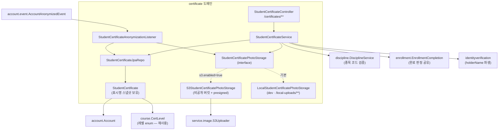
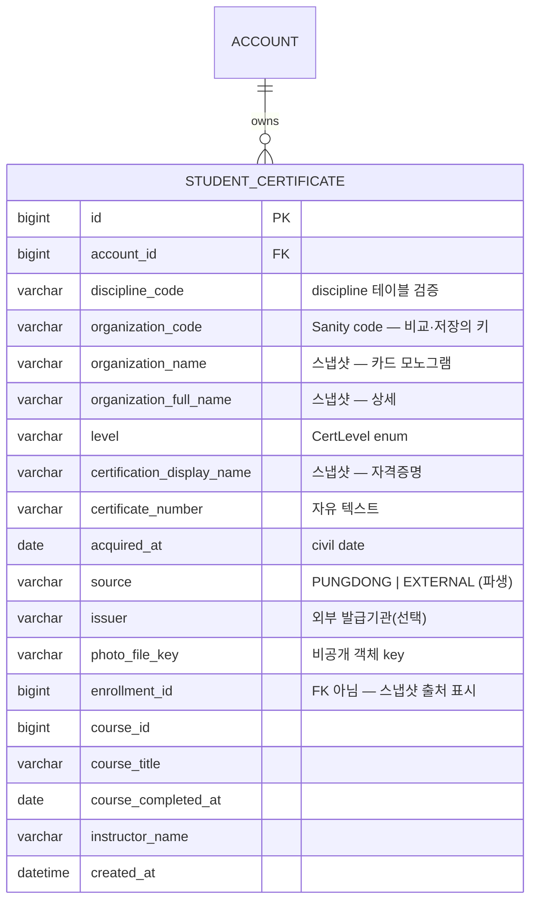
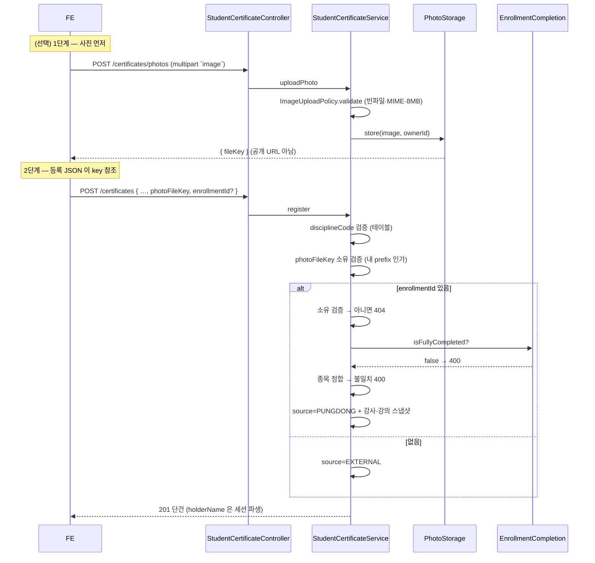

# 학생 보유 자격증 (certificate)

## 한 줄 요약

학생이 **보유한 다이빙 자격증을 직접 기록·관리**하는 도메인(프로필 탭 &gt; 내 자격증). 조회·등록·삭제 + 사진 업로드. 자격증 사진은 **실명·자격증번호가 찍힌 PII** 라 비공개 버킷에 저장하고 조회 시점에만 presigned 로 발급한다. 풍덩 강의 수료와 연결하면 강사·강의가 **등록 시점 스냅샷**으로 박제된다.

> **핵심 invariant** — 클라이언트가 정하는 것은 *무슨 자격증인지*(코드·번호·취득일·사진)뿐이다. **`source`·`holderName`·강사·강의는 전부 서버가 파생**하고, 클라이언트가 준 `enrollmentId`·`photoFileKey` 는 **소유를 검증**한다.

⚠️ 강사 신청의 `ApplicationCertificate`(심사 자료)와 **다른 리소스**다 — 목적·수명주기·열람자·저장 prefix 가 전부 다르다. 합치지 않는다. 정책 비교표는 [certificate/CLAUDE.md](../../src/main/java/com/diving/pungdong/certificate/CLAUDE.md).

---

## 컴포넌트 지도

---

## 엔드포인트 / 권한

전부 `authenticated`(`SecurityConfiguration` 의 `/certificates/**`). **role 게이트 없음** — 강사도 개인 자격으로 보유한다.

| 메서드 · 경로 | 용도 | 성공 | 남의 리소스 |
|---|---|---|---|
| `GET /certificates/mine` | 내 목록 (`acquiredAt DESC`) | 200 `_embedded.certificates` | — |
| `GET /certificates/{id}` | 단건 — **presigned 재발급**용 | 200 `EntityModel` | **-1009** |
| `POST /certificates` | 등록 | **201** 단건 | — |
| `DELETE /certificates/{id}` | 삭제(행 + 사진) | **204** | **-1009** |
| `POST /certificates/photos` | 사진 업로드(multipart `image`) | 200 `{fileKey}` | — |

- **빈 목록은 200 + `_embedded` 부재** (Spring HATEOAS 동작). 404 가 아니다 — 빈 상태는 정상 UI 상태.
- **페이지네이션 없음** — 개인 보유량이 한 자릿수.
- **수정(PUT/PATCH) 없음** — FE 에 편집 화면이 없다. 만들면 도달 불가 API. 엔티티는 막지 않았다.
- 없음/비소유는 **403 이 아니라 -1009**(존재 숨김). **신규 에러 코드 없음.**

---

## 데이터 모델

**마이그레이션**: `V25__student_certificate.sql`. `enrollment_id` 에 **FK 를 걸지 않았다** — 연결한 수강이 나중에 정리돼도 자격증(사용자 자산)은 남아야 한다.

### 표시명이 스냅샷인 이유

`organization_name` / `organization_full_name` / `certification_display_name` 은 **등록 시점 Sanity 카탈로그 값을 박제**한 것이다. `Enrollment.tuitionSnapshot` 과 같은 철학 — 자격증은 **불변 credential** 이라 카탈로그가 나중에 이름을 바꿔도 "내가 그때 딴 그 자격증"의 이름이어야 한다.

부수 효과가 더 크다: FE 의 카탈로그 소비가 **동기 순수함수**(폼의 단체→종목 역인덱스, 상세의 풀네임 행)라, 조회 때마다 Sanity 를 비동기로 읽으면 **로딩 상태가 리스트·상세로 번진다.** 스냅샷이면 목록·상세가 Sanity 왕복 0회다.

**검증되는 건 코드**(`discipline_code`=테이블 대조, `level`=Java enum)이고 표시명은 아니다. 위조해도 표시가 어긋날 뿐 권한·금액에 영향이 없고, 애초에 사용자가 자기 자격증을 자기 신고하는 데이터다("사진이 진실").

---

## 등록 흐름

### 강의 연결 3중 검증

| # | 검증 | 실패 |
|---|---|---|
| 1 | `enrollment.student == me` | **404**(-1009, 존재 숨김) |
| 2 | `EnrollmentCompletion.isCertifiable` | 400 |
| 3 | `course.disciplineCode == request.disciplineCode` | 400 |

> 🔴 **판정은 `EnrollmentCompletion.isCertifiable` 하나이고, hub 가 그 값을 `certifiable` 로 노출한다.** FE 피커는 그 필드로 거른다.
>
> ⚠️ **`status === 'COMPLETED'` 로 거르면 안 된다 — 다른 질문이다.** 정규를 다 끝낸 뒤 추가세션(EXTRA)을 잡으면 카드 상태는 `PROGRESS` 로 돌아가지만 자격증은 이미 취득한 것이다. 표시용 상태로 판정하면 그 동안 강의가 피커에서 사라진다. 두 값은 일부러 분리돼 있다.
>
> `CourseScheduleStatus.derive()` 단독도 부족하다("잡힌 회차"만 보므로 3회차 중 1회차만 듣고 끝낸 수강도 완료로 본다).

**단체 정합은 검사하지 않는다** — 코스의 `organizationCode` 는 "목표 단체"라 실제 발급 단체가 다를 여지가 있다(제휴 발급). 종목처럼 구조적 모순이 아니다.

### 서버가 정하는 값

| 필드 | 파생 | 왜 |
|---|---|---|
| `source` | `enrollmentId` 유무 | 클라이언트가 고르면 **강사 없는 "풍덩 발급"** 이 가능 |
| `holderName` | 최신 VERIFIED 실명 → 없으면 닉네임 | 레포 규칙: identity 는 세션에서, 입력에서 받지 않는다 |
| `instructorName`·`courseTitle`·`courseCompletedAt` | `enrollmentId` 로 조회 | 클라이언트가 준 강사명은 신뢰 대상이 아니다 |

⚠️ **알려진 한계** — 실물 자격증 인쇄명은 로마자(`SUMIN LEE`)인 경우가 흔한데 `holderName` 파생은 한글을 준다. "사진이 진실"이라 허용 중. 정확히 하려면 폼 입력 필드 승격이 필요한데 디자인에 칸이 없다.

---

## 사진 — 접근 등급 = 비공개(PII)

[features/image-storage-and-serving.md](../features/image-storage-and-serving.md) §1 의 **"비공개(PII) = 자격증·보험"** 등급을 그대로 따른다. 학생 자격증은 대상이 강사보다 훨씬 많다.

| | |
|---|---|
| 저장 | 비공개 버킷, key `studentCertificate/{accountId}/{uuid}.{ext}` |
| 열람 | 조회 시점 **presigned GET, TTL 3분** |
| 공개 CDN | **쓰지 않는다** |
| 업로드 검증 | `ImageUploadPolicy.validate` — 빈 파일 · `jpeg/jpg/png/webp` · 8MB |
| 삭제 | `S3Uploader.deletePrivateObject`. ⚠️ **`deletePublicObject` 금지**(공개 버킷 기준 환원이라 조용히 엉뚱한 걸 지운다 — §4b 사고와 같은 모양) |
| 탈퇴 파기 | `AccountAnonymizedEvent` → 리스너가 행 + prefix 일괄 삭제 |

### `photoFileKey` 소유 검증 (anti-IDOR)

presigned URL 은 **경로에 객체 key 를 담는다.** URL 이 한 번 새면 key 를 뽑아 자기 자격증에 붙여 **TTL 3분을 무한 재발급**할 수 있다 — 좁혀둔 열람 창이 영구 접근이 된다. `StudentCertificatePhotoStorage.isOwnedBy` 가 저장 참조에 `studentCertificate/{내 id}/` 가 들어 있는지 본다(끝 슬래시라 `7` 과 `71` 이 안 섞인다).

로컬 구현도 경로에 `{ownerId}/` 를 넣는다 — 안 그러면 이 검증과 일괄 삭제를 **dev/테스트에서 밟을 수 없다**(prod 에서만 도는 코드).

### TTL 3분과 화면 흐름

목록을 열어둔 채 3분이 지나면 그 URL 은 403 이다. 그래서 **`GET /certificates/{id}` 가 presigned 를 재발급**하고(상세 진입 시), FE 는 이미지 로드 실패 시 1회 재조회한다. 풀스크린은 상세와 같은 스토어를 읽어 자동 전파된다.

---

## 협력 도메인

| 도메인 | 무엇을 |
|---|---|
| `discipline` | `getActiveByCode` 로 종목 검증. **테이블이라 배포 없이 행이 는다**(FE 는 미지 코드 폴백 필수) |
| `course` | **`CertLevel` enum 재사용**. 옮기지 말 것 — Sanity ↔ enum ↔ `types.ts` 3자 계약의 일부 |
| `enrollment` | `EnrollmentCompletion.isCertifiable` 공유(hub 가 `certifiable` 로 노출) + 강사·강의 스냅샷 출처 |
| `identityverification` | `holderName` 파생(최신 VERIFIED 실명) |
| `account` | 소유자. `AccountAnonymizedEvent` 로 탈퇴 파기 수신(**단방향** — account 는 이 패키지를 모른다) |
| Sanity | 단체·자격 카탈로그. **BE 는 읽지 않는다** — FE 가 등록 시 고른 표시명을 보내고 BE 는 스냅샷 저장만 |

---

## 설계 간극 / 후속

- 🟡 **자격증 수정** — 엔드포인트 없음(FE 화면 부재). 엔티티는 막지 않았다.
- 🟡 **`issuer` 입력 UI** — 모델엔 있으나 FE 폼에 칸이 없어 신규 등록분은 항상 비어 있다(후속 디자인).
- 🟡 **`holderName` 로마자** — 폼 필드 승격 필요.
- 🟡 **업로드 후 미제출 고아** — 사진만 올리고 폼을 버리면 객체가 남는다. `instructorapplication` 과 동일한 기존 한계(정리 배치는 후속). FE 가 **제출 시점에 업로드**해 최소화한다.
- 🟡 **강사 비즈니스 페이지 연결** — 응답에 `courseId` 로 자리만 열어둠.
- 🟢 **강의 완료 → 자격증 등록 CTA** — BE 는 준비됨(`GET /enrollments/mine/schedule` 의 `COMPLETED` + `enrollmentId`). FE 진입로가 후속.

---

## 관련 문서

- [certificate/CLAUDE.md](../../src/main/java/com/diving/pungdong/certificate/CLAUDE.md) — 패키지 컨텍스트
- [features/image-storage-and-serving.md](../features/image-storage-and-serving.md) — 이미지 접근 등급 정책
- [features/student-schedule.md](../features/student-schedule.md) — 완료 강의 파생(연결 소스)
- [api-clients/types.ts](../api-clients/types.ts) — `StudentCertificate` · `StudentCertificateCreateRequest`
