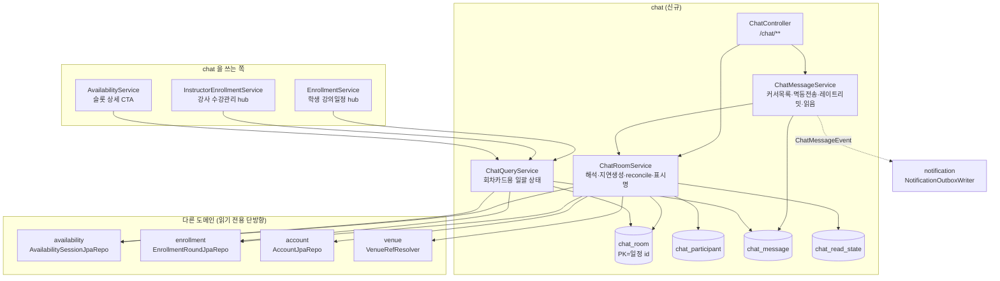
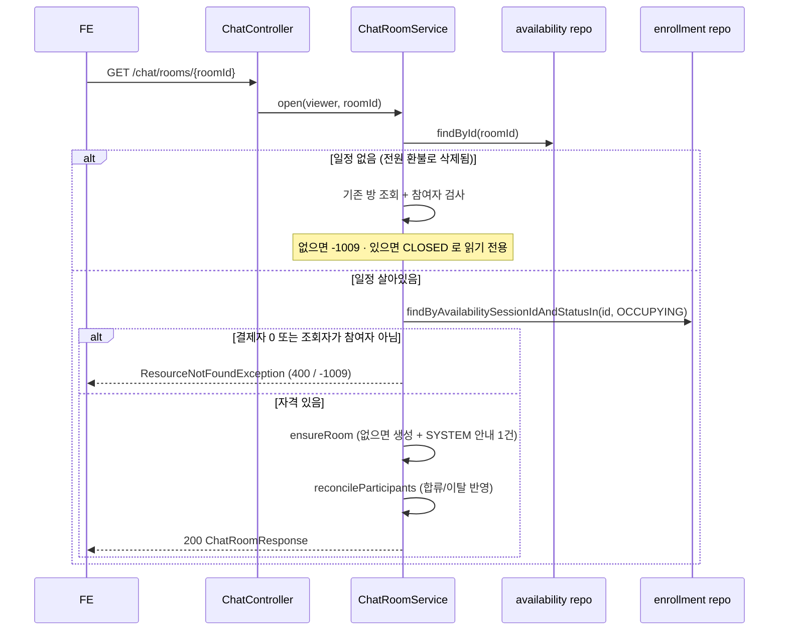
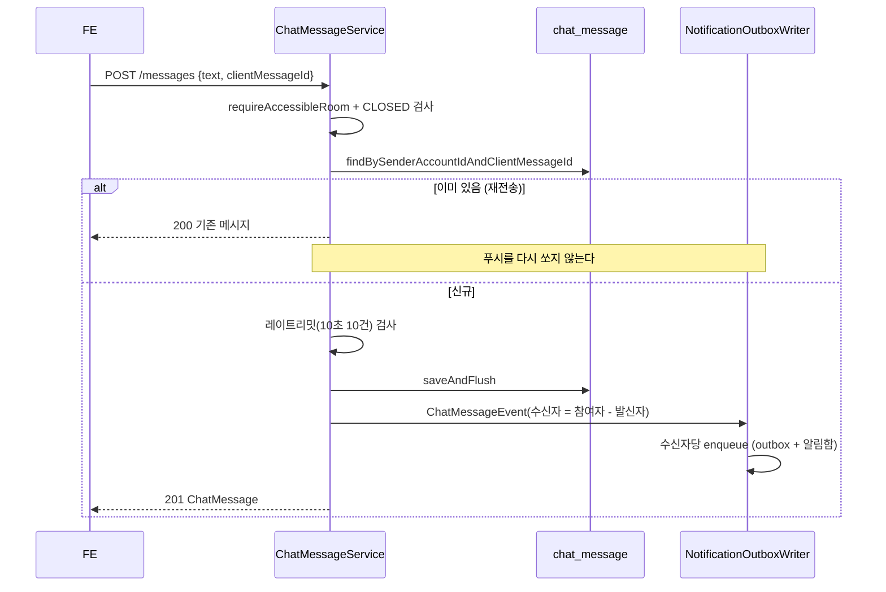
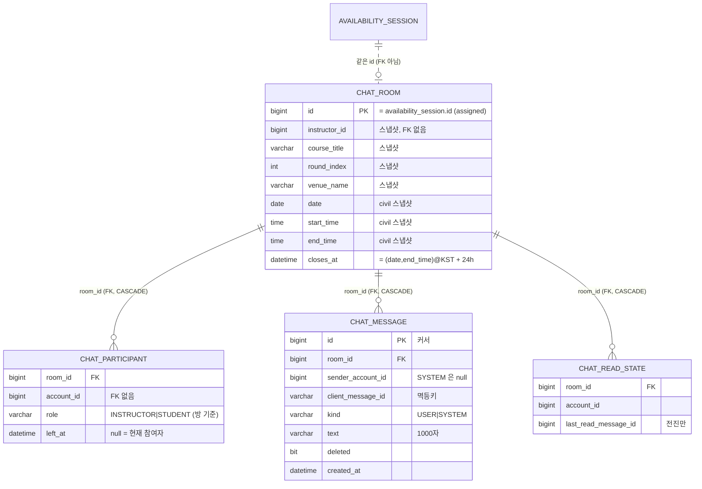

# chat — 세션 단체 채팅

> **어떻게(구현).** 정책·왜·히스토리는 [features/session-group-chat.md](../features/session-group-chat.md), 패키지 작업 컨텍스트는 [chat/CLAUDE.md](../../src/main/java/com/diving/pungdong/chat/CLAUDE.md).

## 1. 한 줄 요약

강사 가용시간 슬롯(일정, `AvailabilitySession`) **하나당 채팅방 하나**. 참여자 = 슬롯 소유 강사 + 그 슬롯에 결제완료(`EnrollmentStatus.OCCUPYING`) 회차를 가진 수강생.

**불변식 3개:**
1. **방 PK = 일정 id, `availability_session` 으로의 FK 없음** — `SessionCleaner` 가 점유 0 이면 일정 행을 물리 삭제하는데, FK 가 있으면 그 삭제가 실패해 환불 플로우가 깨진다.
2. **상태(ACTIVE/CLOSED)는 저장하지 않는다** — 일정 생존 + `closes_at` 경과로 읽을 때 파생(`SlotStatus` 를 파생하는 것과 같은 기조).
3. **참여자 목록과 발신자 이름 해석은 다른 쿼리다** — 전자는 현재 참여자만(`leftAt IS NULL`), 후자는 이탈자 포함(안 그러면 환불로 나간 사람의 과거 말풍선 이름이 빈칸).

## 2. 컴포넌트 지도

⚠️ **순환 참조 주의**: 소비자(enrollment/availability 서비스)가 `ChatQueryService` 를 주입받으므로, chat 쪽은 그 도메인들의 **레포만** 참조해야 한다. 서비스끼리 물리면 Spring Boot 2.6+ 가 기본 금지하는 순환 참조로 **부팅이 실패**한다.

## 3. 흐름

### 3-1. 방 열기 (지연 생성)

### 3-2. 전송 (멱등 + fan-out 푸시)

> UNIQUE 충돌(동시 전송)이 나면 `DataIntegrityViolationException` 을 잡아 기존 메시지를 재조회해 200 으로 돌려준다 — 중복과 같게 취급.

### 3-3. 커서 목록

| 요청 | 쿼리 | `hasMore` | `nextCursor` |
|---|---|---|---|
| `before=X` | `id < X ORDER BY id DESC LIMIT n` → **역순 반환** | 더 과거 존재 | 목록 최소 id |
| 커서 없음 | `ORDER BY id DESC LIMIT n` → 역순 반환 | 더 과거 존재 | 목록 최소 id |
| `after=X` | `id > X ORDER BY id ASC LIMIT n` | 더 최신 존재 | 목록 최대 id |
| 빈 목록 | — | false | **요청 커서 에코** |

응답은 방향과 무관하게 **항상 id 오름차순**. `before` 를 ASC 로 뽑으면 "가장 오래된 N건" 이 나와 위로 스크롤할 때마다 대화 맨 처음으로 점프한다.

## 4. 데이터 모델

**설계 의도:**
- `availability_session` 화살표가 **점선**인 이유 = 같은 id 를 쓰지만 FK 제약이 없다. 일정이 지워져도 방이 남는다.
- 슬롯 정보가 **스냅샷**인 이유 = 일정이 사라져도 헤더("AIDA2 2회차 · 12/10 수")가 깨지면 안 된다. `enrollment_round` 도 같은 이유로 슬롯 스냅샷을 든다. 일정이 살아 있으면 조회 때 갱신된다.
- `account_id` 에 FK 가 없는 이유 = `user_notification.recipient_account_id` 와 같은 기조(채팅이 account 에 강결합되지 않게).
- `UNIQUE (sender_account_id, client_message_id)` — MySQL 이 NULL 중복을 허용하므로 sender 가 NULL 인 SYSTEM 다건과 공존한다.
- **`status` 컬럼이 없다** — 상태는 파생(§1 불변식 2).

## 5. 보안 / 권한 매트릭스

매처는 `SecurityConfiguration` 의 `/chat/**` → `authenticated()`. 역할로 가르지 않는 이유는 강사·수강생이 **같은 방**을 쓰기 때문이고, 실제 판정은 서비스가 방마다 한다.

| 엔드포인트 | 인증 | 소유권/참여 검증 | 비고 |
|---|---|---|---|
| `GET /chat/rooms/{roomId}` | ✅ | `requireAccessibleRoom` | 없으면 **생성**. CLOSED 도 200 |
| `GET /chat/rooms/{roomId}/participants` | ✅ | `requireAccessibleRoom` | 현재 참여자만 |
| `GET /chat/rooms/{roomId}/messages` | ✅ | `requireAccessibleRoom` | `before`+`after` 동시 → 400 |
| `POST /chat/rooms/{roomId}/messages` | ✅ | `requireAccessibleRoom` + CLOSED 차단 | 멱등 · 레이트리밋 |
| `PATCH /chat/rooms/{roomId}/read` | ✅ | `requireAccessibleRoom` | 멱등(전진만) |

**에러 매핑:**

| 상황 | 예외 | HTTP | code |
|---|---|---|---|
| 방 없음 / 비참여자 / 일정 없음 | `ResourceNotFoundException` | **400** | `-1009` |
| CLOSED 방 전송 · 커서 동시 지정 · 검증 실패 | `BadRequestException` | 400 | `-1011` |
| 레이트리밋 초과 | `TooManyRequestsException` | **429** | `-1023` (+`retryAfterSeconds`) |

🔴 **`-1009` 는 404 가 아니라 400 이다**(레포 전역 매핑). FE 딥링크 폴백은 status 가 아니라 **body 의 code** 로 분기해야 한다.

## 6. 알려진 설계 간극

- 🟡 **메시지 신고가 없다.** 앱스토어 UGC 정책상 필요해질 수 있다. → 커뮤니티 `ContentReport`(다형 타겟 + `(target,reporter)` UNIQUE 멱등 + 어드민 큐) 패턴을 복사해 `chat` 에 대응 엔티티를 추가.
- 🟡 **푸시 fan-out 이 발행자 트랜잭션 안에서 참여자 수만큼 insert 한다**(메시지 1건 = outbox N행 + 알림함 N행). 기본 정원 4명이라 지금은 무해. → 정원이 커지면 outbox 를 단일 행 + 수신자 목록으로 접거나 배치 insert 도입.
- 🟡 **레이트리밋이 DB count 라 인스턴스 수에 영향받지 않지만 정밀하지 않다**(창 경계에서 최대 2배 허용). → Redis `SETNX`+TTL(본인확인 OTP 선례)로 승격.
- 🟡 **per-room 알림 mute 가 없다** — 채팅 알림은 참여자 전원에게 무조건 간다. → `notification_preference` 신설(알림 도메인의 "확장 자리" 에 이미 계획됨).
- 🟢 **메시지 삭제 API 가 없다.** `deleted` 컬럼과 툼스톤 문구("삭제된 메시지입니다.")만 있고 경로가 없다. → 모더레이션 도입 시 함께.
- 🟢 **첨부가 없다**(v1 텍스트 전용). → `S3Uploader` + `ImageUploadPolicy` 재사용, 스키마는 그때 마이그레이션(미리 `content_type` 을 두지 않는다).
- 🔴 **prod 는 `FIREBASE_ENABLED=false` 라 실제 푸시가 무음이다**(outbox 는 `SENT` 로 보인다). 이 도메인 밖 문제이고 알림 트랙의 묶음 배포에서 켠다. → 켜기 전까지 "메시지 → 푸시" 가 prod 에서 동작하지 않는다.

## 7. 더 깊게: 테스트로 보기

`src/test/java/com/diving/pungdong/usecase/ChatUseCaseTest.java` — 실 H2 + 시큐리티 체인 + 실 서비스/JPA. `@DisplayName` 을 위에서 아래로 읽으면 사양이다.

- **S1~S5** 지연 생성(방+참여자) · 개설 안내 SYSTEM 1건(날짜 없음) · 전송 201 + 표시명/`mine` · 조회자별 `mine` 판정 · 참여자 목록
- **R1~R3** 미결제 수강생 `-1009` + 방 미생성 · 무관자 `-1009` · 비로그인 401
- **I1~I2** 재전송 200 + 메시지 1건만 · 멱등키 누락 400
- **C1~C4** `before` = 인접 과거(태초 점프 방지) · 초기 진입 backward · **빈 폴링 커서 에코** · `before`+`after` 400
- **U1~U2** unread 집계(내 메시지 제외) · 읽음 전진만
- **X1~X2** 마감 후 CLOSED 읽기전용(조회 200/전송 400) · **일정 물리삭제 후에도 방·스냅샷 생존**
- **H1~H2** 회차 카드의 `sessionId`+`chat` · 미결제는 `chat` 이 non-null 이면서 `HIDDEN`/`roomId=null`

⚠️ 픽스처의 회차에 `venueRefId` 를 반드시 채운다 — 학생 hub 는 회차에 venueRefId 가 하나도 없으면 `resolveNames` 가 `Map.of()` 를 돌려주고 `get(null)` 에서 NPE(500). **채팅과 무관한 기존 결함**이라 테스트가 피해 간다(§6 밖 — 인접 도메인 이슈).

REST Docs `document(...)` 컨트롤러 테스트는 **미작성** — availability/venue/course 와 같이 use-case 로 대체한다.
