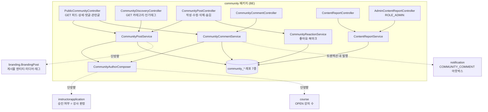
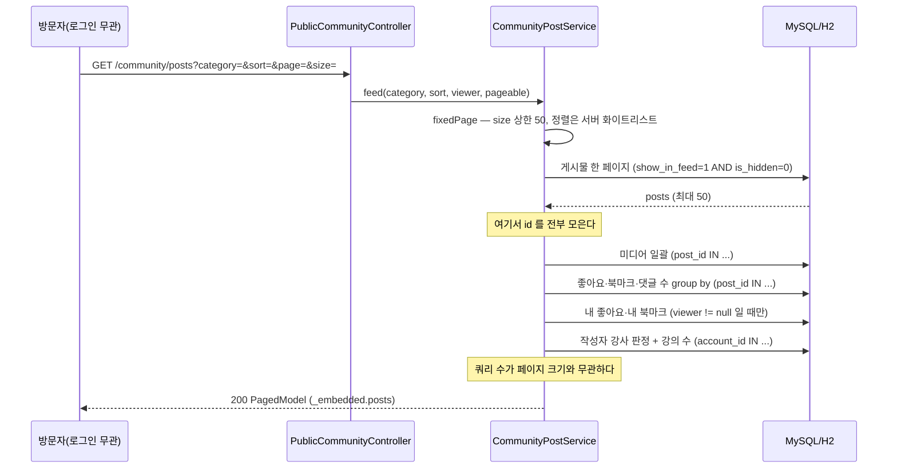
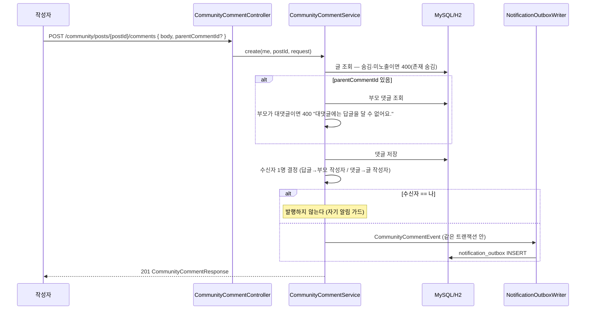
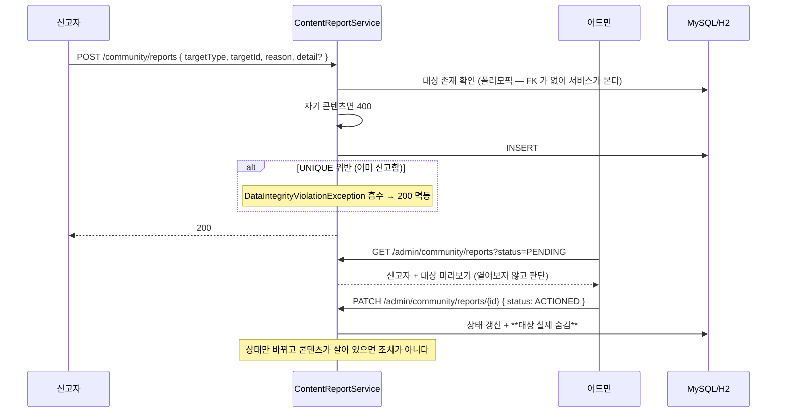
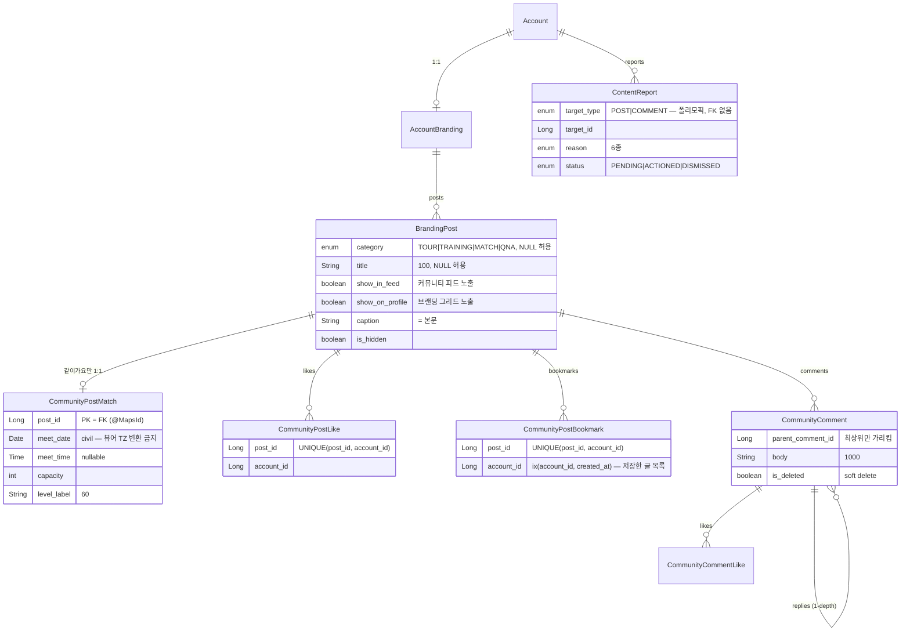

# 커뮤니티 (community) 도메인

## 1. 한 줄 요약

**커뮤니티 = 전 role 공용 피드** — 카테고리 4종(투어 자랑·트레이닝·같이가요·궁금해요)의 글에 좋아요·북마크·1-depth 댓글·신고가 붙고, 강사 작성자는 칩(✓ + "강의 N")으로 강조돼 브랜딩 프로필 → 강의로 이어진다. 핵심 invariant 셋: **게시물 테이블은 새로 만들지 않고 `branding_post` 를 공유한다**, **노출은 브랜딩 → 커뮤니티 단방향이다**, **카운터를 저장하지 않고 페이지 단위 일괄 집계로 파생한다**.

> 정책·왜·결정 히스토리는 [docs/features/community.md](../features/community.md). 이 문서는 *어떻게(구현)*.
> 게시물 엔티티 자체(미디어·태그·숨김·연결 강의)의 구현은 [branding.md](branding.md) 와 공유한다 — 같은 테이블이다.

## 2. 컴포넌트 지도



- **의존 방향은 전부 community → 바깥**이다. `branding`·`account`·`course`·`notification` 은 community 를 모른다. `CommunityCategory` enum 이 community 가 아니라 **`branding` 패키지에 사는 이유**가 이것이다 — 브랜딩 작성 경로도 카테고리를 받는데, branding 이 community 를 import 하면 순환이 된다.
- **`CommunityAuthorComposer` 를 별도 컴포넌트로 뺀 이유**: 게시물 서비스와 댓글 서비스가 같은 작성자 합성을 필요로 한다. 각자 구현하면 한쪽만 고쳐지는 순간 **같은 사람이 피드에선 강사, 댓글에선 일반 유저**로 보인다.
- 강사 여부·강의 수는 **저장하지 않고** 조회 시 파생한다(브랜딩의 `certs` 파생과 같은 방침).

## 3. 흐름

### 3-1. 피드 조회 — 카운터가 없는데 카운트를 어떻게 주나



**카드마다 세면 페이지 크기만큼 쿼리가 나간다.** 그래서 페이지를 먼저 확정하고 그 id 묶음에 대해 일괄 조회를 끝낸 뒤, 그 맵들을 **클로저로 들고 카드를 만든다**(`cardMapperFor`). 브랜딩 그리드가 미디어를 일괄로 모으는 것과 같은 패턴이다.

**역정규화 카운터(`like_count` 컬럼)를 두지 않은 이유**는 `review` 도메인이 이미 "통계 갱신 버그"를 baseline 간극으로 달고 있어서다 — 카운터는 갱신 지점을 하나라도 빠뜨리면 조용히 틀어지고, 틀어진 걸 알아채는 방법이 없다. 집계는 느려질 수는 있어도 **틀리지는 않는다.** 느려지면 그때 캐시/카운터를 붙인다.

**비로그인이면 "내 반응" 조회를 아예 하지 않는다** — 빈 집합이면 모든 `likedByMe`/`bookmarkedByMe` 가 자연히 false 다.

### 3-2. 댓글 작성 → 알림



**수신자는 언제나 최대 1명이다.** 답글에 대해 글 작성자까지 보내면 스레드가 길어질수록 소음이 된다(N3 시나리오로 고정). **자기 알림 가드는 발행 지점**에 있다 — 내 글에 내가 댓글을 다는 건 흔한 동작이라 안 막으면 자기 알림이 쏟아진다(N2).

**리스너가 `MANDATORY` 라 이벤트는 트랜잭션 안에서 발행해야 한다.** 커밋 후 발행으로 바꾸면 아웃박스 행이 안 생긴다. 새 알림 채널을 만들지 않고 **기존 `NOTICE` 채널을 재사용**한 이유는 채널 추가가 앱 릴리스에 묶이기 때문이다(구버전 앱은 모르는 채널을 못 그린다).

### 3-3. 신고 → 어드민 조치



**자동 숨김 임계값은 없다.** 조직적 신고로 정상 글이 사라지는 위험이 어드민 부재 시간대의 노출보다 크고, 임계값은 실데이터 없이는 감이다. 필요해지면 `auto_hidden_at` 컬럼 하나와 카운트 조건만 얹으면 된다.

## 4. 데이터 모델



설계 의도 / 함정:

- 🔴 **게시물 테이블·엔티티 클래스 이름이 `branding_post` / `BrandingPost` 인 것은 실수가 아니다.** ECS 롤링 배포 중에는 구버전 태스크가 살아 있어, 신버전이 부팅하며 RENAME 을 돌리면 그 태스크가 없는 테이블을 조회해 **브랜딩 페이지가 500** 이 된다(드레인될 때까지). 이름은 내부 구현이고 API 경로가 계약이라 바꿔서 얻는 게 없다. 정리하려면 트래픽 없는 시점에 테이블·클래스를 함께 바꾸는 별도 PR 로. (V19 는 순수 additive — `ADD COLUMN`/`ADD INDEX`/`CREATE TABLE` 뿐이다.)
  ⚠️ V19 의 헤더 주석에는 "엔티티는 `CommunityPost` 로 쓰되 `@Table` 을 명시한다" 고 적혀 있지만 **실제로는 클래스명도 `BrandingPost` 로 유지**했다(같은 이유를 클래스에도 적용). **주석을 고치면 Flyway 체크섬이 바뀌어 이미 적용된 DB 가 부팅에 실패**하므로 마이그레이션 파일은 손대지 않는다 — 이 문서가 정본이다.
- **`category` 와 `title` 은 nullable 이다.** 브랜딩에서 올라온 글에는 둘 다 없을 수 있고, V19 이전 글에는 반드시 없다. `category` 가 null 이면 카테고리 필터·관련 글에 안 걸리고 "전체" 피드에만 뜬다. **없는 값을 임의 카테고리로 채우지 않는다** — 하이라이트가 전부 투어 자랑은 아니다.
- **`show_in_feed`/`show_on_profile` 의 DB DEFAULT 는 기존 행 backfill 용이지 신규 쓰기용이 아니다.** 신규 글은 작성 경로(브랜딩 컨트롤러 / 커뮤니티 컨트롤러)가 두 값을 **명시 설정**한다. 기존 브랜딩 글은 `show_in_feed=0` — 유저가 동의한 적 없는 소급 노출을 만들지 않는다(되돌리려면 글마다 숨겨야 한다. 반대 방향이 훨씬 쉽다).
- **같이가요 필드를 메인 테이블 nullable 컬럼으로 붙이지 않은 이유**: 4개 카테고리 중 하나에만 있다. JSON 컬럼도 기각 — `meet_date` 로 정렬·마감 판정을 하는데 JSON 은 색인이 안 걸려 풀스캔이 된다(태그를 JSON 이 아니라 자식 행으로 둔 것과 같은 이유).
- ⚠️ **`CommunityPostMatch` 의 `@Id` 에 `@Column` 을 달면 부팅이 깨진다.** `@MapsId` + `@JoinColumn` 과 컬럼이 중복돼 "Repeated column" 으로 실패한다. `@Id` 는 매핑 없이 두고 `@MapsId` 에 맡긴다.
- **좋아요·북마크·신고의 UNIQUE 가 멱등성의 근거다.** `(대상, 계정)` UNIQUE 덕에 `POST` 를 두 번 보내도 1건이다. 레거시 `lecture_mark`(강의 찜)에는 이 제약이 없어 중복 찜이 가능하다 — 베끼지 않는다. 올바른 선례는 `venue_favorite`.
- **`content_report` 만 FK 가 없다.** 게시물·댓글 두 종류를 가리키는 폴리모픽 참조라 DB 제약을 걸 수 없다. 대상 존재 확인은 **접수 시점에 서비스가** 한다.
- **인덱스는 2개만 추가했다.** 피드용 `ix_community_feed(show_in_feed, is_hidden, category, created_at)` 와 인기 태그 집계용 `ix_branding_post_tag_tag`. 브랜딩 그리드용은 **새로 만들지 않았다** — 기존 `ix_branding_post_grid` 가 이미 `branding_id` 로 좁히므로 그 위에 `show_on_profile` 필터를 얹는 비용은 무시할 수 있다. 거의 같은 인덱스를 하나 더 두면 쓰기 비용만 늘어난다.

### 노출 축을 얹으면 기존 조회 경로를 전부 다시 봐야 한다

공유 테이블에 `show_on_profile` 을 더한 순간, **브랜딩의 기존 쿼리 3개가 조용히 틀렸다** — 커뮤니티 글이 브랜딩 프로필 그리드로 새고 `stats.posts` 가 그리드 타일 수와 어긋났다. `findPublicGrid`·`findOwnerGrid`·`countByBranding_IdAndIsHiddenFalse` 에 전부 `show_on_profile = true` 를 넣어 고쳤다(use-case 테스트 X1/S2 가 잡았다). **새 축을 더하는 변경은 그 테이블을 읽는 모든 경로의 목록을 먼저 만들고 시작해야 한다.**

### 정렬은 서버가 고정한다

클라이언트 `sort` 를 `Pageable` 에 태우지 않는다 — 임의 필드 정렬로 내부 컬럼을 탐색하거나 인덱스 없는 정렬로 풀스캔을 유발할 수 있다.

| 대상 | 규칙 |
|---|---|
| 피드 | 화이트리스트 enum `LATEST`(기본) · `POPULAR` 뿐. tie-break 은 항상 `id desc` |
| `?category=MATCH` | **자동으로 `meetDate ASC`**(일정 임박순). 정렬 축이 조인 테이블에 있어 전용 쿼리를 탄다 |
| 댓글 | `createdAt ASC` **고정 — 파라미터 없음** |
| 페이지 크기 | 상한 50 (전수 스크래핑 방지) |

**`POPULAR` 은 최근 7일 창 + 좋아요 desc** 이고, `group by p`(엔티티 전체)로 쓴다 — 컬럼 일부만 group by 하면 MySQL `ONLY_FULL_GROUP_BY` 에서 깨진다. **H2 는 이걸 증명하지 못하므로**(테스트 DB) 실 MySQL 부팅으로 확인해야 한다. 페이징을 위해 `countQuery` 도 따로 준다.

### 댓글: 무엇을 지우고 무엇을 남기나

- **대댓글이 달린 부모** → soft delete. `deleted: true` + `"삭제된 댓글입니다."` 로 남고 **`replies` 는 보존**된다.
- **대댓글이 없는 댓글** → hard delete. 껍데기를 남길 이유가 없다.
- **댓글 수 집계에서 삭제분은 뺀다.** "댓글 3" 인데 2개만 보이면 버그다.
- **1-depth 는 DB 로 표현할 수 없어 서비스가 강제한다** — `parent.isTopLevel()` 확인.
- **스레드는 한 번에 다 읽는다.** 최상위와 대댓글을 나눠 조회하면 그 사이에 달린 댓글이 유실된다. 응답이 `PagedModel` 이 아니라 **`CollectionModel`**(= `page` 키 없음)인 게 이 때문이다.

## 5. 보안 / 권한 매트릭스

매처는 `global/security/SecurityConfiguration`. ⚠️ **ant 의 `*` 는 `/` 를 넘지 않는다** — `/community/posts/*` 는 `/community/posts/1/comments` 를 덮지 않으므로 **형제·하위 경로마다 매처가 따로** 필요하다(실제로 `/community/categories`·`/community/tags/popular` 가 누락돼 401 이 났었다). **`/admin/community/reports/**` 는 `/community/**` 의 `authenticated` 보다 앞**에 둔다.

| 엔드포인트 | 인증 | 역할 | 소유권 |
|---|---|---|---|
| `GET /community/posts` | **불필요** | — | `show_in_feed=1` + 미숨김만. 정렬·size 서버 고정 |
| `GET /community/posts/{id}` | **불필요** | — | 위와 같음. **단 오너 본인은 자기 글이면 숨김이어도 조회 가능** |
| `GET /community/posts/{id}/comments` | **불필요** | — | 글이 보이면 스레드도 보인다. 페이지네이션 없음 |
| `GET /community/posts/{id}/related` | **불필요** | — | 같은 카테고리·자기 제외. 카테고리 없는 글은 **빈 배열** |
| `GET /community/categories` · `/community/tags/popular` | **불필요** | — | 집계값만 |
| `POST /community/posts` | 필요 | **인증만** | 작성자 = 세션. 연결 강의는 **내 코스**만 |
| `PUT · DELETE /community/posts/{id}` | 필요 | 인증만 | 내 글 아니면 **400(존재 숨김)** |
| `PATCH /community/posts/{id}/visibility` | 필요 | 인증만 | 동일 |
| `POST · DELETE /community/posts/{id}/like` · `/bookmark` | 필요 | 인증만 | 멱등. 숨긴 글에는 걸 수 없다(400) |
| `POST /community/posts/{id}/comments` | 필요 | 인증만 | 대댓글의 부모는 최상위만 |
| `PUT · DELETE /community/comments/{id}` | 필요 | 인증만 | 남의 댓글 **400** |
| `POST · DELETE /community/comments/{id}/like` | 필요 | 인증만 | 멱등. 삭제된 댓글엔 불가 |
| `POST /community/reports` | 필요 | 인증만 | 자기 콘텐츠 400. 중복 **200 멱등** |
| `GET · PATCH /admin/community/reports/**` | 필요 | **ROLE_ADMIN** | — |
| `POST /branding-images` | 필요 | 인증만 | 사진 업로드 — **기존 재사용, 신규 없음** |

**왜 `hasRole("INSTRUCTOR")` 가 없나** — 커뮤니티는 전 role 공용이고, 강사 강조는 **권한이 아니라 표시**다. 강사 판정은 승인된 신청에서 서비스가 파생한다(승인 전 강사를 403 으로 막지 않는 레포 전반의 방침. [branding.md](branding.md) §5 와 같은 이유).

**404 를 쓰지 않는다** — 없는 글·남의 글·숨긴 글은 전부 **400(존재 숨김)**. 있고 없고를 알려주는 것 자체가 정보다.

## 6. 알려진 설계 간극

- 🟡 **강의 연결의 "강사만" 은 커뮤니티가 보장하지 않는다.** 서비스가 보는 건 **코스 소유권 하나**이고, `POST /courses` 는 `authenticated()` 라 STUDENT 롤 계정도 코스를 만들고 `OPEN` 까지 올릴 수 있다. 판정 축이 둘이다 — **칩은 *승인된 강사 신청*, 연결은 *코스 소유***.
  실측(로컬, 승인 상태만 잠깐 내려 재현): 같은 응답에 **`"isInstructor": false` 와 `linkedCourse: {status: "OPEN"}` 이 공존**한다. 즉 화면상 **강사 표식이 없는 사람의 글에 강의 미니카드가 붙는다.**
  ```
  "author": { "nickName": "…", "isInstructor": false },     ← lessonCount 키도 없음
  "linkedCourse": { "id": 1, "title": "…", "status": "OPEN" }
  ```
  → 좁히려면 **코스 도메인의 결정("누가 코스를 만들 수 있나")이 먼저**다. 커뮤니티에서 `isInstructor` 로 연결을 막으면 승인 대기 중인 강사가 자기 코스를 못 걸게 되어(레포 전반의 "승인 전 403 금지" 방침과 충돌) 다른 문제가 생긴다.
- 🟡 **DRAFT 코스를 연결하면 작성자에게 아무 신호가 없다.** 요청은 200 으로 통과하고 공개 응답에서 `linkedCourse` 키만 조용히 빠진다(비공개 코스 누출 방지). 코스를 OPEN 으로 바꾸면 그때 나타나므로 **거절이 아니라 침묵이 문제**다. → picker 에서 DRAFT 를 숨기거나 뱃지로 알린다(FE), 또는 BE 가 400 으로 막는다. 계약에 FE 처리로 적어 뒀다.
- 🟡 **댓글 스레드에 크기 상한이 없다.** 한 글의 댓글을 언제나 전부 반환한다. 수백 개가 쌓이면 응답이 커진다 — 그때 **최상위만 페이징(대댓글은 계속 인라인)** 으로 켠다. 켜는 순간 응답이 `CollectionModel` → `PagedModel` 로 바뀐다.
- 🟡 **레이트리밋이 없다.** 글·댓글 연타를 막는 쿨다운을 계약에 적었지만(D6) 구현하지 않았다. 좋아요·북마크·신고는 UNIQUE 로 멱등이라 연타에 안전하지만, **글·댓글은 그렇지 않다.**
- 🟡 **`POPULAR` 의 7일 창·정렬식이 하드코딩**이다. 실사용 데이터 없이 정한 값이라 튜닝 여지가 있다. 좋아요만 보고 댓글을 안 본다.
- 🟢 **검색 없음** — 계약 범위 밖(디자인의 검색 아이콘은 미렌더). 붙이면 `LectureSpecifications.keywordMatch` 와 같은 MySQL `LIKE` 방식이 자연스럽다.
- 🟢 **참여 신청 없음, 앞으로도 만들지 않는다.** 사용자 의도가 "신청류 = 기존 수강신청(예약) 플로우" 다. 그래서 `capacity` 는 있지만 참여자 테이블도 `joinedCount` 도 없고, 클라이언트는 "N명 모집" 으로 렌더한다. 향후 버디 참여도 커스텀 신청이 아니라 **예약 플로우 통합**으로 설계한다.
- 🟢 **아바타 URL 이 파일명만인 레코드가 있다** — 커뮤니티가 만든 문제가 아니라 기존 데이터 이슈다. [image-storage-and-serving.md](../features/image-storage-and-serving.md) 백로그 참조.

## 7. 더 깊게: 테스트로 보기

`usecase/CommunityUseCaseTest` (실 H2 + 실 시큐리티 필터체인, 46 시나리오). `@DisplayName` 위→아래 = 사양:

- `S1~S3` 작성 → 피드 노출 / 상세(UTC 시각 — **상대시간은 BE 가 만들지 않는다**) / 삭제
- **`X1` 커뮤니티 글은 브랜딩 그리드에 안 나온다 / `X2` 브랜딩 글은 커뮤니티 피드에 뜬다** — 단방향의 양쪽. 이 둘이 노출 모델의 회귀 방지선이다
- `F1` 카테고리 필터
- `M1~M6` 같이가요 — 모집 정보 / **강의 연결 금지** / **일정 임박순** / 지난 모집은 `open=false` / 필수 필드 / 카테고리를 바꾸면 모집 정보도 사라진다
- `A1` 강사가 아니면 `lessonCount` 키가 **아예 없다**(0 이면 "강의 0개인 강사" 로 읽힌다)
- `V1` 업로드로 받지 않은 외부 이미지 거부 / `V2` 제목 없으면 400 + 한국어 문구
- `H1` 숨긴 글은 공개에서 빠지되 **오너 상세로는 열린다**(다시 공개를 누를 화면이 필요하다)
- `K1~K5` 좋아요 멱등 / 취소 / 카드의 카운트·내 상태 / 북마크 목록(비로그인은 에러가 아니라 빈 목록) / 숨긴 글엔 불가
- `D1~D4` 카테고리 카운트는 **0인 카테고리도 채워 4종 전부**(칸이 그려져야 한다) / 인기 태그 / 관련 글 / 인기순
- `C1~C8` 댓글 중첩·수 반영 / **1-depth 강제** / soft delete 로 스레드 유지 / hard delete / 삭제분은 수에서 제외 / 댓글 좋아요 / 남의 댓글 400 / 비로그인 읽기 O·쓰기 401
- `N1~N3` 알림 — 남의 글 댓글은 1건 / **내 글에 내 댓글은 0건** / 답글은 부모 작성자에게만
- `X1~X8` 신고 — 접수·큐 / 중복 200 멱등 / 자기 글 불가 / 기타 사유는 설명 필수 / 없는 대상 불가 / **조치하면 실제로 숨겨진다** / 큐는 ADMIN 만 / 목록에 신고자·미리보기
- `R1~R2` 남의 글 수정·삭제는 **400(403 아님)** / 비로그인 읽기 O·쓰기 401

알림 파이프라인 자체(아웃박스 → FCM)는 `usecase/NotificationOutboxFlowTest` 가 이미 검증한다. 커뮤니티 쪽에서 확인할 것은 **"올바른 사람에게 올바른 횟수로 발행하는가"** 라 `N1~N3` 를 커뮤니티 테스트에 뒀다.

⚠️ **테스트는 H2 + Flyway OFF 라 마이그레이션을 검증하지 못한다.** V19 는 빈 docker MySQL 에 `./scripts/dev.sh` 로 부팅해 `validate` 를 통과시키는 것으로만 확인된다. `POPULAR` 의 `GROUP BY` 도 H2 가 증명하지 못하는 항목이다.
