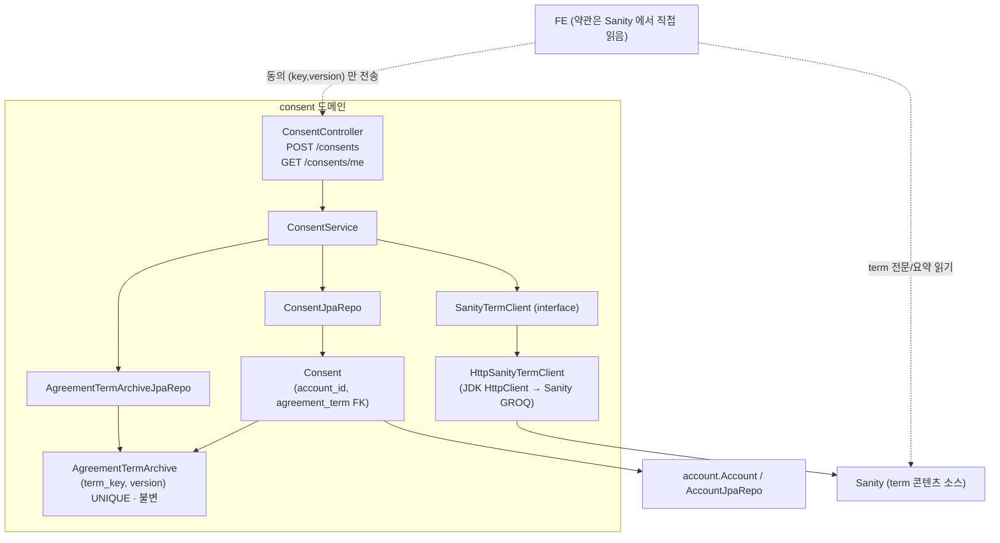
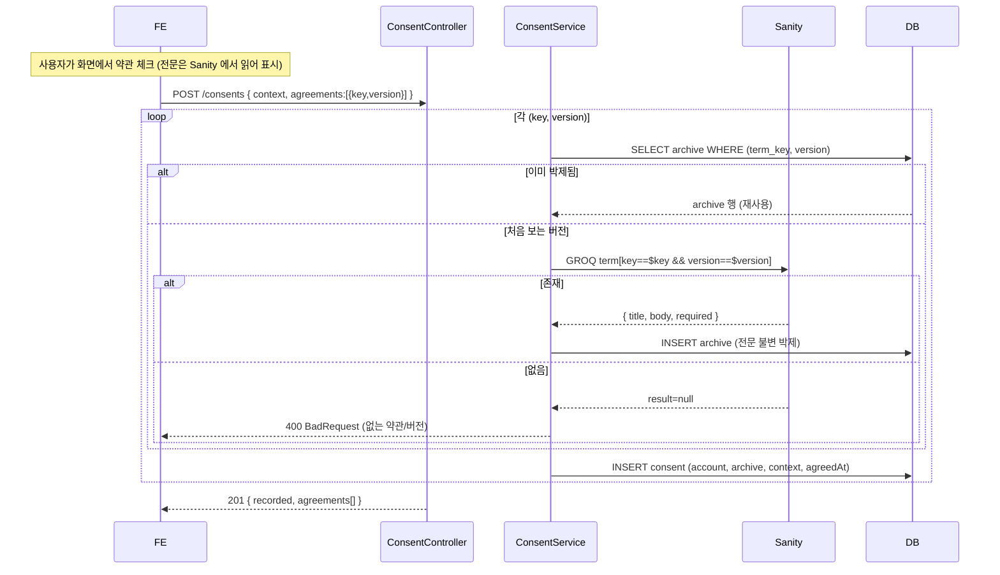
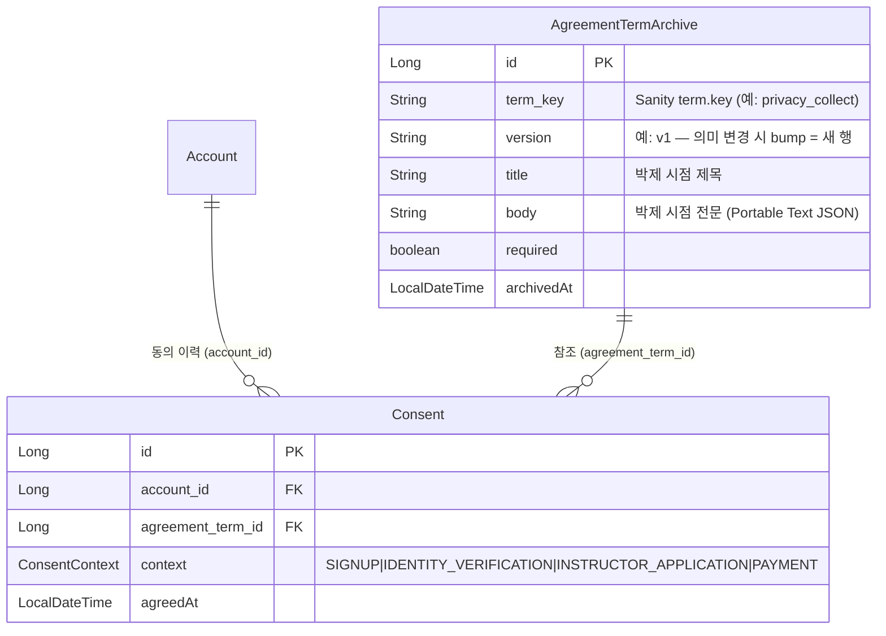

# 동의 / 약관 (consent)

## 한 줄 요약

사용자의 **약관 동의 이력**을 계정 공유 자산으로 기록한다. `POST /consents` 로 "이 계정이, 이 약관 버전에, 어느 화면에서 동의" 를 남기고 `GET /consents/me` 로 조회한다. 약관 **콘텐츠(전문/요약/버전)는 Sanity 가 소유** — FE 가 화면(context) 기준으로 직접 읽어 보여준다. BE 는 콘텐츠를 호스팅하지 않고, 동의 시점에 그 버전을 **불변 박제(증빙)** + 동의를 기록한다.

> **핵심 invariant** — 약관 전문은 유저별로 복사하지 않는다. `(key, version)` 당 1행만 `AgreementTermArchive` 에 박제하고, `Consent` 는 그 행을 FK 참조한다. 박제 행은 **append-only(불변)** — 분쟁 시 "그 사용자가 본 정확한 전문" 의 증빙.

하이브리드 결정(2026-06-12): Sanity 를 약관 편집 UI 로(수정 시 `version` bump), BE 는 동의 시점에 그 버전을 박제 → 편집 편함 + 법적 증빙 둘 다. 자세한 정책은 [features/consent-and-terms.md](../features/consent-and-terms.md).

---

## 컴포넌트 지도

FE 는 약관 **전문을 Sanity 에서** 읽고, BE 엔 `(key,version)` 만 보낸다. BE 는 박제할 전문을 **Sanity 에서 직접** 받는다(FE 본문 신뢰 안 함 — 위변조 방지). 단방향: consent → account, consent → archive.

---

## 흐름 — 첫 동의 freeze + 이후 재사용

분쟁 조회: `consent → agreement_term_id → AgreementTermArchive.body` 로 그 사용자가 동의한 시점의 전문을 그대로 꺼낸다 (박제 행은 불변).

---

## 데이터 모델

- `(term_key, version)` **UNIQUE** — 버전당 1행. 박제는 append-only(수정 안 함).
- `Consent` 는 전문을 복사하지 않고 archive 를 **참조만** → 유저 N명이 같은 버전 동의해도 전문 1번 저장.
- `context` 는 Sanity `term.contexts` 와 같은 어휘 (DB=enum명, JSON=lowercase snake).

---

## 보안 / 권한 매트릭스

| 엔드포인트 | 메서드 | 권한 | 비고 |
|---|---|---|---|
| `/consents` | POST | 인증 | 동의 기록. body 의 `(key,version)` 만 신뢰, 전문은 BE 가 Sanity 에서 직접. 201 |
| `/consents/me` | GET | 인증 | 내 동의 이력(최신순). `_embedded.consents` |

매처: `/consents/**` → `authenticated`. 동의는 본인 것만 — 토큰 계정 기준, 임의 계정 조회 엔드포인트 없음. 약관 콘텐츠 자체(전문 읽기)는 BE 엔드포인트가 아니라 Sanity 직접 조회(public dataset).

---

## 알려진 설계 간극

- 🟡 **boolean 게이트와 공존** — 기존 본인확인/강사신청의 `agreedRequiredTerms` boolean(진행 게이트)은 그대로. consent 는 그 위의 감사 이력. 둘을 수렴/대체할지는 후속. (지금은 FE 가 동의 시점에 `POST /consents` 를 별도 호출)
- 🟡 **개정 시 재동의 유도 미구현** — 필수 약관 version 이 오르면 "현재 active version vs 사용자가 동의한 version" 비교로 재동의를 유도해야 함. 비교 정책/엔드포인트 미정.
- 🟡 **첫-동의 lazy freeze** — Sanity publish 웹훅으로 사전 freeze 하면 더 견고하나 MVP 는 첫 동의 시 fetch+freeze. 동시 첫-동의 경합은 UNIQUE 제약이 막고 500 → FE 재시도로 성공(출시 시 동시성 미미라 허용).
- 🟢 **version 무결성은 운영 규율** — Sanity 에서 의미가 바뀌는 수정 시 반드시 `version` bump 해야 박제와 화면이 일치. 자동 강제 장치는 없음(운영 규약).

---

## 더 깊게: use-case 테스트로 보기

- **[`usecase/ConsentUseCaseTest`](../../src/test/java/com/diving/pungdong/usecase/ConsentUseCaseTest.java)** — 실제 H2 + 시큐리티, `SanityTermClient` 만 `@MockBean`:
  - `C1` 첫 동의 → 버전당 박제 + 이력 / `C2` 다른 계정 같은 버전 → 박제 재사용(freeze 1회) / `C3` 다른 version → 별도 박제 / `V1` Sanity 에 없는 약관 → 400(이력·박제 0) / `V2` 빈 agreements → 400 / `C4` GET /me 이력(`_embedded.consents`)
- 후속 권장 시나리오: `R*` 타인 동의 조회 차단(현재 구조상 불가하지만 명시), `S*` 동시 첫-동의 경합, `X*` Sanity 도달 불가 시 500(전송 오류 vs 없음 구분)
