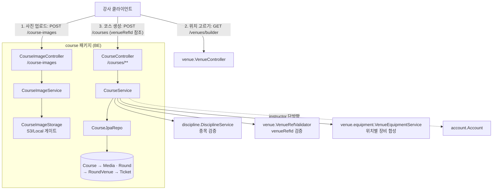
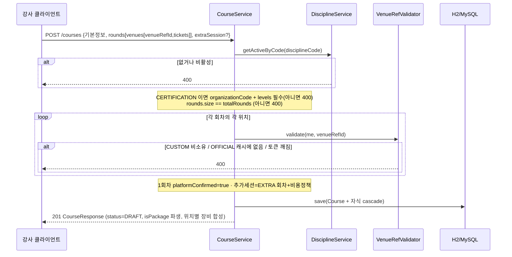

# 코스 (course) 도메인

## 1. 한 줄 요약

**Course(코스)** = 강사가 만드는 강의 상품 — 기본정보(단체·레벨·수강료·사진) + **회차**(회차별 설명·진행 위치·이용권) + 선택적 **추가세션**(비용 정책). V2 코스 작성 화면의 본체이자 legacy `Lecture` 의 후신(둘은 공존, 마이그레이션은 후속). 핵심 invariant: **위치·장비를 코스가 소유하지 않는다** — 위치는 `venueRefId` 로 참조, 위치별 장비는 강사×위치 가격표에서 읽기 시점 합성. 그래서 코스는 "무엇을 가르치나 + 어디서(참조) + 어떤 이용권" 만 담는다.

> 정책·왜·결정 히스토리는 [docs/features/course-create.md](../features/course-create.md). 이 문서는 *어떻게(구현)*.

## 2. 컴포넌트 지도



- course → venue·discipline·account **단방향 참조**(역방향 없음). 위치/장비 진실은 venue 도메인, 코스는 참조만.
- 2-phase: 사진을 먼저 `/course-images` 로 올려 url 을 받고, 생성 JSON 이 그 url + `venueRefId`(빌더에서 고른 위치)를 담는다.

## 3. 핵심 흐름 — 코스 생성



## 4. 데이터 모델

```mermaid
erDiagram
  Course ||--o{ CourseMedia : media
  Course ||--o{ CourseRound : rounds
  CourseRound ||--o{ RoundVenue : venues
  RoundVenue ||--o{ RoundVenueTicket : tickets
  Course }o--|| Account : "instructor (필수)"

  Course {
    Long id
    Long instructor_id "필수"
    String title
    enum kind "TRIAL|CERTIFICATION|TRAINING"
    String organizationCode "CERTIFICATION 만"
    String disciplineCode "discipline.code 검증"
    Set levels "CertLevel @ElementCollection, CERTIFICATION 만(>=2 ⇒ 패키지)"
    int totalRounds
    int price "부가세 포함"
    enum status "DRAFT|OPEN|CLOSED (검수 없음)"
  }
  CourseMedia { enum kind "PHOTO|VIDEO", String url, int sortOrder }
  CourseRound {
    enum roundKind "REGULAR|EXTRA"
    Integer roundIndex "REGULAR 1..N, EXTRA null"
    boolean platformConfirmed "1회차=true"
    Integer freeCount "EXTRA 전용"
    Integer perSessionPrice "EXTRA 전용"
  }
  RoundVenue { String venueRefId "CUSTOM:<pk>|OFFICIAL:<sanityId>", int sortOrder }
  RoundVenueTicket { String ticketRef, enum daypart "WEEKDAY|WEEKEND", int sortOrder }
```

설계 의도:
- **위치·장비 비소유** — `venueRefId` 로 venue 참조, 장비는 강사×위치 가격표(`venue.equipment`)에서 읽기 시점 합성(`CourseResponse.Venue.equipment`). 코스는 이용권 *선택*(ticketRef×daypart)만 보관 — 가격/시간 해석은 부킹 시점(reservation, 후속).
- **추가세션 = EXTRA 회차** — 별도 엔티티 대신 `roundKind` 로 구분 + 비용 정책 필드. 회차 구조 재사용.
- **`levels` 평탄화** — 단체 명칭은 Sanity, BE 는 `CertLevel` enum 만. `isPackage` 는 size>=2 파생(저장 안 함).
- **스냅샷 교체** — 수정은 `clearChildren()` + 재구성(orphanRemoval), venue/instructor-application 과 동일.
- `roundIndex` 컬럼명(‘index’ 예약어 회피).

## 5. 보안 / 권한 매트릭스

매처는 `global/security/SecurityConfiguration` — `/courses/**`·`/course-images` = authenticated (강사 트랙; 리뷰 대기 STUDENT 도 draft 준비 허용, venue 동일). PII 없음 → GET 무방.

| 엔드포인트 | 인증 | 소유권 |
|---|---|---|
| `POST /courses` | 필요 | instructor=현재 계정. venueRefId 는 내 custom / 캐시된 official 만 |
| `GET /courses/mine` | 필요 | 내 코스만 |
| `GET /courses/{id}` | 필요 | 내 코스만 — 아니면 400(존재 숨김) |
| `PUT /courses/{id}` | 필요 | 내 코스만 — 스냅샷 교체 |
| `PATCH /courses/{id}/status` | 필요 | 내 코스만 — DRAFT/OPEN/CLOSED |
| `POST /course-images` | 필요 | multipart → {fileURL} (사진만) |

## 6. 알려진 설계 간극 / 확장 자리

- 🟡 **공개(수강생) 코스 조회 미구현** — 현재 전부 강사 본인 스코프. 브라우즈/상세(OPEN 코스)·검색은 후속(legacy `/lecture/list` 대체).
- 🟡 **ticketRef 깊은 검증 안 함** — 회차 위치의 이용권 선택을 그대로 보관(그 위치에 실제 있는 이용권인지 미검증). 부킹/availability 연동 때 검증 + 가격·시간 해석.
- 🟡 **자격증 (org,disc,level) 권위 검증 안 함** — `organizationCode`·`levels` 를 코드로만 저장(instructor-application 관례). Sanity 카탈로그 대조는 후속.
- 🟡 **영상 업로드** — `MediaKind.VIDEO` 자리는 있으나 업로드/트랜스코딩 미구현(사진만).
- 🟡 **내 강의 메트릭** — 카드의 누적 수강생·평점은 reservation/review 연동 후.
- 🟢 **목록 N+1** — 상세만 위치별 장비 합성(목록은 빈 맵). 합성은 위치 수만큼 가격표 조회(코스당 소수).
- 🟢 **legacy `Lecture` 마이그레이션** — 공존 중. 데이터 이전·엔드포인트 전환은 별도.

## 7. 더 깊게: 테스트로 보기

`usecase/CourseCreateUseCaseTest` (실 H2 + 임베디드 Redis + stub Sanity + 시큐리티). `@DisplayName` 위→아래 = 사양:

- `S1` 자격 과정 생성 → 201·DRAFT·회차/위치 박힘 / `S2` 공식(OFFICIAL) 위치 사용
- `P1` 레벨 2개 → `isPackage=true` / `P2` 추가세션 → EXTRA 회차 + 비용 정책
- `E1` 코스 상세에서 위치별 장비가 강사×위치 가격표로부터 합성
- `V1`~`V4` 자격인데 레벨 없음 / 회차수 불일치 / 없는 종목 / 남의 custom 위치 → 400
- `R1` 남의 코스 상세 400(숨김) / `T1` 상태 OPEN 전이 / `L1` 내 강의 목록 = 내 것만

> ⚠️ `Authorization` 헤더는 **raw JWT**(prefix 없음). 공식 위치 캐시는 임베디드 Redis(process-전역)라 `@BeforeEach` 로 `venue:official:*` flush.
