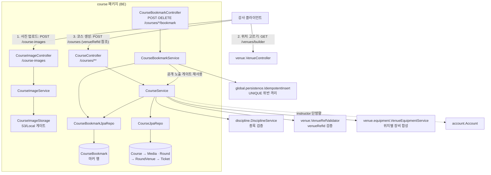
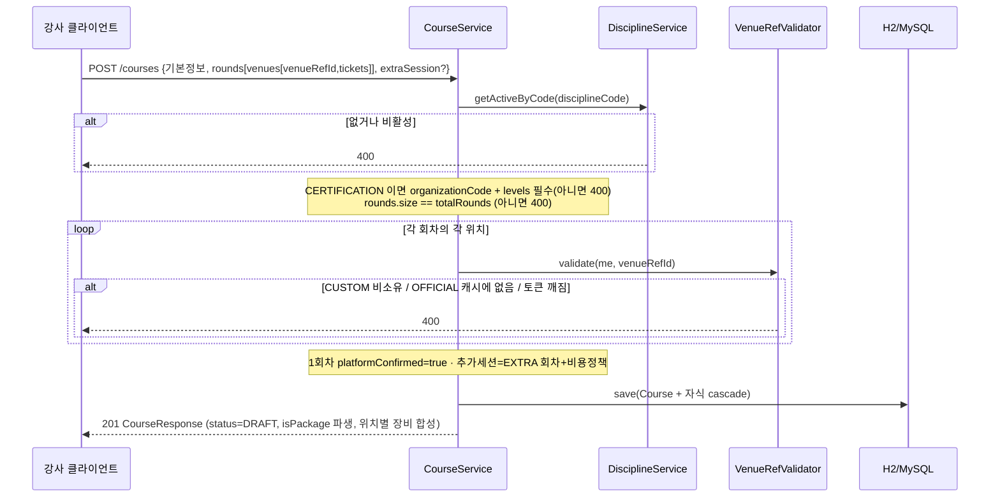

# 코스 (course) 도메인

## 1. 한 줄 요약

**Course(코스)** = 강사가 만드는 강의 상품 — 기본정보(단체·레벨·수강료·사진) + **회차**(회차별 설명·진행 위치·이용권) + 선택적 **추가세션**(비용 정책). V2 코스 작성 화면의 본체이자 legacy `Lecture` 의 후신 — **legacy `Lecture` 는 2026-08-15 삭제됐고 공존은 끝났다(이전할 데이터도 없었다).** 핵심 invariant: **위치·장비를 코스가 소유하지 않는다** — 위치는 `venueRefId` 로 참조, 위치별 장비는 강사×위치 가격표에서 읽기 시점 합성. 그래서 코스는 "무엇을 가르치나 + 어디서(참조) + 어떤 이용권" 만 담는다.

> 정책·왜·결정 히스토리는 [docs/features/course-create.md](../features/course-create.md). 이 문서는 *어떻게(구현)*.

## 2. 컴포넌트 지도

```mermaid
flowchart TB
  subgraph course["course 패키지 (BE)"]
    CC[CourseController<br/>/courses/**] --> CS[CourseService]
    CC2[CourseImageController<br/>/course-images] --> CIS[CourseImageService]
    CIS --> CST[CourseImageStorage<br/>S3/Local 게이트]
    CC3[CourseBookmarkController<br/>POST·DELETE /courses/*/bookmark] --> CBS[CourseBookmarkService]
    CBS -- "공개 노출 게이트 재사용" --> CS
    CBS --> CBR[CourseBookmarkJpaRepo]
    CS --> CBR
    CBR --> CBE[(CourseBookmark<br/>마커 행)]
    CS --> CR[CourseJpaRepo]
    CR --> CE[(Course → Media · Round<br/>→ RoundVenue → Ticket)]
  end
  CBS --> II[global.persistence.IdempotentInsert<br/>UNIQUE 위반 격리]
  CS --> DS[discipline.DisciplineService<br/>종목 검증]
  CS --> VRV[venue.VenueRefValidator<br/>venueRefId 검증]
  CS --> VEQ[venue.equipment.VenueEquipmentService<br/>위치별 장비 합성]
  CS -. instructor 단방향 .-> ACC[account.Account]
  FE["강사 클라이언트"] -- "1. 사진 업로드: POST /course-images" --> CC2
  FE -- "2. 위치 고르기: GET /venues/builder" --> VB[venue.VenueController]
  FE -- "3. 코스 생성: POST /courses (venueRefId 참조)" --> CC

  classDef ext fill:#eef
  class DS,VRV,VEQ,ACC,VB,II ext
```

- course → venue·discipline·account **단방향 참조**(역방향 없음). 위치/장비 진실은 venue 도메인, 코스는 참조만.
- 2-phase: 사진을 먼저 `/course-images` 로 올려 url 을 받고, 생성 JSON 이 그 url + `venueRefId`(빌더에서 고른 위치)를 담는다.

## 3. 핵심 흐름 — 코스 생성

```mermaid
sequenceDiagram
  participant FE as 강사 클라이언트
  participant CS as CourseService
  participant DS as DisciplineService
  participant VRV as VenueRefValidator
  participant DB as H2/MySQL

  FE->>CS: POST /courses {기본정보, rounds[venues[venueRefId,tickets]], extraSession?}
  CS->>DS: getActiveByCode(disciplineCode)
  alt 없거나 비활성
    DS-->>FE: 400
  end
  Note over CS: CERTIFICATION 이면 organizationCode + levels 필수(아니면 400)<br/>rounds.size == totalRounds (아니면 400)
  loop 각 회차의 각 위치
    CS->>VRV: validate(me, venueRefId)
    alt CUSTOM 비소유 / OFFICIAL 캐시에 없음 / 토큰 깨짐
      VRV-->>FE: 400
    end
  end
  Note over CS: 1회차 platformConfirmed=true · 추가세션=EXTRA 회차+비용정책
  CS->>DB: save(Course + 자식 cascade)
  CS-->>FE: 201 CourseResponse (status=DRAFT, isPackage 파생, 위치별 장비 합성)
```

## 4. 데이터 모델

```mermaid
erDiagram
  Course ||--o{ CourseMedia : media
  Course ||--o{ CourseRound : rounds
  CourseRound ||--o{ RoundVenue : venues
  RoundVenue ||--o{ RoundVenueTicket : tickets
  Course }o--|| Account : "instructor (필수)"
  Course ||--o{ CourseBookmark : "저장(북마크)"
  CourseBookmark }o--|| Account : "저장한 사람"

  Course {
    Long id
    Long instructor_id "필수"
    String title
    enum kind "TRIAL|CERTIFICATION|TRAINING"
    String organizationCode "CERTIFICATION 만"
    String disciplineCode "discipline.code 검증"
    Set levels "CertLevel @ElementCollection, CERTIFICATION 만(>=2 ⇒ 패키지)"
    int totalRounds
    int price "부가세 포함"
    enum status "DRAFT|OPEN|CLOSED (검수 없음)"
    OffsetDateTime publishedAt "최초 OPEN 시각 — 되돌리지 않음. 공개 상세 읽기 게이트의 판정"
    OffsetDateTime createdAt "@PrePersist 보장"
    OffsetDateTime updatedAt "@PreUpdate + update()의 명시 호출 — sitemap lastmod 의 출처"
    Set regions "Region @ElementCollection — 둘러보기 지역 필터(저장 시 주소→파생)"
    String primaryLocationName "카드 대표 위치명(저장 시 비정규화)"
  }
  CourseMedia { enum kind "PHOTO|VIDEO", String url, int sortOrder }
  CourseRound {
    enum roundKind "REGULAR|EXTRA"
    Integer roundIndex "REGULAR 1..N, EXTRA null"
    boolean platformConfirmed "1회차=true"
    Integer freeCount "EXTRA 전용"
    Integer perSessionPrice "EXTRA 전용"
  }
  RoundVenue { String venueRefId "CUSTOM:<pk>|OFFICIAL:<sanityId>", int sortOrder }
  RoundVenueTicket { String ticketRef, enum daypart "WEEKDAY|WEEKEND", int sortOrder }
  CourseBookmark {
    Long id
    Long course_id "UNIQUE(course_id, account_id) — 멱등의 근거"
    Long account_id "ix(account_id, created_at) — 저장한 강의 목록"
    OffsetDateTime createdAt
  }
```

설계 의도:
- **위치·장비 비소유** — `venueRefId` 로 venue 참조, 장비는 강사×위치 가격표(`venue.equipment`)에서 읽기 시점 합성(`CourseResponse.Venue.equipment`). 코스는 이용권 *선택*(ticketRef×daypart)만 보관 — 가격/시간 해석은 부킹 시점(reservation, 후속).
- **추가세션 = EXTRA 회차** — 별도 엔티티 대신 `roundKind` 로 구분 + 비용 정책 필드. 회차 구조 재사용.
- **`levels` 평탄화** — 단체 명칭은 Sanity, BE 는 `CertLevel` enum 만. `isPackage` 는 size>=2 파생(저장 안 함).
- **스냅샷 교체 — 단, 회차는 예외로 재사용한다.** 스칼라·미디어·회차 내부의 위치/이용권은 지웠다 다시 만든다(orphanRemoval, venue/instructor-application 과 동일). **회차(`course_round`)만은 (종류, `roundIndex`)로 기존 행을 찾아 내용만 갱신**한다(`CourseService.reconcileRounds`) — `enrollment_round` 가 회차를 FK 로 참조하기 때문이다. 예전엔 회차도 전량 교체라 **수강생이 하나라도 있으면 제목만 바꿔도 참조 무결성 위반으로 500** 이 났다(공통 에러 봉투도 아니라 FE 가 잡지 못했다). 사라지는 회차(회차 수 축소·추가세션 제거)만 지우고, 그중 수강 기록이 물린 게 있으면 `CourseRoundInUseException`(-1024)로 거절한다 — 남의 예약·결제를 BE 가 임의로 정리하지 않는다. 물림 여부는 `course.CourseRoundUsageProbe`(인터페이스) ← `enrollment.CourseRoundUsageAdapter`(구현) 로 묻는다(의존 방향 유지 — `InstructorSummaryProvider` 와 같은 seam). **상태로 거르지 않는다**: 취소·거절된 수강도 행이 남아 FK 는 그대로 걸린다.
- `roundIndex` 컬럼명(‘index’ 예약어 회피).
- **카드의 강사 아바타(`instructorAvatarUrl`)는 페이지당 쿼리 1개**다. `Account.profilePhoto` 는 소유측 `@OneToOne(LAZY)` 이고 `default_batch_fetch_size: 100` 이라 한 페이지의 강사 사진이 IN 절 하나로 함께 온다 — 카드마다 나가지 않는다. (강사 프로필·추천 카드가 이미 쓰는 접근 패턴.) 이 배치 크기를 낮추면 여기가 조용히 느려진다(에러가 아니라 쿼리 수만 는다).
- **검색은 `제목 OR 강사 nickName` LIKE** (`CourseSpecifications.keywordLike`, 대소문자 무시). 사용자는 강사 이름으로 찾는데 예전엔 제목만 봐서 그 검색이 0건이었다 — 루트 `CLAUDE.md` 는 이미 "제목/강사 LIKE" 라고 적혀 있었으니 코드가 문서를 따라간 셈. 강사 조인은 **LEFT** 여야 한다(INNER 면 강사 계정이 없는 코스가 제목이 맞는데도 사라진다). 선행 `%` 와일드카드라 인덱스를 못 타므로 카탈로그가 커지면 전문검색이 필요해진다(현재 규모에선 과설계).
- **강사 축(`instructorNickName`)은 검색과 별개의 필터다** — `CourseSpecifications.instructorNickNameEq`, **정확 일치**(`=`). 강사 둘러보기 카드의 "강의 보기" 가 들어오는 경로라 대상이 이미 한 명으로 특정돼 있다. 부분일치로 두면 `"김민지"` 가 `"김민지2"`·`"김민지스쿨"` 을 끌어와 **남의 강의가 그 강사 목록에 섞인다**(그래서 `keyword` 의 강사명 LIKE 와 뜻이 다르고, 둘은 AND). 조인이 아니라 **exists 서브쿼리**다 — 지역·레벨 필터가 켜는 `distinct` 와 조인 컬럼이 섞이면 MySQL 이 거부하고(3065) H2 는 통과해 테스트만 초록이 된다(`bookmarkedBy`·`instructorApproved` 와 같은 이유). 없는 닉네임은 400 이 아니라 **빈 페이지**(레포 규약 + 닉네임 존재 여부를 상태코드로 흘리지 않기 위해).
- **페이지 크기 상한은 `global/persistence/PageClamp`** (MAX 50 / DEFAULT 20). 둘러보기엔 원래 상한이 없어 `?size=100000` 으로 카탈로그를 통째로 긁을 수 있었다(어드민 신고 큐에서 실제로 났던 것과 같은 구멍). clamp 는 도메인 정책이 아니라 **모든 목록 엔드포인트에 같게 걸려야 하는 가드**라 도메인별 사본을 만들지 않는다.
- **저장(북마크)은 마커 행**(V36) — 상태 컬럼 없이 **행의 유무가 곧 상태**고, `(course_id, account_id)` UNIQUE 가 멱등을 DB 에서 보장한다. 그래서 `POST` 를 두 번 보내도 1개다. 삽입은 `global/persistence/IdempotentInsert`(REQUIRES_NEW)로 격리한다 — 같은 트랜잭션에서 제약 위반을 catch 만 하면 rollback-only 로 표시돼 **뒤이은 카운트 조회가 500** 이 된다. 응답의 `count` 도 `countFresh`(새 스냅샷)로 읽는다: MySQL 기본 REPEATABLE READ 에선 방금 REQUIRES_NEW 로 커밋한 내 행이 바깥 트랜잭션의 스냅샷에 **안 보여** "내 것 빠진 값" 이 나간다(커뮤니티에서 실측된 버그). **enrollment 와 합치지 않은 이유**: 저장했다고 신청한 게 아니고, 신청을 취소해도 저장은 남는다 — 수명이 다르다.
- **둘러보기 facet 비정규화(`regions`·`primaryLocationName`)** — 코스의 위치는 `venueRefId` 참조이고 OFFICIAL 위치 주소는 Sanity 캐시(Redis)라 **쿼리 타임 JOIN 으로 지역 필터가 불가**. 그래서 저장 시점에 `venue.VenueRefResolver`(CUSTOM=DB, OFFICIAL=캐시)로 회차 위치 주소→`venue.Region`(서울·경기/강원/제주/부산·경남/ETC)을 풀어 코스에 박는다. 읽기 경로는 순수 JPA 컬럼 필터(`CourseSpecifications`, ES 안 씀). 트레이드오프: OFFICIAL 위치 이사 시 코스 재저장 전까지 stale(풀 이동은 드물어 MVP 허용, 후속 reconcile 후보).

## 5. 보안 / 권한 매트릭스

매처는 `global/security/SecurityConfiguration` — `/courses/**`·`/course-images` = authenticated (강사 트랙; 리뷰 대기 STUDENT 도 draft 준비 허용, venue 동일). **단 `GET /courses/browse`·`GET /courses/*/detail` 만 permitAll**(수강생 둘러보기·상세, `/courses/**` authenticated 규칙보다 먼저 매칭). PII 없음 → GET 무방.

| 엔드포인트 | 인증 | 소유권 |
|---|---|---|
| `GET /courses/browse` | **불필요(공개)** | OPEN + **그 종목 승인 강사**의 코스만 노출. 필터(종목·지역·종류·레벨·단체·가격·**강사 닉네임 정확일치**)+검색(제목·강사명 부분일치)+정렬+페이지. **size 상한 50/기본 20**(`PageClamp`). 빈 결과=200. 토큰이 있으면 카드에 `bookmarkedByMe` 가 채워진다(없으면 조용히 false) |
| `GET /courses/browse?bookmarkedByMe=true` | 선택(토큰 없으면 **빈 페이지**) | 내가 저장한 강의만. **이때만 `disciplineCode` 가 선택** — 저장 목록은 종목 홈이 아니라 마이페이지에서 들어온다 |
| `GET /courses/{id}/detail` | **불필요(공개)** | **OPEN + "발행 이력이 있는" CLOSED** ∧ 승인 강사 — 그 외 400(존재 숨김). 마감 강의를 읽기 전용으로 여는 이유는 §6 · [features/seo-and-geo.md](../features/seo-and-geo.md). venue 합성(위치명·입장료·장비). `status`·`bookmarkedByMe`·`bookmarkCount` 인라인 |
| `POST /courses/{courseId}/bookmark` | 필요 | 대상은 **공개 노출되는 강의만**(`CourseService.requirePubliclyVisible` — **행동 축**, OPEN 만) — 비OPEN·차단·미승인 강사는 400(존재 숨김). 상세가 열리는 마감 강의도 **저장은 400**이다. **멱등** |
| `DELETE /courses/{courseId}/bookmark` | 필요 | 내 저장만 지운다(남의 저장은 조회 자체가 계정으로 좁혀져 닿지 않는다). **멱등** |
| `POST /courses` | 필요 | instructor=현재 계정. venueRefId 는 내 custom / 캐시된 official 만 |
| `GET /courses/mine` | 필요 | 내 코스만 |
| `GET /courses/{id}` | 필요 | 내 코스만(편집용 원본) — 아니면 400(존재 숨김) |
| `PUT /courses/{id}` | 필요 | 내 코스만 — 스냅샷 교체 |
| `PATCH /courses/{id}/status` | 필요 | 내 코스만. **OPEN 전환만 그 종목 승인(APPROVED) 필요** — DRAFT/CLOSED 로 내리는 건 자유. `published_at` 의 **유일한 쓰기 지점**(최초 OPEN 때 한 번, 이후 불변) |
| `POST /course-images` | 필요 | multipart → {fileURL} (사진만) |

## 6. 알려진 설계 간극 / 확장 자리

- 🔴 **`blocked_at` 은 어드민 전용 축이다**(2026-08-19, V33). 신고 조치로 세워지고 **강사가 만질 수 없다** —
  `CourseStatus`(DRAFT/OPEN/CLOSED)는 강사가 자유롭게 오가는 영업 상태라 조치를 거기 얹으면 되돌려진다.
  빠지는 곳: 둘러보기(`CourseSpecifications` 안에 **조건 없이** 박혀 있다 — `excludeSeeded` 와 달리
  호출부가 고르는 축이 아니다) · 공개 상세 · **강의 수 집계 4종**(브랜딩 `products`·커뮤니티 작성자 칩) ·
  게시물의 연결 강의 카드 2곳 · 신규 신청(슬롯 피커 + 제출 + 다음 회차).
  ⚠️ **확정·결제된 수강은 건드리지 않는다.** `enrollment.getCourse()` 를 타는 경로가 많아
  (수강 카드·환불 비율·채팅방 제목) 연관관계를 끊는 방식으로 구현하면 조용히 무너진다 —
  환불 금액까지 바뀐다. 필터는 **조회 쿼리에만**. 정책은 [features/moderation.md](../features/moderation.md).
- ✅ **마감(CLOSED)된 강의의 공개 상세는 읽기 전용으로 열려 있다**(2026-08-22, BE #322 · V37).
  **읽기 게이트와 행동 게이트가 갈렸다** — `requirePubliclyReadable`(공개 상세)은 OPEN + **발행 이력이
  있는** CLOSED 를, `requirePubliclyVisible`(저장·행동)은 여전히 OPEN 만 통과시킨다. 공통 조건
  (없음·차단·데모가림·미승인 강사)은 `publiclyExposed` 하나를 **반드시 공유**한다 — 원래 게이트가
  하나였던 이유가 그거라, 축을 나눌 때 갈라도 되는 건 **상태 하나뿐**이다.
  **왜 여는가**: 웹에서 강의 URL 은 판매 화면이기 전에 **색인 자산**이다. 마감과 함께 404 가 되면
  그 페이지가 쌓은 검색 신뢰도가 사라지고 공유 링크가 죽고, 404 가 반복되면 크롤러가 `/courses/*`
  재방문 빈도를 낮춰 **살아있는 다른 강의의 색인까지** 늦어진다 — 즉 "잘 팔릴수록 검색 자산이 줄어드는"
  구조였다. 정책은 [features/seo-and-geo.md](../features/seo-and-geo.md).
  ⚠️ **판정은 `CourseStatus` 가 아니라 `published_at` 이다.** 전이가 자유라 **DRAFT→CLOSED 직행**이
  가능하고 그건 한 번도 발행된 적 없는 초안이다(지킬 색인 자산이 없고, 열면 강사가 공개를 선택한 적
  없는 내용이 노출된다). `CLOSED` 를 그대로 게이트로 쓰지 말 것.
  안전망은 `CourseDetailUseCaseTest` **C1~C4 한 묶음** + `ModerationUseCaseTest` R2 · `LaunchFlagsUseCaseTest`
  D1 의 CLOSED 확장(조치·데모가림이 읽기 축도 이긴다) — 되돌리려면 함께 봐야 한다.
- ✅ **`createdAt`·`updatedAt` 이 항상 채워진다**(2026-08-22, BE #323 · V37). 예전엔 `CourseService` 가
  손으로만 세팅해서 **신규 생성 직후 `updatedAt` 이 null** 이었고, 어드민이 `blocked_at` 을 세우는 경로는
  아예 안 건드렸다. 레포 표준(`@PrePersist`/`@PreUpdate` — `branding.AccountBranding` 이 정본)으로 옮기고
  옛 행은 V37 이 백필했다. 그래서 `CourseCardResponse.createdAt` 이 `types.ts` 에서 **옵셔널을 벗었다**.
  ⚠️ **콜백만으로는 부족해 `update()` 의 명시 호출을 남겨 뒀다** — Hibernate 는 이 행의 스칼라가 더러워질
  때만 `@PreUpdate` 를 부르므로 **회차·미디어(자식 컬렉션)만 바뀐 수정은 콜백이 안 뛴다.** 지우지 말 것.
  용도는 웹 sitemap 의 `lastmod`(정책은 [features/seo-and-geo.md](../features/seo-and-geo.md)) — 크롤러가
  **바뀐 것만** 다시 가져가게 하는 신호라 근사값이면 충분하다.
- 🟡 **조치된 강의를 강사에게 알리지 않는다.** 강사는 "왜 아무도 안 들어오지" 를 알 수 없다 — 알림 1종 +
  내 강의 목록 표기가 후속.
- 🟡 **일정 변경·결제 준비는 `blocked_at` 도 `CLOSED` 도 보지 않는다.** 기존 구멍이고, 예약 게이트를
  한 헬퍼로 모을 때 함께 정리한다.
- ✅ **공개·판매는 그 종목 승인 강사만**(2026-08-22, `InstructorApprovalPolicy`). 강사 검수가 수동이라
  하루쯤 걸리는데, 신청자가 그동안 **강의·일정을 만들어 두는 것은 의도적으로 허용**한다 — 다만 승인 전에는
  정식 강사가 아니므로 **그 강의가 노출되면 안 된다.** 그전까지는 그 선이 코드에 없어서, **강사 신청을
  한 번도 안 한 계정도** 강의를 OPEN 해 둘러보기에 띄우고 **결제까지 받을 수 있었다.**
  게이트는 발행(OPEN 전환)과 조회·신청 **양쪽**에 건다 — 발행만 막으면 **열어 둔 뒤 반려된** 강의가
  계속 팔린다(반려는 `CourseStatus` 를 건드리지 않는다). `blocked_at` 과 같은 이유로 읽기 경로가 넷이다:
  둘러보기 · 공개 상세 · 슬롯 피커 · 신청 제출.
  ⚠️ **데모(seeded) 예외를 코드에 넣지 않았다** — 데모 노출은 `showSeededCourses` 라는 별개 축이고,
  무엇보다 prod 데모 코스는 `seeded` 표식이 누락된 이력이 있어 시드 예외가 정작 거기서 안 먹는다.
  데모 강사는 **어드민에서 실제로 승인**해 규칙을 그대로 통과시킨다.

- 🟢 **공개 둘러보기(`GET /courses/browse`) + 상세(`GET /courses/{id}/detail`) 구현** — OPEN 코스 목록/검색/필터 + 카드→상세(legacy `/lecture/list`·상세 대체). 상세는 강사용 `GET /{id}`(원본 ticketRef·daypart) 와 달리 **venue 합성**: venueRefId→`VenueResponse`(`VenueRefResolver.resolveVenues`)로 위치명·type·주소(area)·**입장료(이용권×평일/주말 daypart fee, `VenueDaypart.fee`)**·장비를 풀어 내려준다. 시안의 단일 `entry` 가 아니라 이용권명+daypart별 fee(예 "일반권 (3시간) · 평일 48,000/주말 55,000"). 평점·확정일정 등은 review/booking 도입 후속.
- 🟢 **강사 카드 인라인(`instructor`)** — 아바타·인증마크(승인 여부)·한마디(tagline)·자기소개(bio)·자격 뱃지·공개 강의 수를 상세 응답에 **합성해 싣는다**. 예전엔 `instructorName`(= 실은 닉네임) 하나뿐이라 클라이언트가 `GET /instructors/{nickName}` 을 **순차로 한 번 더** 불러야 했고, 그 엔드포인트는 프로필 미발행이면 400 이라 폴백 분기가 따라다녔다. **핵심은 그 값들이 애초에 브랜딩 소유가 아니었다는 것** — 아바타는 `account`, 인증마크·자격은 `instructorapplication` 소유고 브랜딩 행이 가진 건 tagline·bio 뿐이다. 그래서 프로필을 만든 적 없는 강사도 카드는 온다(그 둘만 null). **단 tagline·bio 는 프로필의 공개 설정을 따른다** — 유저가 비공개로 내리면 그 둘만 빠진다(비공개 = "포트폴리오를 감춘다", 그 둘이 곧 본문). 나머지는 계정·강사신청 소유라 남는다.
  합성은 `course.InstructorSummaryProvider`(인터페이스) ← `branding.CourseInstructorSummaryAdapter`(구현). **의존 방향을 지키려고 갈라 둔 것**이다 — `branding → course` 가 이미 있어(프로필의 강의 수) `course → branding` 을 더하면 순환이다. 필요한 쪽이 계약만 선언하고, 양쪽을 다 아는 `branding` 이 구현한다. ⚠️ **단건 상세 전용** — 카드 목록에 붙이려면 배치 메서드를 따로 둘 것(N+1). `instructorId`·`instructorName` 은 구버전 앱 호환으로 병기 중이며 deprecated.
- 🟢 **강의 저장(북마크) 구현**(2026-08-22, V36 · FE #713 → BE #314). 상세·둘러보기의 "저장" 버튼 계약. 커뮤니티 글 북마크와 **동형이라 새로 설계한 게 없다** — 토글이 아니라 `POST`/`DELETE` 두 메서드이고 둘 다 멱등, 응답은 `{count, active}`. 결정 4건은 이렇게 닫았다:
  1. **`bookmarkCount` 는 내려준다, 노출은 FE 가 정한다** — "N명이 저장" 은 판매 신호지만 초기 숫자가 낮으면 역효과라, 표시를 끄는 게 필드를 빼는 것보다 되돌리기 쉽다. 비용은 페이지당 쿼리 1개(집계 일괄 조회).
  2. **비공개 강의 저장은 400**(커뮤니티가 숨김 글 반응을 막는 것과 같음). 게이트는 공개 상세와 **같은 헬퍼**(`requirePubliclyVisible`)를 쓴다 — 각자 조건을 들고 있으면 한쪽만 조여져 다른 쪽이 우회로가 된다(이 도메인이 이미 두 번 밟은 실수).
  3. **CLOSED 되면 저장 목록에서 빠지지만 저장 행은 남는다** — 다시 OPEN 되면 돌아온다. ~~카드를 남기려면 `CourseCardResponse` 에 `status` 를 실어 배지를 그려야 하는데, **열 수 없는 카드**(공개 상세가 400)를 목록에 남기는 건 부재보다 나쁜 막다른 길이다.~~ **전제가 사라졌다**(2026-08-22, #322): 마감 강의 상세가 읽기 전용으로 열리면서 그 카드는 더 이상 막다른 길이 아니다. `CourseCardResponse.status` 를 **선반영**해 뒀으니(조회 모수는 그대로 OPEN 만) 배지·저장 목록 복원은 FE 가 원할 때 BE 왕복 없이 붙일 수 있다. 단 **저장(북마크) 자체는 마감이면 여전히 400** 이다 — 읽기와 행동은 다른 축.
  4. 🟡 **"저장한 순" 정렬은 유보** — `Sort` 화이트리스트(`LATEST`·가격) 그대로다. 저장 시각으로 정렬하려면 `course_bookmark` 조인이 필요한데, 지역·레벨 필터가 켜는 `query.distinct(true)` 와 겹치면 **MySQL 이 `ORDER BY` 를 거부한다(3065)** — 그리고 **H2 는 통과해 테스트만 초록인 상태**가 된다. 그래서 필터는 exists 서브쿼리로만 걸었다. 필요해지면 인기순 피드처럼 별도 쿼리 경로로 붙일 일이다.
- ✅ **수강생 있는 강의 수정 가능**(2026-08-22). 위 §4 "스냅샷 교체" 참고 — 회차 행을 재사용해 500 을 없앴고,
  못 하는 건 **신청 기록이 있는 회차를 없애는 것** 하나로 좁혔다(400 `-1024`).
  ⚠️ **강사가 회차 위치를 바꿔도 이미 확정된 학생의 예약은 움직이지 않는다** — `enrollment_round` 가 위치를
  `venueRefId` 문자열로 **스냅샷**해 두기 때문이다. 바뀌는 건 *앞으로 잡을* 회차의 후보뿐이라
  "일정 확정엔 강사 수락 필요" 원칙과 충돌하지 않는다(학생 일정이 강사 수정으로 조용히 옮겨가지 않는다).
  **이게 의도한 설계다** — 이미 신청한 건 신청한 대로 간다. 그 학생의 그 회차 장소까지 정말 바꿔야 하면
  **그 회차 채팅방에서 강사와 학생이 합의해 푼다**(채팅은 회차 슬롯 단위다 — `chat.RoundChatState`).
  그래서 강의 수정이 확정 예약을 건드릴 이유가 없고, 개별 사정은 개별 창구로 간다.
- 🟡 **강의가 수정돼도 수강생에게 알리지 않는다.** 회차 설명·위치 후보가 바뀌어도 이미 신청한 학생은 모른다 —
  알림 1종이 후속. 확정 슬롯은 안 움직이므로 급하진 않지만, 다음 회차 후보가 달라지는 건 체감된다.
- 🟡 **둘러보기 정렬 = 최신·가격만** — 시안의 `인기순`/`가까운 일정`은 코스에 평점·확정일정 신호가 아직 없어 미구현(부킹·리뷰 도입 시 추가). 카드의 `meta`(주말·총 N회차) 중 회차수만 확정, 평일/주말 daypart 파생은 후속.
- 🟡 **둘러보기 목록 N+1** — 카드 매핑이 코스별 media/levels/regions(LAZY)를 건드림(페이지 20 기준 소수 쿼리, MVP 허용). fetch-join/프로젝션은 후속 최적화.
- 🟡 **ticketRef 깊은 검증 안 함** — 회차 위치의 이용권 선택을 그대로 보관(그 위치에 실제 있는 이용권인지 미검증). 부킹/availability 연동 때 검증 + 가격·시간 해석.
- 🟡 **자격증 (org,disc,level) 권위 검증 안 함** — `organizationCode`·`levels` 를 코드로만 저장(instructor-application 관례). Sanity 카탈로그 대조는 후속.
- 🟡 **영상 업로드** — `MediaKind.VIDEO` 자리는 있으나 업로드/트랜스코딩 미구현(사진만).
- 🟡 **내 강의 메트릭** — 카드의 누적 수강생·평점은 reservation/review 연동 후.
- 🟢 **목록 N+1** — 상세만 위치별 장비 합성(목록은 빈 맵). 합성은 위치 수만큼 가격표 조회(코스당 소수).
- ~~🟢 **legacy `Lecture` 마이그레이션**~~ — ✅ 해소(2026-08-15). legacy 스택·테이블이 삭제되어 이전 대상이 없다.

## 7. 더 깊게: 테스트로 보기

`usecase/CourseCreateUseCaseTest` (실 H2 + 임베디드 Redis + stub Sanity + 시큐리티). `@DisplayName` 위→아래 = 사양:

- `S1` 자격 과정 생성 → 201·DRAFT·회차/위치 박힘 / `S2` 공식(OFFICIAL) 위치 사용
- `P1` 레벨 2개 → `isPackage=true` / `P2` 추가세션 → EXTRA 회차 + 비용 정책
- `E1` 코스 상세에서 위치별 장비가 강사×위치 가격표로부터 합성
- `V1`~`V4` 자격인데 레벨 없음 / 회차수 불일치 / 없는 종목 / 남의 custom 위치 → 400
- `T1` 승인 강사는 OPEN 전이 가능 / **`T2` 승인 전엔 준비(생성·조회·CLOSED)는 되지만 OPEN 만 400**
- `R1` 남의 코스 상세 400(숨김) / `T1` 상태 OPEN 전이 / `L1` 내 강의 목록 = 내 것만

`usecase/CourseUpdateUseCaseTest` (수정 — 회차 재사용이 지켜지는지가 요지. 실 H2 + 실 수강 행):

- `S1` 제목·가격 수정 / `S2` 회차 설명·위치 수정
- **`K1` 수정해도 회차 id 보존**(지웠다 다시 만들지 않는다) / `K2` 회차 3→5 확장은 기존 id 유지
- `K3` 수강생 없으면 회차 축소 가능
- **`E1` 수강생 있어도 제목 수정 200 — 예전엔 여기서 500** / `E2` 수강생 있어도 위치 변경 가능(예약 안 움직임)
- **`E3` 수강생 물린 회차 제거 → 400 `-1024`** / `E4` 안 물린 회차만 축소는 허용
- **`E5` 취소된 수강도 회차를 붙든다**(상태 무관 — FK 는 상태를 안 본다)
- `V1` 회차수 불일치 400 / `R1` 남의 강의 수정 400(숨김)

`usecase/CourseBrowseUseCaseTest` (공개 둘러보기 — 주소 박은 CUSTOM 위치로 지역 파생 검증):

- `S1` 비로그인 카드 필드(제목·강사·위치·지역·가격·썸네일) / `S2` 종목으로 좁힘
- `R1` 지역=서울·경기 필터 / `R2` ETC 는 명시 필터 제외·전체엔 포함

`usecase/CourseBookmarkUseCaseTest` (저장/북마크 — 실 H2 + 실 시큐리티, `@MockBean` 없음):

- `S1`~`S3` 저장/해제 응답(`count`·`active`), 저장 수는 **사람 수**
- `K1` 두 번 눌러도 1개(토글이 아니라 "저장된 상태로 만들어라") / `K2` 해제도 멱등
- `A1`~`A2` 상세에 `bookmarkedByMe`·`bookmarkCount` 인라인, 남의 저장이 내 버튼을 켜지 않음
- **`A3` 비로그인 상세는 401 이 아니라 `bookmarkedByMe=false`** / `A4` 카드도 같은 두 필드(토큰 없으면 개인화만 빠짐)
- `F1` 저장 목록은 내 것만 / `F2` 저장 목록은 종목 생략 가능(일반 둘러보기는 여전히 400)
- **`F3` 비로그인 저장 목록 = 빈 페이지** / **`F4` CLOSED 면 목록에서 빠지지만 다시 OPEN 되면 돌아온다**
- `G1`~`G2` DRAFT·없는 강의 저장 = 같은 400(존재 숨김) / `G3` 토큰 없이 저장 = 401
- `F1` 종류(체험)·레벨(LEVEL_1) / `F2` 단체 / `F3` 가격 밴드(min/max)
- `Q1` 제목 검색 / `O1` 가격 오름차순 정렬
- `V1` DRAFT 비노출(OPEN 만) / `V2` 빈 결과 = 200 빈 페이지

> ⚠️ `Authorization` 헤더는 **raw JWT**(prefix 없음). 공식 위치 캐시는 임베디드 Redis(process-전역)라 `@BeforeEach` 로 `venue:official:*` flush.

`usecase/CourseDetailUseCaseTest` (공개 상세 — 입장료 합성 검증, CUSTOM 위치 이용권 평일/주말 fee 직접 seed):

- `S1` OPEN 코스 공개 상세(비로그인) → 정체성·강사·회차
- `S2` **입장료 합성** — 위치 이용권의 평일/주말 fee 가 daypart 별로 정확(단일 entry 아님)
- **`I2` 승인 전 강사는 OPEN 자체가 400 / `I2-1` 다른 종목만 승인받았으면 그 종목 강의도 OPEN 불가(승인은 종목별)**
- `I1` 브랜딩 프로필 미작성 강사도 카드가 온다(tagline·bio 만 빈다) / `I2` 승인 전 = `isInstructor:false` + certs·lessonCount 키 없음(+ boolean 키 이중화 방지) / `I3` 승인 강사 = 인증마크·자격·강의 수 / `I3-1` 인셋 `certs` 는 VERIFIED 강사 자격만(자기신고 제외, `level`·`verified=true`) / `I4` tagline·bio 인라인 / `I5` **프로필 비공개(`/instructors/{nickName}` 400)여도 카드는 남는다** / `I6` 공유 기본 사진 → `avatarUrl` null
- `V1` DRAFT(미공개) 상세 400(존재 숨김) / `V2` 없는 id 400
