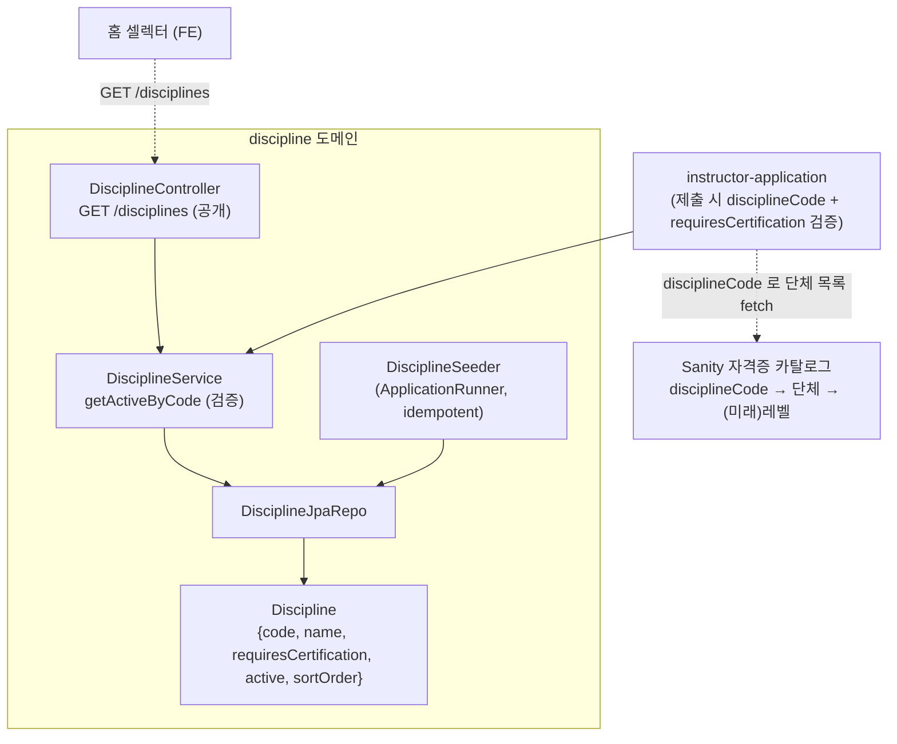
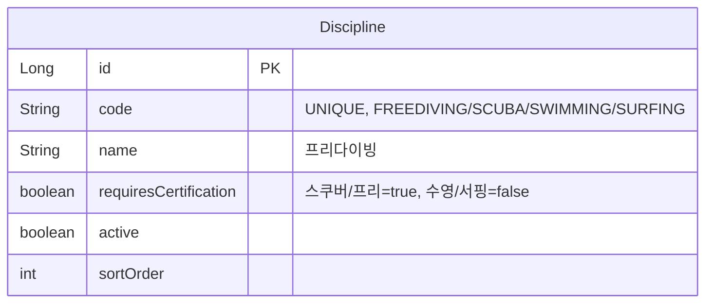

# 종목 (discipline)

## 한 줄 요약

종목(프리다이빙/스쿠버/수영/서핑 ...)을 **계정·강의·강사가 참조하는 1급 개념**으로 둔다. 홈 셀렉터와 강사 신청이 `GET /disciplines` 로 종목을 가져오고, 종목의 **`requiresCertification`** 이 강사 신청 시 자격증 필수 여부를 가른다 (스쿠버/프리다이빙=true, 수영/서핑=false).

> **BE 테이블이 source of truth** (Sanity 아님). `requiresCertification` 이 BE가 강제하는 비즈룰이고, 강의/강사 필터·카운트의 쿼리 대상이라서. enum 도 아님 — 종목 추가는 배포 없이 seed/어드민으로.

---

## 컴포넌트 지도

`Discipline.code` 가 join key — 강사 신청/강의는 code 문자열로 참조, Sanity 자격증 카탈로그도 code 로 종목별 단체를 묶는다.

---

## 데이터 모델

seed 기본값: 프리다이빙(1)·스쿠버(2)=자격증 필요, 수영(3)·서핑(4)=불필요.

---

## 보안 / 권한 매트릭스

| 엔드포인트 | 메서드 | 권한 | 비고 |
|---|---|---|---|
| `/disciplines` | GET | permitAll | 활성 종목, 정렬 순. 로그인 전 홈에서도 필요 |

(어드민 종목 CRUD 는 미구현 — seed + 추후 어드민 도구.)

---

## 알려진 설계 간극 / 확장 자리

- 🟡 **단체-종목 매핑은 Sanity** — 종목별 단체 목록은 BE 가 아니라 Sanity 카탈로그(disciplineCode 키). BE 는 강사 신청의 organizationCode 를 종목에 대해 검증하지 않는다(자격증=Sanity 결정의 일관된 trade-off).
- 🟢 **레벨/등급 확장** — "level2까지 교육 가능한 강사" 같은 세분화: 자격증(`ApplicationCertificate`)에 `ratingCode` 추가 + Sanity 카탈로그에 종목→단체→레벨 + 강의 생성 시 강사 레벨 게이트(강의 도메인). 현재 문자열 code 기반 구조가 additive 수용. MVP 는 종목별 강사로만.
- 🟢 **어드민 종목 관리** — 활성/순서/이름 편집 UI 는 추후. 현재 seed-if-absent.

---

## 더 깊게: use-case 테스트로 보기

- **[`usecase/DisciplineUseCaseTest`](../../src/test/java/com/diving/pungdong/usecase/DisciplineUseCaseTest.java)** — `D1` 공개 GET /disciplines + seed / `D2` requiresCertification 플래그 / `D3` seed idempotent
- 강사 신청의 종목 연동(조건부 자격증·종목별 신청)은 **[`InstructorApplicationUseCaseTest`](../../src/test/java/com/diving/pungdong/usecase/InstructorApplicationUseCaseTest.java)** 의 `DS*` 시리즈
