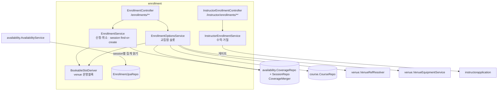
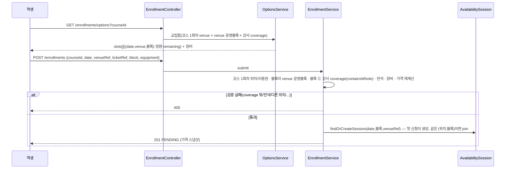
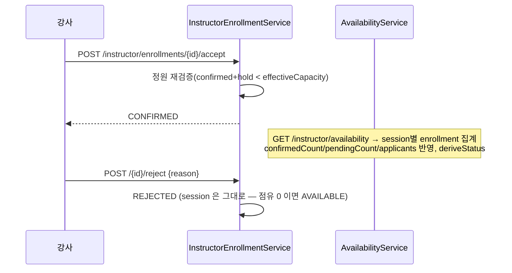
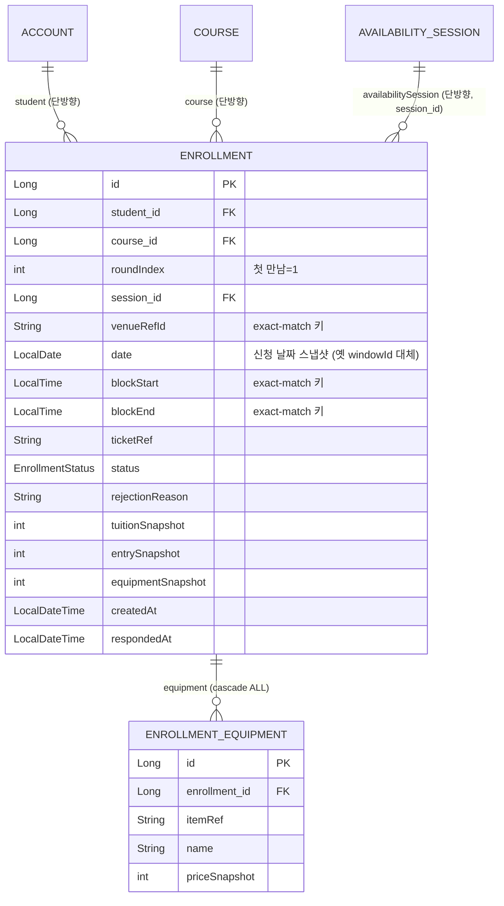

# enrollment — 수강신청 (booking)

## 1. 한 줄 요약

학생이 코스의 **첫 만남(1회차)**을 강사 예약가능시간 안의 슬롯에 신청 → 강사 답변 대기 → 수락/거절. **`강사 coverage(예약가능시간) ∩ Venue 운영블록 ∩ 코스 1회차 위치` 교집합**(venue 부가 coverage 에 통째로 ⊆)을 구현하고, availability 의 풍덩 점유(`PENDING`/`CONFIRMED`/`applicants[]`)를 채운다. invariant: 첫 신청이 (위치,블록) **session 을 생성** → **exact-match join**(같은 위치·정확히 같은 블록만 합류, 부분겹침 불가). 정책·히스토리는 [docs/features/booking.md](../features/booking.md).

## 2. 컴포넌트 지도

의존: enrollment → (account·course·availability·venue·instructorapplication). **availability → enrollment(repo, 읽기 전용)** 단방향 추가 — 캘린더가 점유를 집계하기 위함. (옛 `WindowBinder` 제거 — session 이 생성 시점부터 위치를 소유해 bind/unbind 가 없다.)

## 3. 흐름

### 3-1. 신청 (교집합 옵션 → PENDING + session find-or-create)

### 3-2. 강사 수락/거절 + 캘린더 반영

## 4. 데이터 모델

**의도된 설계**: 점유의 capacity 단위는 `AvailabilitySession`(위치·시간블록·정원). 첫 신청이 `(instructor,date,venueRef,block)` session 을 find-or-create — 같은 (위치,블록)이면 join. 슬롯 식별자 = `(date, venueRefId, blockStart, blockEnd)`(옛 `availabilityWindowId` 대체 — enrollment 가 `date` 스냅샷을 가짐). 신청 자격은 그 블록이 강사 `AvailabilityCoverage` 에 통째로 ⊆(`CoverageMerger.containsWhole`) 일 때만 — coverage 는 enrollment 가 직접 읽어 검증. 가격은 스냅샷(추정치). venue 운영블록은 저장 안 하고 `BookableSlotDeriver` 가 `VenueResponse`(daypart·timeBlock)에서 읽기 시 도출 — CUSTOM/OFFICIAL scope 무관.

## 5. 보안 / 권한 매트릭스

| 엔드포인트 | 인증 | 게이트 | 소유/검증 |
|---|---|---|---|
| GET `/enrollments/options` | ✅ | — | 코스 OPEN |
| POST `/enrollments` | ✅(학생) | — | 코스 OPEN·1회차 위치/이용권 · 블록이 venue 운영블록 · 블록⊆coverage · exact-match · 만석 · 장비소속 |
| GET `/enrollments/mine` | ✅ | — | 내 것만 |
| POST `/enrollments/{id}/cancel` | ✅ | — | 내 PENDING 만, 비소유=400 |
| GET `/instructor/enrollments` | ✅ | 강사신청 보유 | 내 코스 신청만 |
| POST `/instructor/enrollments/{id}/accept` | ✅ | 강사신청 | 내 코스 · PENDING · 정원 |
| POST `/instructor/enrollments/{id}/reject` | ✅ | 강사신청 | 내 코스 · PENDING |

## 6. 알려진 설계 간극

- 🟡 **결제·정산 미구현** — 수락=CONFIRMED 로 끝(디자인 풀버전은 수락→결제링크 푸시→결제완료=확정). 해결안: payment 도메인 + notification 푸시 + EnrollmentStatus 에 PAYMENT_WAITING 추가.
- 🟢 **venue 운영 정밀도** — `BookableSlotDeriver` 는 FIXED·OPEN(단일)·SAME, WEEKLY·MONTHLY 휴무 지원. 공휴일·OPEN 세분화는 후속.
- 🟢 **가격 권위성** — 신청 스냅샷은 추정치. 강사가 입장료/장비를 바꾸면 확정/결제 시 재계산 필요(payment 도메인에서).
- 🟢 **applicants = enrollment 만** — 캘린더 슬롯 안 신청자 행은 풍덩 enrollment 만(외부 hold 는 externalCount 로만). 디자인의 external applicant 행은 후속.

## 7. 더 깊게: 테스트로 보기

- `src/test/.../usecase/EnrollmentUseCaseTest` — 실 H2 + 시큐리티 체인. 그룹 O/S/J/F/A/C/G·R. `@DisplayName` 위→아래 = 사양.
  - O1/O2: 교집합 슬롯, coverage 밖 블록 제외(containsWhole 부분겹침 불가)
  - S1/S2: PENDING 생성 + session 생성 + 캘린더 pending/applicants 반영, 장비 스냅샷
  - J1/J2: 같은 (위치,블록) session 합류 / 다른 블록은 별도 session
  - F1: 만석(confirmed+hold=effectiveCapacity) 신청 400
  - A1/A2: 수락→CONFIRMED+캘린더, 거절→REJECTED(session 잔존, 점유 0=AVAILABLE)
  - C1: 취소→CANCELLED
  - G0/R1/R2/R3: 인증·게이트·격리
- REST Docs `document(...)` 컨트롤러 테스트는 venue/course/availability 와 동일하게 미작성(후속).
