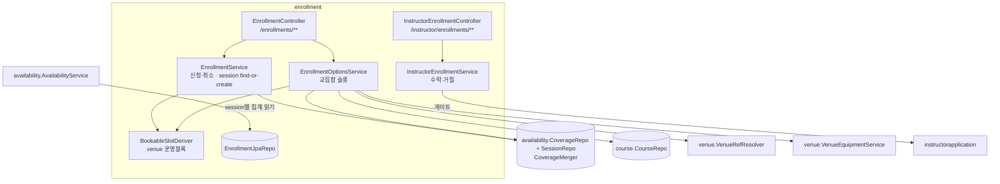
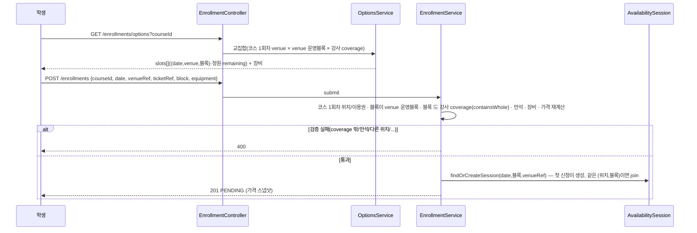
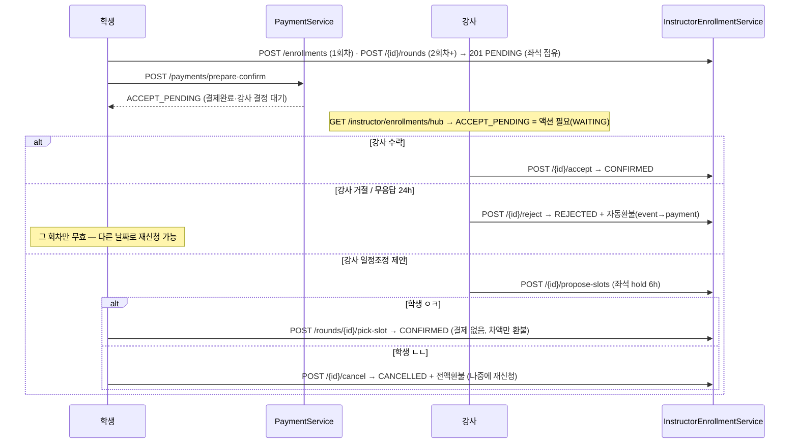
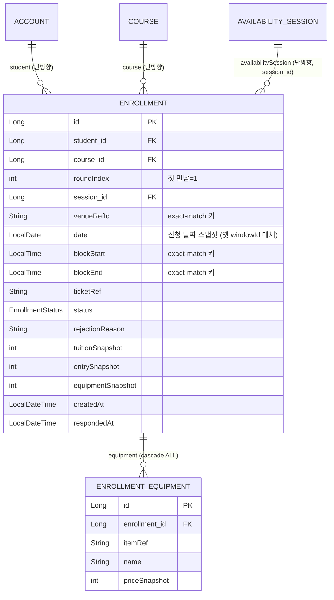

# enrollment — 수강신청 (booking)

## 1. 한 줄 요약

학생이 코스의 **첫 만남(1회차)**을 강사 예약가능시간 안의 슬롯에 신청 → **즉시 결제(선결제)** → 강사 수락/거절(거절·무응답 시 자동환불)(상태기계 §3-2). **`강사 coverage(예약가능시간) ∩ Venue 운영블록 ∩ 코스 1회차 위치` 교집합**(venue 부가 coverage 에 통째로 ⊆)을 구현하고, availability 의 풍덩 점유(`PENDING`/`CONFIRMED`/`applicants[]`)를 채운다. invariant: 첫 신청이 (위치,블록) **session 을 생성** → **exact-match join**(같은 위치·정확히 같은 블록만 합류, 부분겹침 불가). 정책·히스토리는 [docs/features/booking.md](../features/booking.md).

## 2. 컴포넌트 지도


```mermaid
flowchart TB
  subgraph enrollment
    EC[EnrollmentController<br/>/enrollments/**]
    IEC[InstructorEnrollmentController<br/>/instructor/enrollments/**]
    OS[EnrollmentOptionsService<br/>교집합 슬롯]
    ES[EnrollmentService<br/>신청·취소 · session find-or-create]
    IES[InstructorEnrollmentService<br/>수락·거절]
    SD[BookableSlotDeriver<br/>venue 운영블록]
    EN[(EnrollmentJpaRepo)]
  end
  EC --> OS
  EC --> ES
  IEC --> IES
  OS --> SD
  ES --> SD
  OS --> CV[(availability.CoverageRepo + SessionRepo<br/>CoverageMerger)]
  ES --> CV
  OS --> CO[(course.CourseRepo)]
  OS --> VR[venue.VenueRefResolver]
  OS --> VE[venue.VenueEquipmentService]
  IES -->|게이트| IA[instructorapplication]
  AV[availability.AvailabilityService] -->|session별 집계 읽기| EN
```

의존: enrollment → (account·course·availability·venue·instructorapplication). **availability → enrollment(repo, 읽기 전용)** 단방향 추가 — 캘린더가 점유를 집계하기 위함. (옛 `WindowBinder` 제거 — session 이 생성 시점부터 위치를 소유해 bind/unbind 가 없다.)

## 3. 흐름

### 3-1. 신청 (교집합 옵션 → PENDING + session find-or-create)


```mermaid
sequenceDiagram
  participant S as 학생
  participant EC as EnrollmentController
  participant OS as OptionsService
  participant ES as EnrollmentService
  participant SE as AvailabilitySession

  S->>EC: GET /enrollments/options?courseId
  EC->>OS: 교집합(코스 1회차 venue × venue 운영블록 × 강사 coverage)
  OS-->>S: slots[]((date,venue,블록)·정원·remaining) + 장비
  S->>EC: POST /enrollments {courseId, date, venueRef, ticketRef, block, equipment}
  EC->>ES: submit
  ES->>ES: 코스 1회차 위치/이용권 · 블록이 venue 운영블록 · 블록 ⊆ 강사 coverage(containsWhole) · 만석 · 장비 · 가격 재계산
  alt 검증 실패(coverage 밖/만석/다른 위치/...)
    ES-->>S: 400
  else 통과
    ES->>SE: findOrCreateSession(date,블록,venueRef) — 첫 신청이 생성, 같은 (위치,블록)이면 join
    ES-->>S: 201 PENDING (가격 스냅샷)
  end
```

### 3-2. 선결제 상태기계 (전 회차: 신청 → 즉시 결제 → 강사 결정)

**선결제 전환(2026-08-07)** — 결제가 강사 수락 *뒤*가 아니라 신청 *직후*로 이동. 표준 이커머스 "주문 즉시 결제"라 카드사 심사가 익숙한 흐름이 되고, 제품상 어차피 붙일 방향. 결제·환불 인프라(PG 중립 어댑터·실카드 왕복 검증)는 이미 있어 어댑터 재사용.
**전 회차 통일(2026-08-09)** — 1회차만 바꾼 상태는 상태기계가 반쪽이었다(2회차 `accept` 가 400 으로 막히는 seam). 회차 구분을 없애고 `PAYMENT_PENDING` 을 제거해 **상태기계 하나로 수렴**.

```
신청(1회차 submit · 2회차+ /rounds) → PENDING (미결제·좌석 점유 = "장바구니")
  └[결제 prepare/confirm]→ ACCEPT_PENDING (결제완료·좌석 점유·강사 결정 대기)
        ├[강사 수락]         → CONFIRMED
        ├[강사 거절]         → REJECTED  + 전액 자동환불   (그 회차만 · 재신청 가능)
        ├[강사 일정조정 제안] → ACCEPT_PENDING + proposedSlots (학생 차례)
        │     ├[학생 ㅇㅋ pick-slot]   → CONFIRMED (+ 싸졌으면 차액 자동환불)
        │     ├[학생 재제안 reschedule]→ ACCEPT_PENDING (24h 재시작 · 강사에겐 CHANGING)
        │     ├[학생 ㄴㄴ cancel]      → CANCELLED + 전액 자동환불
        │     └[제안 6h 만료]          → 제안만 소멸(강사 차례로 복귀)
        ├[학생 취소]         → CANCELLED + 전액 자동환불
        └[강사 무응답 24h]    → CANCELLED + 전액 자동환불
  └[미결제 만료 12h]         → CANCELLED (좌석 해제, 환불 없음)
```

- **결제** = `POST /payments/prepare`·`confirm`([payment.md](payment.md)). 성공 시 **항상** `PENDING → ACCEPT_PENDING`, `respondedAt=결제시각`(강사 24h 응답시계 시작). 좌석은 *신청* 시점에 이미 점유(결제 전에도) — 결제는 좌석을 새로 잡지 않는다. 금액만 회차별로 다르다(수강료는 1회차 주문에 전액, 2회차+ 는 부대비용만).
- **강사 결정은 3지선다** — 수락 / 거절 / 일정조정 제안. 셋 다 `ACCEPT_PENDING` 에서만. 결제가 앞으로 당겨졌으니 제안도 결제 *후* 시점이 되고, 그래서 **학생은 결제가 아니라 ㅇㅋ/ㄴㄴ만** 하면 된다(제안 자리는 강사가 이미 승인한 자리 → pick 은 재수락도 추가결제도 없이 곧장 `CONFIRMED`). **단 강사가 더 비싼 시간대를 제안했다면 예외** — pick 이 `-1018` 로 돌려보내고 차액 결제를 거치며, 그 종착지는 `CONFIRMED` 가 아니라 `ACCEPT_PENDING`(재수락)이다.
- **금액 불변식** — "그 회차에 남은 결제 순액 == `chargeTotal()`". 결제 후 슬롯 변경(pick/reschedule)은 줄면 `EnrollmentPartialRefundRequestedEvent` 로 차액 자동환불, **늘면 두 갈래** — 위치 유지면 `-1018`(차액만 결제하면 갈 수 있다), 위치까지 바뀌면 `-1019`(차액 경로가 위치를 못 바꿔 취소 후 재신청). ⚠️ **제안 단계의 "결제액 이하" 필터는 2026-08-10 제거**됐다 — 강사는 더 비싼 시간대도 제안할 수 있고, 학생이 그걸 고르면 차액 결제로 간다. 덕분에 enrollment 는 payment 를 조회하지 않고도(역참조 금지) 결제액을 안다.
- **거절/취소 = 그 회차만** — 수강 자체는 유지되고 `RoundGate` 가 자리를 비우므로(활성 회차만 "이미 잡음"으로 봄) 학생이 **그 회차를 다른 날짜로 다시 신청**할 수 있다(시간 제한 없음). "제안이 다 안 되니 다음에 다시" 가 성립하는 근거. hub 파생은 같은 회차에 더 최근 활성/완료 행이 있으면 죽은 행을 제외한다(안 그러면 재신청 후에도 강의가 영구 `RESCHEDULING`).
- **자동환불**(거절·학생취소·무응답) — enrollment 가 `EnrollmentRefundRequestedEvent` 발행 → payment 의 `EnrollmentRefundListener` 가 **동기(같은 트랜잭션)** 로 전액 환불(`RefundService.refundRoundFully`). 동기라 환불 실패 시 상태전이도 함께 롤백(다음 sweep 재시도). 의존 방향 = payment→enrollment (역방향 금지 준수). 차액 환불도 같은 계약(`refundRoundPartially`).
- **만료 스위퍼**(`EnrollmentExpiryService.sweepExpired`, 5분) — PENDING(미결제)은 `createdAt` 기준 `paymentTtlHours`(12h, 환불 없음), ACCEPT_PENDING(결제완료)은 `respondedAt` 기준 `pendingTtlHours`(24h)+전액환불. **두 갈래뿐.** TTL 은 Sanity `siteSettings` 런타임 config.


```mermaid
sequenceDiagram
  participant S as 학생
  participant P as PaymentService
  participant I as 강사
  participant IES as InstructorEnrollmentService

  S->>IES: POST /enrollments (1회차) · POST /{id}/rounds (2회차+) → 201 PENDING (좌석 점유)
  S->>P: POST /payments/prepare·confirm
  P-->>S: ACCEPT_PENDING (결제완료·강사 결정 대기)
  Note over I: GET /instructor/enrollments/hub → ACCEPT_PENDING = 액션 필요(WAITING)
  alt 강사 수락
    I->>IES: POST /{id}/accept → CONFIRMED
  else 강사 거절 / 무응답 24h
    I->>IES: POST /{id}/reject → REJECTED + 자동환불(event→payment)
    Note over S: 그 회차만 무효 — 다른 날짜로 재신청 가능
  else 강사 일정조정 제안
    I->>IES: POST /{id}/propose-slots (좌석 hold 6h)
    alt 학생 ㅇㅋ
      S->>IES: POST /rounds/{id}/pick-slot → CONFIRMED (결제 없음, 차액만 환불)
    else 학생 ㄴㄴ
      S->>IES: POST /{id}/cancel → CANCELLED + 전액환불 (나중에 재신청)
    end
  end
```

**동시성 하드닝(선결제=이중결제 방지)** — 선결제라 "오버부킹"이 "이중결제"가 되므로 좌석 경합을 DB 레벨에서 막는다: (1) `EnrollmentService.requireSeat` 가 좌석 count 직전 세션 행을 **비관적 쓰기잠금**(`AvailabilitySessionJpaRepo.lockById` = `SELECT … FOR UPDATE`)으로 잡아 동시 신청의 count+insert 를 같은 세션 행에서 직렬화. (2) `AvailabilitySession` 자연키(강사·날짜·시간·위치)에 **UNIQUE 제약**(`uk_availability_session_slot`, Flyway `V12`) — 락이 못 막는 "동시에 각자 새 세션 생성" 경합을 차단.

## 4. 데이터 모델


```mermaid
erDiagram
  ACCOUNT ||--o{ ENROLLMENT : "student (단방향)"
  COURSE ||--o{ ENROLLMENT : "course (단방향)"
  AVAILABILITY_SESSION ||--o{ ENROLLMENT : "availabilitySession (단방향, session_id)"
  ENROLLMENT ||--o{ ENROLLMENT_EQUIPMENT : "equipment (cascade ALL)"

  ENROLLMENT {
    Long id PK
    Long student_id FK
    Long course_id FK
    int roundIndex "첫 만남=1"
    Long session_id FK
    String venueRefId "exact-match 키"
    LocalDate date "신청 날짜 스냅샷 (옛 windowId 대체)"
    LocalTime blockStart "exact-match 키"
    LocalTime blockEnd "exact-match 키"
    String ticketRef
    EnrollmentStatus status
    String rejectionReason
    int tuitionSnapshot
    int entrySnapshot
    int equipmentSnapshot
    LocalDateTime createdAt
    LocalDateTime respondedAt
  }
  ENROLLMENT_EQUIPMENT {
    Long id PK
    Long enrollment_id FK
    String itemRef
    String name
    int priceSnapshot
  }
```

**의도된 설계**: 점유의 capacity 단위는 `AvailabilitySession`(위치·시간블록·정원). 첫 신청이 `(instructor,date,venueRef,block)` session 을 find-or-create — 같은 (위치,블록)이면 join. 슬롯 식별자 = `(date, venueRefId, blockStart, blockEnd)`(옛 `availabilityWindowId` 대체 — enrollment 가 `date` 스냅샷을 가짐). 신청 자격은 그 블록이 강사 `AvailabilityCoverage` 에 통째로 ⊆(`CoverageMerger.containsWhole`) 일 때만 — coverage 는 enrollment 가 직접 읽어 검증. 가격은 스냅샷(추정치). venue 운영블록은 저장 안 하고 `BookableSlotDeriver` 가 `VenueResponse`(daypart·timeBlock)에서 읽기 시 도출 — CUSTOM/OFFICIAL scope 무관.

**파생 응답 필드(저장 안 함)** — `paymentExpiresInSeconds`: 미결제(`PENDING`) 회차의 결제 잔여 초. `createdAt + paymentTtlHours` 를 읽을 때 푼다(`enrollment/PaymentWindow`, 만료 스윕과 같은 식 공유). `EnrollmentResponse`·`ScheduleHubResponse.ScheduleRound`·`PaymentPrepareResponse` 에 실린다. **절대시각이 아니라 잔여 초**인 이유는 기기 시계 오차([time-handling.md](time-handling.md)). ⚠️ `0` 이 곧 결제 불가는 아니다 — 스윕이 주기 폴링(기본 5분)이라 잠깐은 결제가 성사된다(성사되면 `ACCEPT_PENDING` 이 되어 스윕 대상에서 빠지므로 "결제했는데 취소" 구멍은 없다).

## 5. 보안 / 권한 매트릭스

| 엔드포인트 | 인증 | 게이트 | 소유/검증 |
|---|---|---|---|
| GET `/enrollments/options` | ✅ | — | 코스 OPEN |
| POST `/enrollments` | ✅(학생) | **본인인증(최신 VERIFIED)** — 없으면 403 -1017([identity-verification.md](identity-verification.md)) | 코스 OPEN·1회차 위치/이용권 · 블록이 venue 운영블록 · 블록⊆coverage · exact-match · 만석 · 장비소속 |
| GET `/enrollments/mine` | ✅ | — | 내 것만 |
| POST `/enrollments/{id}/cancel` | ✅ | — | 내 **PENDING**(무료) / **ACCEPT_PENDING**(전액 자동환불) 만, 비소유=400. 취소된 회차는 재신청 가능 |
| GET `/instructor/enrollments` | ✅ | 강사신청 보유 | 내 코스 신청만 |
| POST `/instructor/enrollments/{id}/accept` | ✅ | 강사신청 | 내 코스 · **ACCEPT_PENDING**(결제완료) → CONFIRMED |
| POST `/instructor/enrollments/{id}/reject` | ✅ | 강사신청 | 내 코스 · **ACCEPT_PENDING** · **전 회차** → REJECTED + 전액 자동환불(그 회차만) |
| GET `/instructor/enrollments/{id}/propose-options` | ✅ | 강사신청 | 내 코스 회차만(비소유=숨김) · `ticketName`·`unavailableReason`(FULL/TIME_CONFLICT) 포함 · **위치 고정**(회차 venue 1개로 스코프) · 중복 제거 · 오늘+8주 ∩ coverage window |
| POST `/instructor/enrollments/{id}/propose-slots` | ✅ | 강사신청 | 내 코스 · **ACCEPT_PENDING** · **최대 3** · bookable+좌석여유만 채택(**가격 무관 — 더 비싸도 제안 가능**) → 좌석 보장 hold |
| POST `/enrollments/rounds/{id}/pick-slot` | ✅(학생) | — | 내 회차 · 제안목록 내 슬롯 · **hold 보장(만석 무관)** → **CONFIRMED**(차액만 환불). 더 비싼 제안 = **-1018**(차액 결제로), 제안 만료 = **-1020** |
| POST `/enrollments/rounds/{id}/reschedule` | ✅(학생) | — | 내 **PENDING**(미결제) 또는 **ACCEPT_PENDING**(결제 유지 재제안) · 금액 증가 시 **-1018**(위치 유지) / **-1019**(위치까지 변경) |

## 6. 알려진 설계 간극

- 🟢 **선결제 전환(2026-08-07) → 전 회차 통일(2026-08-09)** — 회차 구분 없이 신청 직후 결제(`PENDING → 결제 → ACCEPT_PENDING`) → 강사 수락 `CONFIRMED` / 거절·취소·무응답 만료 시 자동환불. `PAYMENT_PENDING` 제거(잔존 행은 Flyway `V13` 이 `PENDING` 으로 이관). 상태기계·동시성 하드닝은 §3-2. [payment 도메인](payment.md)(PG 중립) 소유. 남은 것: notification 결제/거절 푸시 · 정산 수수료 분해.
- 🟢 **더 비싼 슬롯으로의 결제후 변경 — 해결됨(2026-08-10, #204)** — 옛 제약("늘면 400, 취소 후 재신청")은 "차액을 청구하려면 결제 대기 상태가 필요한데 그걸 없앴다" 는 이유였다. **대기를 예약이 아니라 주문에 두어** 풀었다 — `PaymentOrder.target*` + 주문 귀속 `AvailabilityHold`(`paymentOrderId`). 지금은 `-1018` → 차액 결제 → 슬롯 교체 + `ACCEPT_PENDING`(강사 재수락). 상세 [payment.md](payment.md) §3.
- 🟡 **위치까지 바꾸는 차액 결제 — 미구현** — 차액 경로는 위치를 못 바꾼다(`applySlotChange` 가 `venueRefId` 를 그대로 둔다). 그래서 "위치 변경 + 금액 상승" 은 `-1019` 로 **명시 거부**한다 — 안 막으면 결제 후 학생이 고른 적 없는 원래 위치로 조용히 옮겨진다(#232). **이건 임시 가드지 확정 정책이 아니다** — 지원이 원래 방향이고, 하려면 장비 가격표(위치 종속)·입장료 재산정·`AvailabilitySession` 자연키·좌석 hold·겹침 판정·회차 후보 검증이 함께 재계산돼야 한다.
- 🟢 **제안 hold 누수 — 해결됨(2026-08-11, #234·#235)** — 제안 hold 는 `proposedSlots.clear()` 하는 **모든** 경로에서 회수한다(`pickSlot`·`applySlotChange`·`swapSlot`). 또 `requireSeat(session, ignoreProposalRoundId)` 로 **내 몫 hold 를 내 좌석검사에서 제외** — 안 그러면 "나를 위해 잡아둔 자리" 에 내가 막혀(정원 1이면 확정) 차액 결제가 데드엔드가 됐다.
- 🟢 **venue 운영 정밀도** — `BookableSlotDeriver` 는 FIXED·OPEN(단일)·SAME, WEEKLY·MONTHLY 휴무 지원. 공휴일·OPEN 세분화는 후속.
- 🟢 **가격 권위성** — 신청 스냅샷은 추정치. 권위(청구) 금액은 결제 시점 `POST /payments/prepare` 가 재계산(수강료 라이브 + 입장료/장비 스냅샷). 입장료/장비 live 재도출은 후속([payment.md](payment.md)).
- 🟢 **applicants = enrollment 만** — 캘린더 슬롯 안 신청자 행은 풍덩 enrollment 만(외부 hold 는 externalCount 로만). 디자인의 external applicant 행은 후속.
- 🟢 **강사 제안 = 좌석 보장(hold-and-guarantee)** — propose 시 슬롯마다 `AvailabilityHold`(`proposalRoundId`·`expiresAt`) 를 잡아 학생 pick 이 만석으로 막히지 않게 한다(하드캡 우회 X — 미리 잡은 자리 사용). `proposalTtlHours`(Sanity 런타임값, 기본 6h) 만료 시 `EnrollmentExpiryService.sweepExpiredProposals` 가 hold 해제·제안 lapse(회차 상태는 안 건드림 → 파생 뷰가 `RESCHEDULING`→`WAITING`). 만료 후 pick 은 `-1020`. 정책·왜는 [docs/features/reschedule.md](../features/reschedule.md).

## 7. 더 깊게: 테스트로 보기

- `src/test/.../usecase/EnrollmentUseCaseTest` — 실 H2 + 시큐리티 체인. 그룹 O/S/J/F/A/C/G·R. `@DisplayName` 위→아래 = 사양.
  - O1/O2: 교집합 슬롯, coverage 밖 블록 제외(containsWhole 부분겹침 불가)
  - S1/S2: PENDING 생성 + session 생성 + 캘린더 pending/applicants 반영, 장비 스냅샷
  - J1/J2: 같은 (위치,블록) session 합류 / 다른 블록은 별도 session
  - F1: 만석(신청 PENDING 이 좌석 점유) 새 신청 400 — 선결제라 결제·수락 전에도 좌석 점유
  - A1/A2: (결제완료 ACCEPT_PENDING 전제) 수락→CONFIRMED+캘린더(점유), 거절→REJECTED(session 잔존, 점유 0=AVAILABLE). 결제는 `PaymentUseCaseTest`
  - C1: 취소→CANCELLED
  - G0/R1/R2/R3: 인증·게이트·격리
- `src/test/.../usecase/PaymentUseCaseTest` — 선결제 결제: P1~P2 신청(PENDING) 직후 prepare/confirm → `ACCEPT_PENDING`, P8 **2회차도 동일**(권위 금액 = 부대비용만), I1~I4 이니시스 콜백, O1~O2 주문조회.
- `src/test/.../usecase/MultiRoundProgressUseCaseTest` — 전 회차 통일 사양: M3 제안→pick→`CONFIRMED`(추가 결제 없음), M4 2회차 거절→**재신청 가능**, M4-1 제안 전부 거절(취소)→**재신청 가능**, M6-1 결제 후 학생 재제안→`ACCEPT_PENDING`+강사 hub `CHANGING`.
- `src/test/.../usecase/ScheduleHubUseCaseTest` — SH4/SH5 재신청한 회차가 옛 거절 행을 대체(강의가 영구 `RESCHEDULING` 으로 굳지 않음) / 재신청 전엔 거절 행이 남아 액션을 띄움.
- `src/test/.../usecase/RefundUseCaseTest` — RF5 강사 거절→REJECTED+전액 자동환불(cancel 호출·환불기록), RF6 무응답 만료→CANCELLED+환불(`EnrollmentExpiryService.sweepExpired`).
  - G1/G2: 본인인증 게이트 — 미인증 신청 403(-1017)·아무 것도 안 생김 / 인증 후 정상 통과
- REST Docs `document(...)` 컨트롤러 테스트는 venue/course/availability 와 동일하게 미작성(후속).
