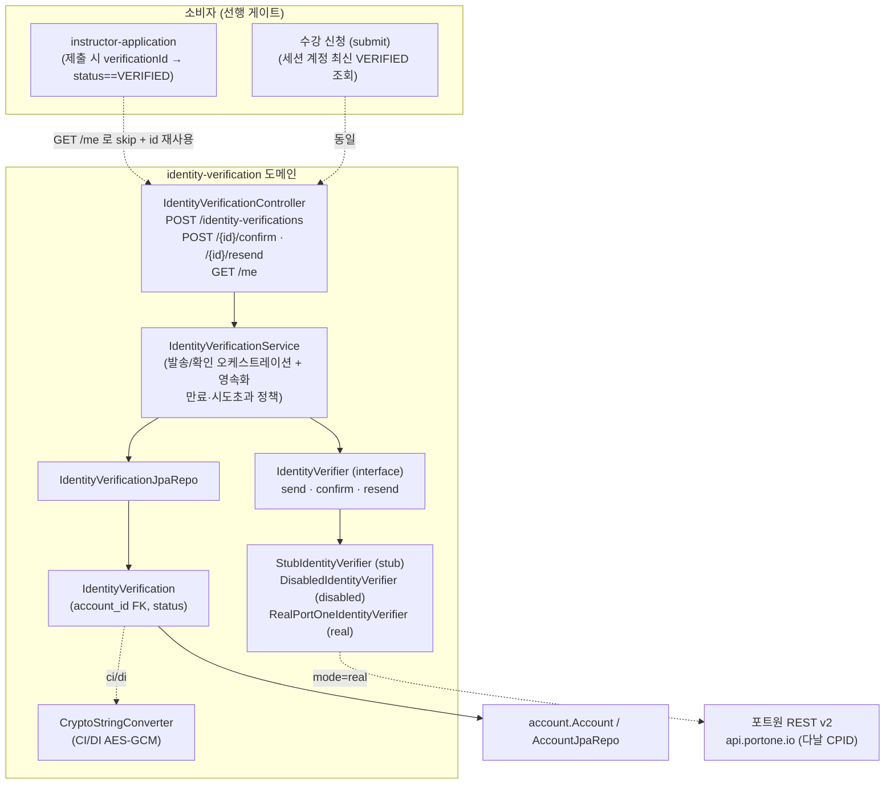
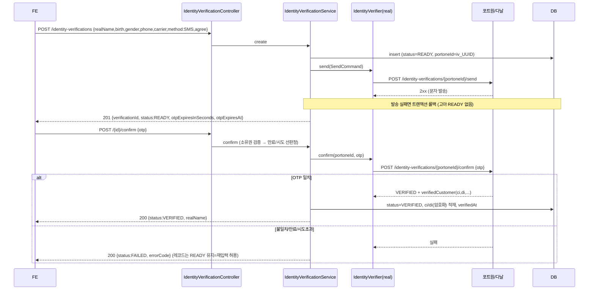
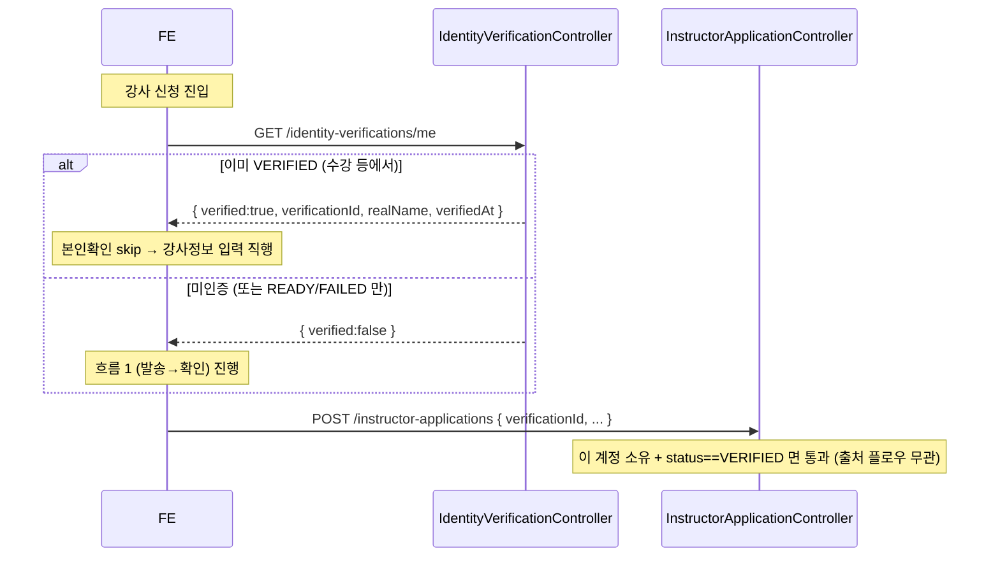

# 본인확인 (identity-verification)

## 한 줄 요약

**휴대폰 SMS 본인인증**(포트원 REST v2 / 다날)을 **계정 공유 자산으로** 노출한다. 별도 인증창(SDK) 없이 서버가 REST 로 진행하고, FE 는 자체 UI 로 전화번호·OTP 입력 화면을 만든다. SMS 는 본질적으로 **2단계** — `POST /identity-verifications`(생성+문자발송, `READY`) → `POST /{id}/confirm {otp}`(→ `VERIFIED`/`FAILED`). 수강(강의 신청 전) / 강사(전환 시) 어느 플로우든 **같은 레코드**를 만들고, `GET /me` 로 기존 `VERIFIED` 를 확인해 재인증을 건너뛰고(skip) `verificationId` 를 재사용한다.

> **왜 SMS(휴대폰) 인가.** 간편인증(카카오/네이버/토스)은 **CI 미반환** 케이스가 있어 CI/DI 확보가 불안정하다. 휴대폰 본인인증(다날)이 CI/DI 를 안정적으로 준다. 간편인증(APP) 코드/어휘(`IdentityProvider`)는 향후 대비로 **유지** — `method` 판별자로 공존. 정책·히스토리는 **[docs/features/identity-verification.md](../features/identity-verification.md)**.

> **모드 게이트.** `pungdong.identity-verification.mode` = `stub`(기본, 문자 미발송·매직 OTP `"000000"`=성공) / `disabled`(fail-closed) / `real`(포트원/다날). 실 다날은 **CPID 개통(통신사 심사, 리드타임 최대 1주) 후** `real` 로 전환. (memory `identity-verification-model`)

---

## 컴포넌트 지도

소비자(강사 신청 등)는 본인확인을 **참조만** 한다 — 단방향. 본인확인 도메인은 소비자를 모른다. 경계(`IdentityVerifier`)는 **외부 호출만**, 영속화는 서비스가 한다(payment 의 `TossPaymentClient` 와 동일 결).

---

## 흐름 1 — SMS 2단계 (발송 → 확인)

- **만료(OTP_EXPIRED)·시도초과(OTP_TOO_MANY_ATTEMPTS)** 정책은 서비스가 강제(모든 구현 공통) — 경계는 "이 OTP 가 맞는가"만.
- 한 번의 불일치는 레코드를 죽이지 않는다(READY 유지, `attemptCount++`). **최대 5회** 초과 시 레코드 `FAILED`(세션 종료 → `resend` 로 되살리거나 새로 시작).
- `POST /{id}/resend` — `attemptCount`·상태를 초기화하고 새 OTP 발송(FAILED 세션도 되살림).

## 흐름 2 — skip (강사 신청에서 재인증 생략)

---

## 데이터 모델

```mermaid
erDiagram
    Account ||--o{ IdentityVerification : "본인확인 이력 (account_id)"

    IdentityVerification {
        Long id PK
        Long account_id FK
        IdentityVerificationStatus status "READY|VERIFIED|FAILED"
        IdentityVerificationMethod method "SMS|APP"
        String portoneVerificationId "iv_UUID (포트원 매핑키, UNIQUE)"
        String realName "PII"
        String birth
        Gender gender
        String phoneNumber "PII"
        Carrier carrier "SKT|KT|LGU|*_MVNO (요청 입력→포트원 반환값)"
        ForeignerType foreignerType "DOMESTIC|FOREIGN (기본 DOMESTIC)"
        String ci "고유식별정보 (AES-GCM 암호화)"
        String di "고유식별정보 (AES-GCM 암호화)"
        IdentityProvider provider "APP 방식 전용, SMS=null"
        LocalDateTime otpExpiresAt "OTP 유효기한(KST wall-clock, 표시용; 카운트다운은 응답 otpExpiresInSeconds 상대초)"
        int attemptCount "OTP 시도수 (max 5)"
        LocalDateTime verifiedAt "VERIFIED 시점"
    }
```

- 계정당 **여러 레코드 허용**(이력/감사). `GET /me` 는 최신 **VERIFIED** 1건(`findTopByAccountIdAndStatusOrderByIdDesc`) — READY/FAILED(진행중·실패) 는 제외.
- **verificationId(우리 DB Long id)** ≠ **portoneVerificationId(포트원 identityVerificationId)**. 후자는 생성 시 `iv_<UUID>` 로 우리가 발급해 발송/확인 매핑키로 쓴다.
- `verifiedAt` 노출하되 **만료 판단 안 함(무만료)** — 법적 재인증 주기 정해지면 TTL 을 얹는다.
- `carrier` 는 SMS 에선 **요청 입력**(발송 대상), 확인 성공 시 포트원 반환 operator 로 덮어써 권위값. `foreignerType` 은 기본 `DOMESTIC`(실 내외국인 판별은 개통 후 보정). 처리방침(Sanity `legalDocument` slug=`privacy`) 의 본인인증 수집 항목("휴대전화번호, 통신사, 내·외국인 구분")과 저장 컬럼 1:1.
- **CI/DI 암호화**: `CryptoStringConverter`(AES-256/GCM, 키 `IDENTITY_CRYPTO_KEY`). 현재 어떤 소비자도 CI/DI 를 **읽지 않아**(read 경로 0) 마이그레이션에 평문 stub 행이 남아도 무해(컨버터가 복호화 실패 시 원문 반환).

---

## 에러 코드 (FE 문구 매핑)

| 상황 | HTTP | 표현 | 비고 |
|---|---|---|---|
| OTP 불일치 | 200 | `{status:FAILED, errorCode:OTP_MISMATCH}` | 재입력(정상 분기). 레코드 READY 유지 |
| OTP 만료 | 200 | `{status:FAILED, errorCode:OTP_EXPIRED}` | resend 필요 |
| 시도 초과(>5) | 200 | `{status:FAILED, errorCode:OTP_TOO_MANY_ATTEMPTS}` | 레코드 FAILED, resend/재시작 |
| 문자 발송 실패 | 400 | CommonResult `{success:false, code, msg}` | create/resend 의 PG 장애. `SMS_SEND_FAILED` 개념(토스 실패와 동일 결) |
| 비소유/없는 id | 400 | CommonResult | 존재 숨김(payment/instructor 와 동일) |

repo 규약(정상 UI 상태는 200+결과 필드)에 따라 **OTP 재입력 가능한 실패는 200 body 의 errorCode**, 인프라 장애만 non-2xx.

### 발송 쿨다운 (2026-07-10)

`POST /identity-verifications`(create) · `POST /{id}/resend` 은 **계정당 발송 간 최소 간격**(`send-cooldown-seconds`, 기본 30s)을 Redis(`SET NX EX`, 키 `identity:otp:cooldown:<accountId>`)로 강제한다 — 다날 실 SMS 비용·남용(toll-fraud) 방어. 창이 열려 있으면 **SMS 미발송 + `200 {retryAfterSeconds}`**(예외 아님 — repo 규약대로 정상 분기, FE 는 "N초 후 재시도"). create 는 이때 201 아닌 200·레코드 미생성, resend 는 상태 불변. 응답은 **discriminated union** — 쿨다운은 순수 `{retryAfterSeconds}`(성공 필드 없음), 성공은 `{status:READY, verificationId, otpExpiresInSeconds, otpExpiresAt, resendAvailableInSeconds}`. `resendAvailableInSeconds`(성공에만) = 다음 발송까지 남은 초(=쿨다운 창) → FE 가 발송 직후 재전송 버튼 pre-disable+카운트다운(차단 시 retryAfterSeconds 와 같은 개념을 성공 상태에서). `IdentityVerificationResult` `@JsonInclude(NON_NULL)` 로 없는 필드를 JSON 에서 빼 union 을 진실로 만든다(안 그러면 쿨다운에 성공 필드가 null 로 실려 FE 타이머가 NaN/0). types.ts 도 `IdentityVerificationSent | IdentityVerificationCooldown`. `send-cooldown-seconds=0` 이면 비활성(테스트). **시간당 상한(cap)은 real 모드 전 후속**(현재 prod=stub, 실 SMS 미발송).

### 선행 게이트 실패 (소비자 측, 2026-07-08)

본인인증이 **선행 조건**인 동작을 미인증으로 시도하면 소비자(수강신청·강사신청)가 **공유 예외** `IdentityVerificationRequiredException` 을 던진다:

| 상황 | HTTP | code | 비고 |
|---|---|---|---|
| 수강신청(POST /enrollments) 시 세션 계정에 최신 VERIFIED 없음 | 403 | **-1017** | FE → 본인인증 화면 |
| 강사신청(POST /instructor-applications) 의 verificationId 가 `status != VERIFIED` | 403 | **-1017** | FE → 본인인증 화면 |
| 강사신청의 verificationId 가 없는/남의 것 | 400 | -1011 | IDOR·잘못된 입력이지 "본인인증하러 가라" 아님 (게이트와 구분) |

`PreLaunchException`(-1016, 런칭 게이트)과 같은 "신청 게이트" 성격 — 식별 코드로 FE 가 다른 400 과 구분해 분기. 무만료라 한 번 VERIFIED 면 이후 신청은 전이적 통과.

---

## 보안 / 권한 매트릭스

| 엔드포인트 | 메서드 | 권한 | 소유권 | 비고 |
|---|---|---|---|---|
| `/identity-verifications` | POST | 인증 | — | 생성+발송. PII → POST body. 201 READY |
| `/identity-verifications/{id}/confirm` | POST | 인증 | **본인 것만** | OTP 확인. 비소유=400 |
| `/identity-verifications/{id}/resend` | POST | 인증 | **본인 것만** | 재발송. 비소유=400 |
| `/identity-verifications/me` | GET | 인증 | 토큰 계정 | 내 최신 VERIFIED. 미인증도 200 `{verified:false}` |

매처: `/identity-verifications/**` → `authenticated`. `{id}` 는 클라이언트 제공이지만 handler 가 **소유권 검증**(`requireMine`) 후 동작 — 남의 본인확인 확인/재발송 불가(anti-IDOR). 임의 id 조회 엔드포인트는 없다.

---

## 알려진 설계 간극

- 🔴 **실 PortOne/다날 라이브 미검증** — `RealPortOneIdentityVerifier` 는 REST 명세 기반으로 작성됐으나, **CPID 개통(리드타임 최대 1주) 전엔 실호출 검증 불가**. 개통 후 (a) 실 문자 수신·OTP·CI/DI 적재 확인, (b) **OTP 에러코드·응답 필드 경로를 실응답으로 보정**(현재 raw 응답 로그), (c) 내외국인(`foreignerType`) 실판별. 그 전까지 로컬/테스트는 `stub`, prod 는 `disabled`.
- 🟡 **무만료(TTL 없음)** — 한 번 VERIFIED면 영구 재사용. 법적 재인증 주기가 확인되면 `verifiedAt` 기준 TTL 추가 → 만료 시 `GET /me` 가 `verified:false`. (사용자 확정: 무만료 유지)
- 🟡 **수강 플로우 미구현** — 본인확인의 또 다른 소비자(강의 신청 전 본인확인)는 아직 없음. 도메인은 공유 자산으로 준비됨.
- 🟢 **CI/DI DI 기반 중복가입 확인 미사용** — DI 는 저장하되 중복가입 차단 로직 없음. 필요 시 유니크/조회 추가.

---

## 더 깊게: use-case 테스트로 보기

- **[`usecase/IdentityVerificationUseCaseTest`](../../src/test/java/com/diving/pungdong/usecase/IdentityVerificationUseCaseTest.java)** — `S1` create→READY / `S2` confirm(매직 OTP)→VERIFIED + CI/DI 적재 / `S3` GET /me 재사용 / `V1` 틀린 OTP→200 FAILED OTP_MISMATCH(READY 유지) / `D1` resend→READY·카운트 초기화 / `T1` READY 만 있으면 GET /me false / `T2` 미인증 200 false / `R1` 남의 id confirm→400
- skip(재사용) + **status==VERIFIED 게이트**는 **[`InstructorApplicationUseCaseTest`](../../src/test/java/com/diving/pungdong/usecase/InstructorApplicationUseCaseTest.java)** 가 create→confirm→제출로 검증
