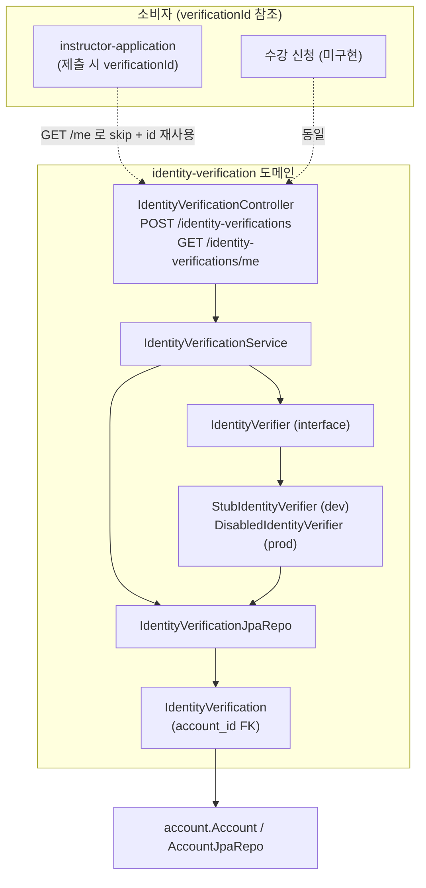
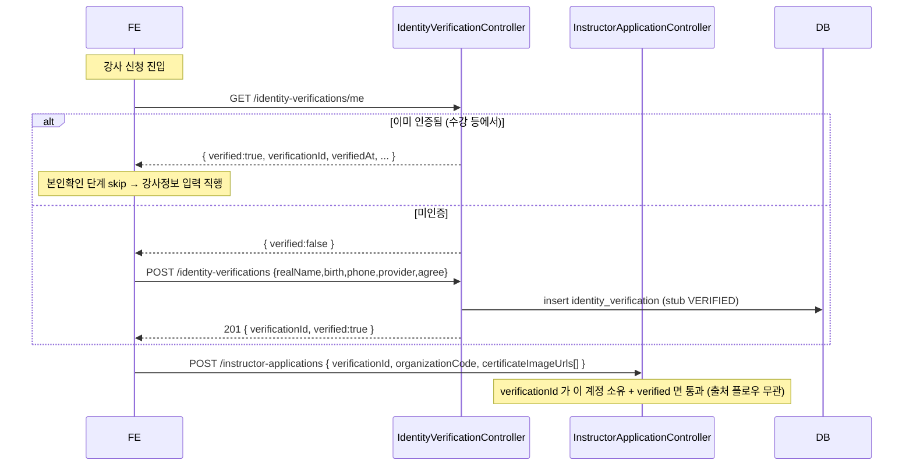
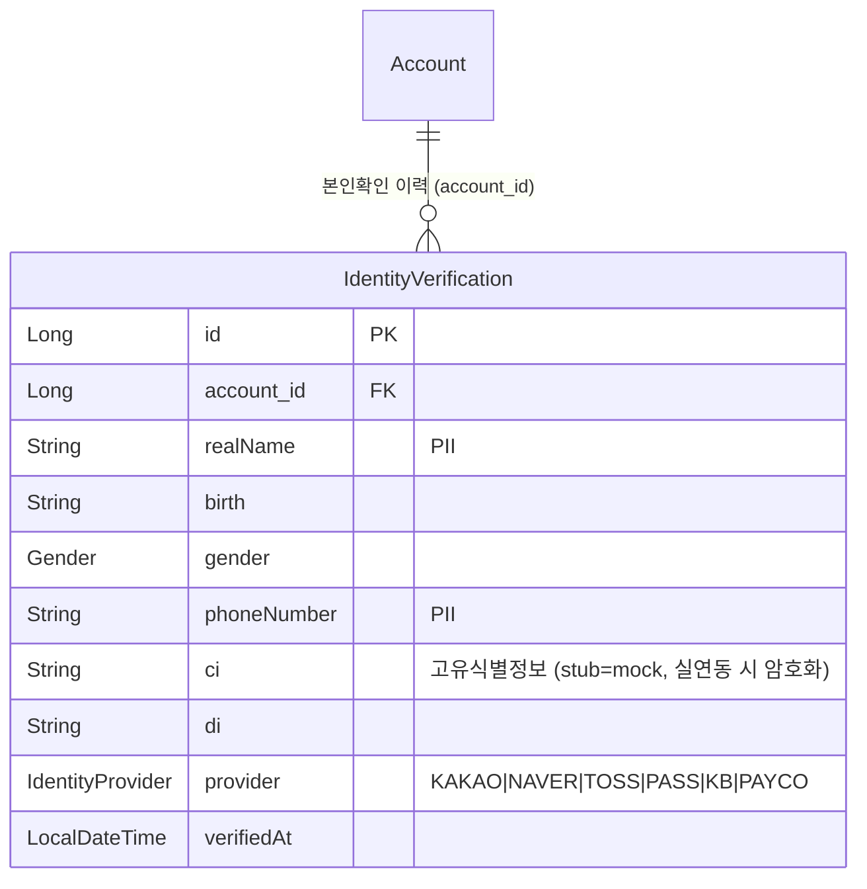

# 본인확인 (identity-verification)

## 한 줄 요약

간편인증 기반 **본인확인을 계정 공유 자산으로** 노출한다. `POST /identity-verifications` 로 만들고 `GET /identity-verifications/me` 로 조회 — 수강(강의 신청 전) / 강사(전환 시) 어느 플로우에서든 **같은 레코드**를 가리킨다. 강사 신청은 `GET /me` 로 기존 인증을 확인해 재인증을 건너뛰고(skip) `verificationId` 를 제출에 재사용한다.

> **stub.** 실제 본인확인기관(CI/DI) 연동은 deferred. 현재 `StubIdentityVerifier` 가 즉시 VERIFIED 처리(mock CI/DI). prod 는 `mode=disabled` 로 fail-closed. (memory `identity-verification-model`)

처음(#34)엔 `instructorapplication` 하위였으나, 본인확인이 수강에서도 쓰는 계정 자산이라 별도 도메인으로 승격(2026-06-09).

---

## 컴포넌트 지도

소비자(강사 신청 등)는 본인확인을 **참조만** 한다 — 단방향. 본인확인 도메인은 소비자를 모른다.

---

## 흐름 — skip (강사 신청에서 재인증 생략)

---

## 데이터 모델

- 계정당 **여러 레코드 허용**(이력/감사). `GET /me` 는 최신 1건(`findTopByAccountIdOrderByIdDesc`).
- `verifiedAt` 노출하되 **만료 판단 안 함(무만료)** — 법적 재인증 주기 정해지면 TTL 을 얹는다.

---

## 보안 / 권한 매트릭스

| 엔드포인트 | 메서드 | 권한 | 비고 |
|---|---|---|---|
| `/identity-verifications` | POST | 인증 | 본인확인 생성. PII → POST body. 201 |
| `/identity-verifications/me` | GET | 인증 | 내 최신 상태. 미인증도 200 `{verified:false}` |

매처: `/identity-verifications/**` → `authenticated`. 본인확인은 본인 것만 — `GET /me` 는 토큰 계정 기준, 임의 id 조회 엔드포인트는 없다.

---

## 알려진 설계 간극

- 🔴 **stub** — 실제 검증 없음, `ci/di` mock 평문. 실연동 시 (a) `IdentityVerifier` 실 구현 + `mode=real`, (b) CI/DI **암호화 저장**, (c) 푸시 대기/비동기 검증 흐름(디자인 ③④⑤). prod 는 그 전까지 `mode=disabled`(fail-closed).
- 🟡 **무만료(TTL 없음)** — 한 번 verified면 영구 유효. 전자금융/실명확인 등 법적 재인증 주기가 확인되면 `verifiedAt` 기준 TTL 추가 → 만료 시 `verified:false`.
- 🟡 **수강 플로우 미구현** — 본인확인의 또 다른 소비자(강의 신청 전 본인확인)는 아직 없음. 도메인은 그걸 받을 준비가 됨(공유 자산).

---

## 더 깊게: use-case 테스트로 보기

- **[`usecase/IdentityVerificationUseCaseTest`](../../src/test/java/com/diving/pungdong/usecase/IdentityVerificationUseCaseTest.java)** — `I1` 인증 후 GET /me / `I2` 미인증 200 {verified:false} / `I3` 최신 1건(이력 보존)
- skip(재사용)은 **[`InstructorApplicationUseCaseTest`](../../src/test/java/com/diving/pungdong/usecase/InstructorApplicationUseCaseTest.java)** 가 `POST /identity-verifications` → 그 id 로 `POST /instructor-applications` 제출(S1 등)로 검증
