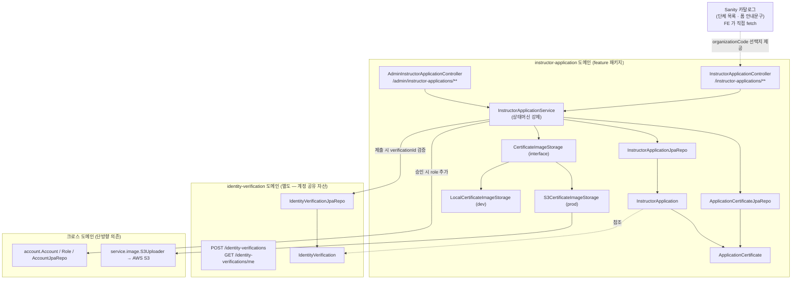
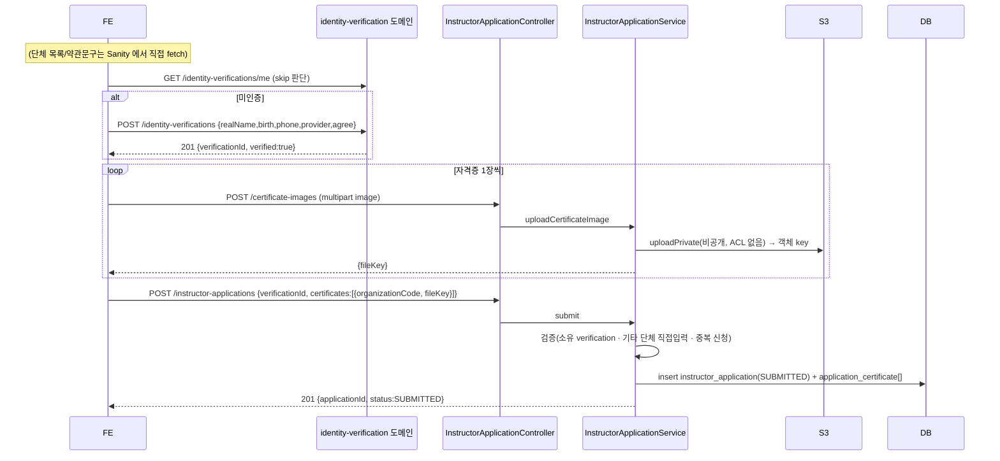
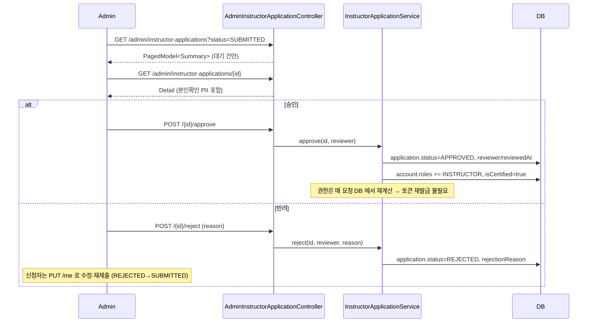
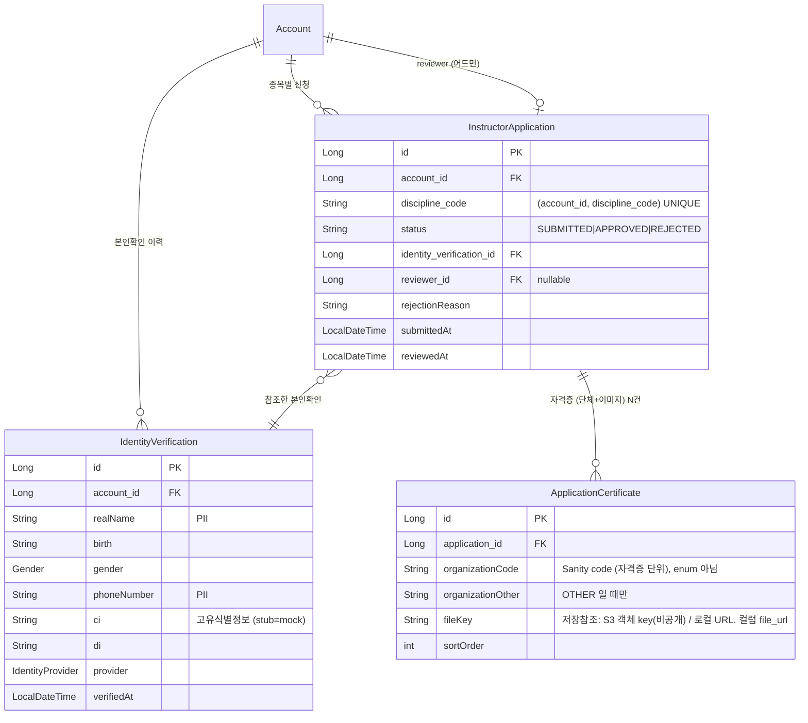

# 강사 신청 (instructor-application)

## 한 줄 요약

수강생(STUDENT)이 **종목 선택 → 본인확인 → 자격증(단체+이미지) 등록 → 제출**하면 그 종목의 `InstructorApplication` 1건이 SUBMITTED 로 생기고, 어드민이 **승인/반려**한다. 승인 시 `INSTRUCTOR` 역할 **추가**(STUDENT 유지) + `isCertified=true`.

신청은 **종목별**이다 — 한 계정이 종목마다 1건(`(account_id, discipline_code)` 유니크), 프리다이빙+스쿠버 동시 가능. 자격증은 **한 종목에 여러 단체**(AIDA+PADI+...)를 담는다(단체는 자격증 단위). 종목의 `requiresCertification`(스쿠버/프리=필수, 수영/서핑=불필요)이 자격증 필수 여부를 가른다. 승인된 강사는 **자격증 관리 탭**(`POST /certificates`)에서 검수 없이 자격증을 추가한다(같은 종목 재신청은 차단).

레거시 `Account.isRequestCertified/isCertified` 플래그 + `/sign/instructor/*` 흐름을 대체하는 **신규 feature 패키지**(`instructorapplication/`). 상태머신으로 제출/승인/반려/재제출을 표현. 종목은 [discipline](discipline.md), 본인확인은 [identity-verification](identity-verification.md) 도메인 참조.

> **본인확인은 stub.** 디자인(강사신청 화면)은 간편인증(카카오/네이버/토스/PASS/KB/페이코 → CI/DI)을 전면에 두지만, 실제 본인확인기관 외부 연동은 deferred다. 현재는 `StubIdentityVerifier` 가 즉시 VERIFIED 처리한다 (memory: `identity-verification-model`).

---

## 컴포넌트 지도

의존 방향은 한쪽 — `instructorapplication` 이 `account` 와 `identity-verification` 을 참조하고 그 역은 없다. 본인확인은 [identity-verification](identity-verification.md) 도메인(계정 공유 자산) 소관 — 신청은 `verificationId` 로 참조만. 단체 카탈로그는 Sanity 가 source of truth라 BE 는 `organizationCode` 문자열만 저장(enum 아님).

**이미지 저장 경계 (FcmGateway 패턴).** 자격증 이미지 저장은 인터페이스 + `@ConditionalOnProperty` 로 환경별 교체:

| 경계 | dev 기본 | prod | 프로퍼티 |
|---|---|---|---|
| 이미지 저장 | `LocalCertificateImageStorage` (로컬 디스크 + `/local-uploads/**` 서빙) | `S3CertificateImageStorage` | `pungdong.storage.s3.enabled` = `false` / `true` |

`CertificateImageStorage` 는 `store(image, ownerId) → 저장참조` + `viewUrl(참조) → 한시 열람 URL` 두 메서드를 가진다.

**자격증 이미지는 비공개(개인정보).** 자격증/보험 이미지는 어드민·본인만 봐야 한다 → 업로드 버킷은 Block Public Access 가 켜진 **비공개** 버킷이고, public ACL 을 붙이지 않는다(붙이면 PutObject 가 거부됨). 저장값은 **공개 URL 이 아니라 객체 key** (`instructorCertificate/{accountId}/{uuid}.{ext}` — 회원별 그룹핑으로 탈퇴 시 prefix 일괄 삭제 + 키에 PII 없음). 표시용 URL 은 **어드민/본인 조회 시점에만** `viewUrl` 로 **presigned GET(TTL 3분)** 발급(`S3CertificateImageStorage.viewUrl`) — 로컬은 정적 서빙 URL 을 그대로 반환. 키는 SigV4 서명 없이 직접 접근 불가(비공개 버킷)라 추측·열람되지 않고, 유출돼도 짧은 TTL 안에서만 유효. (공개-의도 이미지(코스/커뮤니티)는 성격이 정반대 — SEO·SSG 영구 공개 URL 필요 → 별도 public 버킷, 후속 PR. `S3Uploader.upload` 는 그 호환을 위해 URL 반환을 유지.)

(본인확인 stub/disabled 경계는 identity-verification 도메인으로 이동.) → FE 는 AWS·본인확인기관 없이도 dev 에서 전체 흐름 검증 가능.

---

## 흐름 1 — 신청 제출 (2-phase, happy path)

## 흐름 2 — 어드민 승인 / 반려

---

## 데이터 모델

설계 의도:
- **종목별 신청** — `(account_id, discipline_code)` 유니크. 한 사람이 프리다이빙+스쿠버 강사일 수 있어 종목마다 1건. 승인된 신청 = 그 종목의 강사 자격.
- **단체는 자격증 단위** (`ApplicationCertificate.organizationCode`) — 한 종목에 여러 단체 자격(AIDA+PADI+Molchanovs)을 담는다. 신청 레벨에 단체 1개를 두던 초기안은 틀렸다. 문자열 code(Sanity 카탈로그, 종목별)라 BE enum 아님. (향후 레벨 `ratingCode` 추가 자리)
- **본인확인은 [identity-verification](identity-verification.md) 도메인 참조** — 수강/강사 공유, verificationId 재사용(skip).

---

## 보안 / 권한 매트릭스

| 엔드포인트 | 메서드 | 권한 | 비고 |
|---|---|---|---|
| `/instructor-applications/me` | GET | 인증 | 내 신청 **목록**(종목별). 미신청 종목은 항목 없음 |
| `/instructor-applications/certificate-images` | POST | 인증 | multipart (`image`) → `{fileKey}` 저장참조 (2-phase 1단계, 비공개 업로드) |
| `/instructor-applications` | POST | 인증 | 제출. body 에 `disciplineCode`+자격증 목록. 종목별 중복/이미강사 → 400 |
| `/instructor-applications/me` | PUT | 인증 | 수정·재제출 (해당 종목, APPROVED 는 거부) |
| `/instructor-applications/certificates` | POST | 인증 | **자격증 관리** — 승인된 강사가 자격증 추가 (검수 없이) |
| `/admin/instructor-applications` | GET | **ADMIN** | `?status=` 생략 시 전체, 지정 시 탭별. 기본 정렬 submittedAt desc |
| `/admin/instructor-applications/counts` | GET | **ADMIN** | 탭 뱃지용 `{submitted, approved, rejected, total}` |
| `/admin/instructor-applications/{id}` | GET | **ADMIN** | PII 포함 상세 (+ reviewerNickName / createdAt) |
| `/admin/instructor-applications/{id}/approve` | POST | **ADMIN** | INSTRUCTOR 부여 + isCertified |
| `/admin/instructor-applications/{id}/reject` | POST | **ADMIN** | 사유 필수 |

매처는 `SecurityConfiguration`: `/admin/instructor-applications/**` → `hasRole(ADMIN)`, `/instructor-applications/**` → `authenticated`. 승인 후 역할 변경은 매 요청 DB 재계산이라 **재로그인 불필요** (use-case `R3` 가 검증).

### 어드민 지정 (authorization = DB role)

admin 권한은 **DB role 이 source of truth** (`Account.roles` 에 `ADMIN`) — Sanity 같은 CMS 에 두지 않는다(보안 경계). "누구를 admin 으로"의 **목록만 env allowlist** 로 관리: `pungdong.admin.emails`(env `ADMIN_EMAILS`, 콤마구분). 부팅 시 `account.AdminAccountInitializer`(ApplicationRunner)가 그 이메일 계정에 `ROLE_ADMIN` 보장(idempotent). admin 은 **일반 가입 후** 목록에 있으면 승격 — 가입 전이면 다음 기동 시 부여. (use-case `B1`)

---

## 알려진 설계 간극

- 🔴 **본인확인 미연동 (stub)** — dev 는 `StubIdentityVerifier`(즉시 VERIFIED, mock 평문 CI/DI), prod 는 `mode=disabled` 로 `DisabledIdentityVerifier`(fail-closed)로 막힌다. 실 연동 시 (a) `IdentityVerifier` 실 구현 + `mode=real`, (b) CI/DI **암호화 저장**, (c) 푸시 대기/비동기 검증 흐름(디자인 ③④⑤ 화면)을 반영. 출시 전 본인확인이 필수면 이 실 구현이 블로커.
- 🟢 **S3 연동 (비공개 + presigned)** — prod 는 `S3CertificateImageStorage` 가 비공개 버킷(Block Public Access on)에 ACL 없이 올리고(`uploadPrivate`), 조회 시 presigned GET(TTL 3분)으로 표시. 자격증명은 Fargate 태스크 롤(키리스). dev 는 `LocalCertificateImageStorage`(로컬 디스크). 초기 구현이 public-read canned ACL + 작업디렉터리 temp 파일이라 staging/prod 에서 업로드가 실패하던 걸 수정(이 PR). 저장값은 객체 key(`instructorCertificate/{accountId}/{uuid}`).
- 🟡 **공개-의도 이미지 서빙 미완** — 코스/커뮤니티 이미지는 SEO·SSG 영구 공개 URL 이 필요하나, 현재 단일 버킷이 비공개라 직접 열람 불가. 업로드 자체는 이 PR 의 공유 `S3Uploader` 수정으로 성공하지만(객체는 비공개), 공개 서빙은 **별도 public 버킷(+CloudFront)** 후속 PR 로 분리. (강사가 없어 staging 에선 코스 생성이 아직 도달 불가라 실사용 영향 없음.)
- 🟢 **레거시 신청/전환 흐름 제거 완료** — `/sign/instructor/*` 4종 + `/account/instructor`·`/account/instructor-application` + `Account.organization/income/isRequestCertified` + `findAllRequestInstructor` 제거됨. 잔존: `InstructorCertificate`(엔티티/서비스/`/account/instructor/certificate/list` 읽기) + `Account.selfIntroduction`(강의 상세에서 읽힘) — 강사 프로필(instructor-profile) 기능 때 정리.
- 🟡 **REST Docs 스니펫 부재** — 이번 엔드포인트들은 use-case 테스트로만 검증되고 `document(...)` 컨트롤러 테스트가 없다. `api.adoc` 에 include 를 추가하지 않으므로 빌드는 깨지지 않지만, 공개 문서엔 아직 안 나온다. 후속 PR 에서 보강.
- 🟡 **organizationCode 미검증** — BE 는 Sanity 카탈로그와 대조하지 않고 문자열을 그대로 신뢰한다(`OTHER` 직접입력만 빈값 체크). 잘못된 code 가 들어와도 막지 않음 — Sanity 가 출처라는 결정의 trade-off.
- 🟢 **상태 단순화** — `UNDER_REVIEW` 없이 SUBMITTED 가 "검토 중"을 겸한다. 심사 담당자 분리/SLA 가 필요해지면 중간 상태 추가.

---

## 더 깊게: use-case 테스트로 보기

실제 동작의 단일 출처는 **[`usecase/InstructorApplicationUseCaseTest`](../../src/test/java/com/diving/pungdong/usecase/InstructorApplicationUseCaseTest.java)** (실제 H2 + 시큐리티 체인 + 실 서비스/JPA, S3 만 `@MockBean`, 본인확인은 stub 그대로). `@DisplayName` 을 위→아래로 읽으면 사양:

- `S1` 본인확인→제출 시 201 + SUBMITTED 1건 생성 · `S2` 미신청 시 `{status:NONE}` · `S3` 제출 내용이 내 신청 조회에 반영
- `V1` 본인확인 없이 제출 400 · `V2` 자격증 0장 400 · `V3` 기타 단체 직접입력 누락 400
- `D1` 심사 중 중복 제출 400
- `R1` 학생이 어드민 API 403 · `R2` 승인 시 INSTRUCTOR 추가 + isCertified=true · `R3` **승인 직후 옛 토큰으로 강사 전용 API 통과**
- `J1` 반려 시 사유 저장 · `J2` 반려 후 PUT 재제출 → SUBMITTED 복귀
- `A1` 어드민 대기 목록엔 SUBMITTED 만 (승인된 건 제외)
- `S4` 조회 시 저장 key echo + 표시용 `viewUrl`(presigned, 한시) 발급
- `U1` 자격증 이미지 업로드 → 저장 참조 key 반환 (비공개)
