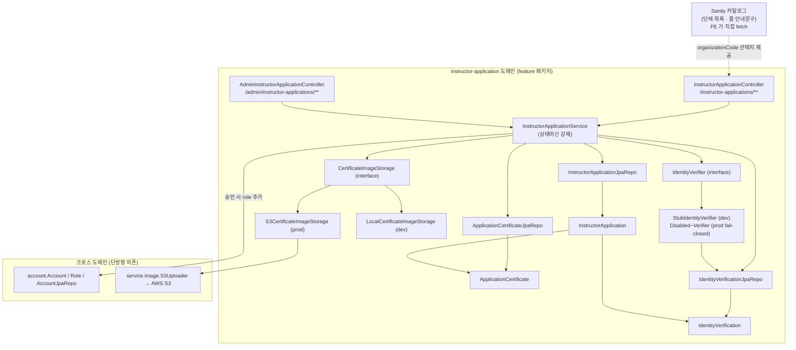
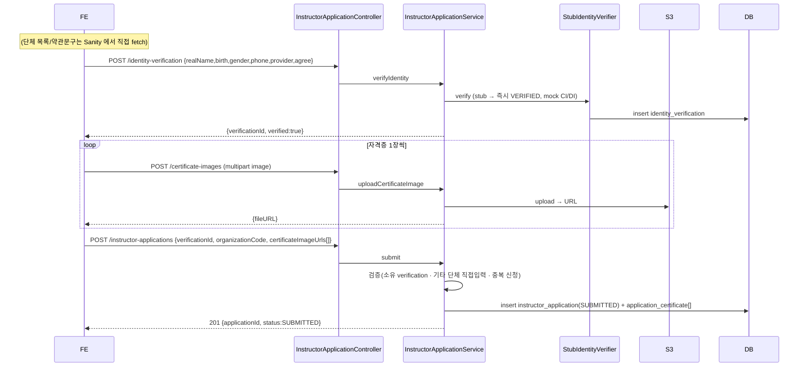
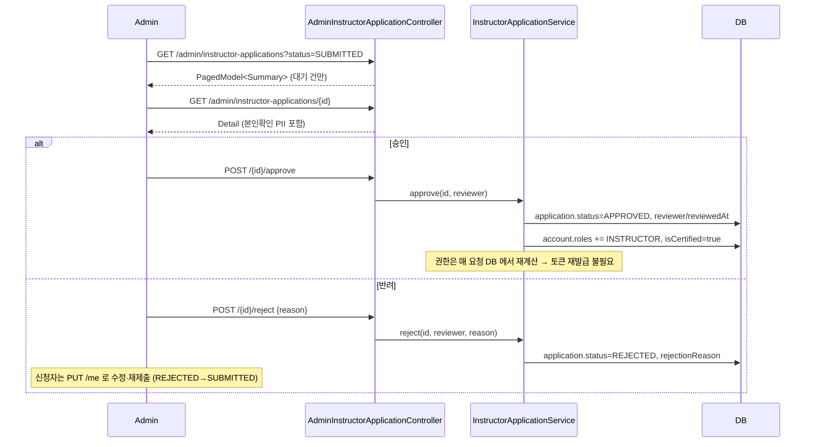
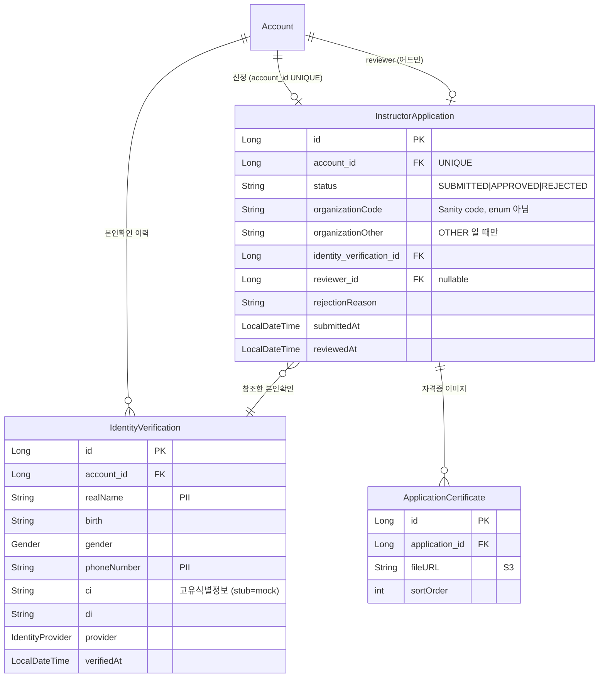

# 강사 신청 (instructor-application)

## 한 줄 요약

수강생(STUDENT)이 **본인확인 → 자격증 이미지 업로드 → 단체 선택 후 제출**하면 `InstructorApplication` 1건이 SUBMITTED 로 생기고, 어드민이 **승인/반려**한다. 승인 시 해당 계정에 `INSTRUCTOR` 역할이 **추가**(STUDENT 유지)되고 `isCertified=true` 가 된다.

레거시 `Account.isRequestCertified/isCertified` 플래그 + `/sign/instructor/*` 흐름을 대체하는 **신규 feature 패키지**(`instructorapplication/`). 한 계정당 신청 1건(`account_id` 유니크), 상태머신으로 제출/승인/반려/재제출을 표현한다.

> **본인확인은 stub.** 디자인(강사신청 화면)은 간편인증(카카오/네이버/토스/PASS/KB/페이코 → CI/DI)을 전면에 두지만, 실제 본인확인기관 외부 연동은 deferred다. 현재는 `StubIdentityVerifier` 가 즉시 VERIFIED 처리한다 (memory: `identity-verification-model`).

---

## 컴포넌트 지도

의존 방향은 한쪽 — `instructorapplication` 이 `account` 를 참조하고 그 역은 없다. 단체 카탈로그는 Sanity 가 source of truth라 BE 는 선택된 `organizationCode` 문자열만 저장한다(enum 아님).

**외부 연동 경계 (FcmGateway 패턴 복제).** 본인확인·이미지저장 둘 다 인터페이스 + `@ConditionalOnProperty` 로 환경별 구현 교체:

| 경계 | dev 기본 | prod | 프로퍼티 |
|---|---|---|---|
| 본인확인 | `StubIdentityVerifier` (즉시 VERIFIED) | `DisabledIdentityVerifier` (fail-closed, 호출 시 거부) → 추후 실 구현 | `pungdong.identity-verification.mode` = `stub` / `disabled` |
| 이미지 저장 | `LocalCertificateImageStorage` (로컬 디스크 + `/local-uploads/**` 서빙) | `S3CertificateImageStorage` | `pungdong.storage.s3.enabled` = `false` / `true` |

→ FE 는 AWS·본인확인기관 없이도 전체 흐름을 dev 에서 검증 가능. prod 전환은 코드 변경 없이 프로퍼티만.

---

## 흐름 1 — 신청 제출 (2-phase, happy path)

## 흐름 2 — 어드민 승인 / 반려

---

## 데이터 모델

설계 의도:
- **`organizationCode` 는 문자열** — 단체 추가가 Sanity 편집만으로 되도록(배포 불필요). 레거시 `Account.organization`(Organization enum, ordinal 저장 버그)은 이 도메인에서 쓰지 않는다.
- **자격증은 신청에 종속** — 재제출 시 신청과 함께 교체되는 스냅샷. 레거시 `account.InstructorCertificate`(Account 소유, 메타 없음)와 별개.
- **본인확인은 별도 엔티티** — 신청과 분리해 두면 재제출 시 새 본인확인을 참조할 수 있고, 실연동 전환 시 적재 경로만 바뀐다.

---

## 보안 / 권한 매트릭스

| 엔드포인트 | 메서드 | 권한 | 비고 |
|---|---|---|---|
| `/instructor-applications/me` | GET | 인증 | 본인 신청만. 미신청 시 200 `{status:NONE}` |
| `/instructor-applications/identity-verification` | POST | 인증 | PII → POST body |
| `/instructor-applications/certificate-images` | POST | 인증 | multipart (`image`) |
| `/instructor-applications` | POST | 인증 | 제출. 중복/이미강사 → 400 |
| `/instructor-applications/me` | PUT | 인증 | 수정·재제출 (APPROVED 는 거부) |
| `/admin/instructor-applications` | GET | **ADMIN** | `?status=` (기본 SUBMITTED) |
| `/admin/instructor-applications/{id}` | GET | **ADMIN** | PII 포함 상세 |
| `/admin/instructor-applications/{id}/approve` | POST | **ADMIN** | INSTRUCTOR 부여 + isCertified |
| `/admin/instructor-applications/{id}/reject` | POST | **ADMIN** | 사유 필수 |

매처는 `SecurityConfiguration`: `/admin/instructor-applications/**` → `hasRole(ADMIN)`, `/instructor-applications/**` → `authenticated`. 승인 후 역할 변경은 매 요청 DB 재계산이라 **재로그인 불필요** (use-case `R3` 가 검증).

---

## 알려진 설계 간극

- 🔴 **본인확인 미연동 (stub)** — dev 는 `StubIdentityVerifier`(즉시 VERIFIED, mock 평문 CI/DI), prod 는 `mode=disabled` 로 `DisabledIdentityVerifier`(fail-closed)로 막힌다. 실 연동 시 (a) `IdentityVerifier` 실 구현 + `mode=real`, (b) CI/DI **암호화 저장**, (c) 푸시 대기/비동기 검증 흐름(디자인 ③④⑤ 화면)을 반영. 출시 전 본인확인이 필수면 이 실 구현이 블로커.
- 🔴 **S3 미연동** — Phase 4 버킷 provision 전까지 prod 의 `S3CertificateImageStorage` 는 못 쓴다. dev 는 `LocalCertificateImageStorage`(로컬 디스크)로 대체. 버킷 생기면 `pungdong.storage.s3.enabled=true` 만 켜면 됨.
- 🟡 **레거시 강사 흐름 잔존** — `/sign/instructor/*` + `Account.isRequestCertified` + `account.InstructorCertificate` + `AccountJpaRepo.findAllRequestInstructor` 가 아직 살아있다. 이 도메인으로 완전 이관 후 제거 대상(별도 PR).
- 🟡 **REST Docs 스니펫 부재** — 이번 엔드포인트들은 use-case 테스트로만 검증되고 `document(...)` 컨트롤러 테스트가 없다. `api.adoc` 에 include 를 추가하지 않으므로 빌드는 깨지지 않지만, 공개 문서엔 아직 안 나온다. 후속 PR 에서 보강.
- 🟡 **organizationCode 미검증** — BE 는 Sanity 카탈로그와 대조하지 않고 문자열을 그대로 신뢰한다(`OTHER` 직접입력만 빈값 체크). 잘못된 code 가 들어와도 막지 않음 — Sanity 가 출처라는 결정의 trade-off.
- 🟢 **상태 단순화** — `UNDER_REVIEW` 없이 SUBMITTED 가 "검토 중"을 겸한다. 심사 담당자 분리/SLA 가 필요해지면 중간 상태 추가.

---

## 더 깊게: use-case 테스트로 보기

실제 동작의 단일 출처는 **[`usecase/InstructorApplicationUseCaseTest`](../../src/test/java/com/diving/pungdong/usecase/InstructorApplicationUseCaseTest.java)** (실제 H2 + 시큐리티 체인 + 실 서비스/JPA, S3 만 `@MockBean`, 본인확인은 stub 그대로). `@DisplayName` 을 위→아래로 읽으면 사양:

- `S1` 본인확인→제출 시 201 + SUBMITTED 1건 생성 · `S2` 미신청 시 `{status:NONE}` · `S3` 제출 내용이 내 신청 조회에 반영
- `V1` 본인확인 없이 제출 400 · `V2` 자격증 0장 400 · `V3` 기타 단체 직접입력 누락 400
- `D1` 심사 중 중복 제출 400
- `R1` 학생이 어드민 API 403 · `R2` 승인 시 INSTRUCTOR 추가 + isCertified=true · `R3` **승인 직후 옛 토큰으로 강사 전용 API 통과**
- `J1` 반려 시 사유 저장 · `J2` 반려 후 PUT 재제출 → SUBMITTED 복귀
- `A1` 어드민 대기 목록엔 SUBMITTED 만 (승인된 건 제외)
- `U1` 자격증 이미지 업로드 → S3 URL 반환
