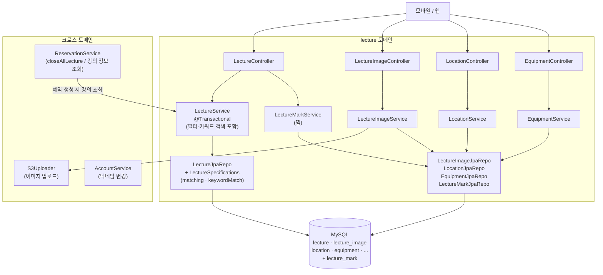
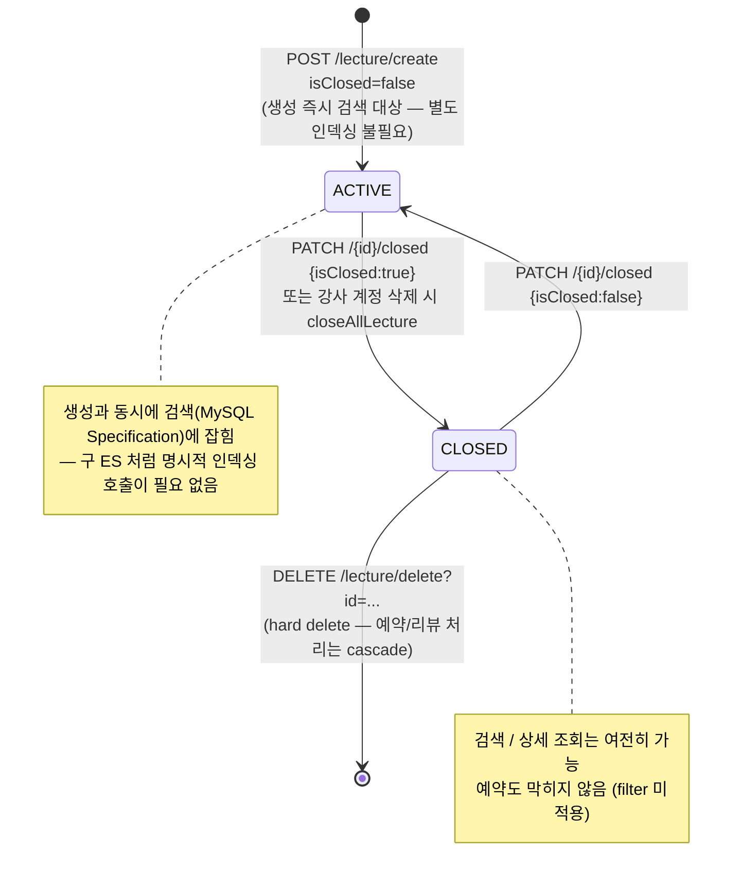
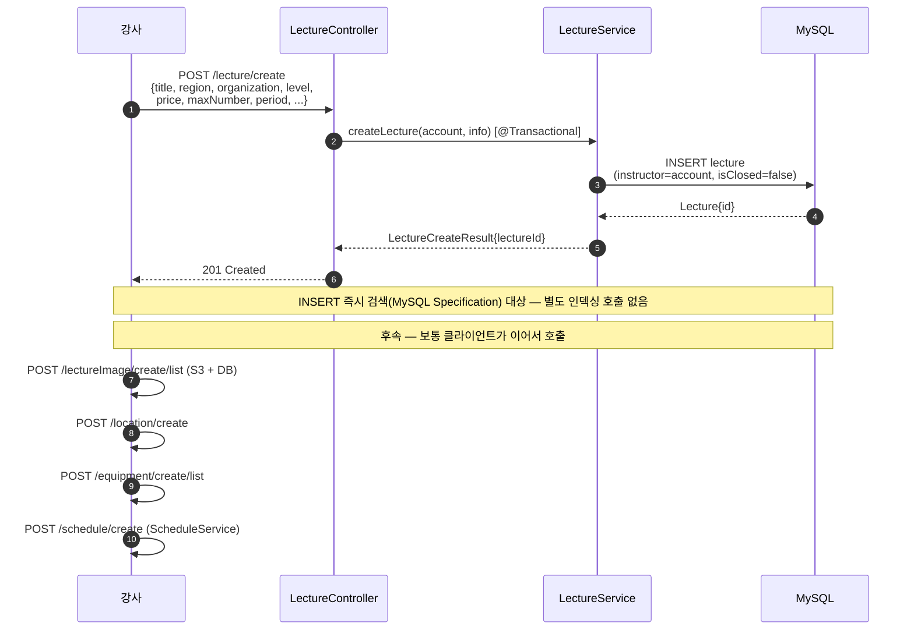
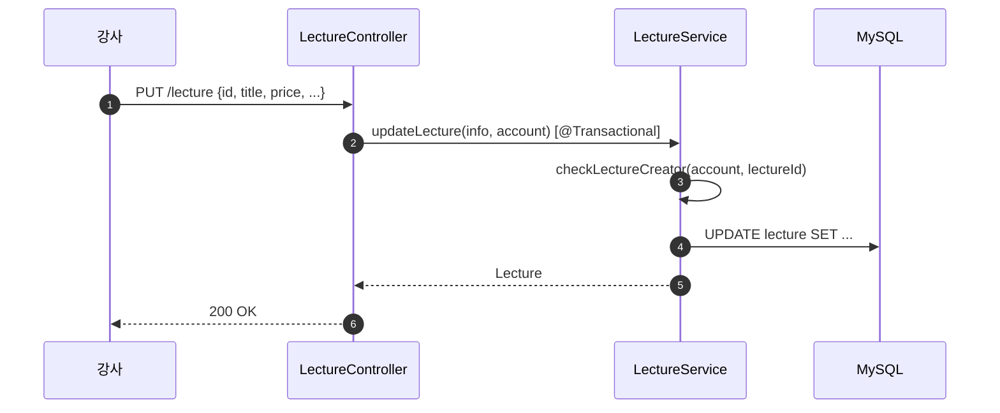
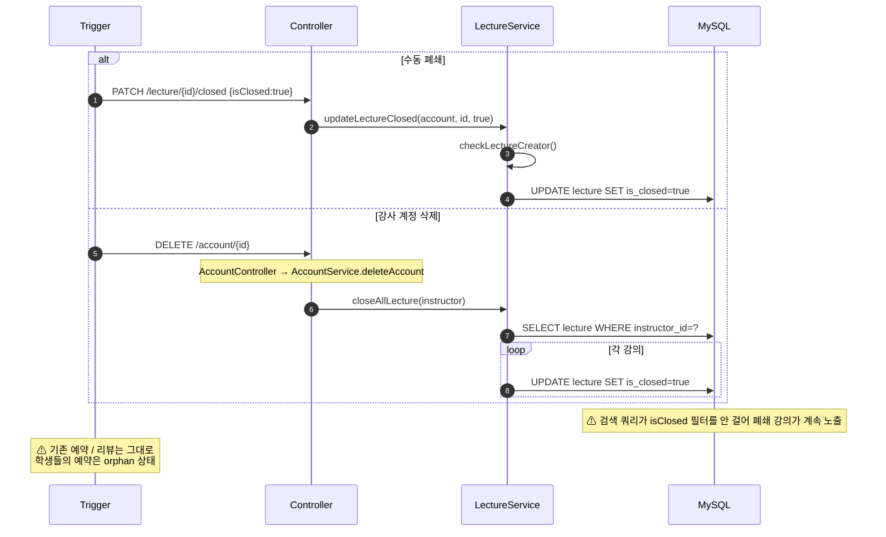
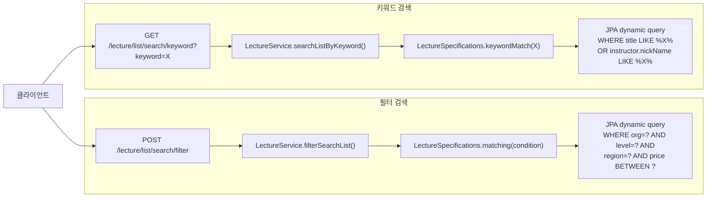
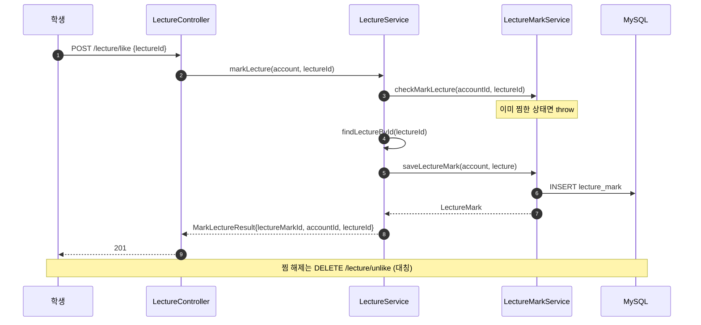
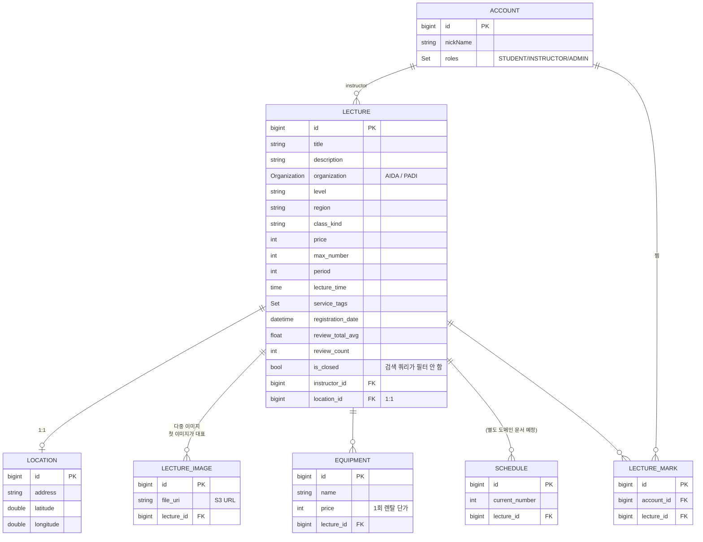

# 강의 (lecture)

## 한 줄 요약

플랫폼의 핵심 상품. 강사(`INSTRUCTOR` 역할 Account) 가 만들고, 학생이 [예약](reservation.md) 한다. **MySQL 이 단일 진실** — 검색(필터·키워드)은 모두 `JpaSpecificationExecutor` + `LectureSpecifications` 동적 쿼리로 처리한다. (Phase 3 에서 Elasticsearch 와 그 동기화 코드를 전부 제거하고 키워드 검색을 MySQL `LIKE` 로 치환 — 결정 근거는 [observability.md](observability.md) "왜 Elasticsearch 가 아닌가".)

`isClosed=true` 가 "폐쇄" 상태이지만 **검색 결과에 여전히 노출되고 예약도 막히지 않음** (필터링 부재 — [§ 알려진 설계 간극](#알려진-설계-간극)). 강사 계정 삭제 시 자기 강의 전부 자동 폐쇄되지만 예약 까지는 손대지 않음.

> **이 도메인은 Lecture / Schedule / Equipment / Location / LectureImage / LectureMark 6개 엔티티 연합체.** Lecture 와 직접 결합된 4개 (Equipment / Location / Image / Mark) 는 이 문서에서 같이 다루고, **Schedule 은 별도 도메인 문서 (TBD)** — 예약 / 일정 / 장비 재고 연동이 따로 다뤄질 가치가 있어서.

---

## 컴포넌트 지도

**핵심 invariant**:

- **MySQL 이 단일 source of truth.** 검색은 같은 MySQL 에 대한 동적 쿼리(Specification) — 별도 검색 저장소·인덱싱·동기화 없음 (Phase 3 에서 ES 제거하며 동기화 구멍 전부 해소).
- Lecture 도메인이 다른 도메인을 직접 호출하지 않음 (ReservationService / AccountService 가 이쪽으로 들어옴 — 단방향).

---

## 강의 생명주기

**`isClosed` 는 MySQL 에만 있는 상태값.** 검색 쿼리(Specification)가 `isClosed=false` 필터를 걸지 않아 폐쇄 강의가 검색에 계속 노출된다 — 근본 원인은 검색 쿼리의 필터 부재 (구 ES 시절엔 `LectureEs` 에 `isClosed` 필드 자체가 없던 게 원인이었으나, MySQL 직접 검색이 된 지금은 쿼리에 `cb.equal(isClosed, false)` 한 줄만 더하면 해소 가능).

---

## 흐름 1: 강의 생성

**설계 흠**: 강의 등록이 **3~5번의 클라이언트 호출** 로 분리됨. UI 워크플로우가 이걸 다 묶어야 하고, 중간에 실패하면 부분 상태 (예: 이미지 없는 강의) 가 DB 에 남음. (구 ES 시절의 "인덱싱 별도 호출 누락 시 검색 불가" 문제는 ES 제거로 사라짐 — 생성 즉시 검색됨.)

---

## 흐름 2: 강의 수정

**단일 source 라 일관성 문제 없음**: 수정은 MySQL `UPDATE` 한 번. 검색이 같은 테이블을 직접 읽으므로 수정 즉시 반영된다. (구 ES 시절엔 MySQL 성공 후 ES 동기화 실패 시 두 source 가 어긋나는 문제가 있었으나, ES 제거로 해소.)

---

## 흐름 3: 강의 폐쇄 (수동 / 강사 계정 삭제)

**연쇄 효과 부재**:
- 검색 Specification 이 `isClosed=false` 필터를 걸지 않아 폐쇄 강의가 검색에 계속 노출 (쿼리 한 줄로 해소 가능)
- 학생들의 기존 [예약](reservation.md) 은 자동 취소되지 않음 — 강사가 사라졌는데 예약은 유효
- 리뷰의 강사 정보는 살아있지만 강사 프로필 조회 불가

---

## 흐름 4: 검색 (필터 / 키워드)

두 검색 경로 모두 **MySQL `JpaSpecificationExecutor` + `LectureSpecifications`** 위에서 동작한다 (Phase 3 에서 키워드 경로를 ES → MySQL `LIKE` 로 치환):

두 경로 모두 `mapToPopularLectureInfos` 로 `LectureInfo` 매핑 + `LectureMarkService.findLikeLectureMap` 의 `isMarked` 오버레이를 공유한다.

**검색 파라미터** (`FilterSearchCondition`):
- organization, level, region, classKind
- costCondition: { min, max }

**둘 다 `isClosed` 필터링 안 함.** 폐쇄 강의가 검색 결과에 그대로 섞여 나옴 (Specification 에 `cb.equal(isClosed, false)` 미적용).

---

## 흐름 5: 찜하기

**찜 카운트는 별도 컬럼으로 관리 안 함** — 매번 LectureMark 행 수를 집계해야 함. 인기도에 활용하려면 비효율적.

---

## 데이터 모델

**검색용 별도 저장소 없음.** 키워드 검색은 `LECTURE.title` 과 조인된 `ACCOUNT.nickName`(강사) 을 직접 `LIKE` 매칭하고, 카드 표시용 `imageUrl`(대표 이미지) / `equipmentNames` / `starAvg` 등은 결과 매핑 시점(`mapToPopularLectureInfos`)에 `lectureImages[0]` · `equipmentList` · `reviewTotalAvg` 에서 조립한다 — 구 ES 처럼 미리 비정규화해 캐시하지 않으므로 동기화 누락(닉네임·장비·이미지·리뷰통계) 문제가 원천적으로 없다.

---

## Equipment / Location / LectureImage / LectureMark — 보조 엔티티

| 엔티티 | 컨트롤러 | 강의와 관계 | 특이 사항 |
|---|---|---|---|
| **LectureImage** | `LectureImageController` | 1:N | S3 에 업로드, DB 에 URI. 첫 이미지가 대표 이미지 — 검색 카드의 `imageUrl` 은 조회 시점에 `lectureImages[0]` 에서 조립 |
| **Location** | `LocationController` | 1:1 | 주소 + 위도/경도. 강의 폐쇄 시 cascade 안 함 |
| **Equipment** | `EquipmentController` | 1:N | 렌탈 가능 장비. 각 Equipment 는 사이즈별 EquipmentStock 다중 보유 |
| **LectureMark** | `LectureController` (`/lecture/like` 계열) | M:N (Account ↔ Lecture) | 찜. timestamp / count 비관리 |

이 4개 모두 **lecture 도메인의 일부로 본다** — 별도 도메인 문서 만들 만큼 복잡하지 않고, 강의 흐름과 강하게 결합되어 있어서 따로 분리하면 오히려 컨텍스트 단절.

---

## 검색 = MySQL 단일 소스 (구 Elasticsearch 동기화 매트릭스 폐기)

Phase 3 (2026-06-24) 에서 Elasticsearch 와 그 인덱싱·동기화 코드(`LectureEsService` / `LectureEsRepo` / `LectureEs` / `ElasticSearchConfig`)를 전부 제거했다. 이전에는 MySQL 변경마다 ES 를 별도로 동기화해야 했고 그 매트릭스에 ❌(동기화 누락) 가 많았다 — 생성 시 인덱싱 별도 호출 필요, 폐쇄·삭제·장비삭제·리뷰통계 미동기화 등.

**제거로 그 모순이 전부 사라졌다.** 검색이 MySQL 을 직접 읽으므로 동기화라는 개념 자체가 없다:

| 과거 ES 동기화 구멍 | 현재 (MySQL 직접 검색) |
|---|---|
| 생성 후 ES 인덱싱 별도 호출 누락 → 검색 불가 | INSERT 즉시 검색 대상 |
| 폐쇄/삭제/장비삭제가 ES 에 미반영 (stale) | 다음 쿼리가 항상 현재 행을 읽음 |
| 닉네임·장비·이미지·리뷰통계 비정규화 캐시 동기화 누락 | 조회 시점에 조인/조립 — 캐시 없음 |
| MySQL 성공 / ES 실패 시 일관성 깨짐 | source 가 하나라 불일치 없음 |

남은 단 하나의 검색 결함은 **`isClosed=false` 필터 부재**(폐쇄 강의 검색 노출) 인데, 이는 ES 와 무관하게 `LectureSpecifications` 에 조건 한 줄을 더하면 해소된다 — [§ 알려진 설계 간극](#알려진-설계-간극) 참고.

---

## 보안 / 권한 매트릭스

### Lecture
| 엔드포인트 | 인증 | 역할 | 비고 |
|---|---|---|---|
| `POST /lecture/create` | 필요 | any (서비스 레벨 INSTRUCTOR 검증 없음) | 누구나 강의 생성 가능한 보안 간극 |
| `PUT /lecture` | 필요 | any | `checkLectureCreator` 로 본인 강의만 수정 |
| `DELETE /lecture/delete?id=` | 필요 | any | hard delete |
| `PATCH /lecture/{id}/closed` | 필요 | any | `checkLectureCreator` |
| `GET /lecture` (`?id=`) | permitAll | — | 폐쇄 강의도 노출 |
| `GET /lecture/manage/list` | 필요 | any | 본인 강의만 |
| `POST /lecture/list/search/filter` | 필요 | — | `isClosed` 필터링 없음 |
| `GET /lecture/list/search/keyword?keyword=` | 필요 | — | 동일 |
| `GET /lecture/new/list` | 필요 | — | 최근 15일 |
| `GET /lecture/popular/list` | 필요 | — | reviewCount + starAvg 정렬 |
| `GET /lecture/instructor/info/creator?lectureId=` | permitAll | — | |
| `POST /lecture/like` / `DELETE /lecture/unlike` | 필요 | any | |
| `GET /lecture/{id}/like` | permitAll | — | 찜 여부 조회 |
| `GET /lecture/like/list` | 필요 | any | 본인 찜 목록 |

### 보조 (Image / Location / Equipment)
| 엔드포인트 | 인증 | 권한 검증 |
|---|---|---|
| `POST /lectureImage/create/list` | 필요 | 서비스에서 강사 본인 |
| `GET /lectureImage/list` | permitAll | — |
| `DELETE /lectureImage/list` | 필요 | 서비스에서 강사 본인 |
| `POST /location/create` | 필요 | 서비스에서 강사 본인 |
| `GET /location` | permitAll | — |
| `PUT /location` | 필요 | 서비스에서 강사 본인 |
| `POST /equipment/create/list` | 필요 | 서비스에서 강사 본인 |
| `GET /equipment/list` | permitAll | — |
| `DELETE /equipment/{id}` | 필요 | 서비스에서 강사 본인 |

**🔴 보안 간극**: `POST /lecture/create` 에 INSTRUCTOR 역할 검증이 없음. 학생도 (이론적으로는) 강의를 만들 수 있음. SecurityConfiguration 의 다른 INSTRUCTOR 전용 라우트 (`/account/instructor/**`) 와 다른 패턴.

---

## 알려진 설계 간극

> **✅ Phase 3 에서 해소된 ES 의존 간극** (2026-06-24): #1 *생성 후 ES 인덱싱 별도 호출 필요*, #3 *MySQL/ES 다중 서비스 트랜잭션 부재*, #9 *장비·이미지·닉네임 ES 부분 동기화*, #10 *ES 미인덱싱 강의 빈 결과* — 모두 Elasticsearch 와 동기화 코드 제거로 사라졌다 (검색이 MySQL 단일 source 직접 조회). 아래에는 ES 와 무관하게 남은 간극만 둔다.

### 심각도 🔴 (출시 전 수정 권장)

2. **폐쇄 / 삭제된 강의가 검색 결과에 노출됨**
   - 검색 Specification(`matching` / `keywordMatch`) 이 `isClosed` 를 거르지 않음. (ES 제거와 무관하게 남은 결함.)
   - **해결안**: `LectureSpecifications` 에 `cb.equal(root.get("isClosed"), false)` 조건 추가.

4. **`POST /lecture/create` 에 INSTRUCTOR 역할 검증 부재**
   - 인증만 되면 누구나 호출 가능. SecurityConfiguration 의 `.authenticated()` 까지만 등록되어 있고 서비스 레벨에도 역할 체크 없음.
   - **해결안**: `@PreAuthorize("hasRole('INSTRUCTOR')")` 또는 SecurityConfiguration matcher 에 `.hasRole("INSTRUCTOR")` 명시.

5. **예약 생성 시 강의 `isClosed` 미검증**
   - [reservation.md](reservation.md) 참고. `ReservationService.saveReservation` 이 `lecture.isClosed` 체크 안 함.
   - **해결안**: `saveReservation` 에서 `if (schedule.lecture.isClosed) throw ClosedLectureException` 추가.

### 심각도 🟡 (출시 후 정리 가능)

6. **강사 계정 삭제 시 학생들의 예약이 orphan 상태**
   - `closeAllLecture` 가 강의만 폐쇄, 기존 예약은 그대로. 학생은 사라진 강사의 강의에 예약을 들고 있음.
   - **해결안**: `closeAllLecture` 에서 미래 예약을 자동 취소 + 환불 트리거 + `ReservationCancelledEvent` 발행.

7. **찜 카운트 비정규화 부재**
   - `Lecture.likeCount` 컬럼 없음. 인기도 표시 / 정렬 시 매번 집계 필요.
   - **해결안**: `Lecture.likeCount` 추가 + `LectureMark` 생성/삭제 시 +/- 1 (race condition 주의).

8. **Hard delete vs soft delete 혼용**
   - `DELETE /lecture/delete?id=` (hard) 와 `PATCH /{id}/closed` (soft) 가 공존. 정책 일관성 부재.
   - **해결안**: hard delete 제거하고 soft delete 만 유지 (또는 명확한 구분 정책).

### 심각도 🟢 (검토 사항)

11. **검색 결과 정렬 / 가중치 기준 명확하지 않음** — 인기 강의는 `reviewCount DESC, reviewTotalAvg DESC` 단순 정렬, 키워드 검색은 `LIKE` 매칭만 하고 관련도 순위가 없음 (정렬 미지정).

12. **강의 생성이 다단계 (강의 → 이미지 → 장비 → 위치 → 일정)** — 클라이언트 UX 가 wizard 형태여야 모든 단계 통과 보장. 중간에 끊긴 강의 정리 정책 없음.

---

## Phase 3 (Elasticsearch 제거) — ✅ 완료 (2026-06-24)

`project_simplification_plan.md` 의 Phase 3. **제거로 결론** (규모 미달 + 새 course 도메인은 이미 Specification 검색 + 동기화 구멍 다수 — 결정 근거 [observability.md](observability.md) "왜 Elasticsearch 가 아닌가"). 실제 수행:

- ✅ `LectureEsService` / `LectureEsRepo` / `LectureEs` / `ElasticSearchConfig` / `TestElasticSearchConfig` 삭제
- ✅ `LectureController` 의 `POST /{id}/elastic-search` 엔드포인트 + 수정/이미지/장비/닉네임 ES 동기화 호출 제거 (`LectureController` · `LectureImageController` · `EquipmentController` · `AccountService`)
- ✅ `getListContainKeyword` → `LectureService.searchListByKeyword` (JPA) 로 치환
- ✅ `LectureSpecifications.keywordMatch(keyword)` 추가 — `title LIKE %?% OR instructor.nickName LIKE %?%`. `filterSearchList` 와 동일한 `mapToPopularLectureInfos` + `isMarked` 오버레이 재사용
- ✅ build.gradle ES 의존성 / docker-compose ES 서비스·볼륨 / application.yml ES 로깅 / application-test.yml `autoconfigure.exclude` + `elasticsearch.uri` / `.env*` `ELASTICSEARCH_URI` 제거 (Phase 0 deferred #3 정리 완료)

> 키워드 검색 성능: 현재 규모에선 `LIKE` 로 충분. full-text 관련도 순위/대용량이 필요해지면 MySQL FULLTEXT 인덱스 또는 관리형 OpenSearch 를 검토 (자가호스팅 ES 부활 X).

---

## 더 깊게: 테스트로 보기

**현재 lecture 도메인은 use-case 테스트가 없습니다.** [reservation.md](reservation.md) 와 동일한 상황 — 통합 안전망 부재.

존재하는 테스트:

| 위치 | 종류 | 검증 범위 |
|---|---|---|
| [`controller/lecture/LectureControllerTest`](../../src/test/java/com/diving/pungdong/controller/lecture/LectureControllerTest.java) | controller (MockMvc + @MockBean) | HTTP wiring + REST Docs. 비즈니스 로직 검증 X |
| [`service/LectureServiceTest`](../../src/test/java/com/diving/pungdong/service/LectureServiceTest.java) | unit (Mockito) | 강의 생성, 찜 여부 조회, checkLectureCreator, calcLeftScheduleDate |

**추가하면 좋을 use-case 시나리오** (`src/test/java/com/diving/pungdong/usecase/LectureUseCaseTest.java` 신설 권장 — 단, 사용자가 use-case 테스트를 기획 변경 후로 미루기로 결정함. 변경이 안정화된 후 작성):

- `C1`: 강의 생성 → 별도 인덱싱 없이 즉시 키워드 검색(제목 매칭)에서 잡힘
- `C2`: 강사 닉네임으로 키워드 검색 → 해당 강사 강의가 잡힘 (title OR nickName LIKE)
- `X1`: 강사가 자기 강의 폐쇄 → `isClosed=true` 인데도 검색 결과에 노출됨 (현 buggy spec 캡처 — isClosed 필터 부재)
- `X2`: 강사 계정 삭제 → 자기 강의 모두 isClosed=true + 학생 예약은 orphan
- `R1`: 학생이 다른 강사의 강의 수정 시도 → checkLectureCreator throw
- `R2`: STUDENT 가 `POST /lecture/create` 호출 → 현재는 통과 (보안 간극 spec 캡처)
- `S1`: 폐쇄된 강의가 `/lecture/popular/list` 응답에 포함됨 (현 spec 캡처)
- `M1`: 동일 학생이 같은 강의 두 번 찜 → checkMarkLecture 거부
