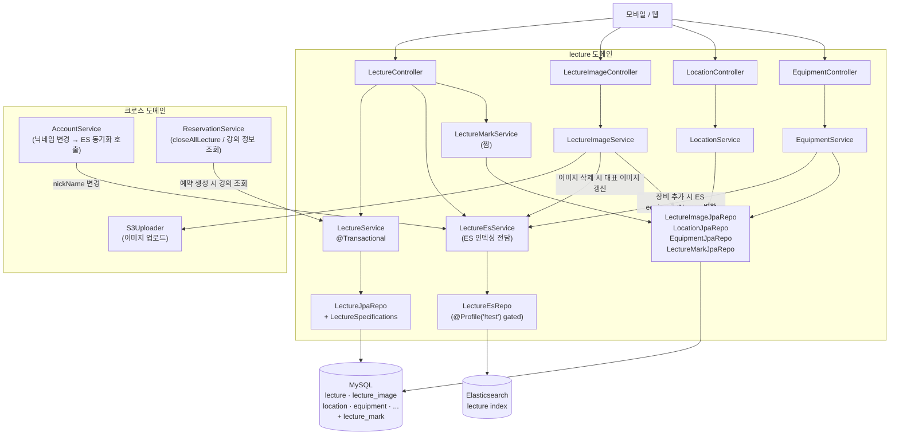
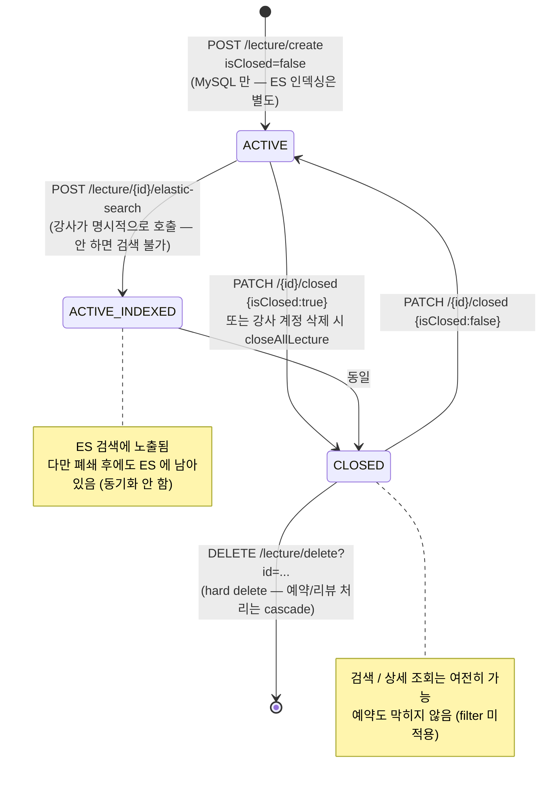
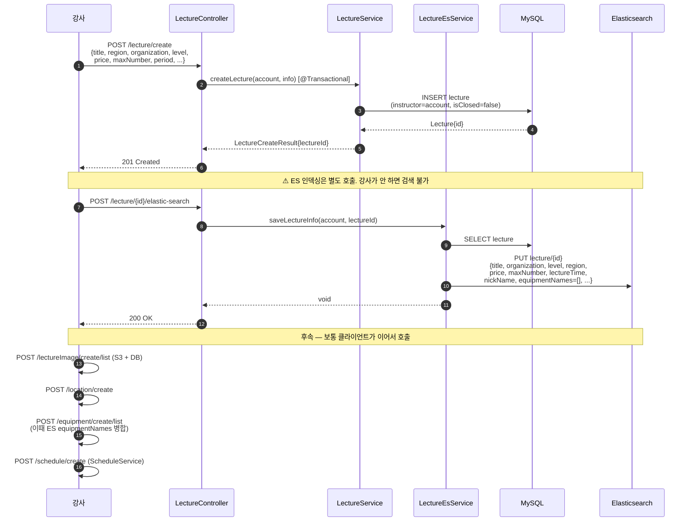
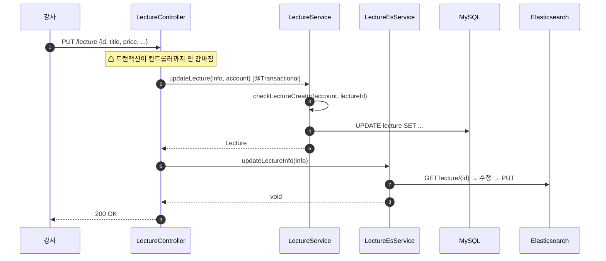
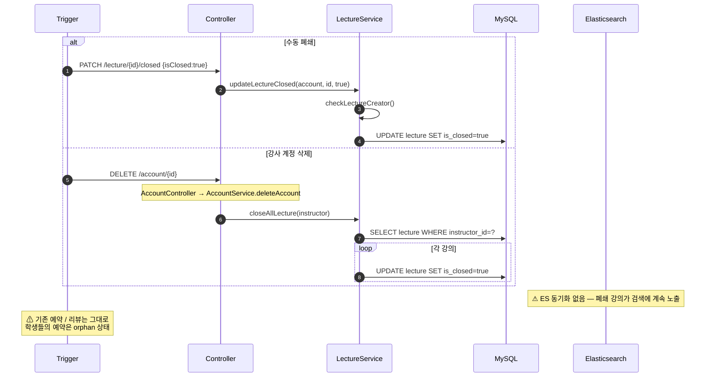
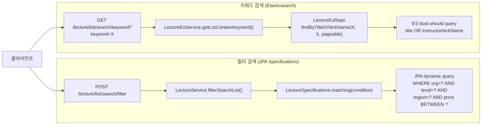
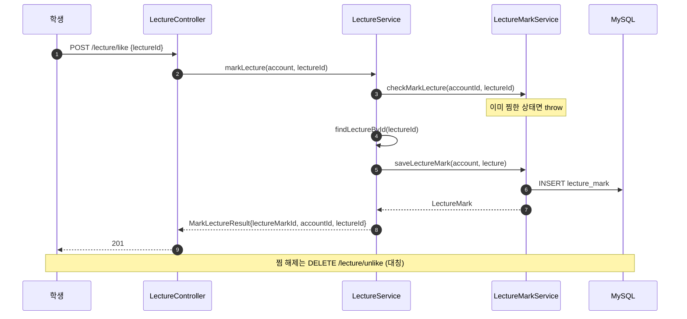
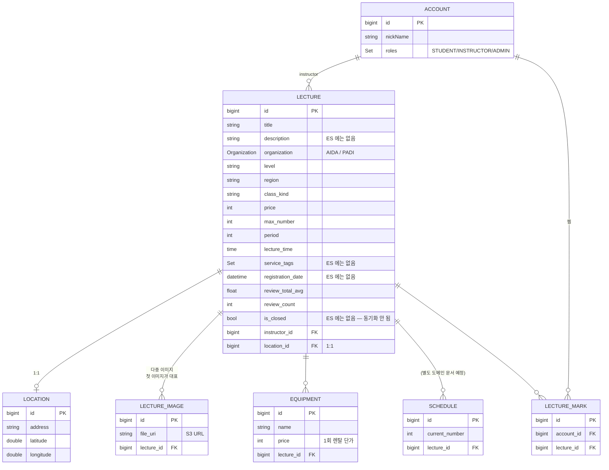

# 강의 (lecture)

## 한 줄 요약

플랫폼의 핵심 상품. 강사(`INSTRUCTOR` 역할 Account) 가 만들고, 학생이 [예약](reservation.md) 한다. **MySQL 이 진실, Elasticsearch 가 검색용 뷰** — 둘은 강의 생성 / 수정 / 강사 닉네임 변경 / 장비 추가 / 이미지 삭제 시점에 컨트롤러 레벨에서 동기화된다 (트랜잭션은 안 묶임).

`isClosed=true` 가 "폐쇄" 상태이지만 **검색 결과에 여전히 노출되고 예약도 막히지 않음** (필터링 부재 — [§ 알려진 설계 간극](#알려진-설계-간극)). 강사 계정 삭제 시 자기 강의 전부 자동 폐쇄되지만 ES / 예약 까지는 손대지 않음.

> **이 도메인은 Lecture / Schedule / Equipment / Location / LectureImage / LectureMark 6개 엔티티 연합체.** Lecture 와 직접 결합된 4개 (Equipment / Location / Image / Mark) 는 이 문서에서 같이 다루고, **Schedule 은 별도 도메인 문서 (TBD)** — 예약 / 일정 / 장비 재고 연동이 따로 다뤄질 가치가 있어서.

---

## 컴포넌트 지도



**핵심 invariant**:

- **MySQL 이 source of truth**, ES 는 검색 전용 뷰. 단방향 동기.
- **ES 동기화는 컨트롤러가 두 서비스를 같이 호출하는 패턴.** 트랜잭션 안 묶여있어서 부분 실패 가능 — [§ 알려진 설계 간극](#알려진-설계-간극) 의 4번.
- Lecture 도메인이 다른 도메인을 직접 호출하지 않음 (ReservationService / AccountService 가 이쪽으로 들어옴 — 단방향).

---

## 강의 생명주기



**상태가 두 개의 source 에 분산**: `isClosed` 는 MySQL 에만 있고 ES `LectureEs` 는 `isClosed` 필드 자체를 안 가짐. 이 분리가 폐쇄 강의가 검색에 계속 노출되는 근본 원인.

---

## 흐름 1: 강의 생성 + ES 인덱싱



**설계 흠**: 강의 등록이 **3~5번의 클라이언트 호출** 로 분리됨. UI 워크플로우가 이걸 다 묶어야 하고, 중간에 실패하면 부분 상태 (예: 이미지 없는 강의 / ES 미인덱싱 강의 등) 가 DB 에 남음.

---

## 흐름 2: 강의 수정



**문제점**: ② MySQL 성공 후 ⑤ ES 실패 시 두 source 가 일관성 깨짐. 트랜잭션이 메서드 두 개에 걸쳐있지 않음.

---

## 흐름 3: 강의 폐쇄 (수동 / 강사 계정 삭제)



**연쇄 효과 부재**:
- ES `LectureEs.isClosed` 필드 자체가 없어서 폐쇄 정보 동기화 불가
- 학생들의 기존 [예약](reservation.md) 은 자동 취소되지 않음 — 강사가 사라졌는데 예약은 유효
- 리뷰의 강사 정보는 살아있지만 강사 프로필 조회 불가

---

## 흐름 4: 검색 (필터 / 키워드)

두 검색 경로가 분리되어 있음:



**검색 파라미터** (`FilterSearchCondition`):
- organization, level, region, classKind
- costCondition: { min, max }

**둘 다 `isClosed` 필터링 안 함.** 폐쇄 강의가 검색 결과에 그대로 섞여 나옴.

---

## 흐름 5: 찜하기



**찜 카운트는 별도 컬럼으로 관리 안 함** — 매번 LectureMark 행 수를 집계해야 함. 인기도에 활용하려면 비효율적.

---

## 데이터 모델



**Elasticsearch `LectureEs`** (검색 전용, MySQL 의 부분 투영):

```
{
  id, title, organization, level, region, period,
  maxNumber, lectureTime, price, reviewCount, starAvg,
  imageUrl,            ← lecture.lectureImages[0].fileURI 캐시
  equipmentNames,      ← lecture.equipmentList[*].name 캐시
  nickName             ← lecture.instructor.nickName 캐시 (denormalized)
}
```

**MySQL 에는 있지만 ES 에는 없는 필드**: `description`, `serviceTags`, `registrationDate`, `isClosed`, `instructor_id`, `location_id`. `isClosed` 가 없는 게 폐쇄 강의 검색 노출의 원인.

---

## Equipment / Location / LectureImage / LectureMark — 보조 엔티티

| 엔티티 | 컨트롤러 | 강의와 관계 | 특이 사항 |
|---|---|---|---|
| **LectureImage** | `LectureImageController` | 1:N | S3 에 업로드, DB 에 URI. 첫 이미지가 대표 이미지로 ES 에도 캐시. 삭제 시 ES `imageUrl` 갱신 트리거 |
| **Location** | `LocationController` | 1:1 | 주소 + 위도/경도. 강의 폐쇄 시 cascade 안 함 |
| **Equipment** | `EquipmentController` | 1:N | 렌탈 가능 장비. 추가 시 ES `equipmentNames` 리스트 병합. 각 Equipment 는 사이즈별 EquipmentStock 다중 보유 |
| **LectureMark** | `LectureController` (`/lecture/like` 계열) | M:N (Account ↔ Lecture) | 찜. timestamp / count 비관리 |

이 4개 모두 **lecture 도메인의 일부로 본다** — 별도 도메인 문서 만들 만큼 복잡하지 않고, 강의 흐름과 강하게 결합되어 있어서 따로 분리하면 오히려 컨텍스트 단절.

---

## Elasticsearch 인덱싱 — 동기화 매트릭스 (Phase 3 대비 핵심)

| 트리거 | MySQL 변경 | ES 동기화 | 비고 |
|---|---|---|---|
| 강의 생성 | INSERT lecture | ❌ (별도 호출 필요) | POST `/lecture/{id}/elastic-search` 명시적 호출해야 인덱싱 |
| 강의 수정 | UPDATE lecture | ✅ updateLectureInfo (컨트롤러 레벨) | 트랜잭션 안 묶임 |
| 강의 폐쇄 | UPDATE lecture is_closed=true | ❌ | ES 에 isClosed 필드 자체가 없음 |
| 강의 hard delete | DELETE lecture | ❌ | ES 에 stale 행이 남음 |
| 강사 계정 삭제 → closeAllLecture | UPDATE 다수 | ❌ | 위와 같은 이유 |
| 강사 닉네임 변경 | UPDATE account | ✅ updateInstructorNickName (Account 도메인이 cross-call) | findAllByNickName 으로 매핑된 모든 강의 갱신 |
| 이미지 추가 | INSERT lecture_image | ❌ (대표 이미지 변경 시에만 갱신 필요한데 안 함) | |
| 이미지 삭제 | DELETE lecture_image | ✅ updateMainLectureImage | 대표 이미지가 바뀔 가능성이 있어서 |
| 장비 추가 | INSERT equipment | ✅ updateEquipmentNames | ES equipmentNames 리스트 병합 |
| 장비 삭제 | DELETE equipment | ❌ | ES 에 stale 장비명 남음 |
| 리뷰 작성 → reviewCount/avg 변경 | UPDATE lecture | ❌ | ES 에도 reviewCount/starAvg 가 있는데 동기 안 됨 |

→ **동기화 구멍이 많음.** Phase 3 에서 ES 를 제거하면 이 모든 모순이 해소됨. 유지하려면 outbox-style 인덱싱 워커 도입 필요 (현재 알림 도메인이 쓰는 패턴 응용 가능).

**테스트 환경**: `ElasticSearchConfig` 가 `@Profile("!test")` 로 gated, `TestElasticSearchConfig` 가 `LectureEsRepo` 를 Mockito mock 으로 제공 → ES 관련 테스트는 의미 없는 통과 (Phase 0 deferred 메모리의 #3).

---

## 보안 / 권한 매트릭스

### Lecture
| 엔드포인트 | 인증 | 역할 | 비고 |
|---|---|---|---|
| `POST /lecture/create` | 필요 | any (서비스 레벨 INSTRUCTOR 검증 없음) | 누구나 강의 생성 가능한 보안 간극 |
| `PUT /lecture` | 필요 | any | `checkLectureCreator` 로 본인 강의만 수정 |
| `DELETE /lecture/delete?id=` | 필요 | any | hard delete |
| `PATCH /lecture/{id}/closed` | 필요 | any | `checkLectureCreator` |
| `POST /lecture/{id}/elastic-search` | 필요 | any | `checkLectureCreator` |
| `GET /lecture` (`?id=`) | permitAll | — | 폐쇄 강의도 노출 |
| `GET /lecture/manage/list` | 필요 | any | 본인 강의만 |
| `POST /lecture/list/search/filter` | 필요 | — | `isClosed` 필터링 없음 |
| `GET /lecture/list/search/keyword?keyword=` | 필요 | — | 동일 |
| `GET /lecture/new/list` | 필요 | — | 최근 15일 |
| `GET /lecture/popular/list` | 필요 | — | reviewCount + starAvg 정렬 |
| `GET /lecture/instructor/info/creator?lectureId=` | permitAll | — | |
| `POST /lecture/like` / `DELETE /lecture/unlike` | 필요 | any | |
| `GET /lecture/{id}/like` | permitAll | — | 찜 여부 조회 |
| `GET /lecture/like/list` | 필요 | any | 본인 찜 목록 |

### 보조 (Image / Location / Equipment)
| 엔드포인트 | 인증 | 권한 검증 |
|---|---|---|
| `POST /lectureImage/create/list` | 필요 | 서비스에서 강사 본인 |
| `GET /lectureImage/list` | permitAll | — |
| `DELETE /lectureImage/list` | 필요 | 서비스에서 강사 본인 |
| `POST /location/create` | 필요 | 서비스에서 강사 본인 |
| `GET /location` | permitAll | — |
| `PUT /location` | 필요 | 서비스에서 강사 본인 |
| `POST /equipment/create/list` | 필요 | 서비스에서 강사 본인 |
| `GET /equipment/list` | permitAll | — |
| `DELETE /equipment/{id}` | 필요 | 서비스에서 강사 본인 |

**🔴 보안 간극**: `POST /lecture/create` 에 INSTRUCTOR 역할 검증이 없음. 학생도 (이론적으로는) 강의를 만들 수 있음. SecurityConfiguration 의 다른 INSTRUCTOR 전용 라우트 (`/account/instructor/**`) 와 다른 패턴.

---

## 알려진 설계 간극

### 심각도 🔴 (출시 전 수정 권장)

1. **강의 생성 후 ES 인덱싱 별도 호출 필요**
   - 강사가 `POST /lecture/{id}/elastic-search` 를 잊으면 검색에 안 잡힘.
   - **해결안**: `LectureService.createLecture` 마지막에 `lectureEsService.saveLectureInfo` 호출 (트랜잭션 commit 후 outbox 패턴 권장).

2. **폐쇄 / 삭제된 강의가 검색 결과에 노출됨**
   - `LectureEs` 에 `isClosed` 필드 부재 + `closeAllLecture` 가 ES 갱신 안 함.
   - **해결안**: `LectureEs` 에 `isClosed` 추가 + 검색 쿼리에서 `isClosed=false` 필터 + 폐쇄 시 ES 갱신.

3. **컨트롤러 레벨 다중 서비스 호출에 트랜잭션 부재**
   - `updateLecture` 가 MySQL 성공 / ES 실패 시 두 source 일관성 깨짐.
   - **해결안**: 컨트롤러에서 `@Transactional` 또는 outbox 큐 도입.

4. **`POST /lecture/create` 에 INSTRUCTOR 역할 검증 부재**
   - 인증만 되면 누구나 호출 가능. SecurityConfiguration 의 `.authenticated()` 까지만 등록되어 있고 서비스 레벨에도 역할 체크 없음.
   - **해결안**: `@PreAuthorize("hasRole('INSTRUCTOR')")` 또는 SecurityConfiguration matcher 에 `.hasRole("INSTRUCTOR")` 명시.

5. **예약 생성 시 강의 `isClosed` 미검증**
   - [reservation.md](reservation.md) 참고. `ReservationService.saveReservation` 이 `lecture.isClosed` 체크 안 함.
   - **해결안**: `saveReservation` 에서 `if (schedule.lecture.isClosed) throw ClosedLectureException` 추가.

### 심각도 🟡 (출시 후 정리 가능)

6. **강사 계정 삭제 시 학생들의 예약이 orphan 상태**
   - `closeAllLecture` 가 강의만 폐쇄, 기존 예약은 그대로. 학생은 사라진 강사의 강의에 예약을 들고 있음.
   - **해결안**: `closeAllLecture` 에서 미래 예약을 자동 취소 + 환불 트리거 + `ReservationCancelledEvent` 발행.

7. **찜 카운트 비정규화 부재**
   - `Lecture.likeCount` 컬럼 없음. 인기도 표시 / 정렬 시 매번 집계 필요.
   - **해결안**: `Lecture.likeCount` 추가 + `LectureMark` 생성/삭제 시 +/- 1 (race condition 주의).

8. **Hard delete vs soft delete 혼용**
   - `DELETE /lecture/delete?id=` (hard) 와 `PATCH /{id}/closed` (soft) 가 공존. 정책 일관성 부재.
   - **해결안**: hard delete 제거하고 soft delete 만 유지 (또는 명확한 구분 정책).

9. **장비 / 이미지 / 닉네임 변경 시 ES 가 부분적으로만 동기화**
   - 위 ES 동기화 매트릭스 표 참고. 갱신 누락이 여러 군데.
   - **해결안**: outbox 인덱싱 큐로 통합 (notification 도메인의 outbox 패턴 응용).

10. **ES 인덱스가 없는 시점에 검색 호출 시 빈 결과만 나옴**
    - 강사가 `elastic-search` 호출 안 한 강의는 키워드 검색 안 잡히지만 에러도 안 남.
    - **해결안**: 1번 해결과 함께 자동 인덱싱.

### 심각도 🟢 (검토 사항)

11. **검색 결과 정렬 / 가중치 기준 명확하지 않음** — 인기 강의는 `reviewCount DESC, reviewTotalAvg DESC` 단순 정렬, 키워드 검색은 ES 기본 점수.

12. **강의 생성이 다단계 (강의 → ES → 이미지 → 장비 → 위치 → 일정)** — 클라이언트 UX 가 wizard 형태여야 모든 단계 통과 보장. 중간에 끊긴 강의 정리 정책 없음.

---

## Phase 3 (Elasticsearch 제거 결정) 대비 체크리스트

`project_simplification_plan.md` 의 Phase 3 가 ES 를 제거할지 / 유지할지 결정 단계. 제거 결정 시 이 도메인이 가장 큰 변경 영역.

**제거 시 작업**:
- `LectureEsService` / `LectureEsRepo` / `LectureEs` 삭제
- `LectureController` 의 `POST /{id}/elastic-search` 엔드포인트 삭제
- `getListContainKeyword` 를 JPA 기반 검색으로 대체 (예: `WHERE title LIKE %?% OR instructor.nickname LIKE %?%`)
  - 트래픽 / 인덱스 성능 측정 필요 — JPA full-text 는 ES 보다 느림
- `LectureSpecifications` 에 키워드 매칭 추가
- `AccountService.updateNickName` 의 ES 호출 제거
- `EquipmentService` / `LectureImageService` 의 ES 호출 제거
- `application-test.yml` 의 ES autoconfigure 제외 + `TestElasticSearchConfig` mock 삭제 (Phase 0 deferred #3 정리)

**유지 시 작업**:
- 위 [§ ES 동기화 매트릭스](#elasticsearch-인덱싱--동기화-매트릭스-phase-3-대비-핵심) 의 ❌ 표시된 것들 모두 채우기
- 인덱싱 outbox 패턴 도입 (notification 도메인 응용)
- `LectureEs.isClosed` 필드 추가 + 검색 쿼리 필터링

---

## 더 깊게: 테스트로 보기

**현재 lecture 도메인은 use-case 테스트가 없습니다.** [reservation.md](reservation.md) 와 동일한 상황 — 통합 안전망 부재.

존재하는 테스트:

| 위치 | 종류 | 검증 범위 |
|---|---|---|
| [`controller/lecture/LectureControllerTest`](../../src/test/java/com/diving/pungdong/controller/lecture/LectureControllerTest.java) | controller (MockMvc + @MockBean) | HTTP wiring + REST Docs. 비즈니스 로직 검증 X |
| [`service/LectureServiceTest`](../../src/test/java/com/diving/pungdong/service/LectureServiceTest.java) | unit (Mockito) | 강의 생성, 찜 여부 조회, checkLectureCreator, calcLeftScheduleDate |
| `controller/lecture/LectureControllerTest > "ElasticSearch에 강의 데이터 저장"` | controller | **Phase 0 deferred #3** — Mockito mock 으로 통과만 함, 실제 검증 없음 |

**추가하면 좋을 use-case 시나리오** (`src/test/java/com/diving/pungdong/usecase/LectureUseCaseTest.java` 신설 권장 — 단, 사용자가 use-case 테스트를 기획 변경 후로 미루기로 결정함. 변경이 안정화된 후 작성):

- `C1`: 강의 생성 + ES 인덱싱 → 키워드 검색에서 잡힘
- `C2`: 강의 생성만 하고 ES 인덱싱 skip → 키워드 검색에서 안 잡힘 (현 buggy spec 캡처)
- `U1`: 강의 수정 → MySQL + ES 둘 다 갱신됨
- `X1`: 강사가 자기 강의 폐쇄 → MySQL 만 갱신, ES 그대로 (현 spec 캡처)
- `X2`: 강사 계정 삭제 → 자기 강의 모두 isClosed=true + 학생 예약은 orphan
- `R1`: 학생이 다른 강사의 강의 수정 시도 → checkLectureCreator throw
- `R2`: STUDENT 가 `POST /lecture/create` 호출 → 현재는 통과 (보안 간극 spec 캡처)
- `S1`: 폐쇄된 강의가 `/lecture/popular/list` 응답에 포함됨 (현 spec 캡처)
- `M1`: 동일 학생이 같은 강의 두 번 찜 → checkMarkLecture 거부
