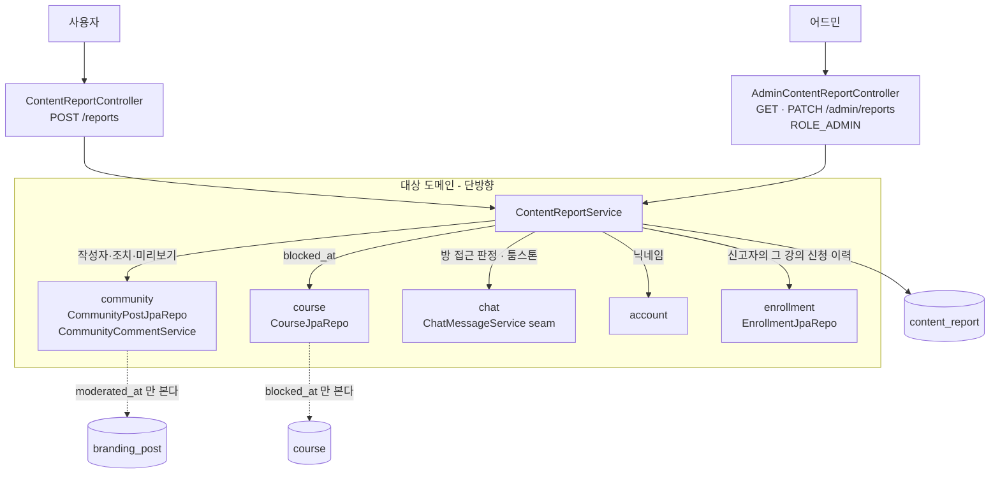
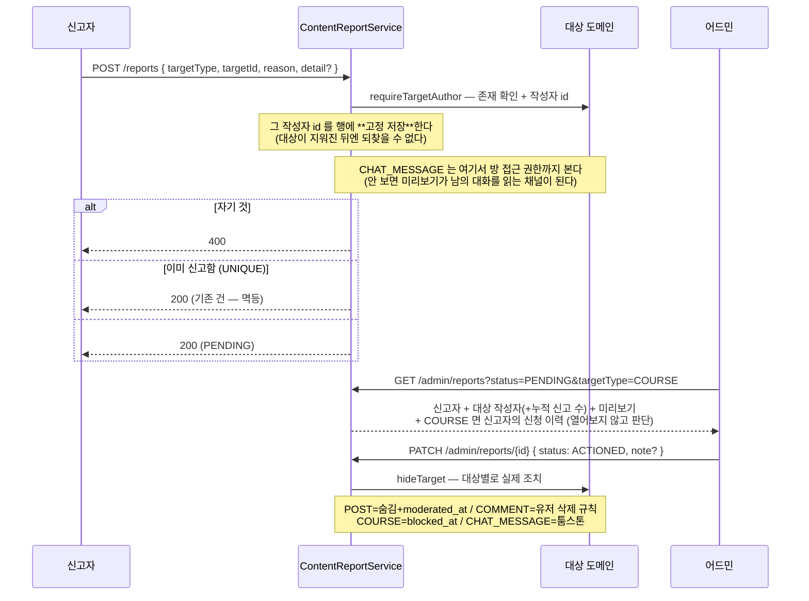
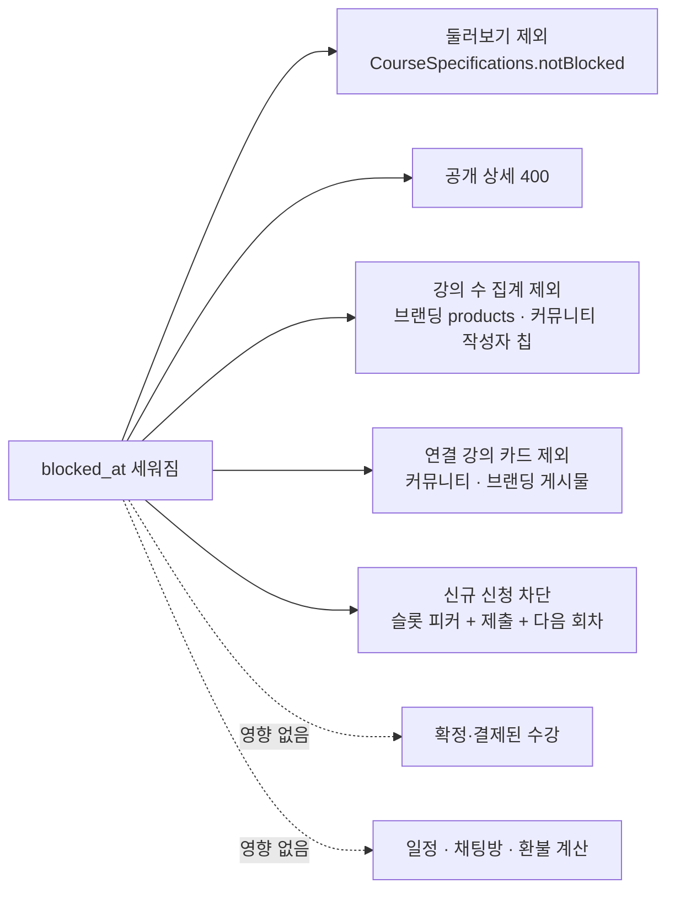
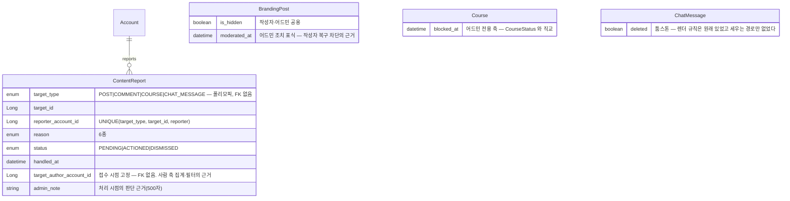

# moderation (신고·조치)

> 정책·왜·결정 히스토리는 [features/moderation.md](../features/moderation.md) 가 소유한다. 여기는 *어떻게*.

## 1. 한 줄

**한 테이블·한 큐**(`content_report`)로 네 종류의 대상(게시물·댓글·강의·채팅 메시지)을 받고, 어드민이
사람 눈으로 처리한다. 핵심 invariant 셋: **조치(`ACTIONED`)는 대상을 실제로 숨긴다**(상태만 바뀌면
조치가 아니다), **의존은 한 방향이다**(대상 도메인은 신고를 읽지 않는다 — 조치 표식을 자기 컬럼으로
갖는다), **자동 숨김 임계값은 없다**(조직적 신고로 정상 글이 사라지는 위험이 더 크다).

2026-08-19 에 `community/` 에서 분리됐다 — 대상이 커뮤니티 밖(강의·채팅)으로 넓어지면서 이름이 사실과
어긋났기 때문이다.

## 2. 컴포넌트 지도

점선이 **순환을 끊는 지점**이다. 커뮤니티·코스는 신고 테이블을 읽지 않고 **자기 테이블의 조치 표식**만
본다 — 읽기 시작하면 `community → moderation → community` 순환이 된다.

## 3. 흐름

### 3-1. 접수 → 조치

### 3-2. 강의 조치의 파급 (거래는 끊지 않는다)

## 4. 데이터 모델

설계 의도 / 함정:

- **FK 가 없는 건 의도다.** 네 종류를 가리키는 폴리모픽 참조라 DB 제약을 걸 수 없다. 대상 존재 확인은
  **접수 시점에 서비스가** 한다 — 안 하면 어드민이 열 수 없는 행이 큐에 쌓인다.
- **`target_author_account_id` 는 접수 시점에 못 박는다**(V34). 매번 대상을 열어 알아내면 대상이
  지워지는 순간 그 행은 **"누구에 대한 신고인지 모르는 행"** 이 된다 — 접수 때 이미 작성자를 확인하고
  있으므로(자기 것 신고 차단의 판정 근거) 그 값을 그대로 적는다. 부수효과로 **같은 사람에 대한 반복
  신고**가 대상 종류·강의를 가로질러 한 쿼리(`countByTargetAuthorIn`)로 잡힌다. FK 는 없다 — 폴리모픽
  테이블 관례이기도 하고, 계정 삭제(익명화)가 신고 행 때문에 막히면 안 된다.
- **어드민 큐의 부가 정보는 전부 배치로 모은다**(`QueueContext`). 작성자 닉네임 · 작성자별 누적 수 ·
  (COURSE 한정) 신고자의 신청 이력 셋 다 id 집합 하나면 한 번에 물어볼 수 있는 값이라, 행마다 조회하면
  페이지 크기만큼 쿼리가 곱해진다. ⚠️ `targetPreview` 만은 아직 행 단위다(대상 종류가 넷이라 배치가
  안 되는 유일한 값).
- **`(target_type, target_id, reporter)` UNIQUE 가 멱등의 근거다.** ⚠️ 같은 사람이 같은 대상을 두 번
  신고할 수 없다 — 테스트 데이터에서 자주 걸린다(신고자를 달리해야 한다).
- **조치 표식이 대상 테이블에 있는 이유는 순환 회피다**(§2). `moderated_at` 은 V33 에서 기존 ACTIONED
  신고의 `handled_at` **최솟값**으로 백필했다 — 안 채우면 이미 조치된 글을 작성자가 되살릴 수 있게 되어
  마이그레이션이 보안 후퇴가 된다.
- **`blocked_at` 을 `CourseStatus` 로 표현하지 않았다.** DRAFT/OPEN/CLOSED 는 강사가 자유롭게 오가는
  영업 상태라 조치를 거기 얹으면 강사가 되돌린다.
- ⚠️ **강의 조치를 연관관계 제거로 구현하지 말 것.** `enrollment.getCourse()` 를 타는 경로가 많아
  (수강 카드·환불 비율·채팅방 제목) 조용히 무너진다. 필터는 조회 쿼리에만.

## 5. 권한 매트릭스

| 엔드포인트 | 인증 | 역할 | 소유권 / 가드 |
|---|---|---|---|
| `POST /reports` (별칭 `/community/reports`) | 필요 | 인증만 | 신고자는 세션에서. 자기 것 400. 중복 **200 멱등**. `CHAT_MESSAGE` 는 **방 접근 가능자만** |
| `GET /admin/reports?status=&targetType=&targetAuthorNickName=` | 필요 | **ROLE_ADMIN** | 없는 닉네임은 빈 페이지(400 아님) |
| `GET /admin/reports/counts` | 필요 | **ROLE_ADMIN** | — |
| `PATCH /admin/reports/{id}` | 필요 | **ROLE_ADMIN** | `ACTIONED` 는 대상을 실제로 숨긴다. `note`(500자)는 선택 — 빈 값이면 기존 메모를 지우지 않는다 |

매처는 `global/security/SecurityConfiguration`. ⚠️ `/admin/reports` 와 `/admin/reports/**` 를 함께 적고
넓은 매처보다 **앞**에 둔다. 접수 경로 `/reports` 는 `/community/**` 밖이라 매처가 따로 필요하다.

## 6. 알려진 설계 간극

- 🟡 **강사에게 조치를 알리지 않는다.** 어드민이 직접 연락하는 전제다 — 강사는 "왜 아무도 안 들어오지"
  를 알 수 없다. 해결안: 알림 1종 + 내 강의 목록 상태 표기(계약 추가라 별도 PR).
- 🟡 **일정 변경·결제 준비는 조치된 강의를 막지 않는다.** 두 경로는 원래 `CLOSED` 도 보지 않는 기존
  구멍이다. 해결안: 예약 게이트를 한 헬퍼로 모으며 함께 정리.
- 🟡 **조치가 망치 하나다.** `ACTIONED` 는 대상별로 무겁고(강의면 사실상 판매 중단) 1:1 분쟁엔 과해
  대개 기각으로 끝난다. 지금은 `admin_note` 로 이력만 메우고 있다 — 비파괴 조치 **상태값**(확인함 ·
  경고 · 중재 중)은 나중에 더해도 과거 신고에 소급 손실이 없어 미뤘다(계약·탭 추가라 별도 PR).
- 🟡 **수강 맥락은 한 비트뿐이다.** `reporterEnrolled`(신청 이력 유무)까지만 싣는다. 회차 일자·결제/
  환불 이력 요약은 상세 엔드포인트 + 어드민 화면이 필요한 별도 작업 — enrollment·payment 에 데이터가
  남아 있어 **언제 붙여도 소급된다**(그래서 미룰 수 있었다).
- 🟡 **경로가 둘이다**(신·구). FE 셋이 옮기면 별칭 제거.
- 🟡 **레이트리밋이 없다.** UNIQUE 로 멱등이라 연타는 안전하지만 대량 신고는 막지 않는다.
- 🟢 **자동 숨김 임계값 없음** — 스키마는 열려 있다(`auto_hidden_at` 컬럼 하나면 된다).

## 7. 더 깊게: 테스트로 보기

- `usecase/ModerationUseCaseTest` — `R*` 강의 신고(조치가 **실제로** 둘러보기·상세에서 지운다 /
  신규 신청 차단 / **확정 수강은 유지**) · `M*` 채팅 메시지(툼스톤) · `G*` 가드(**비참여자 신고 불가** =
  IDOR) · `Q*` 어드민 큐(항목 탭 · 대상 작성자 · ADMIN 전용 · 구 경로 별칭 · **사람 축 집계/필터** ·
  **대상이 지워져도 작성자가 남는다** · **신고자의 신청 이력** · **기각에도 남는 메모**).
- `usecase/CommunityUseCaseTest` 의 `X1~X8` — 게시물·댓글 신고(접수·멱등·자기 것 불가·조치하면 숨겨짐).
  커뮤니티에서 태어난 규칙이라 그쪽에 남겨 뒀다.
