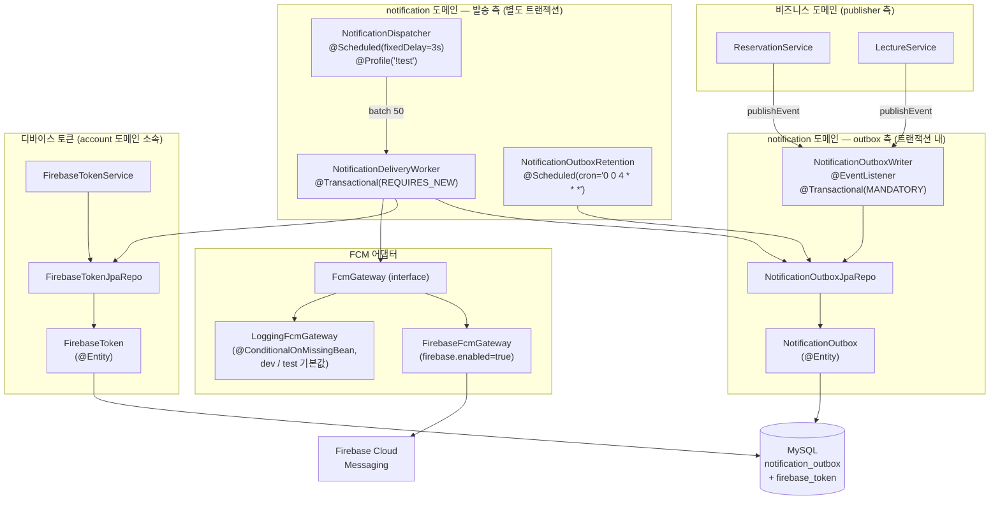
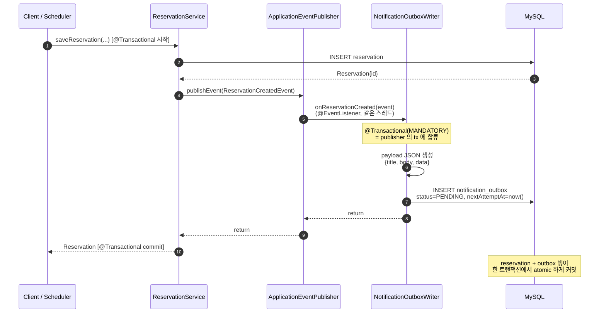
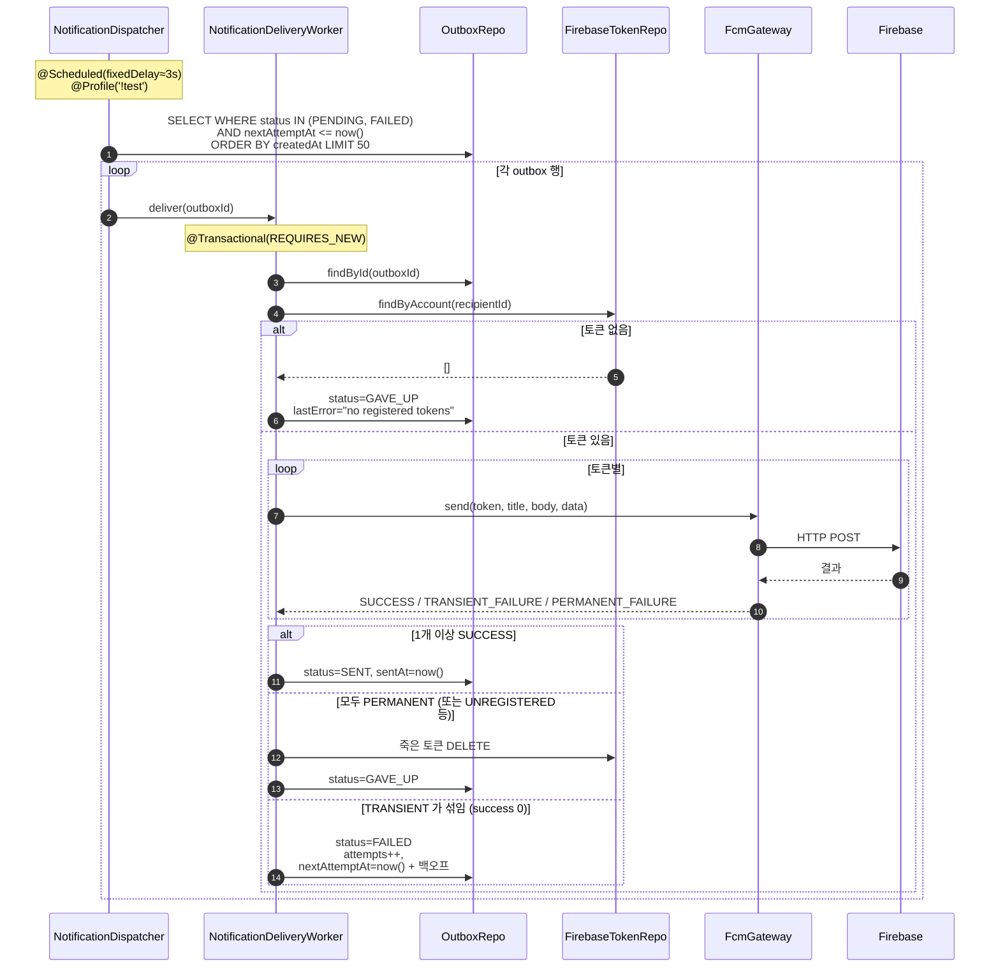
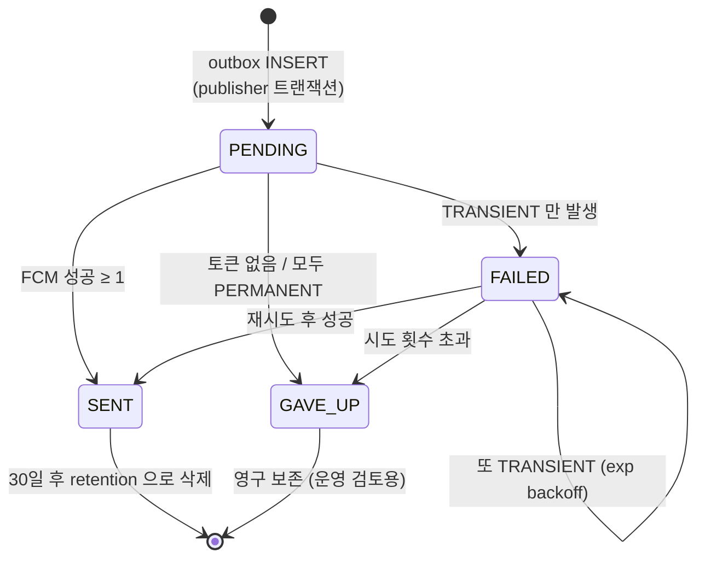
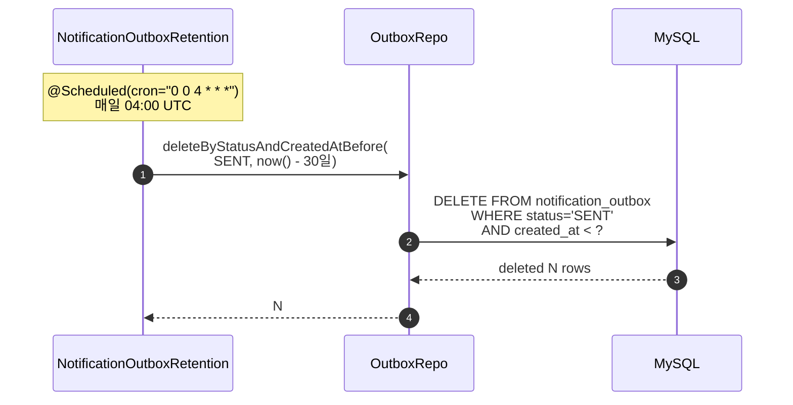
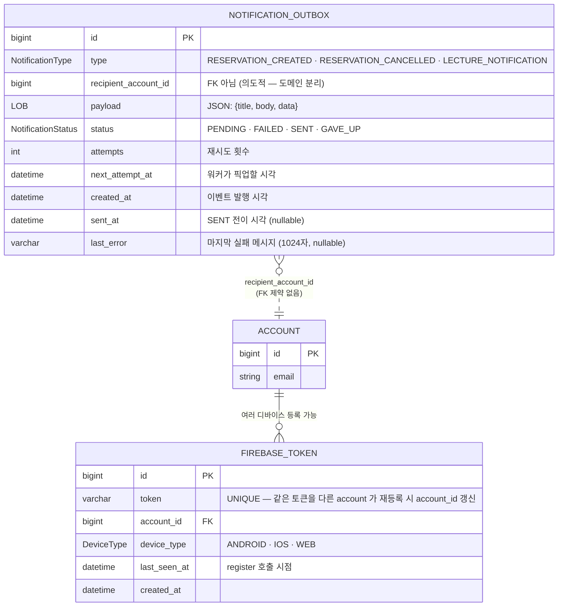

# 알림 (notification)

> **도메인 문서(구현/어떻게)** — outbox→worker→FCM 파이프라인의 *메커니즘*을 소유한다. 푸시의 **정책·계약(FE SoT)·왜·결정 히스토리는 [features/push.md](../features/push.md)** 가 소유 (여기엔 복붙하지 않음). 디바이스 토큰 엔티티(`FirebaseToken`)는 [account](../../src/main/java/com/diving/pungdong/account/CLAUDE.md) 소유.

## 한 줄 요약

비즈니스 트랜잭션에서 **Spring Application Event** 를 쏘면, 같은 트랜잭션 안에서 **outbox 행** 이 PENDING 으로 기록되고, 별도 워커가 **기본 3초마다**(`notification.dispatcher.fixed-delay-ms`, env 튜닝) PENDING / FAILED 를 픽업해 **FCM** 으로 발송한다. Kafka 는 Phase 2-C 에서 완전 제거됨.

이벤트 발행과 발송이 트랜잭션 분리되어 있어서, 비즈니스 롤백 시 알림이 함께 롤백된다 (= "유령 알림" 방지). 발송 자체는 실패해도 재시도 가능.

---

## 컴포넌트 지도



**이 도메인이 다른 도메인과 분리되어 있는 방식**:

- **Publisher (예약/강의 등) 는 알림 인프라를 모른다.** `ApplicationEventPublisher.publishEvent(ReservationCreatedEvent)` 한 줄만 부른다. outbox 가 무엇인지, FCM 이 있는지조차 모름.
- **Outbox 측은 같은 트랜잭션에 들러붙는다.** `@Transactional(propagation = MANDATORY)` — 자기 혼자서는 트랜잭션 못 열고 반드시 publisher 의 트랜잭션 안에서만 동작. 따라서 publisher 가 롤백되면 outbox 행도 같이 사라짐.
- **Worker 측은 완전히 분리.** 별도 스레드 / 별도 트랜잭션 (REQUIRES_NEW). 발송 실패가 publisher 트랜잭션에 영향 0.

---

## 흐름 1: 이벤트 발행 → outbox PENDING 기록 (같은 트랜잭션)



**핵심 invariant**: `reservation` INSERT 가 롤백되면 `notification_outbox` INSERT 도 자동 롤백 → 예약 안 들어갔는데 알림만 가는 시나리오 발생 불가.

---

## 흐름 2: 워커 발송 (기본 3초마다, 별도 트랜잭션)



**상태 전이 다이어그램**:



**재시도 백오프** (`NotificationDeliveryWorker` 내부): 30s → 1m → 2m → 4m → ... 최대 1h 캡. 시도 횟수 한도 초과 시 GAVE_UP.

---

## 흐름 3: Retention (Phase 2-D)



**보존 정책**:

| 상태 | 보존 |
|---|---|
| SENT | 30 일 (configurable: `notification.outbox.sent-retention-days`) |
| FAILED | **영구** — 운영자가 직접 점검할 신호 |
| GAVE_UP | **영구** — 토큰 정리 / 사용자 비활성 분석용 |
| PENDING | 삭제 안 함 (워커가 결국 SENT 또는 GAVE_UP 로 옮김) |

---

## 데이터 모델



**의도된 설계**:

- **`recipient_account_id` 는 FK 제약 없음** — 알림 도메인이 account 도메인에 강결합되면 마이그레이션 / 도메인 분리가 어려워짐. 무결성은 앱 레벨에서.
- **`status` + `nextAttemptAt` 복합 인덱스** — 워커가 매 10초 돌리는 쿼리의 핵심. `idx_outbox_status_next_attempt`.
- **`payload` 는 `@Lob` JSON 문자열** — 이벤트 타입이 늘어도 컬럼 안 늘어남 (스키마 유연성). 단점: JSON 안의 필드로 인덱싱 불가 → 인덱싱 필요한 필드는 별도 컬럼화 검토 (현재 없음).
- **FCM 토큰 UNIQUE 제약** — 같은 디바이스 토큰이 여러 account 에 묶이지 않음. 사용자가 로그아웃 후 다른 계정으로 로그인하면 토큰의 `account_id` 만 갱신되고 행은 1개 유지 (upsert).

---

## 이벤트 타입 매트릭스

| 이벤트 | 발행 위치 | 수신자 | 데이터 페이로드 | OutboxType |
|---|---|---|---|---|
| `ReservationCreatedEvent` | `ReservationService.saveReservation` | 강사 (instructorAccountId) | studentNickname, lectureTitle, scheduleId | `RESERVATION_CREATED` |
| `ReservationCancelledEvent` | 예약 취소 흐름 | 강사 | 동일 | `RESERVATION_CANCELLED` |
| `LectureNotificationEvent` | 강사가 강의 팔로워에게 직접 알림 | 팔로워 목록 (1:N) | lectureId, title, body | `LECTURE_NOTIFICATION` |

**payload 예시** (JSON 으로 outbox 에 저장됨):

```json
{
  "title": "새 예약이 들어왔어요",
  "body": "김철수님이 '프리다이빙 입문' 강의를 예약했습니다",
  "data": {
    "notificationId": "<uuid>",
    "type": "RESERVATION_CREATED",
    "lectureId": "123",
    "scheduleId": "456"
  }
}
```

`data` 맵은 FCM 의 data 페이로드로 전달되어 클라이언트가 탭 시 deep-link 판단(`type`)에 쓴다. `notificationId`(UUID, `enqueue` 에서 주입)는 at-least-once 전송의 **중복 dedup 키** — 같은 outbox 행은 재시도해도 동일 id. 정책은 [features/push.md](../features/push.md).

---

## FCM Gateway — dev / prod 분기

| 환경 | 빈 | 동작 |
|---|---|---|
| 운영 (`firebase.enabled=true`) | `FirebaseFcmGateway` | 실제 FCM 호출. 자격증명은 `FirebaseConfig` 가 선택(↓). 기조 = **WIF 키리스(JSON 키 금지)**, GCP 프로젝트 `plop-5997b`. *왜* 는 [features/push.md §자격증명](../features/push.md). |
| 로컬 / 테스트 | `LoggingFcmGateway` | 실제 FCM 빈 없으면 활성화. 로그만 찍고 SUCCESS 반환. |

**자격증명 선택** (`global/config/FirebaseConfig`, 우선순위):

1. **WIF** (`firebase.wif.audience` 설정 시) — AWS ECS task role → GCP SA 가장(impersonate), **키 파일 0**. prod/staging 기조.
   - ⚠️ **Fargate 는 코드 한 조각 필요**: google-auth 1.23.0 내장 AWS 공급기는 env/EC2 IMDS 만 읽어 Fargate task role 자격(컨테이너 엔드포인트 `AWS_CONTAINER_CREDENTIALS_*`)을 못 가져온다 → AWS SDK `DefaultAWSCredentialsProviderChain`(컨테이너 엔드포인트+자동회전) 기반 `AwsSecurityCredentialsSupplier` shim 을 끼운다. ("코드 변경 0"은 EC2 가정이었음.)
   - ⚠️ **`GOOGLE_CLOUD_PROJECT` env 필수**: WIF(external_account) 자격엔 project id 가 없어 FCM 엔드포인트(`/v1/projects/<id>/messages:send`)를 못 만든다. service account JSON 엔 들어있어 그 경로에선 불필요.
2. **service account JSON** (`firebase.credentials.path`) — 파일 키. 로컬/임시.
3. **ADC** — 그 외.

**예외 분류** (`FirebaseFcmGateway`):

- `PERMANENT_FAILURE` ← `UNREGISTERED` (앱 삭제 / 토큰 만료), `INVALID_ARGUMENT`, `SENDER_ID_MISMATCH`, `THIRD_PARTY_AUTH_ERROR` → **토큰 DB 에서 삭제**
- `TRANSIENT_FAILURE` ← `INTERNAL`, `UNAVAILABLE`, `QUOTA_EXCEEDED` → 토큰 보존, 재시도 스케줄

---

## 보안 / 권한 매트릭스

| 엔드포인트 | 인증 | 권한 | 비고 |
|---|---|---|---|
| `POST /me/devices` | 인증 필요 | any | 디바이스 토큰 등록(`{token, platform?}`). `DeviceController` → `FirebaseTokenService.register` upsert. 신분=`@CurrentUser`. |
| `DELETE /me/devices/{token}` | 인증 필요 | any | 토큰 해제(로그아웃/탈퇴). `FirebaseTokenService.unregister`. |

알림 도메인 자체는 외부에 노출된 발송 트리거 엔드포인트가 **없다** — 모든 알림은 비즈니스 흐름의 부수효과로 자동 발생.

`LectureNotificationEvent` 만 강사 UI 에서 직접 발행 (강의 관리 화면 → 강의 도메인 컨트롤러 경유 → 이벤트 발행). 이 트리거 엔드포인트는 **강의 도메인 문서**(예정) 에서 다룬다.

---

## 확장 자리 (예정 / 검토 중)

| 항목 | 예상 시점 | 비고 |
|---|---|---|
| 운영용 admin 엔드포인트 — `GET /admin/notifications/failed`, `POST /admin/notifications/{id}/retry` | 출시 후 | 현재는 SQL 직접 보고 수동 처리 가정 |
| 사용자 알림 설정 — 강의별 mute, 채널 opt-out | 출시 후 | `notification_preference` 테이블 신설 |
| 이벤트 타입 추가 — `ReviewCreatedEvent`, `ScheduleReminderEvent`, `PaymentConfirmedEvent` | 해당 도메인 작업 시 | 같은 패턴 재사용 |
| Email 채널 — 동일 outbox 에 `channel=EMAIL` 컬럼 추가, AWS SES 게이트웨이 | 출시 후 | 운영 결정 = SES (memory: `operations_decisions.md`) |
| 인앱 알림함 (durable feed) — 푸시 유실 대비 서버 권위 레코드 | 출시 후 | [#132](https://github.com/pungdong/Pungdong-Backend/issues/132), [features/push.md](../features/push.md) |

---

## 더 깊게: use-case 테스트로 보기

문서는 stale 될 수 있지만 테스트는 항상 현재 동작이다. 알림 도메인 동작의 **단일 출처**:

- [`src/test/java/com/diving/pungdong/usecase/NotificationOutboxFlowTest.java`](../../src/test/java/com/diving/pungdong/usecase/NotificationOutboxFlowTest.java) — 7 시나리오:
  - `ReservationCreatedEvent 발행 시 outbox에 instructor 수신 PENDING 행이 생성됨 (payload는 title/body 구조)` — **흐름 1 검증**
  - `발송 워커: 토큰 등록된 수신자, FCM 성공 → SENT` — **흐름 2 success path**
  - `발송 워커: 수신자에게 등록된 토큰이 없으면 즉시 GAVE_UP` — **GAVE_UP 분기**
  - `발송 워커: FCM 영구 실패(UNREGISTERED 등) → 토큰 삭제 + GAVE_UP` — **PERMANENT_FAILURE**
  - `발송 워커: FCM 일시 실패 → 토큰 보존 + FAILED + next_attempt_at 미래로 스케줄` — **TRANSIENT_FAILURE 재시도**
  - `Retention: deleteByStatusAndCreatedAtBefore는 오래된 SENT만 지우고 FAILED/GAVE_UP 및 최근 SENT는 보존` — **흐름 3**
  - `FirebaseToken upsert: 같은 token을 다른 account로 등록하면 account_id가 갱신됨 (행 추가 X)` — **토큰 upsert invariant**

`@DisplayName` 만 위에서 아래로 읽어도 알림 사양이 그대로 된다.
