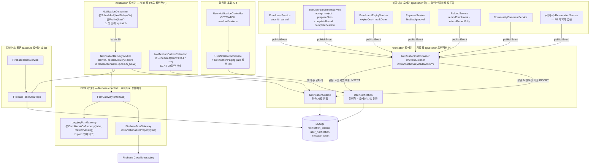
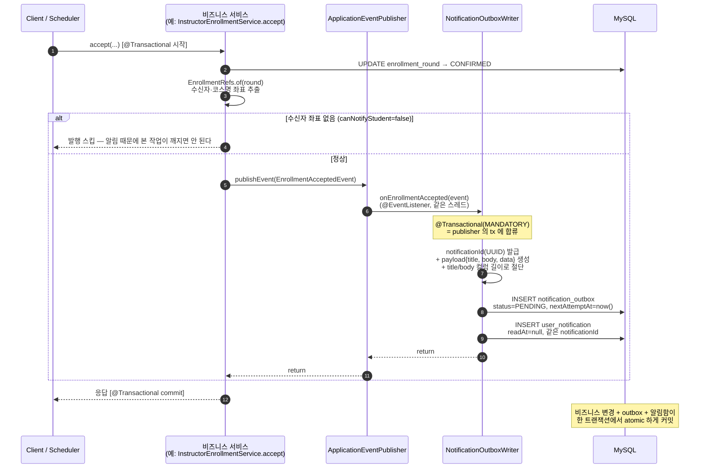
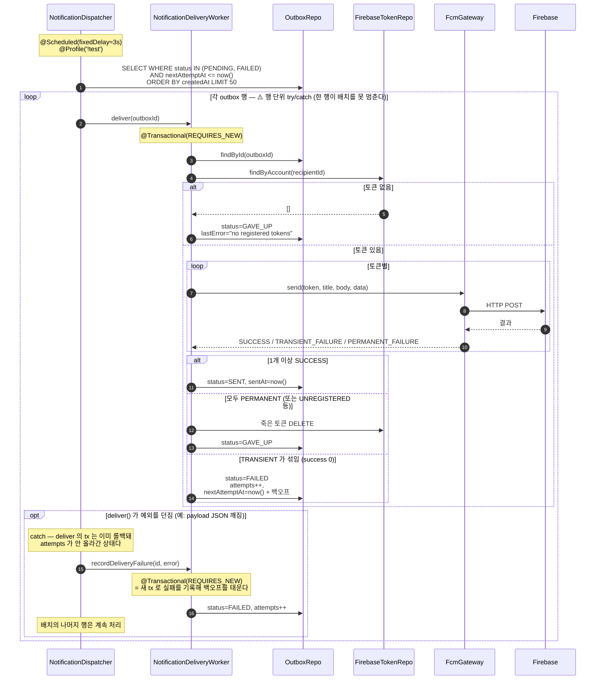
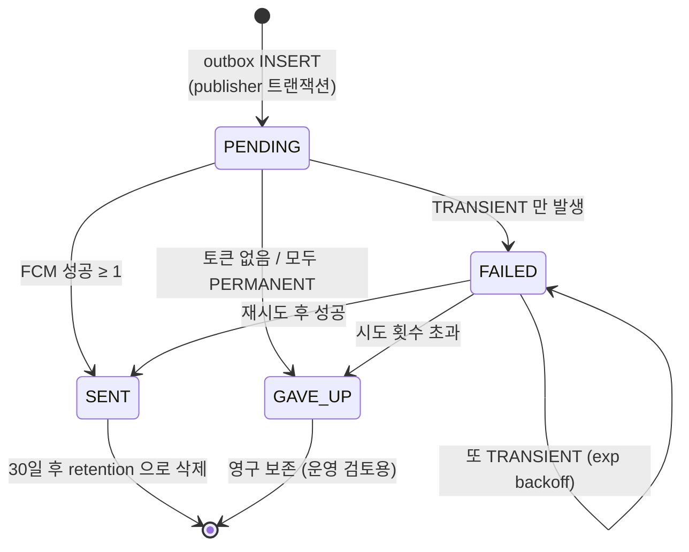
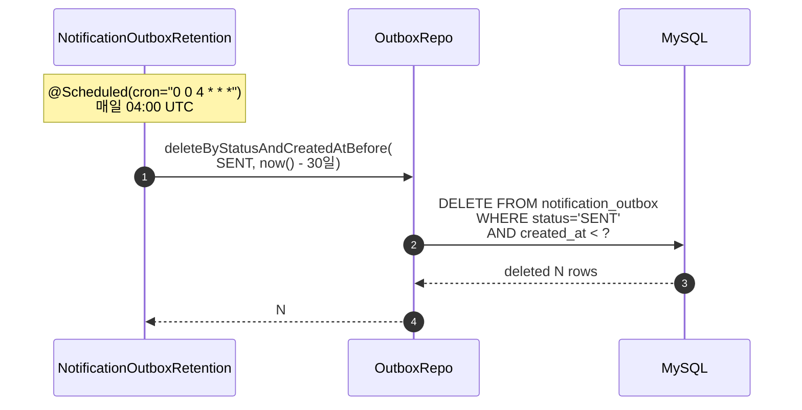
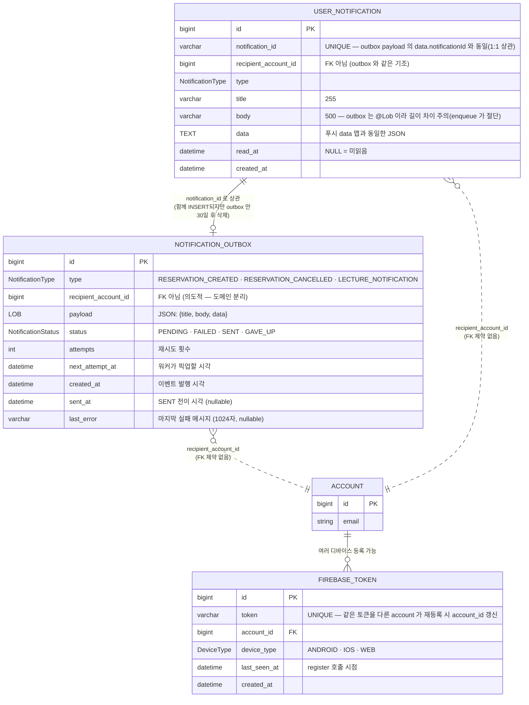

# 알림 (notification)

> **도메인 문서(구현/어떻게)** — outbox→worker→FCM 파이프라인의 *메커니즘*을 소유한다. 푸시의 **정책·계약(FE SoT)·왜·결정 히스토리는 [features/push.md](../features/push.md)** 가 소유 (여기엔 복붙하지 않음). 디바이스 토큰 엔티티(`FirebaseToken`)는 [account](../../src/main/java/com/diving/pungdong/account/CLAUDE.md) 소유.

## 한 줄 요약

비즈니스 트랜잭션에서 **Spring Application Event** 를 쏘면, 같은 트랜잭션 안에서 **outbox 행** 이 PENDING 으로 기록되고, 별도 워커가 **기본 3초마다**(`notification.dispatcher.fixed-delay-ms`, env 튜닝) PENDING / FAILED 를 픽업해 **FCM** 으로 발송한다. Kafka 는 Phase 2-C 에서 완전 제거됨.

이벤트 발행과 발송이 트랜잭션 분리되어 있어서, 비즈니스 롤백 시 알림이 함께 롤백된다 (= "유령 알림" 방지). 발송 자체는 실패해도 재시도 가능.

---

## 컴포넌트 지도


```mermaid
flowchart TB
    subgraph Biz["비즈니스 도메인 (publisher 측) — 알림 인프라를 모른다"]
        EnrollSvc["EnrollmentService<br/>submit · cancel"]
        InstEnrollSvc["InstructorEnrollmentService<br/>accept · reject · proposeSlots<br/>completeRound · completeSession"]
        ExpirySvc["EnrollmentExpiryService<br/>expireOne · markDone"]
        PaySvc["PaymentService<br/>finalizeApproval"]
        RefundSvc["RefundService<br/>refundEnrollment · refundRoundFully"]
        CommunitySvc["CommunityCommentService"]
        LegacySvc["(레거시) ReservationService<br/>— FE 계약에 없음"]
    end

    subgraph Inbox["notification 도메인 — 기록 측 (publisher 트랜잭션 안)"]
        Writer["NotificationOutboxWriter<br/>@EventListener<br/>@Transactional(MANDATORY)"]
        OutboxEntity["NotificationOutbox<br/>전송 시도 원장"]
        UserNotifEntity["UserNotification<br/>알림함 = 도메인 사실 원장"]
    end

    subgraph Api["알림함 조회 API"]
        NotifCtrl["UserNotificationController<br/>GET/PATCH /me/notifications"]
        NotifSvc["UserNotificationService<br/>+ NotificationPaging(size 상한 50)"]
    end

    subgraph Worker["notification 도메인 — 발송 측 (별도 트랜잭션)"]
        Dispatcher["NotificationDispatcher<br/>@Scheduled(fixedDelay≈3s) @Profile('!test')<br/>⚠️ 행 단위 try/catch"]
        DeliveryWorker["NotificationDeliveryWorker<br/>deliver / recordDeliveryFailure<br/>@Transactional(REQUIRES_NEW)"]
        Retention["NotificationOutboxRetention<br/>@Scheduled(cron='0 0 4 * * *')<br/>SENT 30일만 삭제"]
    end

    subgraph Token["디바이스 토큰 (account 도메인 소속)"]
        TokenSvc["FirebaseTokenService"]
        TokenRepo["FirebaseTokenJpaRepo"]
    end

    subgraph Fcm["FCM 어댑터 — firebase.enabled 프로퍼티로 상호배타"]
        Gateway["FcmGateway (interface)"]
        Real["FirebaseFcmGateway<br/>@ConditionalOnProperty(true)"]
        Stub["LoggingFcmGateway<br/>@ConditionalOnProperty(false, matchIfMissing)<br/>🔴 prod 현재 이쪽"]
    end

    DB[("MySQL<br/>notification_outbox · user_notification<br/>· firebase_token")]
    FCMext["Firebase Cloud Messaging"]

    EnrollSvc & InstEnrollSvc & ExpirySvc & PaySvc & RefundSvc & CommunitySvc & LegacySvc -->|publishEvent| Writer
    Writer -->|같은 트랜잭션 이중 INSERT| OutboxEntity
    Writer -->|같은 트랜잭션 이중 INSERT| UserNotifEntity
    OutboxEntity --> DB
    UserNotifEntity --> DB

    NotifCtrl --> NotifSvc
    NotifSvc -->|읽기·읽음처리| UserNotifEntity

    Dispatcher -->|batch 50| DeliveryWorker
    DeliveryWorker --> OutboxEntity
    DeliveryWorker --> TokenRepo
    DeliveryWorker --> Gateway
    Retention --> OutboxEntity

    Gateway --> Real
    Gateway --> Stub
    Real --> FCMext

    TokenSvc --> TokenRepo
    TokenRepo --> DB
```

**이 도메인이 다른 도메인과 분리되어 있는 방식**:

- **Publisher 는 알림 인프라를 모른다.** `ApplicationEventPublisher.publishEvent(...)` 한 줄만 부른다. outbox 가 무엇인지, FCM 이 있는지조차 모름.
- **기록 측은 같은 트랜잭션에 들러붙는다.** `@Transactional(propagation = MANDATORY)` — 자기 혼자서는 트랜잭션 못 열고 반드시 publisher 의 트랜잭션 안에서만 동작. 따라서 **publisher 가 롤백되면 outbox 행과 알림함 행이 함께 사라진다**(유령 알림 방지).
  - ⚠️ 뒤집으면 **알림 쓰기가 실패하면 비즈니스 작업도 롤백**된다는 뜻이다. 그래서 `enqueue` 는 title/body 를 컬럼 길이로 자르고, 발행 지점은 수신자 좌표를 못 만들면(`EnrollmentRefs.canNotifyStudent()` false) **발행을 건너뛴다** — 알림 때문에 수강신청·결제가 깨지면 안 된다.
- **Worker 측은 완전히 분리.** 별도 스레드 / 별도 트랜잭션(`REQUIRES_NEW`). 발송 실패가 publisher 트랜잭션에 영향 0.
- **알림함 조회는 발송과 무관.** 푸시가 실패해도(`GAVE_UP`) 알림함 행은 그대로 남아 API 로 보인다 — 이게 별도 테이블인 이유다(§데이터 모델).

---

## 흐름 1: 이벤트 발행 → outbox + 알림함 이중 INSERT (같은 트랜잭션)


```mermaid
sequenceDiagram
    autonumber
    participant Caller as Client / Scheduler
    participant Biz as 비즈니스 서비스<br/>(예: InstructorEnrollmentService.accept)
    participant Pub as ApplicationEventPublisher
    participant Writer as NotificationOutboxWriter
    participant DB as MySQL

    Caller->>Biz: accept(...) [@Transactional 시작]

    Biz->>DB: UPDATE enrollment_round → CONFIRMED
    Biz->>Biz: EnrollmentRefs.of(round)<br/>수신자·코스명 좌표 추출
    alt 수신자 좌표 없음 (canNotifyStudent=false)
        Biz-->>Caller: 발행 스킵 — 알림 때문에 본 작업이 깨지면 안 된다
    else 정상
        Biz->>Pub: publishEvent(EnrollmentAcceptedEvent)
        Pub->>Writer: onEnrollmentAccepted(event)<br/>(@EventListener, 같은 스레드)
        Note over Writer: @Transactional(MANDATORY)<br/>= publisher 의 tx 에 합류
        Writer->>Writer: notificationId(UUID) 발급<br/>+ payload{title, body, data} 생성<br/>+ title/body 컬럼 길이로 절단
        Writer->>DB: INSERT notification_outbox<br/>status=PENDING, nextAttemptAt=now()
        Writer->>DB: INSERT user_notification<br/>readAt=null, 같은 notificationId
        Writer-->>Pub: return
        Pub-->>Biz: return
    end
    Biz-->>Caller: 응답 [@Transactional commit]
    Note over DB: 비즈니스 변경 + outbox + 알림함이<br/>한 트랜잭션에서 atomic 하게 커밋
```

**핵심 invariant**: 비즈니스 변경이 롤백되면 outbox 행과 알림함 행도 자동 롤백 → **일어나지도 않은 일을 알리는 시나리오가 발생 불가**.

**`enqueue` 한 곳이 두 테이블을 쓴다** — 타입별 분기가 없으므로 **앞으로 추가되는 모든 알림 타입이 자동으로 알림함에 적재된다.** 두 행은 `notificationId`(UUID)로 1:1 상관되고, 그 값이 곧 푸시 `data.notificationId`(앱 dedup 키)라 "푸시 한 통 ↔ 알림함 한 줄"이 추적된다.

⚠️ **이 결합의 대가**: 알림 쓰기가 실패하면 **비즈니스 작업도 롤백**된다. 그래서 (a) title/body 를 `varchar(255)/(500)` 로 자르고 — outbox payload 는 `@Lob` 이라 길이 제한이 없어 긴 `LECTURE_NOTIFICATION` 본문이 `Data too long` 을 내면 수강신청이 알림 때문에 실패한다 — (b) 수신자 좌표를 못 만들면 발행 자체를 건너뛴다.

**반대로 이 결합이 바람직한 자리도 있다**: 거절(#3)은 환불 이벤트가 동기라 **환불이 실패하면 거절도 롤백**되고 알림도 함께 사라진다. "거절됐고 환불됩니다"를 보내놓고 거절이 취소되는 모순이 구조적으로 불가능하다.

---

## 흐름 2: 워커 발송 (기본 3초마다, 별도 트랜잭션)


```mermaid
sequenceDiagram
    autonumber
    participant Dis as NotificationDispatcher
    participant Worker as NotificationDeliveryWorker
    participant OutRepo as OutboxRepo
    participant TokRepo as FirebaseTokenRepo
    participant Gw as FcmGateway
    participant FCM as Firebase

    Note over Dis: @Scheduled(fixedDelay≈3s)<br/>@Profile('!test')
    Dis->>OutRepo: SELECT WHERE status IN (PENDING, FAILED)<br/>AND nextAttemptAt <= now()<br/>ORDER BY createdAt LIMIT 50

    loop 각 outbox 행 — ⚠️ 행 단위 try/catch (한 행이 배치를 못 멈춘다)
        Dis->>Worker: deliver(outboxId)
        Note over Worker: @Transactional(REQUIRES_NEW)

        Worker->>OutRepo: findById(outboxId)
        Worker->>TokRepo: findByAccount(recipientId)

        alt 토큰 없음
            TokRepo-->>Worker: []
            Worker->>OutRepo: status=GAVE_UP<br/>lastError="no registered tokens"
        else 토큰 있음
            loop 토큰별
                Worker->>Gw: send(token, title, body, data)
                Gw->>FCM: HTTP POST
                FCM-->>Gw: 결과
                Gw-->>Worker: SUCCESS / TRANSIENT_FAILURE / PERMANENT_FAILURE
            end

            alt 1개 이상 SUCCESS
                Worker->>OutRepo: status=SENT, sentAt=now()
            else 모두 PERMANENT (또는 UNREGISTERED 등)
                Worker->>TokRepo: 죽은 토큰 DELETE
                Worker->>OutRepo: status=GAVE_UP
            else TRANSIENT 가 섞임 (success 0)
                Worker->>OutRepo: status=FAILED<br/>attempts++,<br/>nextAttemptAt=now() + 백오프
            end
        end

        opt deliver() 가 예외를 던짐 (예: payload JSON 깨짐)
            Note over Dis: catch — deliver 의 tx 는 이미 롤백돼<br/>attempts 가 안 올라간 상태다
            Dis->>Worker: recordDeliveryFailure(id, error)
            Note over Worker: @Transactional(REQUIRES_NEW)<br/>= 새 tx 로 실패를 기록해 백오프를 태운다
            Worker->>OutRepo: status=FAILED, attempts++
            Note over Dis: 배치의 나머지 행은 계속 처리
        end
    end
```

**상태 전이 다이어그램**:


```mermaid
stateDiagram-v2
    [*] --> PENDING: outbox INSERT<br/>(publisher 트랜잭션)
    PENDING --> SENT: FCM 성공 ≥ 1
    PENDING --> FAILED: TRANSIENT 만 발생
    PENDING --> GAVE_UP: 토큰 없음 / 모두 PERMANENT
    FAILED --> SENT: 재시도 후 성공
    FAILED --> FAILED: 또 TRANSIENT (exp backoff)
    FAILED --> GAVE_UP: 시도 횟수 초과
    SENT --> [*]: 30일 후 retention 으로 삭제
    GAVE_UP --> [*]: 영구 보존 (운영 검토용)
```

**재시도 백오프** (`NotificationDeliveryWorker` 내부): 30s → 1m → 2m → 4m → ... 최대 1h 캡. 시도 횟수 한도 초과 시 GAVE_UP.

**poison-pill 방어** (`NotificationDispatcher.dispatch`): 루프가 **행 단위 try/catch** 로 감싸여 있고, `deliver()` 가 예외를 던지면 `deliveryWorker.recordDeliveryFailure(id, error)` 를 **별도 트랜잭션(REQUIRES_NEW)** 으로 호출해 실패를 기록한다.

> **없으면 어떻게 되나**: `deliver()` 는 `REQUIRES_NEW` 라 예외 시 자기 트랜잭션이 롤백돼 상태·`attempts` 가 그대로 남는다. 픽업이 `ORDER BY createdAt ASC` 라 **다음 틱에도 같은 행이 선두로 재선택**되고, `attempts` 가 안 올라 `MAX_ATTEMPTS` → `GAVE_UP` 구제도 영영 발동하지 않는다. 즉 **깨진 행 하나가 알림 큐 전체를 영구 정지**시킨다(뒤 행은 전부 미발송). 예외 경로는 실재한다 — payload JSON 이 깨지면 `deserialize` 가 `IllegalStateException` 을 던진다. `firebase.enabled=false` 인 동안은 stub 이 예외를 안 던져 잠복해 있다가, **실전송 전환 순간 발현**한다. 회귀 테스트 = `NotificationOutboxFlowTest` 의 `P1`·`P2`.

---

## 흐름 3: Retention (Phase 2-D)


```mermaid
sequenceDiagram
    autonumber
    participant Sched as NotificationOutboxRetention
    participant Repo as OutboxRepo
    participant DB as MySQL

    Note over Sched: @Scheduled(cron="0 0 4 * * *")<br/>매일 04:00 UTC
    Sched->>Repo: deleteByStatusAndCreatedAtBefore(<br/>  SENT, now() - 30일)
    Repo->>DB: DELETE FROM notification_outbox<br/>WHERE status='SENT'<br/>AND created_at < ?
    DB-->>Repo: deleted N rows
    Repo-->>Sched: N
```

**보존 정책**:

| 상태 | 보존 |
|---|---|
| SENT | 30 일 (configurable: `notification.outbox.sent-retention-days`) |
| FAILED | **영구** — 운영자가 직접 점검할 신호 |
| GAVE_UP | **영구** — 토큰 정리 / 사용자 비활성 분석용 |
| PENDING | 삭제 안 함 (워커가 결국 SENT 또는 GAVE_UP 로 옮김) |

---

## 데이터 모델


```mermaid
erDiagram
    NOTIFICATION_OUTBOX {
        bigint id PK
        NotificationType type "RESERVATION_CREATED · RESERVATION_CANCELLED · LECTURE_NOTIFICATION"
        bigint recipient_account_id "FK 아님 (의도적 — 도메인 분리)"
        LOB payload "JSON: {title, body, data}"
        NotificationStatus status "PENDING · FAILED · SENT · GAVE_UP"
        int attempts "재시도 횟수"
        datetime next_attempt_at "워커가 픽업할 시각"
        datetime created_at "이벤트 발행 시각"
        datetime sent_at "SENT 전이 시각 (nullable)"
        varchar last_error "마지막 실패 메시지 (1024자, nullable)"
    }
    FIREBASE_TOKEN {
        bigint id PK
        varchar token "UNIQUE — 같은 토큰을 다른 account 가 재등록 시 account_id 갱신"
        bigint account_id FK
        DeviceType device_type "ANDROID · IOS · WEB"
        datetime last_seen_at "register 호출 시점"
        datetime created_at
    }
    ACCOUNT {
        bigint id PK
        string email
    }

    USER_NOTIFICATION {
        bigint id PK
        varchar notification_id "UNIQUE — outbox payload 의 data.notificationId 와 동일(1:1 상관)"
        bigint recipient_account_id "FK 아님 (outbox 와 같은 기조)"
        NotificationType type
        varchar title "255"
        varchar body "500 — outbox 는 @Lob 이라 길이 차이 주의(enqueue 가 절단)"
        TEXT data "푸시 data 맵과 동일한 JSON"
        datetime read_at "NULL = 미읽음"
        datetime created_at
    }

    ACCOUNT ||--o{ FIREBASE_TOKEN : "여러 디바이스 등록 가능"
    NOTIFICATION_OUTBOX }o..|| ACCOUNT : "recipient_account_id<br/>(FK 제약 없음)"
    USER_NOTIFICATION }o..|| ACCOUNT : "recipient_account_id<br/>(FK 제약 없음)"
    USER_NOTIFICATION ||--o| NOTIFICATION_OUTBOX : "notification_id 로 상관<br/>(함께 INSERT되지만 outbox 만 30일 후 삭제)"
```

**`user_notification` = 인앱 알림함 (도메인 사실 원장).** outbox 와 **목적이 다르다**:

| | `notification_outbox` | `user_notification` |
|---|---|---|
| 답하는 질문 | "단말에 밀어넣기 성공했나" (전송 시도 원장) | "이 유저에게 무슨 일이 있었나" (사실 원장) |
| 보존 | SENT 30일 후 삭제 | **삭제 안 함** |
| 토큰 없는 수신자 | `GAVE_UP` (실패로 기록) | 정상 행 (그대로 보임) |
| 인덱스 | `(status, next_attempt_at)` — 워커용 | `(recipient, created_at)` · `(recipient, read_at)` — 조회용 |

**왜 겸용하지 않았나**: outbox 는 디바이스 토큰이 없으면 `GAVE_UP` 이 되는데, **웹 사용자·앱 미설치 사용자가 정확히 그 경우**다. 그들이야말로 알림함이 가장 필요한 대상이라, 겸용하면 durability 라는 도입 목적 자체가 무너진다. 두 행은 `NotificationOutboxWriter.enqueue` 가 **같은 트랜잭션**에서 함께 쓰므로 비즈니스 롤백 시 둘 다 사라진다(유령 알림 방지).

⚠️ **보존기간이 달라서 관계가 1:1 이 아니다** — 함께 만들어지지만 retention 이 **outbox 의 SENT 만** 30일 뒤 지운다. 그래서 오래된 알림함 행은 **짝 outbox 행이 없다**(ER 의 `||--o|`). `notification_id` 로 조인할 때 outbox 쪽이 없을 수 있다는 뜻이다.

**정렬 안정성** — `created_at` 은 `DATETIME(6)`, 조회는 `createdAt DESC, id DESC`. 초 단위로 자르거나 타이브레이커가 없으면 **같은 트랜잭션에서 만들어진 알림들의 순서가 불확정**이 되어 페이지 경계에서 행이 중복되거나 사라진다(무한스크롤이 조용히 항목을 잃는다).

**의도된 설계**:

- **`recipient_account_id` 는 FK 제약 없음** — 알림 도메인이 account 도메인에 강결합되면 마이그레이션 / 도메인 분리가 어려워짐. 무결성은 앱 레벨에서.
- **`status` + `nextAttemptAt` 복합 인덱스** — 디스패처가 **기본 3초마다**(`notification.dispatcher.fixed-delay-ms`, env 튜닝) 돌리는 픽업 쿼리의 핵심. `idx_outbox_status_next_attempt`.
- **`payload` 는 `@Lob` JSON 문자열** — 이벤트 타입이 늘어도 컬럼 안 늘어남 (스키마 유연성). 단점: JSON 안의 필드로 인덱싱 불가 → 인덱싱 필요한 필드는 별도 컬럼화 검토 (현재 없음).
- **FCM 토큰 UNIQUE 제약** — 같은 디바이스 토큰이 여러 account 에 묶이지 않음. 사용자가 로그아웃 후 다른 계정으로 로그인하면 토큰의 `account_id` 만 갱신되고 행은 1개 유지 (upsert).

---

## 상황별 알림 카탈로그 (구현 확정본)

> **이 표가 "어떤 상황에 어떤 알림이 나가는가"의 단일 출처다.** 문구·수신자·`data` 키는 `NotificationOutboxWriter` 실코드 기준. 트리거는 **클래스.메서드**로 적는다(라인번호는 금방 rot 한다).
> 타입 이름은 `NotificationOutbox.type` 이 `varchar(32)` 라 **32자를 넘을 수 없다**(회귀 테스트 `NotificationEventCatalogTest.N11`).

### 수강(enrollment) — 채널 `reservation`

| # | Type | 트리거 | 수신자 | title / body |
|---|---|---|---|---|
| 1 | `ENROLLMENT_SUBMITTED` | `EnrollmentService.submit` | **강사** | 새 수강신청 / `{학생닉}님이 {코스명}을 신청했어요` |
| 2 | `ENROLLMENT_ACCEPTED` | `InstructorEnrollmentService.accept` | 학생 | 수강 확정 / `{강사닉}님이 {코스명} 신청을 수락했어요` |
| 3 | `ENROLLMENT_REJECTED` | `InstructorEnrollmentService.reject` | 학생 | 수강 거절 / `{강사닉}님이 {코스명} 신청을 거절했어요. 결제하신 금액은 전액 환불됩니다` |
| 4 | `ENROLLMENT_SLOTS_PROPOSED` | `InstructorEnrollmentService.proposeSlots` | 학생 | 일정 제안 도착 / `{강사닉}님이 가능한 일정을 제안했어요. 확인하고 선택해 주세요` |
| 5 | `ENROLLMENT_EXPIRED` | `EnrollmentExpiryService.expireOne` | 학생 | 신청 만료 / **2갈래**(↓) |
| 6 | `ROUND_COMPLETED` | `InstructorEnrollmentService.completeRound`·`completeSession` **+** `EnrollmentExpiryService.markDone` | 학생 | 수강 완료 / `{코스명} 수업이 완료되었어요. 어떠셨는지 후기를 남겨주세요` |

`data` = `{notificationId, type, courseId, enrollmentId, roundId}`. **`lectureId`/`scheduleId` 는 안 쓴다**(레거시 좌표).

**#5 만료의 2갈래** — `expireOne` 의 `wasPaid` 가 가른다:
- `false`(미결제 12h 만료, 환불 없음) → `결제 기한이 지나 {코스명} 신청이 취소되었어요`
- `true`(결제완료 무응답 24h 만료 + 전액 자동환불) → `{강사닉}님이 24시간 내에 응답하지 않아 {코스명} 신청이 취소되고 전액 환불되었어요`

### 결제(payment) — 채널 `payment`

| # | Type | 트리거 | 수신자 | title / body |
|---|---|---|---|---|
| 7 | `PAYMENT_COMPLETED` | `PaymentService.finalizeApproval` | 학생 | 결제 완료 / `{코스명} {금액}원 결제가 완료되었어요` |
| 8 | `REFUND_COMPLETED` | `RefundService.refundEnrollment` **+** `refundRoundFully(studentInitiated=true)` | 학생 | 환불 완료 / `{코스명} {금액}원이 환불되었어요` |

`data` = 위 5키 + `orderId`. 금액은 `%,d`(천단위 구분).

> `payment` 채널은 **앱에 이미 만들어져 있으나 아무도 쓰지 않던 빈 채널**이었다 — 신설이 아니라 첫 사용이라 앱 릴리스 종속이 없다. 새 채널을 만들면 그 알림이 앱 배포에 묶이므로 **기존 5채널(reservation/payment/chat/notice/marketing) 밖으로 나가지 말 것.**

### 커뮤니티 — 채널 `notice`

| # | Type | 트리거 | 수신자 | title / body |
|---|---|---|---|---|
| 9 | `COMMUNITY_COMMENT` | `CommunityCommentService` | 글/댓글 작성자 | 새 댓글·새 답글 / `{작성자닉}님이 {글}에 댓글을 남겼어요` |

`data` = `{notificationId, type, postId, commentId}`. 제목 없는 글(브랜딩 유입)이면 `회원님의 글` 로 대체. **좋아요 알림은 만들지 않는다**(빈도가 높아 소음).

### 레거시 — 사문화, 신규 사용 금지

| # | Type | 트리거 | 상태 |
|---|---|---|---|
| 10 | `RESERVATION_CREATED` | `ReservationService.saveReservation` | 발행처가 `/reservation` 레거시 도메인. **FE 계약(`types.ts`)에 없어 호출 경로가 없다** |
| 11 | `RESERVATION_CANCELLED` | 예약 취소 흐름 | 동일 |
| 12 | `LECTURE_NOTIFICATION` | 강사→강의 수강생 운영 메시지 | 동일 |

**enum 에서 지우지 않는다** — 과거 outbox/알림함 행이 `varchar` 로 그 이름을 들고 있어 역직렬화가 깨진다. 신규 코드에서 안 쓸 뿐이다.

### 발행 조건 · 멱등 근거 (읽지 않으면 중복/누락을 만든다)

| 항목 | 규칙 |
|---|---|
| **환불 알림은 학생이 직접 요청한 환불에만** | 거절(#3)·만료(#5) body 가 **이미 환불을 안내**하므로 자동환불 경로에서 또 쏘면 같은 사건에 2건이 간다(2026-08-14 사용자 결정). 그래서 `refundRoundPartially`(차액 자동환불)와 **거절·만료발 `refundRoundFully` 에는 걸지 않는다** — `studentInitiated` 플래그로 가른다(사유 문자열로 분기하지 않는다. 문구가 바뀌면 조용히 깨진다). |
| **환불 금액은 실반환액** | `applyCancel` 이 잔액으로 clamp 하고, **결과 미확인 시도가 있으면 0 을 돌려주고 건너뛴다.** 계획액을 쓰면 "N원이 환불되었어요" 가 거짓이 될 수 있고 그 문구는 알림함에 영구 보존된다. **0원이면 발행하지 않는다.** |
| **`ROUND_COMPLETED` 는 경로가 3개** | 강사 수동 단건·세션 일괄 + 자동 sweep. 셋 다 **`doneAt == null` 일 때만** 발행해 멱등. |
| **`PAYMENT_COMPLETED` 는 세 겹으로 한 번** | (1) 순차 재호출 = `applyConfirm` 초입 "이미 DONE" 가드 (2) 동시 재전송 = `PaymentOrder.@Version` 이 blind overwrite 를 막아 진 쪽 롤백 (3) 확정 롤백 후 재확정(`findApproved`) = 직전 발행이 그 트랜잭션과 함께 롤백돼 있음. **확정이 롤백되면 승인 원장은 남아도 알림은 안 나간다** — 확정 안 된 걸 "결제 완료"로 알리면 거짓이라 이게 맞다. |
| **`data` 의 null id 는 키째 생략** | 앱이 `Number("null")` → `NaN` 을 만들지 않게(`putIfPresent`). 회귀 테스트 `N10`. |

### 미구현 — 2순위 강사 알림 5종 (백로그)

**아래는 의도적으로 안 만들었다. 없는 게 버그가 아니다.**

`ROUND_REQUESTED`(2회차+ 신청) · `SLOT_CHANGE_APPLIED`(차액 결제 후 변경) · `ENROLLMENT_SLOT_PICKED`(학생이 제안 선택) · `ENROLLMENT_CANCELLED`(학생 취소→강사) · `ENROLLMENT_RESCHEDULED`(학생 일정변경 요청)

사용자 결정으로 1순위 8종만 구현(2026-08-14). **단 재고 근거를 남긴다**: 이 중 강사 수신분은 **강사가 모르면 24h 무응답 TTL 에 걸려 자동취소 + 전액 자동환불**로 끝난다. "강사가 앱을 자주 본다"는 가정이 틀리면 **알림 부재의 비용이 돈과 예약 실패로 실현**된다. 1순위 8종은 강사가 이미 아는 건(자기가 한 행동)이거나 학생 수신이라 이 성격이 아니다.

**payload 예시** (JSON 으로 outbox 에 저장됨):

```json
{
  "title": "새 예약이 들어왔어요",
  "body": "김철수님이 '프리다이빙 입문' 강의를 예약했습니다",
  "data": {
    "notificationId": "<uuid>",
    "type": "RESERVATION_CREATED",
    "lectureId": "123",
    "scheduleId": "456"
  }
}
```

`data` 맵은 FCM 의 data 페이로드로 전달되어 클라이언트가 탭 시 deep-link 판단(`type`)에 쓴다. `notificationId`(UUID, `enqueue` 에서 주입)는 at-least-once 전송의 **중복 dedup 키** — 같은 outbox 행은 재시도해도 동일 id. 정책은 [features/push.md](../features/push.md).

---

## FCM Gateway — dev / prod 분기

**두 게이트웨이는 `firebase.enabled` 프로퍼티의 반대값으로 상호배타 잠금**이다 — `@ConditionalOnMissingBean` 이 아니다(그건 컴포넌트 스캔 순서가 비보장이라 prod 부팅을 깨뜨린 적이 있다, #97. [패키지 CLAUDE.md](../../src/main/java/com/diving/pungdong/notification/CLAUDE.md) 참고).

| 조건 | 빈 | 동작 |
|---|---|---|
| `firebase.enabled=true` | `FirebaseFcmGateway` | 실제 FCM 호출. 자격증명은 `FirebaseConfig` 가 선택(↓). 기조 = **WIF 키리스(JSON 키 금지)**, GCP 프로젝트 `plop-5997b`. *왜* 는 [features/push.md §자격증명](../features/push.md). |
| `firebase.enabled=false` **또는 미설정**(`matchIfMissing=true`) | `LoggingFcmGateway` | 로그만 찍고 **`SUCCESS` 반환**. |

### 🔴 현재 prod 는 stub 이다 (2026-08-14 기준)

`infra/envs/production/main.tf` 가 `FIREBASE_ENABLED = "false"` 라 **prod 는 `LoggingFcmGateway`** 다. staging 만 `true` + WIF 3종 + `GOOGLE_CLOUD_PROJECT` 를 갖고 있다.

**이 조합이 만드는 함정**: stub 이 `SUCCESS` 를 반환하므로 워커가 outbox 를 **`SENT` 로 마킹**한다. 즉 **DB 상으로는 100% 정상 발송으로 보이는데 단말엔 아무것도 안 간다** — 에러도, `GAVE_UP` 도, 실패 카운터도 안 남는 **무증상 실패**다. "prod 에서 푸시가 안 온다"는 지금 **정상 동작**이고, 실발송 검증은 staging 에서만 된다.

`application.yml` 에 `firebase:` 블록이 아예 없어서 유일한 공급원은 컨테이너 env `FIREBASE_ENABLED` 다. 로컬·CI 도 미설정이라 전부 stub.

**prod 전환 시 4개를 한 번에** 넣어야 한다(`FIREBASE_ENABLED` 만 켜면 자격증명이 없어 깨진다) — 목록·절차는 [features/push.md](../features/push.md).

**자격증명 선택** (`global/config/FirebaseConfig`, 우선순위):

1. **WIF** (`firebase.wif.audience` 설정 시) — AWS ECS task role → GCP SA 가장(impersonate), **키 파일 0**. prod/staging 기조.
   - ⚠️ **Fargate 는 코드 한 조각 필요**: google-auth 1.23.0 내장 AWS 공급기는 env/EC2 IMDS 만 읽어 Fargate task role 자격(컨테이너 엔드포인트 `AWS_CONTAINER_CREDENTIALS_*`)을 못 가져온다 → AWS SDK `DefaultAWSCredentialsProviderChain`(컨테이너 엔드포인트+자동회전) 기반 `AwsSecurityCredentialsSupplier` shim 을 끼운다. ("코드 변경 0"은 EC2 가정이었음.)
   - ⚠️ **`GOOGLE_CLOUD_PROJECT` env 필수**: WIF(external_account) 자격엔 project id 가 없어 FCM 엔드포인트(`/v1/projects/<id>/messages:send`)를 못 만든다. service account JSON 엔 들어있어 그 경로에선 불필요.
2. **service account JSON** (`firebase.credentials.path`) — 파일 키. 로컬/임시.
3. **ADC** — 그 외.

**발송 메시지 구성 (카테고리 → 채널/priority/interruption-level)**: 알림은 `NotificationType.getCategory()`(`NotificationCategory`)를 가지며, 워커가 그 카테고리를 게이트웨이에 넘긴다. `FirebaseFcmGateway` 가 실음 — **Android** `AndroidConfig`: `channelId`(앱이 만든 채널로 라우팅) + `priority`(거래성=HIGH 절전회피·즉시, 공지/마케팅=NORMAL). 채널 importance/소리/유저토글은 앱 소유. **iOS** `ApnsConfig.aps`: `interruption-level`(마케팅=passive/거래=time-sensitive/공지=active) + alert(title/body 동봉, self-contained). `time-sensitive` 실효는 네이티브 Time-Sensitive 엔타이틀먼트 필요(없으면 active 강등); iOS 비활성 동안 휴면. 채널표·정책은 [features/push.md §채널/카테고리](../features/push.md).

**마케팅 야간제한**: `MARKETING` 카테고리는 enqueue 시(및 재시도 스케줄 시) `MarketingSendWindow.clamp` 로 `nextAttemptAt` 을 **08~21 KST** 안으로 맞춤(야간이면 다음 08:00). 디스패처가 `nextAttemptAt<=now` 만 픽업하므로 별도 배치 없이 "시간 되면 순차 발송"이 됨. 근거=정보통신망법 §50, 정책은 features/push.md.

**예외 분류** (`FirebaseFcmGateway`):

- `PERMANENT_FAILURE` ← `UNREGISTERED` (앱 삭제 / 토큰 만료), `INVALID_ARGUMENT`, `SENDER_ID_MISMATCH`, `THIRD_PARTY_AUTH_ERROR` → **토큰 DB 에서 삭제**
- `TRANSIENT_FAILURE` ← `INTERNAL`, `UNAVAILABLE`, `QUOTA_EXCEEDED` → 토큰 보존, 재시도 스케줄

---

## 보안 / 권한 매트릭스

| 엔드포인트 | 인증 | 권한 | 비고 |
|---|---|---|---|
| `POST /me/devices` | 인증 필요 | any | 디바이스 토큰 등록(`{token, platform?}`). `DeviceController` → `FirebaseTokenService.register` upsert. 신분=`@CurrentUser`. |
| `DELETE /me/devices/{token}` | 인증 필요 | any | 토큰 해제(로그아웃/탈퇴). `FirebaseTokenService.unregister`. |
| `GET /me/notifications` | 인증 필요 | any | 인앱 알림함 목록. HAL `PagedModel`(`_embedded.notifications`), `?page=`0-based·`?size=`기본20/상한50, 정렬 서버고정(`createdAt DESC`), `?unreadOnly=`(기본 false, 서버 필터). |
| `GET /me/notifications/unread-count` | 인증 필요 | any | 미읽음 개수(뱃지). `{count}`. 0 건도 200. |
| `PATCH /me/notifications/{id}/read` | 인증 필요 | **본인 것만** | 단건 읽음. 멱등(`readAt` 최초값 유지). 남의 알림이면 **400 + 존재 숨김**(`ResourceNotFoundException`). |
| `PATCH /me/notifications/read-all` | 인증 필요 | any | 전체 읽음(벌크 UPDATE, 미읽음만). |

**시큐리티 매처는 추가하지 않는다** — `SecurityConfiguration` 의 `anyRequest().authenticated()` 가 `/me/**` 를 이미 덮는다(`/me/devices` 와 동일 방식).

알림 도메인 자체는 외부에 노출된 **발송 트리거** 엔드포인트가 **없다** — 모든 알림은 비즈니스 흐름의 부수효과로 자동 발생. 위 알림함 API 는 전부 **읽기/읽음처리**다.

`LectureNotificationEvent` 만 강사 UI 에서 직접 발행 (강의 관리 화면 → 강의 도메인 컨트롤러 경유 → 이벤트 발행). 이 트리거 엔드포인트는 **강의 도메인 문서**(예정) 에서 다룬다.

---

## 확장 자리 (예정 / 검토 중)

| 항목 | 예상 시점 | 비고 |
|---|---|---|
| 운영용 admin 엔드포인트 — `GET /admin/notifications/failed`, `POST /admin/notifications/{id}/retry` | 출시 후 | 현재는 SQL 직접 보고 수동 처리 가정 |
| 사용자 알림 설정 — 강의별 mute, 채널 opt-out | 출시 후 | `notification_preference` 테이블 신설 |
| 이벤트 타입 추가 — `ReviewCreatedEvent`, `ScheduleReminderEvent` | 해당 도메인 작업 시 | 같은 패턴 재사용 |
| Email 채널 — 동일 outbox 에 `channel=EMAIL` 컬럼 추가, AWS SES 게이트웨이 | 출시 후 | 운영 결정 = SES (memory: `operations_decisions.md`) |
| **2순위 강사 알림 5종** | 사용자 재검토 | §카탈로그 "미구현" 참고 — 24h TTL 자동환불 논거 있음 |
| 결제 마감임박 알림(미결제 12h TTL 사전 경고) | 미정 | 기존 훅이 없어 **전용 스윕이 필요**. 만료(#5)는 사후 통보라 예방 가치가 다름 |
| 다중 인스턴스 중복 발송 방지 | 스케일아웃 시 | 픽업 쿼리에 `FOR UPDATE SKIP LOCKED` 없음. 현재는 at-least-once + `data.notificationId` dedup 으로 유저 체감 중복 0 |
| 레거시 `/reservation` 도메인 제거 | 기획 redesign 시 | 알림 타입 3종(#10~12)이 여기 묶여 있다 |
| ~~인앱 알림함 (durable feed)~~ | **✅ 완료** | [#132](https://github.com/pungdong/Pungdong-Backend/issues/132) — `user_notification` + `/me/notifications` ([PR #250](https://github.com/pungdong/Pungdong-Backend/pull/250)) |
| ~~디스패처 poison-pill~~ | **✅ 완료** | 행 단위 try/catch + `recordDeliveryFailure` (흐름 2 참고) |

---

## 더 깊게: use-case 테스트로 보기

문서는 stale 될 수 있지만 테스트는 항상 현재 동작이다. 알림 도메인 동작의 **단일 출처**:

- [`src/test/java/com/diving/pungdong/usecase/NotificationOutboxFlowTest.java`](../../src/test/java/com/diving/pungdong/usecase/NotificationOutboxFlowTest.java) — 7 시나리오:
  - `ReservationCreatedEvent 발행 시 outbox에 instructor 수신 PENDING 행이 생성됨 (payload는 title/body 구조)` — **흐름 1 검증**
  - `발송 워커: 토큰 등록된 수신자, FCM 성공 → SENT` — **흐름 2 success path**
  - `발송 워커: 수신자에게 등록된 토큰이 없으면 즉시 GAVE_UP` — **GAVE_UP 분기**
  - `발송 워커: FCM 영구 실패(UNREGISTERED 등) → 토큰 삭제 + GAVE_UP` — **PERMANENT_FAILURE**
  - `발송 워커: FCM 일시 실패 → 토큰 보존 + FAILED + next_attempt_at 미래로 스케줄` — **TRANSIENT_FAILURE 재시도**
  - `Retention: deleteByStatusAndCreatedAtBefore는 오래된 SENT만 지우고 FAILED/GAVE_UP 및 최근 SENT는 보존` — **흐름 3**
  - `FirebaseToken upsert: 같은 token을 다른 account로 등록하면 account_id가 갱신됨 (행 추가 X)` — **토큰 upsert invariant**
  - `P1 발송 중 예외가 나도 그 행만 실패 처리되고 배치의 나머지 행은 계속 발송된다` — **poison-pill 방지**
  - `P2 발송 예외가 반복되면 attempts가 쌓여 결국 GAVE_UP 으로 떨어진다` — **큐 영구 정지 방지**

- [`NotificationCenterUseCaseTest`](../../src/test/java/com/diving/pungdong/usecase/NotificationCenterUseCaseTest.java) — 알림함 HTTP 사양(`S*` 성공 / `R*` 권한 / `V*` 검증 / `X*` 트랜잭션). 특히:
  - `S2` 는 응답 JSON 의 **`$._embedded.notifications` 경로를 직접 단언**한다 — `@Relation` 이 빠지면 Spring HATEOAS 가 타입명 기반 키를 써서 FE 언랩이 **에러 없이 빈 배열**을 받는데, DTO 만 보는 테스트는 이 회귀를 못 잡는다.
  - `X1` = **`MANDATORY` 전파 회귀 테스트**(비즈니스 롤백 시 알림함 행도 사라짐), `X2` = **"푸시 실패해도 알림함엔 남는다"**(토큰 없어 `GAVE_UP` 이어도 조회됨).

- [`NotificationEventCatalogTest`](../../src/test/java/com/diving/pungdong/usecase/NotificationEventCatalogTest.java) — **§카탈로그 표를 잠그는 테스트**. 타입/수신자/채널/문구/`data` 키를 이벤트별로 단언한다. `data` 키가 조용히 바뀌면 앱 라우팅이 no-op 이 되는데(모르는 type → `default`) 아무도 못 알아채기 때문. `N10`=null id 키 생략, `N11`=enum 이름 32자 이내 전수.

- [`RefundUseCaseTest.RF4`](../../src/test/java/com/diving/pungdong/usecase/RefundUseCaseTest.java) — 학생 회차 취소 → **실제 반환액이 문구에 들어가는지**까지 단언(계획액을 쓰면 거짓이 되는 자리).

`@DisplayName` 만 위에서 아래로 읽어도 알림 사양이 그대로 된다.

> ⚠️ **테스트가 구조적으로 못 잡는 것**: 마이그레이션은 CI 가 **아예 실행하지 않는다**(H2 + Flyway OFF, 스키마를 엔티티에서 만든다). `V23` 을 쓸 때 `CHAR(36)` 으로 적었다가 **엔티티(`String`+`length=36`)와 어긋나 `hbm2ddl=validate` 가 부팅을 거부**한 적이 있다 — 테스트는 전부 통과했고 Flyway 실행도 정상이었다. 스키마를 건드리면 **빈 docker MySQL 에 부팅해 Flyway 실행 + validate 통과를 눈으로 확인**할 것.
