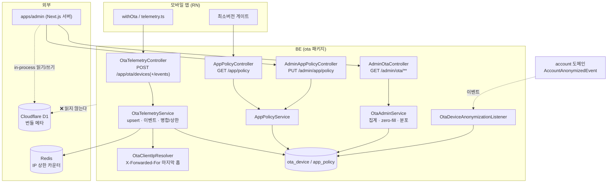
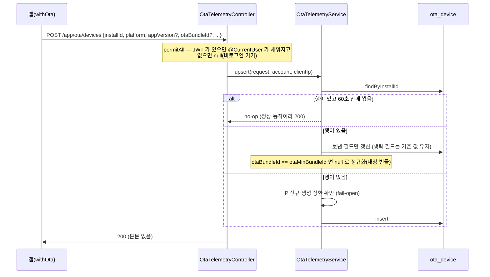
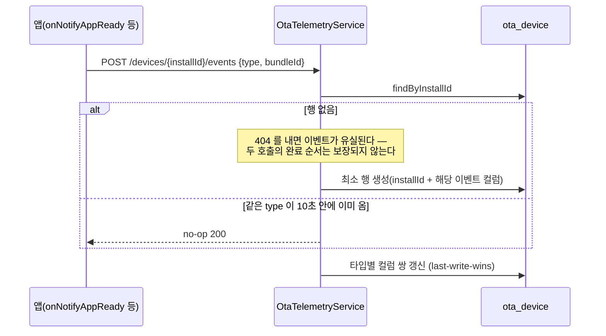
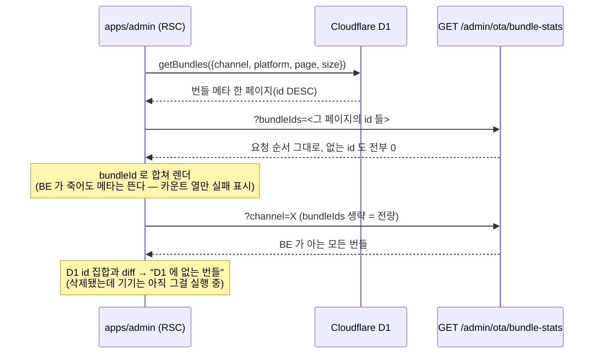
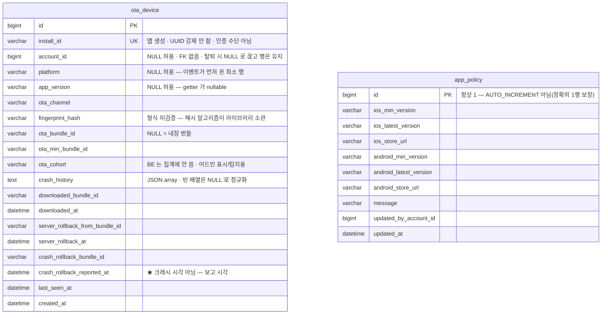

# OTA 텔레메트리 · 릴리스 대시보드 (ota 도메인)

> **정책·왜·히스토리는 [docs/features/ota-telemetry.md](../features/ota-telemetry.md)** — 이 문서는 *어떻게*(구성요소·흐름·모델·권한).
> 앱 쪽 아키텍처(번들·채널·지문·롤백 메커니즘)는 PungDong 레포 `docs/features/ota.md`.

## 1. 한 줄 요약

앱이 부팅마다 "나는 어느 번들·어느 앱버전·어느 지문으로 돌고 있다" 를 보고하고(`ota_device`), 어드민이 그걸
**번들별 카운트**로 집계해 릴리스 대시보드를 그린다. 여기에 스토어 업데이트를 강제하는 **최소버전 정책**
(`app_policy`)이 함께 산다.

**핵심 invariant 3개**

1. **BE 는 Cloudflare D1 을 읽지 않는다.** 번들 메타(메시지·커밋·enabled·rollout·force·배포시각)의 유일한
   출처는 D1 이고, 어드민(Next.js 서버)이 in-process 로 읽어 `bundleId` 키로 합친다. 라이브러리 D1 스키마가
   8개월에 두 번 바뀐 이력이 있어, 컬럼명을 Java 에 새기면 업그레이드가 곧 사일런트 데이터 손상이 된다.
2. **수집은 관용적, 제어는 엄격.** 텔레메트리는 앱이 4xx 를 조용히 삼키므로 거절 = "그 기기가 영구히 집계 밖"
   이다. 그래서 `installId`·`platform` 외에는 전부 선택이고 형식 검증도 최소다. 반대로 `PUT /admin/app/policy`
   는 사람이 폼에 넣고 에러가 화면에 보이므로 semver 를 엄격히 본다.
3. **카운트와 목록은 같은 술어를 쓴다.** `OtaBundleStats` 의 각 필드는 `GET .../devices?state=` 의 동명
   필터와 1:1 이다 — 어드민이 숫자를 눌렀는데 다른 수가 나오면 안 된다(`OtaAdminUseCaseTest` A7 이 잠근다).

## 2. 컴포넌트 지도

## 3. 흐름

### 3-1. 부팅 보고 (인증 선택)

### 3-2. 이벤트 — 부팅 보고보다 먼저 도착해도 살린다

### 3-3. 어드민 조인 — 목록의 주체는 D1

## 4. 데이터 모델

**의도된 설계**

- **`account_id` 에 FK 를 걸지 않는다** — 알림 outbox 와 같은 기조. 집계 도메인이 account 에 강결합되면
  account 쪽 변경이 대시보드를 흔든다.
- **`firebase_token` 을 확장하지 않았다** — 그 테이블은 "푸시 토큰"의 수명을 산다(로그아웃 시 삭제·탈퇴 시
  하드삭제·푸시 거부 기기는 행 없음). 하필 **잘못된 번들에 갇힌 사용자는 앱이 이상해서 로그아웃했을 가능성이
  높아, 가장 보고 싶은 집단이 우선적으로 지워진다.**
- **이벤트 원장 테이블이 없다** — 타입별 "마지막 상태"만 컬럼 쌍으로 남긴다. 타임라인이 필요해지면 그때
  `ota_device_event` 를 추가한다.
- **`app_policy` 에 시드 행을 넣지 않는다** — 행이 없을 때의 폴백(`minVersion "0.0.0"`)이 곧 안전 기본값인데,
  시드를 넣으면 "행이 없는 경로"가 프로덕션에서 한 번도 안 돌아 테스트만 통과한 죽은 코드가 된다.

## 5. 보안 / 권한 매트릭스

| 엔드포인트 | 인증 | 역할 | 비고 |
|---|---|---|---|
| `POST /app/ota/devices` | **permitAll** (선택 인증) | any | JWT 를 실으면 계정 링크. 신분은 세션에서만 — 바디로 accountId 를 받지 않는다 |
| `POST /app/ota/devices/{installId}/events` | **permitAll** (선택 인증) | any | ant `*` 가 `/` 를 안 넘어 매처를 따로 등록 |
| `GET /app/policy` | **permitAll** | any | 🚨 **어떤 경우에도 401 금지** — 앱이 토큰을 동봉해 부르므로 401 이 나오면 부팅 중 강제 로그아웃 |
| `GET /admin/ota/bundle-stats` | 필요 | **ADMIN** | 평문 JSON. `bundleIds` 최대 100 |
| `GET /admin/ota/bundles/{id}/devices` | 필요 | **ADMIN** | HAL `PagedModel`, rel `otaDevices` |
| `GET /admin/ota/devices` | 필요 | **ADMIN** | `userId` **또는** `installId` 정확히 하나 |
| `GET /admin/ota/summary` | 필요 | **ADMIN** | |
| `PUT /admin/app/policy` | 필요 | **ADMIN** | 전체 치환 |

- 🔒 **`installId` 는 암호학적 난수가 아니다**(RN 엔 WebCrypto 가 없다) — **인증 수단이 아니며, 이 값을 키로 하는
  비인증 *읽기* 경로를 만들면 안 된다.** 현재 비인증 경로는 쓰기 전용이고, 읽는 경로는
  `GET /admin/ota/devices?installId=` 하나뿐이며 ADMIN 뒤에 있다.
- ⚠️ `GET /admin/ota/devices?userId=` 는 레포 규칙("`userId` 파라미터는 red flag")의 **정당한 예외**다 —
  여기서 `userId` 는 요청자의 신분이 아니라 **조회 대상**이고, 요청자 신분은 매처가 검증한다.
- **PII 미노출**: 응답에 담기는 사용자 정보는 `nickName`(공개 표시 핸들)뿐. 이메일·전화번호는 없다.

## 6. 알려진 설계 간극

- 🟡 **IP 상한이 "신뢰 프록시 정확히 하나"를 전제한다.** `OtaClientIpResolver` 는 `X-Forwarded-For` 의
  **마지막 홉**(ALB 가 덧붙인 실 클라이언트 IP)을 쓴다. CloudFront 같은 홉이 앞에 추가되면 전제가 깨진다.
  → 해결안: 홉이 늘면 신뢰 프록시 수를 설정값으로 빼고 뒤에서 N번째를 고른다.
- 🟡 **`crashRolledBack` 은 사실상 단조 증가**라 "지금 나아지고 있나"를 못 본다(윈도우를 안 탄다).
  → 해결안: 필요해지면 `crash_rollback_reported_at` 에 윈도우를 건 변형 카운트를 추가(현재는 백로그).
- 🟢 **집계가 매 요청 GROUP BY** 다. 결과 집합은 구분되는 번들 수라 작지만, 기기 수가 커지면 스캔이 는다.
  → 해결안: 번들별 카운트 스냅샷 테이블 + 주기 갱신(현재 규모에선 불필요).
- 🟢 **`bundle-stats` 전량 모드에 상한이 없다.** `installed` 가 현재 상태라 행이 자연 소멸하므로 무한 증가하지
  않지만, 상한이 없다는 사실 자체는 기록해 둔다.

## 7. 더 깊게: 테스트로 보기

| 테스트 | 무엇을 잠그나 |
|---|---|
| `usecase/OtaTelemetryUseCaseTest` | 부팅 upsert(S1~S6) · 이벤트 3종과 레이스 허용(E1~E3) · 관용적 검증(V1~V7) |
| `usecase/OtaAdminUseCaseTest` | 권한(R1·R2) · zero-fill 과 요청 순서(A1) · 전량 모드(A3) · **카운트↔목록 일치(A7)** |
| `usecase/OtaTelemetryRateLimitUseCaseTest` | IP 상한(L1) + **기존 기기는 막지 않음**(L2) |
| `usecase/AppPolicyUseCaseTest` | 미설정 폴백(P1) · 비인증 조회(P2) · **만료 토큰에도 200**(P3) · 엄격 semver(P4) |

> ⚠️ 테스트는 H2 + Flyway OFF 라 **마이그레이션을 실행하지 않는다.** `V29` 의 첫 실제 Flyway 실행이
> staging/prod 가 되지 않도록, 빈 docker MySQL 에 부팅해 확인하는 것이 배포 전 필수 절차다.
