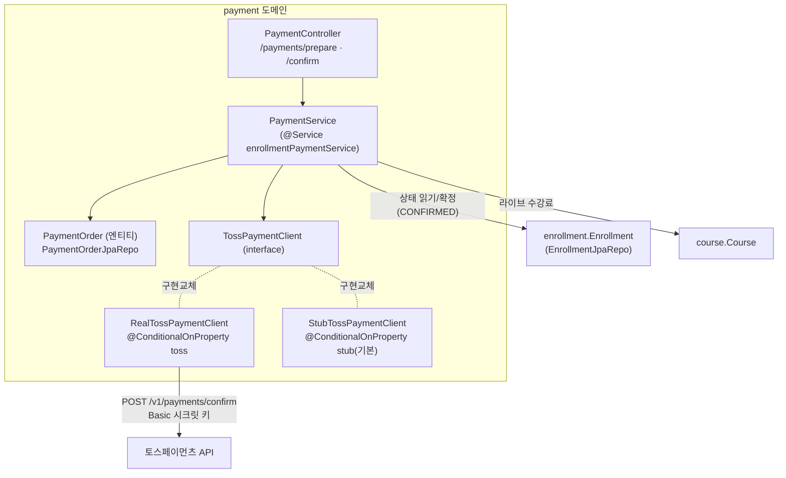
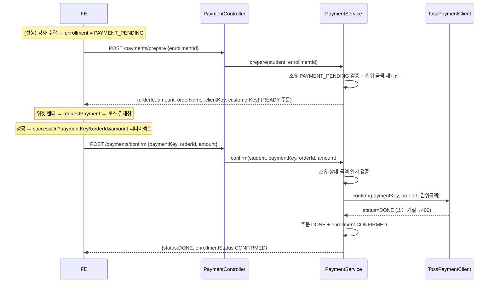
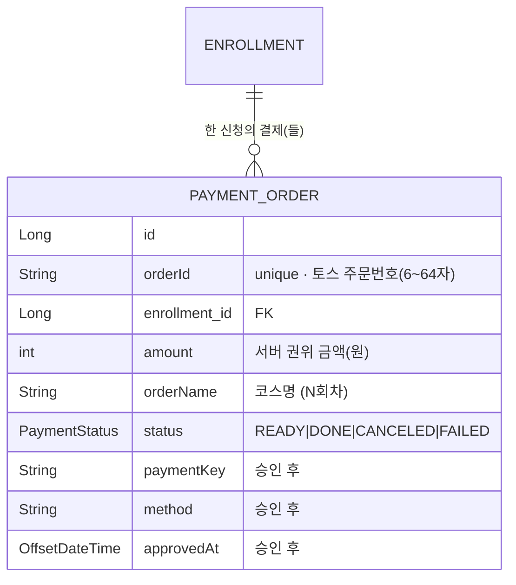

# 결제 (payment) 도메인

## 1. 한 줄 요약

수락된 수강신청(`enrollment` = `PAYMENT_PENDING`)의 **결제**를 책임지는 도메인. 토스페이먼츠 **결제위젯 v2** 흐름의 BE — FE 위젯이 결제하고, **승인은 서버가** 시크릿 키로 호출한다. 핵심 invariant 두 개: **(1) 금액은 서버 권위값** — 클라이언트가 보낸 amount 를 신뢰하지 않고 주문에 박힌 금액과 대조(불일치 시 거절, 토스도 같은 금액으로 승인), **(2) 결제 완료 = 확정** — 승인 성공만이 enrollment 를 `CONFIRMED` 로 넘긴다. 시크릿 키는 BE 밖으로 안 나간다(juso 승인키 기조).

> 레거시 `domain/payment/Payment`(옛 예약 플로우의 가격 산술 전용, PG 필드 없음)와 무관 — 새 `payment/` feature 패키지가 enrollment 옆에서 결제를 1급으로 소유.

## 2. 컴포넌트 지도

단방향: payment → enrollment / course (읽기 + enrollment 확정). enrollment/course 는 payment 를 모른다.

## 3. 핵심 흐름

분기: amount 불일치 → 400(토스 미호출). 이미 DONE 주문 confirm 재호출 → 200 DONE(멱등). PAYMENT_PENDING 아닌 신청 prepare → 400. 비소유 → 400(존재 숨김, repo 컨벤션).

## 4. 데이터 모델

설계 의도: `orderId` 가 unique + 멱등 키(confirm 의 Idempotency-Key, amount 조회 키). `amount` 는 prepare 시점에 **코스 라이브 수강료 + 입장료 스냅샷 + 장비 스냅샷** 으로 재계산해 박는다(신청 스냅샷은 "추정치"라 권위 금액은 결제 시점 재계산 — enrollment 설계 그대로). 한 enrollment 에 READY 주문은 하나만 멱등 재사용.

## 5. 보안 / 권한 매트릭스

| 엔드포인트 | 인증 | 소유권 검증 | 비고 |
|---|---|---|---|
| `POST /payments/prepare` | authenticated | enrollment.student == 나 + 상태 PAYMENT_PENDING | 비소유/없음 = 400, 결제대기 아님 = 400 |
| `POST /payments/confirm` | authenticated | order.enrollment.student == 나 | amount 불일치 = 400, 멱등(이미 DONE = 200) |

매처: `/payments/**` → authenticated (`global/security/SecurityConfiguration`). **시크릿 키는 BE 전용**(승인 Basic 인증), FE 엔 `clientKey`(공개)만 prepare 응답으로.

## 6. 알려진 설계 간극

- 🔴 **webhook 미연동** — 비동기 상태(가상계좌 입금·취소·부분취소)를 받지 못한다. v1 은 confirm 리다이렉트만. → 토스 webhook 엔드포인트 + 서명 검증 후속.
- 🟡 **결제 미완 만료·환불 상태기계 부재** — 수락 후 결제를 안 하면 `PAYMENT_PENDING` 으로 무기한 좌석 점유. → 만료(자동 거절/슬롯 해제) + 환불(CANCELED) 상태기계 후속.
- 🟡 **입장료/장비 live 재계산 안 함** — 권위 금액은 수강료만 라이브, 입장료/장비는 신청 스냅샷. venue 블록 재도출 후속.
- 🟢 **정산 수수료 분해 없음** — PG 3.4% + 플랫폼 6.6% 분해/정산은 후속(enrollment `아직 안 한 것`).
- 🟢 **캘린더 표시** — `PAYMENT_PENDING` 을 `confirmed` 버킷으로 합산(점유). FE 가 "미결제"를 별도 표시하려면 카운트 분리 후속.

## 7. 더 깊게: 테스트로 보기

실제 동작의 단일 출처 = `src/test/java/com/diving/pungdong/usecase/PaymentUseCaseTest.java`(실 H2 + 시큐리티 체인, `TossPaymentClient` 만 `@MockBean`). `@DisplayName` 위→아래로 사양을 읽는다:

- `P1` 수락된 신청 prepare → READY 주문 + 권위 금액(365,000)
- `P2` confirm 성공 → 주문 DONE + enrollment CONFIRMED
- `P3` 금액 불일치 → 400, PG 미호출, 신청 그대로
- `P4` confirm 멱등(재호출도 DONE)
- `P5` 결제대기 아닌 신청 prepare → 400
- `P6` 비소유 prepare → 400(존재 숨김)
- `P7` 결제대기 점유가 둘째 수락을 막음(정원 1)

enrollment 측 수락→PAYMENT_PENDING 전이는 `EnrollmentUseCaseTest`(A1/F1).
