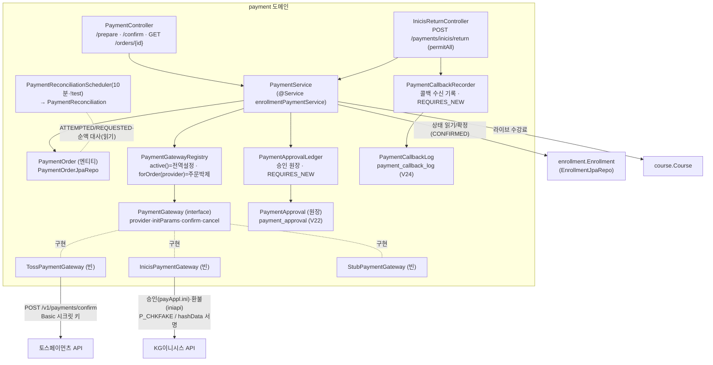
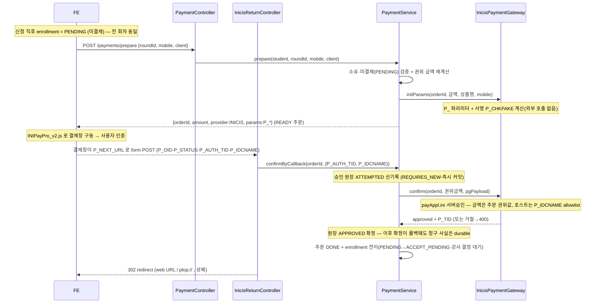
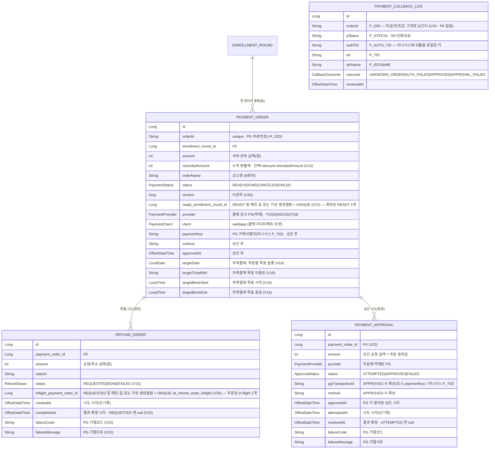

# 결제 (payment) 도메인

## 1. 한 줄 요약

수강신청(`enrollment` = `PENDING` 미결제)의 **결제**를 책임지는 도메인. **선결제**라 신청 직후가 결제 시점이다(전 회차 동일). **PG 중립**(포트-어댑터/Strategy) — FE 결제창이 결제하고 **승인은 서버가** 호출한다. 실제 PG 는 `PaymentGateway` 뒤에서 교체된다(토스/이니시스/stub). **토스↔이니시스는 `PAYMENT_MODE` 환경변수로 갈아끼우는 플러그식 스왑**이고, **신규 주문**은 전역 설정(`pungdong.payment.mode`)이 PG 를 고르지만 그 PG 를 **주문에 박제**(`PaymentOrder.provider`)해서 **기존 주문의 승인·환불은 결제 당시 PG 로** 간다(`PaymentGatewayRegistry`) — PG 를 갈아탄 뒤 과거 주문 환불이 엉뚱한 PG 로 나가 실패하는 것을 막는다. 핵심 invariant 세 개: **(1) 금액은 서버 권위값** — 클라이언트가 보낸 amount 를 신뢰하지 않고 주문에 박힌 금액과 대조하며, PG 에도 **주문에 박힌 금액**을 보내 결제창 결제액과 다르면 PG 가 거절, **(2) 결제 완료 = 전이** — 승인 성공만이 enrollment 를 다음 상태로 넘긴다(**전 회차** `PENDING→ACCEPT_PENDING`·강사 결정 대기), **(3) 롤백 안 되는 외부 부수효과는 시도부터 원장에** — 승인(`payment_approval`)·환불(`refund_order`)·콜백 수신(`payment_callback_log`) 모두 발행자 트랜잭션 밖(`REQUIRES_NEW`)에서 선기록하고, 10분 주기 대사 스윕이 결과 미확인·금액 드리프트를 ERROR 로 표면화한다(§4). 강사 거절·학생 취소·무응답 만료 시 enrollment 이벤트로 **전액 자동환불**(더 싼 슬롯으로 일정이 바뀌면 **차액만** 환불)(payment→enrollment 방향, [enrollment.md](enrollment.md) §3-2). 시크릿(토스 시크릿키 / 이니시스 hashKey·apiKey)은 BE 밖으로 안 나간다(juso 승인키 기조).

> 레거시 `domain/payment/Payment`(옛 예약 플로우의 가격 산술 전용, PG 필드 없음)와 무관 — 새 `payment/` feature 패키지가 enrollment 옆에서 결제를 1급으로 소유.

## 2. 컴포넌트 지도


```mermaid
flowchart TB
    subgraph payment["payment 도메인"]
        Ctl["PaymentController<br/>/prepare · /confirm · GET /orders/{id}"]
        InicisRet["InicisReturnController<br/>POST /payments/inicis/return (permitAll)"]
        Svc["PaymentService<br/>(@Service enrollmentPaymentService)"]
        Order["PaymentOrder (엔티티)<br/>PaymentOrderJpaRepo"]
        Reg["PaymentGatewayRegistry<br/>active()=전역설정 · forOrder(provider)=주문박제"]
        Client["PaymentGateway (interface)<br/>provider·initParams·confirm·cancel"]
        Toss1["TossPaymentGateway (빈)"]
        Inicis["InicisPaymentGateway (빈)"]
        Stub["StubPaymentGateway (빈)"]
        ApprLedger["PaymentApprovalLedger<br/>승인 원장 · REQUIRES_NEW"]
        Appr["PaymentApproval (원장)<br/>payment_approval (V22)"]
        CbRec["PaymentCallbackRecorder<br/>콜백 수신 기록 · REQUIRES_NEW"]
        CbLog["PaymentCallbackLog<br/>payment_callback_log (V24)"]
        Recon["PaymentReconciliationScheduler(10분·!test)<br/>→ PaymentReconciliation"]
    end
    Ctl --> Svc
    InicisRet --> Svc
    InicisRet --> CbRec
    CbRec --> CbLog
    Svc --> Order
    Svc --> Reg
    Svc --> ApprLedger
    ApprLedger --> Appr
    Recon -. "ATTEMPTED/REQUESTED·순액 대사(읽기)" .- Order
    Reg --> Client
    Client -. 구현 .- Toss1
    Client -. 구현 .- Inicis
    Client -. 구현 .- Stub
    Svc -- "상태 읽기/확정(CONFIRMED)" --> Enr["enrollment.Enrollment<br/>(EnrollmentJpaRepo)"]
    Svc -- "라이브 수강료" --> Course["course.Course"]
    Toss1 -- "POST /v1/payments/confirm<br/>Basic 시크릿 키" --> TossApi["토스페이먼츠 API"]
    Inicis -- "승인(payAppl.ini)·환불(iniapi)<br/>P_CHKFAKE / hashData 서명" --> InicisApi["KG이니시스 API"]
```

단방향: payment → enrollment / course (읽기 + enrollment 확정). enrollment/course 는 payment 를 모른다.

## 3. 핵심 흐름

토스/STUB 는 FE 가 `confirm` 을 호출하지만, **이니시스는 결제창이 BE 콜백으로 form POST → BE 서버승인**(WebView 가 POST 본문을 못 읽어서). 아래는 이니시스 흐름:


```mermaid
sequenceDiagram
    participant FE
    participant Ctl as PaymentController
    participant Ret as InicisReturnController
    participant Svc as PaymentService
    participant PG as InicisPaymentGateway
    Note over FE: 신청 직후 enrollment = PENDING (미결제) — 전 회차 동일
    FE->>Ctl: POST /payments/prepare {roundId, mobile, client}
    Ctl->>Svc: prepare(student, roundId, mobile, client)
    Svc->>Svc: 소유·미결제(PENDING) 검증 + 권위 금액 재계산
    Svc->>PG: initParams(orderId, 금액, 상품명, mobile)
    Note over PG: P_ 파라미터 + 서명 P_CHKFAKE 계산(외부 호출 없음)
    Svc-->>FE: {orderId, amount, provider:INICIS, params:P_*} (READY 주문)
    Note over FE: INIPayPro_v2.js 로 결제창 구동 → 사용자 인증
    FE-->>Ret: 결제창이 P_NEXT_URL 로 form POST (P_OID·P_STATUS·P_AUTH_TID·P_IDCNAME)
    Ret->>Svc: confirmByCallback(orderId, {P_AUTH_TID, P_IDCNAME})
    Note over Svc: 승인 원장 ATTEMPTED 선기록 (REQUIRES_NEW·즉시 커밋)
    Svc->>PG: confirm(orderId, 권위금액, pgPayload)
    Note over PG: payAppl.ini 서버승인 — 금액은 주문 권위값, 호스트는 P_IDCNAME allowlist
    PG-->>Svc: approved + P_TID (또는 거절→400)
    Note over Svc: 원장 APPROVED 확정 — 이후 확정이 롤백돼도 청구 사실은 durable
    Svc->>Svc: 주문 DONE + enrollment 전이(PENDING→ACCEPT_PENDING·강사 결정 대기)
    Ret-->>FE: 302 redirect (web URL / plop:// , 성패)
```

분기: 인증 실패(`P_STATUS≠00`) → 승인 호출 없이 fail 302. PG 승인 거절 → 주문 READY 유지 + fail 302(에러를 PG 에 안 던짐). 알 수 없는 주문(위조 P_OID) → web fail 302. 이미 DONE 주문 → 200 DONE(멱등). 미결제(PENDING) 아닌 신청 prepare → 400. 비소유 → 400(존재 숨김). **금액은 콜백값(P_AMT)이 아니라 주문 권위값**으로 승인 전문에 실려 위변조를 막는다(승인엔 서명이 없음).

**콜백은 결과와 무관하게 전부 DB 에 남는다**(#252, `payment_callback_log` V24) — `PaymentCallbackRecorder` 가 `REQUIRES_NEW` 로 위 네 갈래를 각각 `UNKNOWN_ORDER`(위조/오배송) / `AUTH_FAILED` / `APPROVED` / `APPROVAL_FAILED` 로 기록한다(`CallbackOutcome`). 승인이 롤백돼도 수신 기록은 커밋되고, 기록 실패는 삼켜서 결제 경로를 막지 않는다(`PaymentCallbackRecorder.record`). 승인 실패는 예외 객체째 로깅해 스택트레이스를 남긴다(`InicisReturnController:87`). 이걸로 "이니시스는 보냈다는데 우리는 받은 기록이 0" 분쟁·위조 콜백 공격 탐지·실패 콜백의 `P_AUTH_TID`(이니시스에 되물을 유일한 키) 보존이 가능해졌다.

### 슬롯 변경 차액 결제 — 대기를 "예약"이 아니라 "주문"에 둔다

더 비싼 시간대로 옮기려면 차액을 받아야 하는데, 그 "결제 대기"를 예약 상태({`EnrollmentStatus`})에 두면 방금 없앤 `PAYMENT_PENDING` 류가 되살아난다. 대신 **대기를 주문에** 둔다:

```
POST /payments/prepare {roundId, targetDate, targetTicketRef, targetBlockStart, targetBlockEnd, targetVenueRefId}
                                                              └ 선택이지만 **항상 보낼 것** — 안 보내면 -1019 위치 가드가 꺼진다
  ├─ enrollment 가 검증·가격 산정(quoteSlotChange) — 위치·장비 고정이라 갈리는 건 입장료뿐
  ├─ amount = 목표 회차금액 − 현재 회차금액 (차액만)
  ├─ 주문에 목표 슬롯 박제 + 목표 슬롯 좌석 hold(주문 귀속, paymentTtlHours)
  └─ 회차 상태는 그대로 (ACCEPT_PENDING / CONFIRMED)
POST /payments/confirm
  └─ 승인 순간 applySlotChange — 슬롯 교체 + hold→실점유 + 옛 슬롯 이력
     + **강사 결정 대기(ACCEPT_PENDING)로 되돌리고 24h 시계 재시작** (강사 hub 엔 CHANGING)
  └─ 강사 수락 → CONFIRMED / 거절 → REJECTED + 그 회차 전액(차액 포함) 자동환불
[미결제 방치 · paymentTtlHours 경과]
  └─ 주문만 FAILED + 좌석 반납. 예약은 원래 슬롯·원래 상태 그대로 — 롤백할 것이 없다
```

- **왜 좌석을 잡나**: 결제창이 떠 있는 동안 그 자리를 다른 학생이 가져가면 **돈은 받고 자리는 못 주는** 상태가 된다. 강사 제안 hold 와 같은 이유·같은 부품(`AvailabilityHold`)이되, **주문 귀속**(`paymentOrderId`)이라 제안 TTL 스위퍼가 걷어가지 않는다.
- **★ 강사 수락은 여전히 필요하다**: 학생이 임의로 고른 시간은 강사가 동의한 적이 없고, 우리 `coverage` 가 강사의 실제 일정(타 플랫폼 예약 등)을 다 반영한다는 보장이 없다. **일정 확정에는 강사 동의가 무조건 필요**하다는 게 이 도메인의 규칙이다. 차액 결제는 "돈을 미리 내고 강사 확인을 기다리는" 것 — `reschedule` 의 결제완료 경로와 같다.
  - 대비: **강사 제안을 고르는 `pick-slot` 만** 재수락이 없다. 강사가 자기가 가능한 시간을 낸 것 자체가 동의이기 때문이다. 이 비대칭이 규칙의 핵심이다.
  - 거절되면 그 회차 전액(차액 포함)이 자동환불된다(#203 의 회차 단위 루프).
- **범위**: 바뀌는 건 **일정(날짜·이용권·블록)** 뿐. 위치·장비까지 바꾸려면 취소 후 재신청(주문에 실을 수 있는 건 일정 한 벌).
- 목표 입장료는 별도 컬럼 없이 유도한다 — 위치·장비가 그대로라 `목표입장료 = 현재입장료 + 차액`.

## 4. 데이터 모델


```mermaid
erDiagram
    ENROLLMENT_ROUND ||--o{ PAYMENT_ORDER : "한 회차의 결제(들)"
    PAYMENT_ORDER {
        Long id
        String orderId "unique · PG 주문번호(=P_OID)"
        Long enrollment_round_id "FK"
        int amount "서버 권위 금액(원)"
        int refundedAmount "누적 환불액 · 잔액=amount-refundedAmount (V14)"
        String orderName "코스명 (N회차)"
        PaymentStatus status "READY|DONE|CANCELED|FAILED"
        long version "낙관락 (V20)"
        Long ready_enrollment_round_id "READY 일 때만 값 갖는 가상 생성컬럼 + UNIQUE (V21) — 회차당 READY 1개"
        PaymentProvider provider "결제 당시 PG(박제) · TOSS|INICIS|STUB"
        PaymentClient client "web|app (콜백 리다이렉트 타겟)"
        String paymentKey "PG 거래식별자(이니시스 P_TID) · 승인 후"
        String method "승인 후"
        OffsetDateTime approvedAt "승인 후"
        LocalDate targetDate "차액결제: 적용할 목표 슬롯 (V16)"
        String targetTicketRef "차액결제 목표 이용권 (V16)"
        LocalTime targetBlockStart "차액결제 목표 시작 (V16)"
        LocalTime targetBlockEnd "차액결제 목표 종료 (V16)"
    }
    PAYMENT_ORDER ||--o{ REFUND_ORDER : "환불 시도(원장)"
    REFUND_ORDER {
        Long id
        Long payment_order_id "FK"
        int amount "요청/취소 금액(원)"
        String reason
        RefundStatus status "REQUESTED|DONE|FAILED (V15)"
        Long inflight_payment_order_id "REQUESTED 일 때만 값 갖는 가상 생성컬럼 + UNIQUE uk_refund_order_inflight (V26) — 주문당 in-flight 1개"
        OffsetDateTime createdAt "시도 시각(선기록)"
        OffsetDateTime completedAt "결과 확정 시각 · REQUESTED 면 null (V15)"
        String failureCode "PG 거절코드 (V15)"
        String failureMessage "PG 거절사유 (V15)"
    }
    PAYMENT_ORDER ||--o{ PAYMENT_APPROVAL : "승인 시도(원장)"
    PAYMENT_APPROVAL {
        Long id
        Long payment_order_id "FK (V22)"
        int amount "승인 요청 금액 = 주문 권위값"
        PaymentProvider provider "주문에 박제된 PG"
        ApprovalStatus status "ATTEMPTED|APPROVED|FAILED"
        String pgTransactionId "APPROVED 시 확보(토스 paymentKey / 이니시스 P_TID)"
        String method "APPROVED 시 확보"
        OffsetDateTime approvedAt "PG 가 알려준 승인 시각"
        OffsetDateTime attemptedAt "시도 시각(선기록)"
        OffsetDateTime resolvedAt "결과 확정 · ATTEMPTED 면 null"
        String failureCode "PG 거절코드"
        String failureMessage "PG 거절사유"
    }
    PAYMENT_CALLBACK_LOG {
        Long id
        String orderId "P_OID — 미상(위조)도 그대로 남긴다 (V24 · FK 없음)"
        String pStatus "P_STATUS · 00=인증성공"
        String authTid "P_AUTH_TID — 이니시스에 되물을 유일한 키"
        String tid "P_TID"
        String idcName "P_IDCNAME"
        CallbackOutcome outcome "UNKNOWN_ORDER|AUTH_FAILED|APPROVED|APPROVAL_FAILED"
        OffsetDateTime receivedAt
    }
```

설계 의도: `orderId`(=P_OID) 가 unique + 멱등 키(콜백→주문 매핑, amount 조회 키). `amount` 는 prepare 시점에 **코스 라이브 수강료 + 입장료 스냅샷 + 장비 스냅샷** 으로 재계산해 박는다. `provider` 는 prepare 가 박제(V10), 승인·환불은 그 값으로 라우팅. `client` 는 콜백 리다이렉트 타겟(V11). 한 회차에 READY 주문은 하나만 멱등 재사용 — 동시 prepare 도 조건부 유니크(V21)가 DB 에서 강제한다(아래 "동시성 방어").

### 돈의 축 vs 예약의 축 — 그리고 주문을 어떻게 읽나

`PaymentStatus`(주문)와 `EnrollmentStatus`(회차)는 **독립**이다. `DONE` 은 "PG 승인됨"이지 "예약 확정"이 아니다 — 선결제라 승인 시점의 회차는 `ACCEPT_PENDING`(강사 결정 대기)이고 확정은 강사 수락 뒤다.

환불은 **주문 단위로 실행**(PG 취소 전문에 그 주문의 `paymentKey` 를 실어야 함)되고, `refund_order` 에 이력이 쌓인다. 회차는 그 위의 **집계 단위**다 — 한 회차에 승인 주문이 여러 건일 수 있다(원결제 + 일정 변경 차액 결제).

> **회차 순액 = Σ(승인액) − Σ(환불액)** = Σ(주문별 `refundableAmount()`)
>
> - **회차 전액 환불**(강사 거절·학생 취소·무응답) = 그 회차의 승인 주문을 **각각** 잔액 전액 취소하는 루프
> - **차액 환불** = **최신 주문부터** 뺀다 — 차액 결제분을 먼저 되돌려야 원결제가 부분환불된 것처럼 보이지 않는다. 최신 주문 잔액을 넘으면 이전 주문으로 넘어가고, **회차 순액을 넘지는 않는다**
> - 불변식 **"회차 순액 == `chargeTotal()`"** 은 주문이 N개가 돼도 성립한다(차액을 더 받든 돌려주든 양쪽이 같이 움직이므로) 승인 사실인 `status` 는 부분환불로 바뀌지 않으므로, **잔액을 행에서 바로 읽히게** `refundedAmount` 를 함께 들고 있는다(V14).

| 주문이 이렇게 보이면 | 뜻 |
|---|---|
| `DONE` + `refundedAmount = 0` | 정상 결제 |
| `DONE` + `0 < refundedAmount < amount` | **부분환불**(일정 변경 차액 등) |
| `CANCELED` (`refundedAmount = amount`) | **전액환불** |

`refund_order`(이력)가 **원장**이고 `refundedAmount` 는 그 합의 **캐시**다 — 같은 트랜잭션에서 함께 갱신되며, 어긋나면 `refund_order` 가 진실이다. 모든 환불은 `RefundService.applyCancel` 한 곳을 지나며 **취소가능 잔액으로 clamp** 된다(초과 취소·이중 취소 불가, 멱등).

### 환불은 "시도"부터 남긴다 — 대사(reconciliation) 가능한 원장

환불은 **롤백되지 않는 외부 부수효과**(PG 에 돈을 돌려주라고 말하는 것)다. 기록을 발행자(강사 거절·만료 sweep·학생 취소) 트랜잭션에 묶어두면 그 트랜잭션이 롤백될 때 **PG 엔 취소가 나갔는데 우리 DB 엔 흔적이 없는** 상태가 된다 — 재시도가 이중환불이 되고 대사도 불가능하다. 그래서 기록은 `RefundLedger` 가 **별도 트랜잭션**(`REQUIRES_NEW`)으로 맡는다.

```
applyCancel
  ├─ clamp: 취소가능 잔액(amount−refundedAmount)으로 자름 · 잔액 0 이면 no-op(멱등)
  ├─ 대사 가드: 그 주문에 REQUESTED 잔존? → RefundBlockedException(409/-1022)
  │      — 발행자(거절·취소·만료)까지 롤백(C2). 조용히 건너뛰면 회차만 끝나고 돈이 남는다:
  │        "환불 못 하면 상태 전이도 확정 안 함". 사람이 PG 원장과 대사해 확정하면 재시도가 흐른다
  ├─ recordAttempt  → REQUESTED 즉시 커밋      ← 여기서 죽어도 "시도했다"는 남는다
  │      └ 위 가드는 락 없는 pre-check 라 동시 두 시도가 함께 통과할 수 있다(H-1) —
  │        원자 차단은 uk_refund_order_inflight(V26): 둘째 INSERT 가 유니크 위반 → 같은 -1022
  ├─ PG cancel
  │    ├─ 거절(PaymentGatewayException) → markFailed(FAILED + code/msg) 후 rethrow
  │    ├─ 2xx 인데 canceled=false(취소 미확정) → markFailed 후 rethrow (H-2 —
  │    │    반환값 안 보고 DONE 기록하면 "환불했다고 기록되나 실제론 안 됨" = 영구 미환불)
  │    └─ 전송 실패(타임아웃·파싱)        → REQUESTED 유지 + rethrow (결과 미확인 = 대사 대상)
  └─ markDone(DONE + completedAt) + refundedAmount 누적 + 전액이면 CANCELED
```

| `refund_order.status` | 뜻 |
|---|---|
| `REQUESTED` | **결과 미확인** — PG 가 취소했는지 모른다. 그 주문의 자동 환불은 잠기고(`RefundBlockedException`, -1022) **대사 대상**이 된다 |
| `DONE` | 취소 성공. 잔액(`refundedAmount`)에 반영됨 |
| `FAILED` | PG 가 거절. `failureCode`/`failureMessage` 에 진단정보(이니시스 `resultCode` / 토스 `code`) |

- **성공 후 발행자가 롤백되면**: 환불 기록·잔액은 커밋된 채 남는다(현실과 일치 — PG 는 취소했다). 다음 재시도는 줄어든 잔액을 보고 no-op → **이중환불 없음**. 상태 전이만 다시 시도된다.
- **실패하면**: 상태 전이는 롤백(돈-상태 원자성 유지)되지만 **`FAILED` 이력은 남는다**.
- PG 거절 사유는 `PaymentGatewayException` 이 실어 나르되 **응답엔 일반 400 문구만** 내려간다(PG 내부 코드를 강사 화면에 노출하지 않음). 진단은 DB·로그에만.

### 승인도 "시도"부터 남긴다 — orphan charge 차단 (`PaymentApprovalLedger`, #249)

환불 원장(위)의 **승인 쪽 대칭**이다. 승인도 "PG 에 청구하라고 말하는 것" = **롤백되지 않는 외부 부수효과**인데, `applyConfirm` 은 PG 청구 **뒤에** 주문 DONE·회차 전이를 확정한다. 그 확정이 `@Version` 충돌·좌석 재검증 등으로 롤백되면 **카드는 청구됐는데 DB 엔 흔적 0**(주문 READY, paymentKey null) — orphan charge. 대사로도 못 잡고 환불도 못 한다. 그래서 기록은 `PaymentApprovalLedger` 가 **별도 트랜잭션**(`REQUIRES_NEW`, 별도 빈 — self-invocation 이면 프록시를 안 거쳐 무시됨)으로 맡는다(`payment_approval` V22):

```
applyConfirm (PaymentService.java:235)
  ├─ 멱등: 이미 DONE → 그대로 성공 반환
  ├─ findApproved: 이미 APPROVED 이력? → 재청구 없이 그 결과로 전진 확정(finalizeApproval)
  │      ← 이전 확정이 롤백돼 주문이 READY 로 남은 경우. "정확히 한 번 청구 / 여러 번 적용"
  ├─ hasUnresolvedApproval: ATTEMPTED 잔존? → 400 (재청구 금지 — 카드가 이미 청구됐을 수 있다.
  │      사람이 PG 원장과 대사해 그 행을 확정해야 다시 흐른다)
  ├─ recordAttempt → ATTEMPTED 즉시 커밋      ← PG 호출 직전 선기록
  ├─ PG confirm
  │    ├─ 거절(BadRequest·PaymentGatewayException / approved=false) → markFailed(FAILED) — 청구 안 됨, 재시도 가능
  │    └─ 전송 실패(그 외 RuntimeException) → ATTEMPTED 유지 + rethrow (결과 미확인 = 대사 대상·재승인 차단)
  ├─ markApproved → APPROVED(+pgTransactionId·method·approvedAt) 즉시 커밋   ← 청구 사실 durable
  └─ finalizeApproval (outer 트랜잭션) — 주문 DONE + 회차 전이. 여기가 롤백돼도 APPROVED 는 남는다
```

| `payment_approval.status` | 뜻 |
|---|---|
| `ATTEMPTED` | **결과 미확인** — 청구됐는지 모른다. 그 주문의 재승인은 잠기고(`hasUnresolvedApproval`) **대사 대상** |
| `APPROVED` | 청구 성공(tid 확보). 확정이 롤백돼도 남아 재시도가 **재청구 없이** 전진 확정한다 |
| `FAILED` | PG 거절 — 청구 안 됨. 재시도 가능. `failureCode`/`failureMessage` 에 진단 |

조회 가드(`findApproved`/`hasUnresolvedApproval`)도 `REQUIRES_NEW` 인 이유: 발행자 스냅샷에 갇히면 **다른 트랜잭션이 방금 커밋한 시도**를 못 봐 이중청구가 된다(`PaymentApprovalLedger.java:22-23`). `finalizeApproval` 은 회계 불변식 "DONE 인데 `approvedAt=null` 금지"도 지킨다 — PG 가 승인시각을 안 주면 처리시각으로 보정하고 warn(`PaymentService.java:304-310`).

### 대사(reconciliation) 스윕 — 원장은 보는 사람이 있어야 산다 (`PaymentReconciliation`, #253·#261)

원장에 남기는 것까지 됐어도 **그 행이 있다는 걸 사람이 알 방법**이 없었다. `PaymentReconciliationScheduler`(`@Profile("!test")`, `pungdong.payment.reconciliation-sweep-ms` 기본 10분)가 두 대사를 주기 실행해 ERROR 로 올린다(알림·대시보드가 잡게). 둘은 독립 try/catch — 하나가 죽어도 나머지는 돈다.

1. **`reportStuck`** (#253) — **15분+ 결과 미확인**으로 남은 승인(`ATTEMPTED`)·환불(`REQUESTED`) 시도를 세어 ERROR. 유예 15분은 방금 시작한 정상 시도 오탐 방지.
2. **`reportAmountMismatch`** (M1, #261) — 결제완료(`ACCEPT_PENDING`)·확정(`CONFIRMED`) 회차의 **순액(Σ DONE 주문 `amount−refundedAmount`)이 `chargeTotal()` 과 다르면** 드리프트로 ERROR. `reportStuck` 이 "결과 미확인"을 보는 것과 짝으로, 이건 "결과는 확정됐는데 금액이 안 맞는" 것을 잡는다. **오탐 방지 3중**: 미결제·취소/거절 회차 제외(순액 0 이 정상), `respondedAt < cutoff`(방금 전이한 건 제외), **`REQUESTED` in-flight 가 걸린 회차 제외**(전이 중 — 그건 `reportStuck` 이 이미 표면화).

**탐지만 한다** — 자동 재승인/재환불은 하지 않는다(이중청구·이중환불 위험). 확정은 사람이 PG 원장과 대사해서 한다(`PaymentReconciliation.java:25`).

### 동시성 방어 — 레이스의 최종 심판은 DB 제약

가드·조회는 락 없는 pre-check 라 near-simultaneous 요청을 못 막는다. 최종 방어선은 전부 DB 에 있다:

- **`@Version` 낙관락** (V20, #248) — `EnrollmentRound`·`PaymentOrder`. 취소↔승인 교차·supersede·만료 스윕의 blind full-row overwrite(lost update)를 막는다 — 진 쪽 트랜잭션이 롤백되고 **409 / `-1021 CONCURRENT_MODIFICATION`** 으로 내려간다(재시도 안내). 알림 정확히-한-번의 두 번째 겹(`PaymentService.java:316-322`)이기도 하다.
- **READY 조건부 유니크** (V21) — MySQL 엔 부분 유니크가 없어, `status='READY'` 일 때만 `enrollment_round_id` 값을 갖는 **가상 생성컬럼 + UNIQUE**(`uk_payment_order_ready_round`)로 "회차당 READY 주문 1개"를 DB 가 강제한다. 동시 prepare 이중 READY(→각각 승인되면 이중청구, 이후 조회 `IncorrectResultSize` 영구 500)를 차단 — 진 쪽은 `ConcurrentRequestException`(409/-1021)로 받고 재시도 시 먼저 만들어진 주문을 재사용한다(`PaymentService.createReadyOrder`).
- **환불 in-flight 유니크** (V26) — `refund_order` 에 `status='REQUESTED'` 일 때만 `payment_order_id` 값을 갖는 가상 생성컬럼 + UNIQUE(`uk_refund_order_inflight`). 동시 이중환불을 원자 차단(applyCancel 의 락 없는 check-then-insert 보완, H-1). **왜 `FOR UPDATE` 를 못 쓰나**: `RefundLedger.markDone` 이 `REQUIRES_NEW`(= 다른 커넥션)로 같은 `payment_order` 행을 UPDATE 하려다 바깥 트랜잭션의 FOR UPDATE 와 **self-deadlock** 난다(V26 마이그레이션 주석). `@Version` 도 못 막는다 — 두 스레드가 각자 `REQUIRES_NEW` 에서 잔액을 올린다. (원래 V25 였으나 #255 자격증 V25 와 번호 충돌해 #257 에서 V26 으로 리넘버.)
- **좌석 overbooking 방어** (H-4 — enrollment 도메인이지만 "돈은 받고 자리는 못 준다"로 직결) — `EnrollmentService.requireSeat` 가 세션 행을 `lockById`(SELECT … FOR UPDATE)로 잡아 동시 신청을 직렬화하고, 점유 count 도 **잠금 조회**(`roundRepo.lockOccupyingRoundIds`)로 한다. plain count 는 MySQL REPEATABLE READ 에서 **트랜잭션 앞선 course/coverage 조회 시점에 고정된 스냅샷**을 읽어, 상대가 방금 커밋한 신청을 못 보고 정원을 초과했다(H-4 버그). 잠금 count 는 스냅샷을 우회해 최신 커밋을 읽는다(`EnrollmentService.java:808-821`). 새 세션 동시 생성 경합은 자연키 UNIQUE(`uk_availability_session_slot`, V12)가 차단.
- **검증은 실 MySQL 로** — H2 는 `SELECT FOR UPDATE`·REPEATABLE READ 스냅샷 의미를 재현하지 못해, H-1 이중환불·H-4 오버부킹은 **Testcontainers 실 MySQL 하네스**(`./gradlew mysqlTest`, `@Tag("mysql")` — `src/test/java/com/diving/pungdong/concurrency/`)로 검증한다. 기본 스위트에선 제외(`build.gradle:94-113`).

### 환불 정합성 — 앵커·페널티 범위·나머지 배분 (#258, 정책 상세는 [features/payment.md](../features/payment.md))

`RefundCalculator` 의 메커니즘 세 가지만 여기 적는다(왜/정책 히스토리는 피처 문서 소유):

1. **그레이스(강사 수락 1h 내 100%) 앵커 = 확정 시각** — CONFIRMED 회차의 `respondedAt`(수락·pick-slot·재수락 순간, `RefundCalculator.ratePct`). 확정 후 `respondedAt` 을 갱신하는 경로는 없다(제안·일정변경요청은 ACCEPT_PENDING 상태에서만 가능하고 그 상태는 100%) — 그래서 "그레이스 재개방" 우려는 성립하지 않는다(`RefundCalculatorTest` F3/N2, `RefundUseCaseTest` RF16). 없으면(legacy) 회차 `createdAt` 폴백(보수적). (2026-08-14 #258 은 결제완료 `approvedAt` 을 앵커로 썼다가 2026-08-15 되돌림 — 왜는 피처 문서.) `finalizeApproval` 의 `approvedAt` null 보정+warn 은 원장 정합용으로 유지.
2. **날짜 페널티(당일 0/전날 50/2일전 70/3일전+ 100)는 `CONFIRMED` 회차에만** — 페널티는 "강사가 풀을 예약한 뒤 코앞 취소" 손해를 물리는 것이라 미수락(`ACCEPT_PENDING`)·미결제는 명분이 없어 100%(`RefundCalculator.java:76-77`). `cancel(roundId)` 경로(전액환불)와 `refundEnrollment` 경로의 결과가 일치하게 된다.
3. **수강료/N 의 정수 나눗셈 나머지는 마지막 정규회차에 배분** — 버리면 환불 합계 < 원금(학생 불리, 대사 어긋남)(`RefundCalculator.java:56-57`).

## 5. 보안 / 권한 매트릭스

| 엔드포인트 | 인증 | 소유권 검증 | 비고 |
|---|---|---|---|
| `POST /payments/prepare` (일반) | authenticated | round.enrollment.student == 나 + 상태 **미결제(PENDING)**, 전 회차 동일 | 비소유/없음 = 400, 미결제 아님 = 400 |
| `POST /payments/prepare` (**차액**, `target*` 동반) | authenticated | 내 회차 + 상태 **`ACCEPT_PENDING`**(결제완료·강사 결정 대기) | 목표가 안 비싸면 400 · `targetVenueRefId` 가 현재 위치와 다르면 **-1019**(주문·hold 생성 전) |
| `POST /payments/confirm` | authenticated | order.enrollment.student == 나 | **TOSS/STUB 전용**. amount 불일치 = 400, 멱등(이미 DONE = 200) |
| `GET /payments/orders/{orderId}` | authenticated | order.enrollment.student == 나 | 성공화면·재진입 조회. 비소유 = 400 |
| `POST /admin/payments/orders/{orderId}/refund` | **hasRole(ADMIN)** | (운영자 — 소유권 무관) | **수동 환불**(운영 보정). 잔액 전액/일부를 `applyCancel` 로 — `RefundOrder` 원장·잔액·PG 라우팅·이중환불 가드 동일. 돈만 만지고 회차 상태 불변. 잔액 초과·이미 전액환불 = 400 |
| `POST /payments/inicis/return` | **permitAll** + **CORS 제외** | (P_AUTH_TID + 서버 권위 금액 대조가 방어) | 이니시스 결제창 form POST. 승인 후 302 리다이렉트(성패·web/app). `/payments/**` 보다 먼저 매칭. cross-origin form POST 라 CORS 검사에서 뺌(아래) |

**이니시스는 confirm 주체가 BE**: 앱 WebView 가 결제창의 form POST 본문을 못 읽어, `P_NEXT_URL` 을 BE(`/payments/inicis/return`)로 두고 서버가 승인 후 GET 리다이렉트(주문에 박제된 `client` 로 web URL/`plop://` 선택, 고정 allowlist=오픈리다이렉트 방지). TOSS/STUB 는 FE 가 confirm. 세션리스 승인은 소유권 대신 **`P_AUTH_TID`(우리 콜백에만 옴) + 승인 전문의 서버 권위 금액 대조**가 방어(승인엔 서명이 없음).

**CORS 제외**: 콜백은 결제창(`paypro.inicis.com`)·앱 WebView 가 하는 **cross-origin form POST(navigation)** 라, 전역 CORS allowlist(`cors.allowed-origins`)로 origin 을 검사하면 `Origin` 헤더가 밖이라 `Invalid CORS request`(403)로 막힌다. 하지만 form POST navigation 은 브라우저 JS(fetch/XHR)가 아니라 **CORS 의 대상이 아니고**, 콜백 진위는 위의 `P_AUTH_TID`+서버승인이 보장한다 — CORS 는 이 경로의 보안 경계가 아니다. 그래서 `SecurityConfiguration.corsConfigurationSource()` 가 `/payments/inicis/return` 만 `allowedOriginPattern("*")`(+`allowCredentials=false`)로 `/**` 보다 먼저 등록해 CORS 검사에서 뺀다. 전역 allowlist 는 그대로(다른 경로는 여전히 restrictive). FE 가 WebView origin 을 웹 도메인으로 위장할 필요가 없어진다.

**SSRF 방어**: 승인 호스트를 콜백 `P_IDCNAME`(예: `fc`→`fcpaypro.inicis.com`)으로 조립하므로, `idcHost()` 가 소문자 토큰만 허용해 `evil.com/` 같은 호스트 주입을 막는다.

**시크릿은 BE 전용** — 토스 시크릿키(승인 Basic 인증), 이니시스 `hashKey`(P_CHKFAKE 서명)·`apiKey`(환불 hashData). FE 엔 계산된 `params`(P_ 파라미터 + 서명값)만 내려간다. **`P_NEXT_URL`(콜백 주소)은 클라이언트가 정하지 못한다** — 서버 설정(`pungdong.payment.inicis.ret-url`) 고정.

**하드닝 에러코드** (표의 400 들과 별개, `ExceptionAdvice`·`exception_ko.yml`·`types.ts` ErrorCode):

| 코드 | HTTP | 언제 |
|---|---|---|
| `-1021 CONCURRENT_MODIFICATION` | 409 | `@Version` 낙관락 충돌 또는 동시 prepare 유니크 충돌(`ConcurrentRequestException`) — "잠시 후 재시도", 재시도하면 먼저 커밋된 자원을 재사용 |
| `-1022 REFUND_BLOCKED` | 409 | 환불 대사 가드(`RefundBlockedException`) — 결과 미확인 환불 시도가 있거나 동시 환불이 진행 중이라 상태 전이째 롤백. 대사 확정 후 재시도로 풀린다 |

## 6. 알려진 설계 간극

- 🟢 **이니시스 실 왕복 검증 완료** (2026-08-07, staging 테스트 MID `INIpayTest`) — **실카드**로 결제창→승인(payAppl)→DONE→CONFIRMED→**환불(iniapi)**→CANCELLED **전 사이클 성공**(카드 승인·취소 문자까지 수신). 저장한 tid 로 환불이 승인돼 **환불 tid 필드 OK**(P_TID 우선·P_APPL_TID 폴백 정상), hashData 바이트동일성·전액취소(type=refund) 정상. 검증법: raw JWT(Bearer 안 붙임) → `GET /enrollments/mine` → `POST /enrollments/{id}/refund`. prod MID(`plopol1192`)는 카드사심사 flip 때 재확인.
- 🔴 **webhook 미연동** — 비동기 상태(취소·부분취소 통보)를 받지 못한다. v1 은 콜백 승인 + 환불 API 동기 응답만. 카드+간편결제만 받아 가상계좌 입금통보는 불필요. → PG webhook 엔드포인트 + 서명 검증 후속(`venue/sync/SanityWebhookVerifier` 패턴 참고). (2026-08 하드닝의 콜백 수신 원장·대사 스윕이 **관측 공백**은 메웠지만, 비동기 통보 자체를 받는 건 여전히 후속.)
- 🟢 **결제 하드닝 스윕 반영 완료** (2026-08-12~13, #245·#248·#249·#251·#252·#253 + #261) — 감사에서 나온 돈-정합 간극을 일괄 해소: **승인 원장**(orphan charge 차단, §4)·**콜백 수신 원장**(§3)·**대사 스윕 2종**(결과 미확인 + 금액 드리프트 M1, §4)·**낙관락 `@Version`**(V20)·**READY 조건부 유니크**(V21)·**환불 in-flight 유니크**(V26, H-1)·**좌석 잠금 count**(H-4)·**환불 미확정 시 상태 전이 롤백**(C2, `-1022`)·**취소 미확정 FAILED 처리**(H-2). 동시성 의미는 실 MySQL 하네스(`./gradlew mysqlTest`)가 지킨다 — §4 "동시성 방어".
- 🟢 **환불 정합성 정책 정리 완료** (#258) — 그레이스 앵커 정리(→ 2026-08-15 수락 시각으로 확정), 날짜 페널티를 `CONFIRMED` 한정으로, 나눗셈 나머지를 마지막 회차 배분으로. §4 "환불 정합성" + [features/payment.md](../features/payment.md).
- 🟢 **환불액 노출 완료** (#262, M5) — `PaymentConfirmResponse`(confirm·`GET /payments/orders/{id}` 공용)에 `refundedAmount`(누적 환불액)·`refundableAmount`(취소가능 잔액) 추가. `status` 만으론 부분환불 금액이 안 보였다 — FE 가 "N원 환불됨"·잔액을 계산 없이 표시한다.
- 🟢 **환불 clientIp 등록 불요** (2026-08-07 검증) — 환불 전문의 `clientIp`(기본값·변동 egress)로 이니시스 환불이 통과했다. 즉 **고정 egress(fck-nat) 불필요** — 환불 자동화에 인프라 부담 0. (KCP 8012 취소-IP 제약과 달리 이니시스는 IP 대조를 안 하는 것으로 확인. prod MID 에서 재확인 권장이나 강신호. 만약 prod 에서 IP 제약이 나타나면 fck-nat/나노 NAT ~$7/월 옵션 — 히스토리는 git.)
- 🟢 **결제 미완 만료 + 거절/무응답 자동환불 구현** (2026-08-07 선결제 전환) — 선결제 1회차: 미결제(PENDING) 12h 만료(슬롯 해제·환불 없음), 결제완료(ACCEPT_PENDING) 강사 무응답 24h 만료 + **전액 자동환불**, 강사 거절 시 **전액 자동환불**. enrollment 이벤트(`EnrollmentRefundRequestedEvent`) → `EnrollmentRefundListener` → `RefundService.refundRoundFully`(동기·롤백 안전). 상태기계는 [enrollment.md](enrollment.md) §3-2.
- 🟢 **결제 카운트다운·차액 구분 노출 완료** (2026-08-11) — 미결제 회차의 **잔여 초**(`paymentExpiresInSeconds`)를 `EnrollmentResponse`·일정 hub `ScheduleRound`·`PaymentPrepareResponse` 에 싣는다. **저장 컬럼 없음** — `createdAt + paymentTtlHours` 를 읽을 때 푼다(`enrollment/PaymentWindow`, 만료 스윕과 같은 식). 절대시각이 아니라 잔여 초인 이유는 기기 시계 오차([time-handling.md](time-handling.md)). 승인 응답엔 `scheduleChange`(= `PaymentOrder.isSlotChange()`)를 실어 완료 화면이 "결제 완료"와 "일정 변경 요청"을 가르게 했다 — 이니시스는 성공 URL 을 BE 가 만들어 302 하므로 FE 가 쿼리로 실어보낼 수 없어 서버가 알려주는 게 유일한 경로다.
- 🟢 **위치 변경 + 금액 상승은 차액 결제로 못 간다 — 코드로 갈라 막음** (2026-08-11) — 차액 결제는 "입장료만 갈린다"는 전제 위에 서 있어 `applySlotChange` 가 `venueRefId` 를 그대로 둔다. 그런데 이 조합을 `-1018` 로 내보내면 FE 가 차액 결제로 유도하고, **결제 후 학생이 고른 적 없는 원래 위치로 조용히 옮겨진다**(이용권·시간이 두 위치에 겹치면 검증도 통과하고 성공 화면도 정상으로 보인다). 두 겹으로 막았다: ① **`reschedule` 이 `-1019` 를 먼저 낸다**(위치를 이미 받으므로 FE 변경 없이 방어) ② `prepare` 가 선택 입력 `targetVenueRefId` 를 받아 현재 위치와 대조(다르면 `-1019`, 주문·hold 생성 전). 위치 변경이라도 **같거나 싸면** reschedule 로 그대로 된다. 완전한 "위치 변경 + 차액 결제"는 장비 가격표(위치 종속)·세션 자연키·좌석 hold·겹침 판정까지 재계산이 필요해 별도 피처.
- 🟢 **결제 응답 필드명이 두 축을 드러내게 개명** (2026-08-11, FE 역제안 수용) — `PaymentConfirmResponse` 는 **결제의 결과**(`status`·`amount`·`scheduleChange` — 멱등)와 **조회 시점의 회차 상태**(live 읽기 — 멱등 아님)가 한 DTO 에 섞여 있다. 옛 이름 `enrollmentStatus` 가 "이 결제의 결과" 로 읽혀 FE 가 `CONFIRMED` 분기를 지우는 회귀가 났고(강사가 이미 수락했는데 "확인 중" 표시), `confirm` 재호출이 `200 DONE` 계약인데 그 필드만 값이 달라지는 모순도 있었다. **live 읽기는 유지**(화면이 필요한 건 "지금 뭐라고 말해줄까")하되 이름을 `currentEnrollmentStatus` 로 바꿔 계약만 읽고도 예측되게 했다. 스냅샷 필드는 두지 않는다 — 쓰는 화면이 없고 "둘 중 뭘 쓰나" 가 새 함정이 된다. 같은 DTO 의 `enrollmentId`(실제로는 **회차 id**, 환불 경로의 수강 id 와 혼동)도 `roundId` 로 함께 개명.
- 🟡 **입장료/장비 live 재계산 안 함** — 권위 금액은 수강료만 라이브, 입장료/장비는 신청 스냅샷. venue 블록 재도출 후속.
- 🟢 **정산(지급대행) 미연동** — 강사 정산은 이니시스 **지급대행**이 대행한다(런칭엔 상점관리자페이지 수동 운영, 지급대행 API 는 후속). 플랫폼 수수료/포인트 분해 정산은 우리 로직이 계산(런칭엔 포인트 없음). → 정책은 [docs/features/payment.md](../features/payment.md).
- 🟢 **캘린더 표시** — 결제완료·점유 상태(`ACCEPT_PENDING`/`CONFIRMED`)를 `confirmed` 버킷으로 합산(점유). FE 가 "미결제(PENDING)"를 별도 표시하려면 카운트 분리 후속.

## 7. 더 깊게: 테스트로 보기

실제 동작의 단일 출처 = `src/test/java/com/diving/pungdong/usecase/PaymentUseCaseTest.java`(실 H2 + 시큐리티 체인, `PaymentGateway` 만 `@MockBean`). `@DisplayName` 위→아래로 사양을 읽는다:

- `P1` 신청(PENDING) 직후 prepare → READY 주문 + 권위 금액(365,000) + provider=STUB
- `P2` confirm 성공 → 주문 DONE + enrollment **ACCEPT_PENDING**(선결제 1회차 = 결제완료·강사 확인 대기)
- `P3` 금액 불일치 → 400, PG 미호출, 신청 그대로(PENDING)
- `P4` confirm 멱등(재호출도 DONE)
- `A2` 승인 성공 시 승인 원장에 APPROVED(+tid)가 남는다 — 확정이 롤백돼도 청구 사실은 durable (C1)
- `A3` 이미 승인(청구)된 주문은 재청구 없이 전진 확정 — 확정 롤백 후 재시도가 PG 를 다시 부르지 않는다
- `P5` 이미 결제완료(ACCEPT_PENDING) 신청 재-prepare → 400(결제대기 아님)
- `P6` 비소유 prepare → 400(존재 숨김)
- `P7` 신청(PENDING) 좌석 점유가 둘째 신청을 막음(정원 1) — 선결제라 결제·수락 전에도 점유
- `W1` 미결제 회차는 **결제 잔여 초**(`paymentExpiresInSeconds`)를 내 목록·일정 hub·prepare 응답에 모두 실어준다
- `W2` 결제가 끝나면 그 값은 사라진다(null) — 셀 기한이 없다
- `W3` 일반 결제 승인 응답의 `scheduleChange` 는 false (차액 결제와 완료 화면 문구를 가르는 플래그)

차액 결제 쪽은 `MultiRoundProgressUseCaseTest`:
- `C1` 더 비싼 슬롯으로 그냥 reschedule → **-1018**(`ADDITIONAL_PAYMENT_REQUIRED`), 슬롯은 롤백
- `C2` prepare 의 `target*` 시각은 `"18:00"`·`"18:00:00"` 둘 다 받는다(슬롯이 준 표기 그대로)
- `C3` 차액 결제 승인·주문조회 응답 모두 `scheduleChange=true`
- `C4` **위치까지 바꾸면서 비싸지면 `-1018` 이 아니라 `-1019`** — 차액 경로로 못 가는 조합
- `C5` prepare 에 다른 `targetVenueRefId` 를 실으면 `-1019` (주문·좌석 hold 생성 전에 차단), 같은 위치면 통과
- `PH5` 만료된 제안을 뒤늦게 고르면 `-1020`(`PROPOSAL_EXPIRED`) — 범용 -1011 과 가름
- `C1-3` **정원 1**에서 제안받은 자리로 (pick-slot 대신) reschedule 해도 내 제안 hold 에 안 막히고, hold 는 회수된다
- `C1-2` **정원 1**에서도 제안 → `-1018` → 차액 결제가 이어진다 — 자기 제안 hold 에 자기가 막히지 않고, 승인 후 그 hold 도 회수된다
- `I1` 이니시스 콜백 승인 → 서버 승인·확정 + app 성공 스킴 302 / `I2` PG 거절 → 주문 READY 유지, web fail 302 / `I3` 인증실패(P_STATUS≠00) → 승인 호출 없이 fail 302 / `I4` 알 수 없는 P_OID(위조) → web fail 302 / `I7` 콜백 수신은 DB 에 기록된다 — 위조 P_OID 도 UNKNOWN_ORDER + authTid 보존
- `O1` GET /payments/orders/{id} 소유자 조회(DONE·확정) / `O2` 남의 주문 조회 400
- `InicisPaymentTransmissionTest`(K/M/V) — 이니시스 전문·서명·hashData 바이트동일성·SSRF(외부 호출 0, 자격증명 불요)
- `RefundUseCaseTest` `RF4` — PG 스왑 후 과거 주문은 결제 당시 PG(이니시스)로 환불, 새 active(토스)로 안 나간다 / `RF5` 강사 거절→REJECTED+전액 자동환불(cancel 호출·환불기록) / `RF6` 무응답 만료→CANCELLED+환불
- `RefundUseCaseTest` 하드닝·다주문: `RF7` 부분환불 누적·clamp / `RF8` 전액→CANCELED·이후 no-op / `RF9` PG 거절 시 상태전이 롤백+FAILED 이력 / `RF10` REQUESTED 잔존 시 `RefundBlockedException`(재호출 없음) / `RF15` 그 경우 강사 거절까지 롤백(C2) / `RF14` canceled=false 는 DONE 기록 안 함(H-2) / `RF11`~`RF13` 다주문 전액·최신 주문 우선 차감·순액 상한
- `RefundCalculatorTest`(F/N) — 환불율표·`F3`/`N2` 그레이스 앵커=강사 수락(확정) 시각 respondedAt(결제 시각 무관)·`N1` 날짜 페널티 CONFIRMED 한정·`N3` 나머지 마지막 회차 배분(합계=원금)
- `PaymentReconciliationTest`(RC1~RC4) — 유예 지난 미확정만 카운트·순액==chargeTotal 정합·드리프트 표면화·REQUESTED in-flight 회차 제외
- `PaymentOrderConcurrencyTest`(VL1~VL2) — `@Version` 0 시작·증가, stale 저장 시 낙관락 충돌(먼저 커밋한 쪽이 이김)
- **실 MySQL 동시성**(`./gradlew mysqlTest`, Testcontainers·H2 로는 재현 불가): `H-1` 8스레드 동시 환불에도 PG 취소 1회(이중환불 없음) / `H-4`·`H-4b` 동시 신청·동시 세션 생성에도 overbooking 없음

enrollment 측 전이는 `EnrollmentUseCaseTest`(A1 수락→CONFIRMED·A2 거절→REJECTED·F1 만석).
