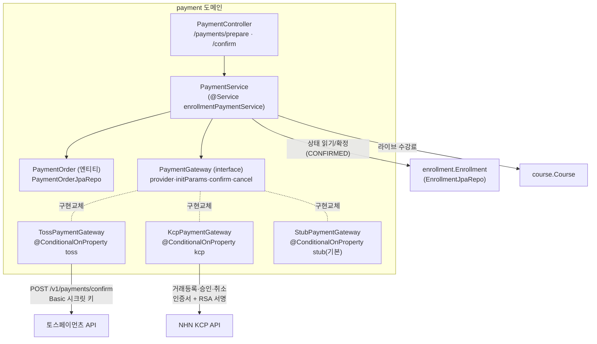
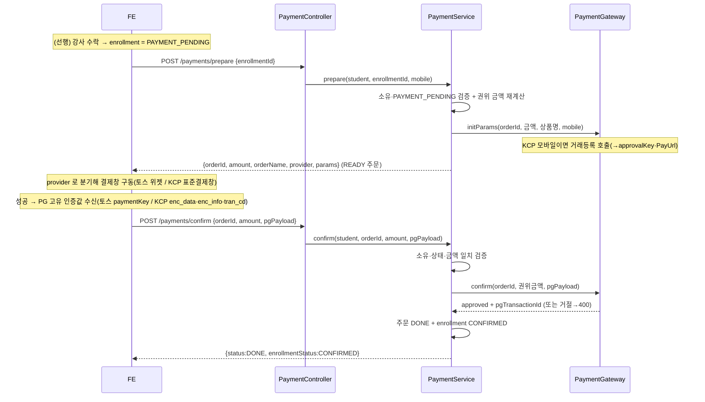
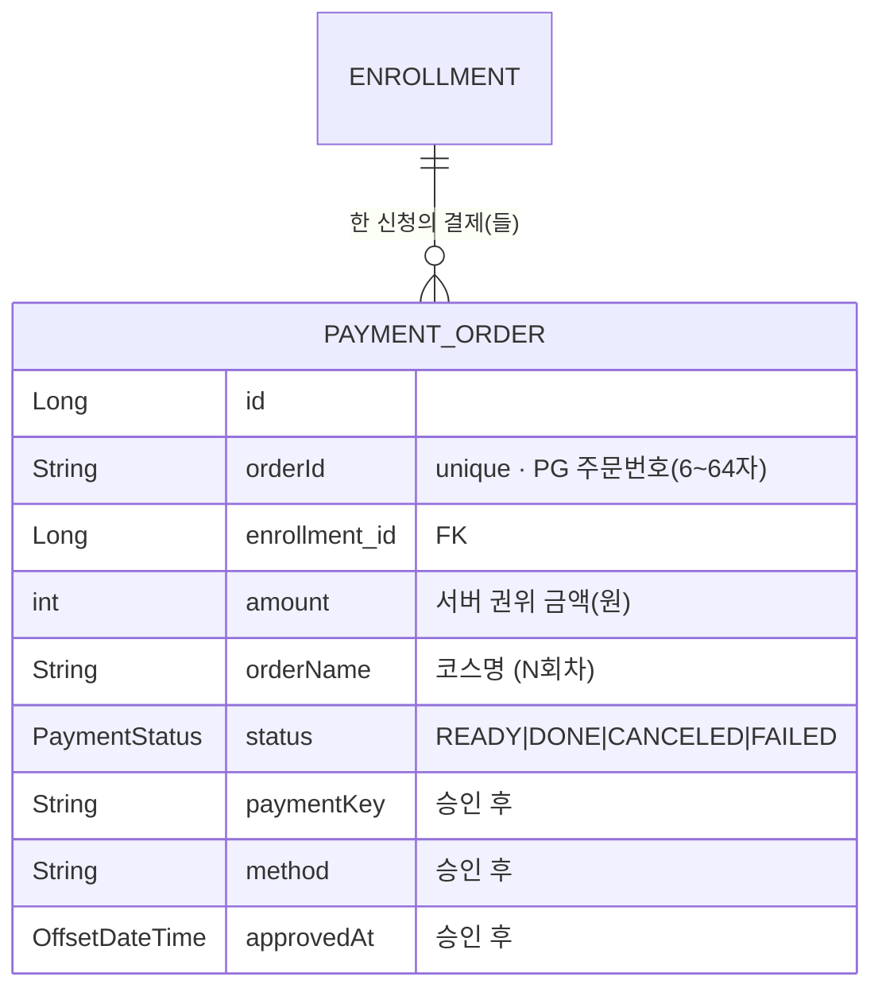

# 결제 (payment) 도메인

## 1. 한 줄 요약

수락된 수강신청(`enrollment` = `PAYMENT_PENDING`)의 **결제**를 책임지는 도메인. **PG 중립** — FE 결제창이 결제하고 **승인은 서버가** 호출한다. 실제 PG 는 `PaymentGateway` 뒤에서 교체된다(토스페이먼츠 결제위젯 v2 / NHN KCP 표준결제 / stub, `pungdong.payment.mode` 로 **부팅 시 하나만**). 핵심 invariant 두 개: **(1) 금액은 서버 권위값** — 클라이언트가 보낸 amount 를 신뢰하지 않고 주문에 박힌 금액과 대조하며, PG 에도 **주문에 박힌 금액**을 보내 결제창 결제액과 다르면 PG 가 거절, **(2) 결제 완료 = 확정** — 승인 성공만이 enrollment 를 `CONFIRMED` 로 넘긴다. 시크릿(토스 시크릿키 / KCP 인증서·개인키)은 BE 밖으로 안 나간다(juso 승인키 기조).

> 레거시 `domain/payment/Payment`(옛 예약 플로우의 가격 산술 전용, PG 필드 없음)와 무관 — 새 `payment/` feature 패키지가 enrollment 옆에서 결제를 1급으로 소유.

## 2. 컴포넌트 지도

```mermaid
flowchart TB
    subgraph payment["payment 도메인"]
        Ctl["PaymentController<br/>/payments/prepare · /confirm"]
        Svc["PaymentService<br/>(@Service enrollmentPaymentService)"]
        Order["PaymentOrder (엔티티)<br/>PaymentOrderJpaRepo"]
        Client["PaymentGateway (interface)<br/>provider·initParams·confirm·cancel"]
        Toss1["TossPaymentGateway<br/>@ConditionalOnProperty toss"]
        Kcp["KcpPaymentGateway<br/>@ConditionalOnProperty kcp"]
        Stub["StubPaymentGateway<br/>@ConditionalOnProperty stub(기본)"]
    end
    Ctl --> Svc
    Svc --> Order
    Svc --> Client
    Client -. 구현교체 .- Toss1
    Client -. 구현교체 .- Kcp
    Client -. 구현교체 .- Stub
    Svc -- "상태 읽기/확정(CONFIRMED)" --> Enr["enrollment.Enrollment<br/>(EnrollmentJpaRepo)"]
    Svc -- "라이브 수강료" --> Course["course.Course"]
    Toss1 -- "POST /v1/payments/confirm<br/>Basic 시크릿 키" --> TossApi["토스페이먼츠 API"]
    Kcp -- "거래등록·승인·취소<br/>인증서 + RSA 서명" --> KcpApi["NHN KCP API"]
```

단방향: payment → enrollment / course (읽기 + enrollment 확정). enrollment/course 는 payment 를 모른다.

## 3. 핵심 흐름

```mermaid
sequenceDiagram
    participant FE
    participant Ctl as PaymentController
    participant Svc as PaymentService
    participant PG as PaymentGateway
    Note over FE: (선행) 강사 수락 → enrollment = PAYMENT_PENDING
    FE->>Ctl: POST /payments/prepare {enrollmentId}
    Ctl->>Svc: prepare(student, enrollmentId, mobile)
    Svc->>Svc: 소유·PAYMENT_PENDING 검증 + 권위 금액 재계산
    Svc->>PG: initParams(orderId, 금액, 상품명, mobile)
    Note over PG: KCP 모바일이면 거래등록 호출(→approvalKey·PayUrl)
    Svc-->>FE: {orderId, amount, orderName, provider, params} (READY 주문)
    Note over FE: provider 로 분기해 결제창 구동(토스 위젯 / KCP 표준결제창)
    Note over FE: 성공 → PG 고유 인증값 수신(토스 paymentKey / KCP enc_data·enc_info·tran_cd)
    FE->>Ctl: POST /payments/confirm {orderId, amount, pgPayload}
    Ctl->>Svc: confirm(student, orderId, amount, pgPayload)
    Svc->>Svc: 소유·상태·금액 일치 검증
    Svc->>PG: confirm(orderId, 권위금액, pgPayload)
    PG-->>Svc: approved + pgTransactionId (또는 거절→400)
    Svc->>Svc: 주문 DONE + enrollment CONFIRMED
    Svc-->>FE: {status:DONE, enrollmentStatus:CONFIRMED}
```

분기: amount 불일치 → 400(PG 승인 미호출). 이미 DONE 주문 confirm 재호출 → 200 DONE(멱등). PAYMENT_PENDING 아닌 신청 prepare → 400. 비소유 → 400(존재 숨김, repo 컨벤션).

## 4. 데이터 모델

```mermaid
erDiagram
    ENROLLMENT ||--o{ PAYMENT_ORDER : "한 신청의 결제(들)"
    PAYMENT_ORDER {
        Long id
        String orderId "unique · PG 주문번호(6~64자)"
        Long enrollment_id "FK"
        int amount "서버 권위 금액(원)"
        String orderName "코스명 (N회차)"
        PaymentStatus status "READY|DONE|CANCELED|FAILED"
        String paymentKey "승인 후"
        String method "승인 후"
        OffsetDateTime approvedAt "승인 후"
    }
```

설계 의도: `orderId` 가 unique + 멱등 키(confirm 의 Idempotency-Key, amount 조회 키). `amount` 는 prepare 시점에 **코스 라이브 수강료 + 입장료 스냅샷 + 장비 스냅샷** 으로 재계산해 박는다(신청 스냅샷은 "추정치"라 권위 금액은 결제 시점 재계산 — enrollment 설계 그대로). 한 enrollment 에 READY 주문은 하나만 멱등 재사용.

## 5. 보안 / 권한 매트릭스

| 엔드포인트 | 인증 | 소유권 검증 | 비고 |
|---|---|---|---|
| `POST /payments/prepare` | authenticated | enrollment.student == 나 + 상태 PAYMENT_PENDING | 비소유/없음 = 400, 결제대기 아님 = 400 |
| `POST /payments/confirm` | authenticated | order.enrollment.student == 나 | amount 불일치 = 400, 멱등(이미 DONE = 200) |

매처: `/payments/**` → authenticated (`global/security/SecurityConfiguration`). **시크릿은 BE 전용** — 토스 시크릿키(승인 Basic 인증), KCP 인증서·개인키(승인/취소 서명). FE 엔 공개값만 `params` 로 내려간다(토스 `clientKey` 등).

**`Ret_URL`(KCP 결제창 복귀 주소)은 클라이언트가 정하지 못한다** — 서버 설정(`pungdong.payment.kcp.ret-url`) 고정. 클라이언트가 넘기면 오픈 리다이렉트가 되기 때문.

## 6. 알려진 설계 간극

- 🔴 **webhook 미연동** — 비동기 상태(가상계좌 입금·취소·부분취소)를 받지 못한다. v1 은 confirm 리다이렉트만. → PG webhook 엔드포인트 + 서명 검증 후속(`venue/sync/SanityWebhookVerifier` 패턴 참고).
- 🔴 **KCP 실 왕복 미검증** — 어댑터는 문서 기준으로 작성했고 전문 사양만 테스트로 고정(`KcpPaymentTransmissionTest`). **테스트 상점ID 로 실제 결제/취소를 태워봐야** 한다. 특히 **기취소 이력이 있는 건의 잔액 전량 취소**가 `STSC`/`STPC` 중 무엇인지(현재 "잔액 전부면 STSC" 구현) — 돈이 걸린 분기라 실측 필요.
- 🟡 **KCP 현금영수증 후속처리 없음** — 머니(카카오·토스·SSG)/포인트(네이버) 결제는 현금성이라 현금영수증 대상이고, 취소 시 `app_cash_receipt_mny` 가 돌아온다. 현재는 **감사 로그만**. KCP 대행이면 조치 불필요, 가맹점 직접관리 계약이면 현금영수증 취소 연동 필요 → **계약 조건 확인 후 결정**.
- 🔴 **아웃바운드 IP 비고정 → KCP 취소 불가** — ECS 태스크가 `assign_public_ip=true`(NAT 없음)라 출발지 IP 가 매번 바뀐다. KCP 문서(에러코드 **8012**): *"취소는 NHNKCP 상점관리자에 등록한 서버에서만 가능"* — **승인은 인증서로 되지만 취소는 등록 IP 에서만** 된다. 즉 현재 인프라로는 **환불이 배포·재시작마다 깨진다**. → **NAT 게이트웨이 + EIP 로 아웃바운드 IP 고정 필수**(월 $32~), 그 IP 를 파트너관리자 → 기술관리센터 → 보안관리 → 서버 IP 설정(결제)에 등록.
- 🔴 **부분취소는 KCP 사전 협의 필요** — 에러코드 **8392**: 부분취소를 API 로 하려면 *"NHN KCP 와 부분취소 가능하도록 협의"* 가 되어 있어야 하고, 미협의 가맹점은 거절된다. 우리 환불(`RefundService`)은 **전부 부분취소 기반**(회차별)이라 협의가 없으면 환불 기능 자체가 동작하지 않는다. → 계약 시 반드시 요청.
- 🟡 **환불이 정산잔액에 묶인다** — 에러코드 **8178**: 취소는 정산예정금액에서 차감되며, 부족하면 거절(가상계좌로 선입금해야 취소 가능). 런칭 초기 거래량이 적을 때 **첫 환불이 막힐 수 있다** — 운영 인지 필요.
- 🟡 **결제 미완 만료·환불 상태기계 부재** — 수락 후 결제를 안 하면 `PAYMENT_PENDING` 으로 무기한 좌석 점유. → 만료(자동 거절/슬롯 해제) + 환불(CANCELED) 상태기계 후속.
- 🟡 **입장료/장비 live 재계산 안 함** — 권위 금액은 수강료만 라이브, 입장료/장비는 신청 스냅샷. venue 블록 재도출 후속.
- 🟢 **정산 수수료 분해 없음** — PG 3.4% + 플랫폼 6.6% 분해/정산은 후속(enrollment `아직 안 한 것`).
- 🟢 **캘린더 표시** — `PAYMENT_PENDING` 을 `confirmed` 버킷으로 합산(점유). FE 가 "미결제"를 별도 표시하려면 카운트 분리 후속.

## 7. 더 깊게: 테스트로 보기

실제 동작의 단일 출처 = `src/test/java/com/diving/pungdong/usecase/PaymentUseCaseTest.java`(실 H2 + 시큐리티 체인, `PaymentGateway` 만 `@MockBean`). `@DisplayName` 위→아래로 사양을 읽는다:

- `P1` 수락된 신청 prepare → READY 주문 + 권위 금액(365,000)
- `P2` confirm 성공 → 주문 DONE + enrollment CONFIRMED
- `P3` 금액 불일치 → 400, PG 미호출, 신청 그대로
- `P4` confirm 멱등(재호출도 DONE)
- `P5` 결제대기 아닌 신청 prepare → 400
- `P6` 비소유 prepare → 400(존재 숨김)
- `P7` 결제대기 점유가 둘째 수락을 막음(정원 1)

enrollment 측 수락→PAYMENT_PENDING 전이는 `EnrollmentUseCaseTest`(A1/F1).
