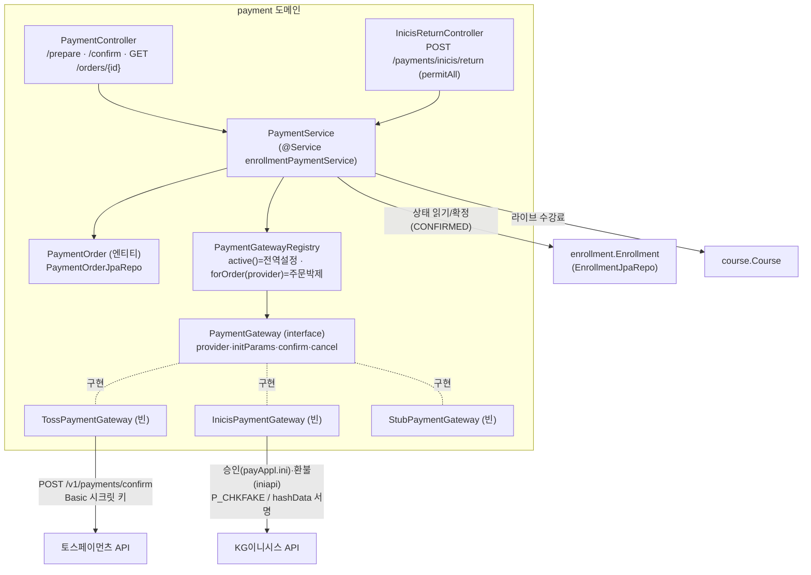
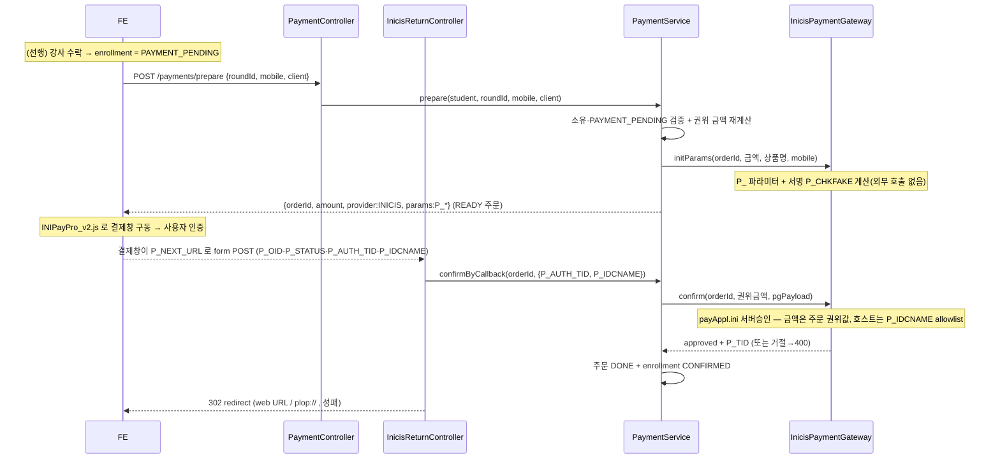
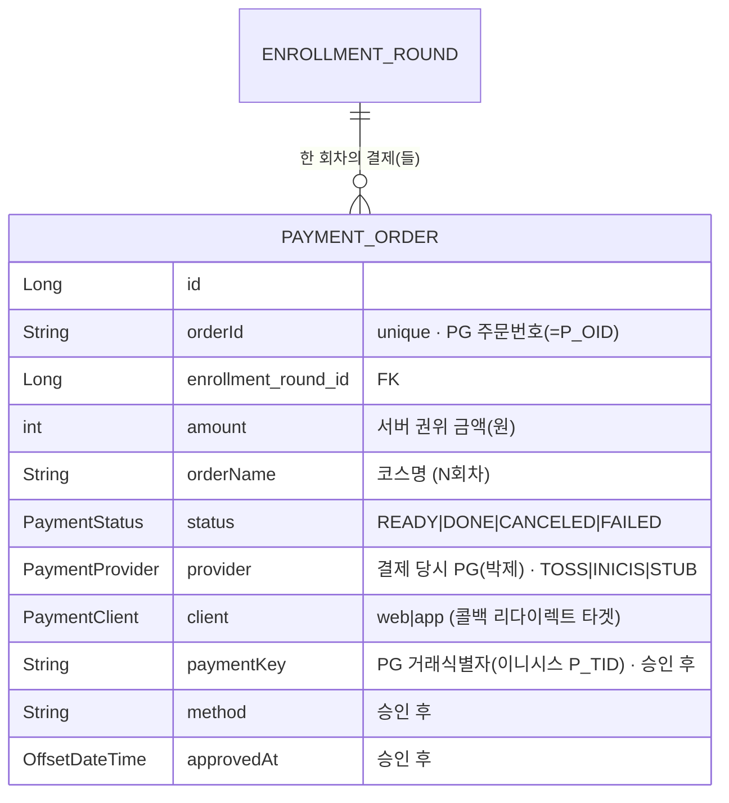

# 결제 (payment) 도메인

## 1. 한 줄 요약

수락된 수강신청(`enrollment` = `PAYMENT_PENDING`)의 **결제**를 책임지는 도메인. **PG 중립**(포트-어댑터/Strategy) — FE 결제창이 결제하고 **승인은 서버가** 호출한다. 실제 PG 는 `PaymentGateway` 뒤에서 교체된다(토스/이니시스/stub). **토스↔이니시스는 `PAYMENT_MODE` 환경변수로 갈아끼우는 플러그식 스왑**이고, **신규 주문**은 전역 설정(`pungdong.payment.mode`)이 PG 를 고르지만 그 PG 를 **주문에 박제**(`PaymentOrder.provider`)해서 **기존 주문의 승인·환불은 결제 당시 PG 로** 간다(`PaymentGatewayRegistry`) — PG 를 갈아탄 뒤 과거 주문 환불이 엉뚱한 PG 로 나가 실패하는 것을 막는다. 핵심 invariant 두 개: **(1) 금액은 서버 권위값** — 클라이언트가 보낸 amount 를 신뢰하지 않고 주문에 박힌 금액과 대조하며, PG 에도 **주문에 박힌 금액**을 보내 결제창 결제액과 다르면 PG 가 거절, **(2) 결제 완료 = 확정** — 승인 성공만이 enrollment 를 `CONFIRMED` 로 넘긴다. 시크릿(토스 시크릿키 / 이니시스 hashKey·apiKey)은 BE 밖으로 안 나간다(juso 승인키 기조).

> 레거시 `domain/payment/Payment`(옛 예약 플로우의 가격 산술 전용, PG 필드 없음)와 무관 — 새 `payment/` feature 패키지가 enrollment 옆에서 결제를 1급으로 소유.

## 2. 컴포넌트 지도

```mermaid
flowchart TB
    subgraph payment["payment 도메인"]
        Ctl["PaymentController<br/>/prepare · /confirm · GET /orders/{id}"]
        InicisRet["InicisReturnController<br/>POST /payments/inicis/return (permitAll)"]
        Svc["PaymentService<br/>(@Service enrollmentPaymentService)"]
        Order["PaymentOrder (엔티티)<br/>PaymentOrderJpaRepo"]
        Reg["PaymentGatewayRegistry<br/>active()=전역설정 · forOrder(provider)=주문박제"]
        Client["PaymentGateway (interface)<br/>provider·initParams·confirm·cancel"]
        Toss1["TossPaymentGateway (빈)"]
        Inicis["InicisPaymentGateway (빈)"]
        Stub["StubPaymentGateway (빈)"]
    end
    Ctl --> Svc
    InicisRet --> Svc
    Svc --> Order
    Svc --> Reg
    Reg --> Client
    Client -. 구현 .- Toss1
    Client -. 구현 .- Inicis
    Client -. 구현 .- Stub
    Svc -- "상태 읽기/확정(CONFIRMED)" --> Enr["enrollment.Enrollment<br/>(EnrollmentJpaRepo)"]
    Svc -- "라이브 수강료" --> Course["course.Course"]
    Toss1 -- "POST /v1/payments/confirm<br/>Basic 시크릿 키" --> TossApi["토스페이먼츠 API"]
    Inicis -- "승인(payAppl.ini)·환불(iniapi)<br/>P_CHKFAKE / hashData 서명" --> InicisApi["KG이니시스 API"]
```

단방향: payment → enrollment / course (읽기 + enrollment 확정). enrollment/course 는 payment 를 모른다.

## 3. 핵심 흐름

토스/STUB 는 FE 가 `confirm` 을 호출하지만, **이니시스는 결제창이 BE 콜백으로 form POST → BE 서버승인**(WebView 가 POST 본문을 못 읽어서). 아래는 이니시스 흐름:

```mermaid
sequenceDiagram
    participant FE
    participant Ctl as PaymentController
    participant Ret as InicisReturnController
    participant Svc as PaymentService
    participant PG as InicisPaymentGateway
    Note over FE: (선행) 강사 수락 → enrollment = PAYMENT_PENDING
    FE->>Ctl: POST /payments/prepare {roundId, mobile, client}
    Ctl->>Svc: prepare(student, roundId, mobile, client)
    Svc->>Svc: 소유·PAYMENT_PENDING 검증 + 권위 금액 재계산
    Svc->>PG: initParams(orderId, 금액, 상품명, mobile)
    Note over PG: P_ 파라미터 + 서명 P_CHKFAKE 계산(외부 호출 없음)
    Svc-->>FE: {orderId, amount, provider:INICIS, params:P_*} (READY 주문)
    Note over FE: INIPayPro_v2.js 로 결제창 구동 → 사용자 인증
    FE-->>Ret: 결제창이 P_NEXT_URL 로 form POST (P_OID·P_STATUS·P_AUTH_TID·P_IDCNAME)
    Ret->>Svc: confirmByCallback(orderId, {P_AUTH_TID, P_IDCNAME})
    Svc->>PG: confirm(orderId, 권위금액, pgPayload)
    Note over PG: payAppl.ini 서버승인 — 금액은 주문 권위값, 호스트는 P_IDCNAME allowlist
    PG-->>Svc: approved + P_TID (또는 거절→400)
    Svc->>Svc: 주문 DONE + enrollment CONFIRMED
    Ret-->>FE: 302 redirect (web URL / plop:// , 성패)
```

분기: 인증 실패(`P_STATUS≠00`) → 승인 호출 없이 fail 302. PG 승인 거절 → 주문 READY 유지 + fail 302(에러를 PG 에 안 던짐). 알 수 없는 주문(위조 P_OID) → web fail 302. 이미 DONE 주문 → 200 DONE(멱등). PAYMENT_PENDING 아닌 신청 prepare → 400. 비소유 → 400(존재 숨김). **금액은 콜백값(P_AMT)이 아니라 주문 권위값**으로 승인 전문에 실려 위변조를 막는다(승인엔 서명이 없음).

## 4. 데이터 모델

```mermaid
erDiagram
    ENROLLMENT_ROUND ||--o{ PAYMENT_ORDER : "한 회차의 결제(들)"
    PAYMENT_ORDER {
        Long id
        String orderId "unique · PG 주문번호(=P_OID)"
        Long enrollment_round_id "FK"
        int amount "서버 권위 금액(원)"
        String orderName "코스명 (N회차)"
        PaymentStatus status "READY|DONE|CANCELED|FAILED"
        PaymentProvider provider "결제 당시 PG(박제) · TOSS|INICIS|STUB"
        PaymentClient client "web|app (콜백 리다이렉트 타겟)"
        String paymentKey "PG 거래식별자(이니시스 P_TID) · 승인 후"
        String method "승인 후"
        OffsetDateTime approvedAt "승인 후"
    }
```

설계 의도: `orderId`(=P_OID) 가 unique + 멱등 키(콜백→주문 매핑, amount 조회 키). `amount` 는 prepare 시점에 **코스 라이브 수강료 + 입장료 스냅샷 + 장비 스냅샷** 으로 재계산해 박는다. `provider` 는 prepare 가 박제(V10), 승인·환불은 그 값으로 라우팅. `client` 는 콜백 리다이렉트 타겟(V11). 한 회차에 READY 주문은 하나만 멱등 재사용.

## 5. 보안 / 권한 매트릭스

| 엔드포인트 | 인증 | 소유권 검증 | 비고 |
|---|---|---|---|
| `POST /payments/prepare` | authenticated | round.enrollment.student == 나 + 상태 PAYMENT_PENDING | 비소유/없음 = 400, 결제대기 아님 = 400 |
| `POST /payments/confirm` | authenticated | order.enrollment.student == 나 | **TOSS/STUB 전용**. amount 불일치 = 400, 멱등(이미 DONE = 200) |
| `GET /payments/orders/{orderId}` | authenticated | order.enrollment.student == 나 | 성공화면·재진입 조회. 비소유 = 400 |
| `POST /payments/inicis/return` | **permitAll** | (P_AUTH_TID + 서버 권위 금액 대조가 방어) | 이니시스 결제창 form POST. 승인 후 302 리다이렉트(성패·web/app). `/payments/**` 보다 먼저 매칭 |

**이니시스는 confirm 주체가 BE**: 앱 WebView 가 결제창의 form POST 본문을 못 읽어, `P_NEXT_URL` 을 BE(`/payments/inicis/return`)로 두고 서버가 승인 후 GET 리다이렉트(주문에 박제된 `client` 로 web URL/`plop://` 선택, 고정 allowlist=오픈리다이렉트 방지). TOSS/STUB 는 FE 가 confirm. 세션리스 승인은 소유권 대신 **`P_AUTH_TID`(우리 콜백에만 옴) + 승인 전문의 서버 권위 금액 대조**가 방어(승인엔 서명이 없음).

**SSRF 방어**: 승인 호스트를 콜백 `P_IDCNAME`(예: `fc`→`fcpaypro.inicis.com`)으로 조립하므로, `idcHost()` 가 소문자 토큰만 허용해 `evil.com/` 같은 호스트 주입을 막는다.

**시크릿은 BE 전용** — 토스 시크릿키(승인 Basic 인증), 이니시스 `hashKey`(P_CHKFAKE 서명)·`apiKey`(환불 hashData). FE 엔 계산된 `params`(P_ 파라미터 + 서명값)만 내려간다. **`P_NEXT_URL`(콜백 주소)은 클라이언트가 정하지 못한다** — 서버 설정(`pungdong.payment.inicis.ret-url`) 고정.

## 6. 알려진 설계 간극

- 🟢 **이니시스 실 왕복 검증 완료** (2026-08-07, staging 테스트 MID `INIpayTest`) — **실카드**로 결제창→승인(payAppl)→DONE→CONFIRMED→**환불(iniapi)**→CANCELLED **전 사이클 성공**(카드 승인·취소 문자까지 수신). 저장한 tid 로 환불이 승인돼 **환불 tid 필드 OK**(P_TID 우선·P_APPL_TID 폴백 정상), hashData 바이트동일성·전액취소(type=refund) 정상. 검증법: raw JWT(Bearer 안 붙임) → `GET /enrollments/mine` → `POST /enrollments/{id}/refund`. prod MID(`plopol1192`)는 카드사심사 flip 때 재확인.
- 🔴 **webhook 미연동** — 비동기 상태(취소·부분취소 통보)를 받지 못한다. v1 은 콜백 승인 + 환불 API 동기 응답만. 카드+간편결제만 받아 가상계좌 입금통보는 불필요. → PG webhook 엔드포인트 + 서명 검증 후속(`venue/sync/SanityWebhookVerifier` 패턴 참고).
- 🟢 **환불 clientIp 등록 불요** (2026-08-07 검증) — 환불 전문의 `clientIp`(기본값·변동 egress)로 이니시스 환불이 통과했다. 즉 **고정 egress(fck-nat) 불필요** — 환불 자동화에 인프라 부담 0. (KCP 8012 취소-IP 제약과 달리 이니시스는 IP 대조를 안 하는 것으로 확인. prod MID 에서 재확인 권장이나 강신호. 만약 prod 에서 IP 제약이 나타나면 fck-nat/나노 NAT ~$7/월 옵션 — 히스토리는 git.)
- 🟡 **결제 미완 만료·환불 상태기계 부재** — 수락 후 결제를 안 하면 `PAYMENT_PENDING` 으로 무기한 좌석 점유. → 만료(자동 거절/슬롯 해제) + 환불(CANCELED) 상태기계 후속.
- 🟡 **입장료/장비 live 재계산 안 함** — 권위 금액은 수강료만 라이브, 입장료/장비는 신청 스냅샷. venue 블록 재도출 후속.
- 🟢 **정산(지급대행) 미연동** — 강사 정산은 이니시스 **지급대행**이 대행한다(런칭엔 상점관리자페이지 수동 운영, 지급대행 API 는 후속). 플랫폼 수수료/포인트 분해 정산은 우리 로직이 계산(런칭엔 포인트 없음). → 정책은 [docs/features/payment.md](../features/payment.md).
- 🟢 **캘린더 표시** — `PAYMENT_PENDING` 을 `confirmed` 버킷으로 합산(점유). FE 가 "미결제"를 별도 표시하려면 카운트 분리 후속.

## 7. 더 깊게: 테스트로 보기

실제 동작의 단일 출처 = `src/test/java/com/diving/pungdong/usecase/PaymentUseCaseTest.java`(실 H2 + 시큐리티 체인, `PaymentGateway` 만 `@MockBean`). `@DisplayName` 위→아래로 사양을 읽는다:

- `P1` 수락된 신청 prepare → READY 주문 + 권위 금액(365,000) + provider=STUB
- `P2` confirm 성공 → 주문 DONE + enrollment CONFIRMED
- `P3` 금액 불일치 → 400, PG 미호출, 신청 그대로
- `P4` confirm 멱등(재호출도 DONE)
- `P5` 결제대기 아닌 신청 prepare → 400
- `P6` 비소유 prepare → 400(존재 숨김)
- `P7` 결제대기 점유가 둘째 수락을 막음(정원 1)
- `I1` 이니시스 콜백 승인 → 서버 승인·확정 + app 성공 스킴 302 / `I2` PG 거절 → 주문 READY 유지, web fail 302 / `I3` 인증실패(P_STATUS≠00) → 승인 호출 없이 fail 302 / `I4` 알 수 없는 P_OID(위조) → web fail 302
- `O1` GET /payments/orders/{id} 소유자 조회(DONE·확정) / `O2` 남의 주문 조회 400
- `InicisPaymentTransmissionTest`(K/M/V) — 이니시스 전문·서명·hashData 바이트동일성·SSRF(외부 호출 0, 자격증명 불요)
- `RefundUseCaseTest` `RF4` — PG 스왑 후 과거 주문은 결제 당시 PG(이니시스)로 환불, 새 active(토스)로 안 나간다

enrollment 측 수락→PAYMENT_PENDING 전이는 `EnrollmentUseCaseTest`(A1/F1).
