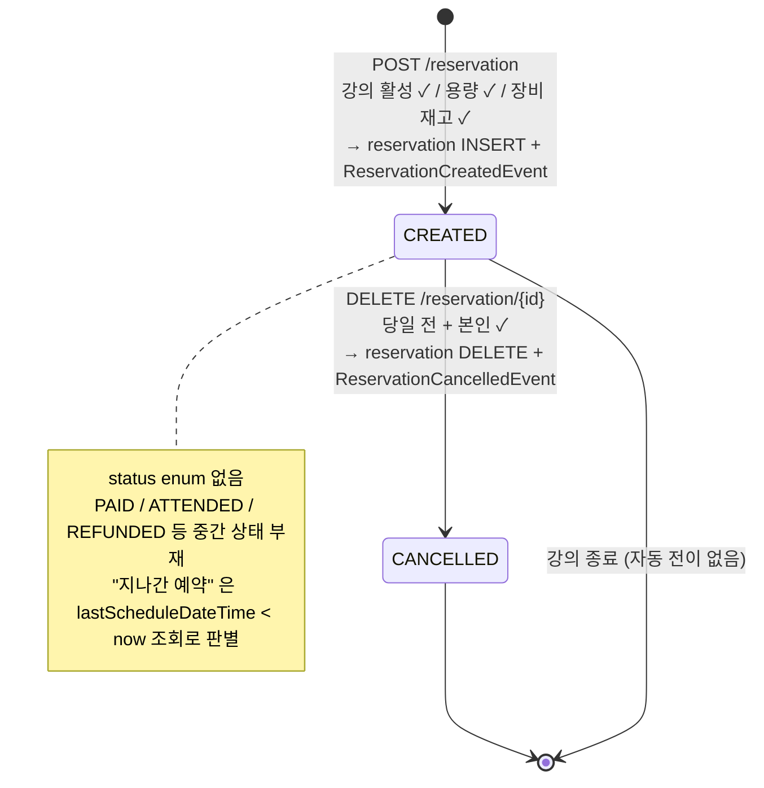
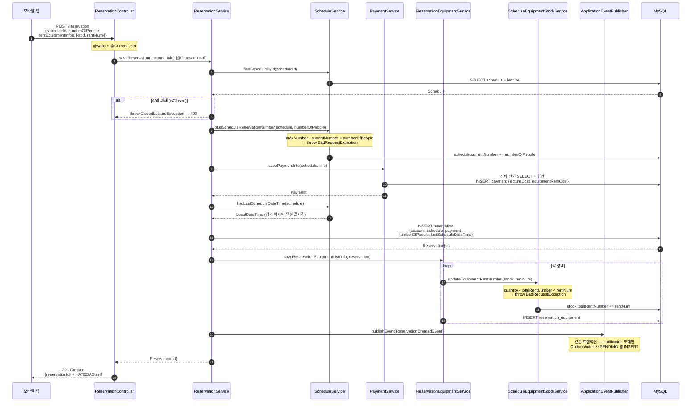
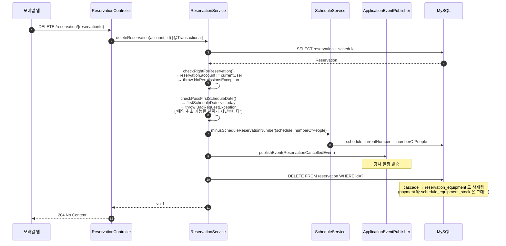
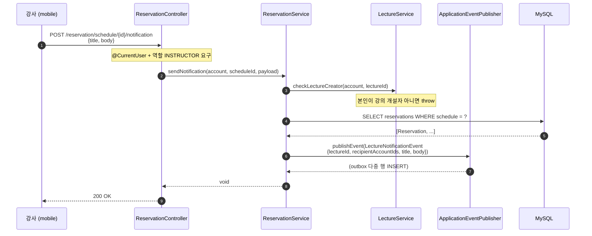
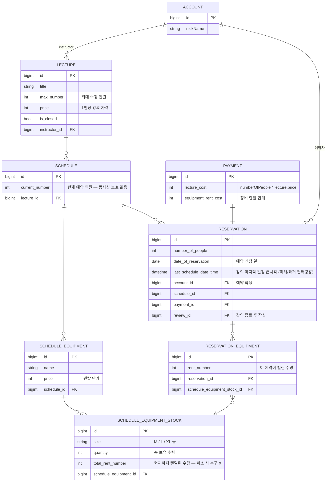

# 예약 (reservation)

## 한 줄 요약

학생이 강의 일정을 선택해 예약 → 인원 / 장비 / 결제 합산하여 `reservation` 행 생성 → 강사에게 `ReservationCreatedEvent` 발행. 취소는 **첫 일정 당일 전까지만** 가능. 상태 enum 없이 **존재(CREATED) / 삭제(CANCELLED)** 두 가지만 다루는 단순 설계 — 결제 / 환불 / 출석 같은 중간 상태는 의도적으로 부재.

> **이 문서는 "기획 변경 전 baseline" 입니다.** 동시성 / 환불 / 장비 재고 복구 등 알려진 간극이 여럿 있고 다 [§ 알려진 설계 간극](#알려진-설계-간극) 에 정리되어 있어요. 그쪽을 가장 먼저 읽으면 어디를 고쳐야 하는지 한눈에 보입니다.

---

## 컴포넌트 지도

```mermaid
flowchart TB
    Client["모바일 앱"]

    subgraph Domain["reservation 도메인"]
        Ctrl["ReservationController"]
        Svc["ReservationService<br/>@Transactional"]
        ReqSvc["ReservationEquipmentService"]
        Repo["ReservationJpaRepo<br/>+ ReservationEquipmentJpaRepo"]
    end

    subgraph Cross["크로스 도메인 협력자"]
        SchedSvc["ScheduleService<br/>(용량 ± / 첫·끝 일정 시각)"]
        EqStockSvc["ScheduleEquipmentStockService<br/>(장비 재고 차감)"]
        PaySvc["PaymentService<br/>(금액 계산 + Payment 저장)"]
        LectSvc["LectureService<br/>(강사 권한 / 강의 폐쇄 여부)"]
        Pub["ApplicationEventPublisher<br/>(알림 도메인으로 발행)"]
    end

    DB[("MySQL<br/>reservation · reservation_equipment<br/>payment · schedule.current_number<br/>schedule_equipment_stock.total_rent_number")]

    Client -->|"POST /reservation<br/>DELETE /reservation/{id}<br/>GET /reservation/list · /future · /past · ..."| Ctrl
    Ctrl -->|@CurrentUser| Svc

    Svc --> SchedSvc
    Svc --> PaySvc
    Svc --> LectSvc
    Svc --> ReqSvc
    Svc --> Repo
    Svc --> Pub

    ReqSvc --> EqStockSvc
    ReqSvc --> Repo

    SchedSvc --> DB
    PaySvc --> DB
    EqStockSvc --> DB
    Repo --> DB
```

이 도메인이 다른 도메인을 **호출하는 방향만 있고**, 다른 도메인이 reservation 을 직접 호출하지는 않음. 단방향이라 분리가 비교적 깔끔.

---

## 예약 생명주기



---

## 흐름 1: 예약 생성



**한 트랜잭션 안에서 atomic 으로 일어나는 변경** (전부 같은 `@Transactional`):

1. `schedule.current_number` 증가
2. `payment` INSERT
3. `reservation` INSERT
4. `schedule_equipment_stock.total_rent_number` 증가 (각 렌탈 장비별)
5. `reservation_equipment` INSERT (각 렌탈 장비별)
6. `notification_outbox` INSERT (publisher 의 트랜잭션에 합류)

어느 한 단계라도 throw 하면 전부 롤백 → 부분 상태 노출 없음.

**검증 거부 분기**:

| 단계 | 조건 | 응답 |
|---|---|---|
| ③ | `lecture.isClosed == true` | 403 (`ClosedLectureException`) |
| ④ | `maxNumber - currentNumber < numberOfPeople` | 400 — "수강 신청 인원 수를 초과 하였습니다" |
| ⑨ | 어떤 장비라도 `quantity - totalRentNumber < rentNum` | 400 — "남은 재고 수량이 없습니다" |

---

## 흐름 2: 예약 취소



**중요한 부분**: 취소 시 `schedule.current_number` 는 감소하지만 **`schedule_equipment_stock.total_rent_number` 는 감소하지 않음**. 장비 재고가 점진적으로 고갈되는 버그 → [§ 알려진 설계 간극](#알려진-설계-간극) 의 2번 항목.

또한 `payment` 행은 DELETE 안 되고 그대로 남아있음 — 환불 정책이 없는 현재 구조의 부산물.

---

## 흐름 3: 강사가 일정의 예약자들에게 알림



`LectureNotificationEvent` 가 다중 수신자를 가지는 유일한 이벤트 — [notification.md](notification.md) 참고.

---

## 데이터 모델



**의도된 / 의도되지 않은 설계**:

- **`status` enum 부재** — 의도된 단순화. 다만 결제/출석 도입 시 큰 리팩토링 비용.
- **`last_schedule_date_time` 캐시 컬럼** — `findMyFuture/Past` 쿼리 단순화를 위한 비정규화. 트레이드오프: schedule 의 일정이 변경되면 재계산 필요 (현재 추적 안 함).
- **`payment_id` FK 가 reservation 측에 있음** — 1:1 인데 reservation 이 payment 를 소유. 환불을 위한 별도 행이 필요해지면 payment 측 status 필드를 추가해야 함.

---

## 장비 렌탈 — 데이터 흐름

```
Lecture          (강의)
  └─ Schedule    (강의의 1회차 일정 묶음)
       ├─ ScheduleDateTime[]              (구체적 날짜/시간)
       └─ ScheduleEquipment[]             (이 일정에서 빌릴 수 있는 장비)
            └─ ScheduleEquipmentStock[]   (사이즈별 재고)
                ├─ quantity (총)
                └─ total_rent_number (현재까지 빌린 합계)
                    ↑
                    └─ 예약 생성 시 +rentNumber
                       예약 취소 시 — 감소 안 함 (버그)
                
Reservation
  └─ ReservationEquipment[]              (이 예약이 빌린 장비들)
       └─ ScheduleEquipmentStock  ───────┘  (참조)
       └─ rent_number                      (몇 개 빌렸나)
```

**가격 합산** (`PaymentService.calcEquipmentTotalRentCost`):

```
totalCost = Σ (info.rentNumber × scheduleEquipmentStock.scheduleEquipment.price)
```

→ Payment 의 `equipment_rent_cost` 에 저장.

---

## 결제 — 현재 stub 상태

| 항목 | 현 구현 |
|---|---|
| Payment 행 | 단순히 금액만 저장 (lectureCost / equipmentRentCost) |
| 결제 게이트웨이 | **연동 없음.** 클라이언트가 결제 책임을 따로 가지거나 추후 추가 |
| 결제 상태 | **enum 없음.** 결제 성공/실패/대기 표현 불가 |
| 환불 | **로직 없음.** 예약 취소해도 payment 행 그대로 남음 |
| Webhook / idempotency | 없음 |

→ 실제 PG (토스 / 카카오페이 / Stripe) 연동 시 Payment 도메인이 대규모 확장 필요. [§ 확장 자리](#확장-자리) 참고.

---

## 보안 / 권한 매트릭스

| 엔드포인트 | 인증 | 역할 | 소유권 확인 | 비고 |
|---|---|---|---|---|
| `POST /reservation` | 필요 | any | N/A (생성) | 본인 계정으로 생성 |
| `GET /reservation/list` | 필요 | any | implicit (account 필터) | 본인 예약만 조회 |
| `GET /reservation/future` | 필요 | any | implicit | 본인의 미래 예약 |
| `GET /reservation/past` | 필요 | any | implicit | 본인의 과거 예약 |
| `GET /reservation` | 필요 | any | **explicit** | `checkRightForReservation` 통과 후 상세 반환 |
| `GET /reservation/schedule` | 필요 | any | ❌ | reservationId 만 받으면 누구나 조회 — **보안 간극** |
| `GET /reservation/location` | 필요 | any | ❌ | 동일 — **보안 간극** |
| `GET /reservation/equipment/list` | 필요 | any | ❌ | 동일 — **보안 간극** |
| `DELETE /reservation/{id}` | 필요 | any | **explicit** | 본인 + 당일 전 |
| `POST /reservation/schedule/{id}/notification` | 필요 | **INSTRUCTOR** | explicit (강의 개설자) | `checkLectureCreator` 통과 후 발송 |

---

## 알려진 설계 간극

기획 변경 들어가기 전, 현재 코드의 알려진 부채를 한 곳에 모아둠. **수정은 아직 하지 않음** — baseline 으로 보존.

### 심각도 🔴 (출시 전 수정 권장)

1. **동시성 보호 없음 — 초과 예약 가능**

   `Schedule.current_number` 증감 시 비관/낙관락 둘 다 없음. 두 학생이 동시에 마지막 자리를 예약하면 둘 다 통과 → `maxNumber` 초과 가능.
   
   ```
   T1: SELECT (current=4)  T2: SELECT (current=4)
   T1: check 5-4>=1 ✓      T2: check 5-4>=1 ✓
   T1: UPDATE current=5    T2: UPDATE current=5  ← 둘 다 통과, 실제론 6명
   ```
   
   **해결안**: `findByIdWithLock` 패턴 (`@Lock(LockModeType.PESSIMISTIC_WRITE)`) 또는 `@Version` 컬럼으로 optimistic lock. 같은 문제가 `ScheduleEquipmentStock.total_rent_number` 에도 있음.

2. **예약 취소 시 장비 재고 미복구**

   `deleteReservation` 이 `cascade.REMOVE` 로 `reservation_equipment` 만 지우고 `schedule_equipment_stock.total_rent_number` 는 그대로. 시간이 지나면 장비 재고가 고갈된 것처럼 보임.
   
   **해결안**: `deleteReservation` 에서 `ReservationEquipment` 들을 순회하며 `updateEquipmentRentNumber(stock, -rentNumber)` 호출.

3. **중복 예약 방지 없음**

   같은 학생이 같은 일정에 여러 번 예약 가능. DB 유니크 제약 없음, 애플리케이션 체크 없음. capacity 가 차면 거부되긴 하지만 의도적 동작은 아님.
   
   **해결안**: `(account_id, schedule_id)` UNIQUE 제약 + 서비스 레이어 명시적 체크.

### 심각도 🟡 (출시 후 정리 가능)

4. **읽기 엔드포인트 일부에 소유권 체크 없음**

   `/reservation/schedule`, `/reservation/location`, `/reservation/equipment/list` 는 `reservationId` 만 받으면 응답. 다른 사용자의 예약 정보 노출 가능 (강의 위치는 어차피 강의 detail 에서 보이지만, "누가 예약했는지" 가 새는 건 문제).
   
   **해결안**: 세 엔드포인트 모두에 `checkRightForReservation` 또는 그에 준하는 검증 추가.

5. **`status` enum 부재**

   결제 / 출석 / 환불 같은 상태가 들어오면 큰 리팩토링 필요. 지금 추가하는 비용 < 나중에 추가하는 비용.
   
   **해결안**: `ReservationStatus { CREATED, CANCELLED }` enum 부터 시작 → PAID / ATTENDED / REFUNDED 등 점진 추가.

6. **`Payment` 가 stub**

   환불 없음, 결제 상태 없음, PG 연동 없음. 실 결제 들어가는 순간 큰 변경 필요.
   
   **해결안**: 별도 PR 로 Payment 도메인 확장 — 게이트웨이 어댑터 인터페이스, 상태 enum, webhook 핸들러.

7. **`last_schedule_date_time` 비정규화 컬럼이 schedule 변경 시 재계산 안 됨**

   강의 일정이 추가 / 삭제 / 변경되면 기존 reservation 의 `last_schedule_date_time` 이 stale 됨. 미래/과거 필터링이 틀어짐.
   
   **해결안**: schedule 변경 시 해당 schedule 의 모든 reservation 의 `last_schedule_date_time` 도 같이 갱신, 또는 컬럼 제거하고 쿼리에서 ScheduleDateTime 직접 조인.

### 심각도 🟢 (생각해볼 만한 것)

8. **취소 가능 시점이 "당일 이전" 으로 hard-coded** — 강의별로 취소 정책이 다를 수 있는데 현재는 모든 강의에 동일 규칙.

9. **`numberOfPeople` 가 1 이상인지 검증 부재** — 0 또는 음수가 들어오면? validation 으로 막혀 있는지 확인 필요 (DTO 의 @Min 같은 어노테이션 부재 가능성).

---

## 확장 자리 (예상되는 변경)

기획 변경이 들어왔을 때 닿을 가능성이 높은 영역.

| 영역 | 변경 시 손 댈 곳 |
|---|---|
| 결제 게이트웨이 연동 | Payment 도메인 + ReservationService.saveReservation 의 payment 생성 단계 + webhook 컨트롤러 추가 |
| 환불 / 부분 환불 | Payment.status enum + ReservationService.deleteReservation + 외부 PG 환불 호출 |
| 상태 관리 (PAID / ATTENDED / REFUNDED) | Reservation.status enum + state transition 로직 + 기존 미래/과거 필터링 쿼리도 재검토 |
| 강의별 취소 정책 | Lecture 에 `cancellable_until_hours` 같은 컬럼 + `checkPassFirstScheduleDate` 로직 일반화 |
| 출석 체크 | Reservation 에 출석 여부 컬럼 + 강사용 출석 입력 엔드포인트 |
| 동시성 / 락 | ScheduleService / ScheduleEquipmentStockService 에 락 추가 (PR 1순위) |
| 그룹 예약 / 친구와 함께 | numberOfPeople > 1 일 때의 의미 명확화 — 현재는 1명이 N자리 점유 |

---

## 더 깊게: 테스트로 보기

**현재 reservation 도메인은 use-case 테스트가 없습니다.** 다른 도메인 (sign-up / notification) 과 달리 안전망이 약함 — 기획 변경 들어가기 전에 use-case 테스트부터 추가하는 게 안전.

현재 있는 테스트:

| 위치 | 종류 | 검증 범위 |
|---|---|---|
| [`service/ReservationServiceTest`](../../src/test/java/com/diving/pungdong/service/ReservationServiceTest.java) | unit (Mockito) | 당일 취소 거부, 미래/과거 필터링, 리뷰 존재 여부 |
| [`repo/reservation/ReservationJpaRepoTest`](../../src/test/java/com/diving/pungdong/repo/reservation/ReservationJpaRepoTest.java) | repo (H2) | findByAccountAndAfter/Before Today 쿼리 |
| [`controller/reservation/ReservationControllerTest`](../../src/test/java/com/diving/pungdong/controller/reservation/ReservationControllerTest.java) | controller (MockMvc + @MockBean) | HTTP wiring + REST Docs snippet (실 로직 검증 없음) |

**기획 변경 들어가기 전 추가하면 좋을 use-case 시나리오** (`src/test/java/com/diving/pungdong/usecase/ReservationUseCaseTest.java` 신설 권장):

- `S1`: 정상 예약 — 응답 + DB 상태 + outbox 행
- `S2`: 동일 학생이 같은 일정에 다시 예약 → ??? (현재는 통과되어 버림 — 이 동작을 spec 으로 캡처)
- `C1`: 용량 마지막 자리에서 1명 예약 → currentNumber 정확 증가
- `C2`: 강의 폐쇄 시 거부 (ClosedLectureException)
- `C3`: 장비 재고 부족 시 거부 + reservation INSERT 도 같이 롤백되는지
- `X1`: 당일 취소 시 거부
- `X2`: 미래 취소 시 currentNumber 감소 + ReservationCancelledEvent 발행 + payment 행은 잔존 (현 buggy spec 캡처)
- `X3`: 본인 아닌 예약 취소 시 NoPermissionsException

위 시나리오를 먼저 작성해두면, 기획 변경 후 깨지는 시나리오만 골라서 의식적으로 갱신할 수 있음 — `AuthUseCaseTest.L1` 가 logout no-op 을 spec 으로 캡처해뒀던 방식과 동일.
