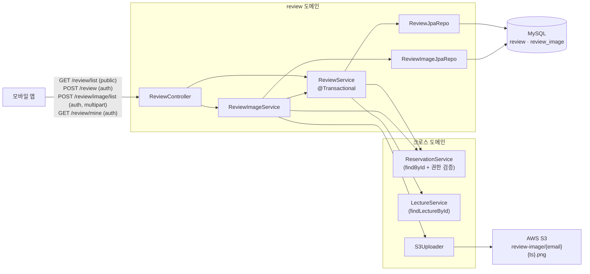
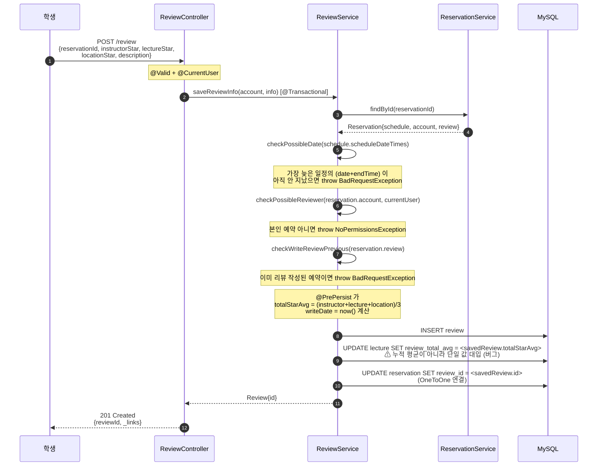
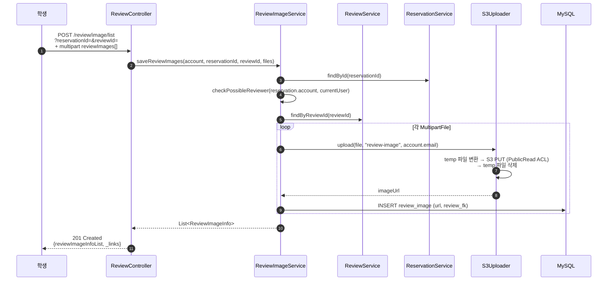
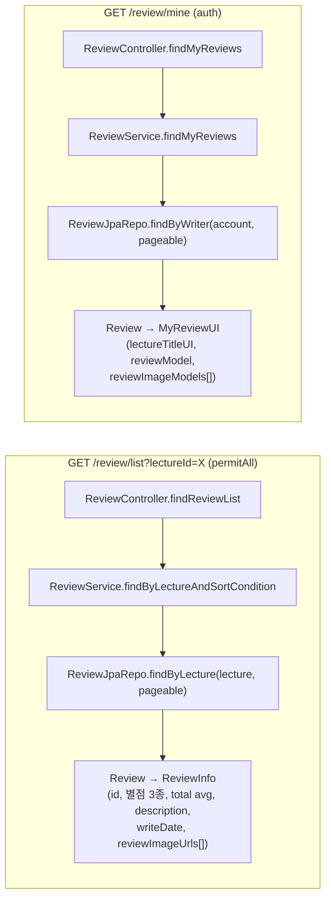
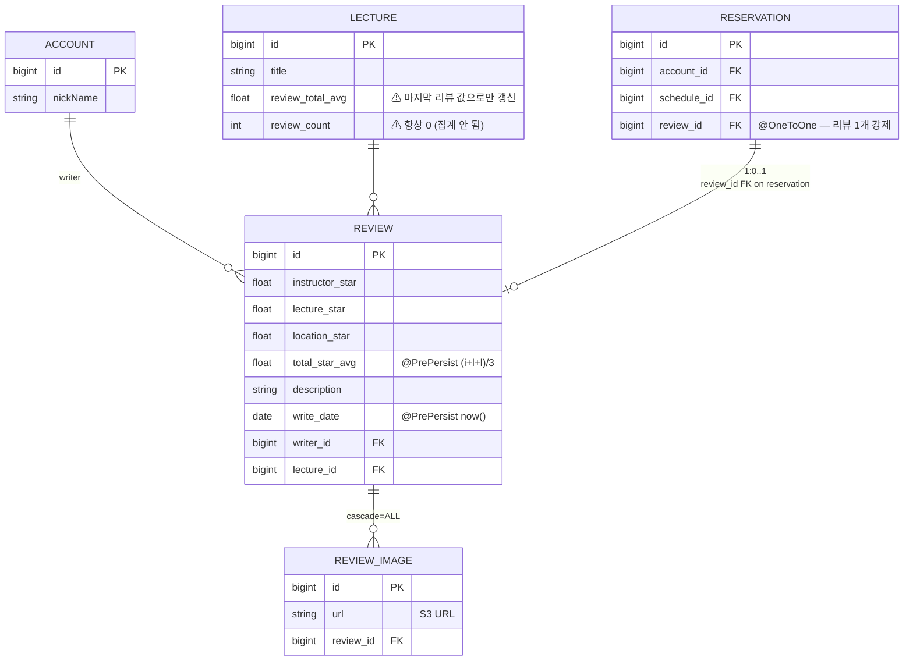
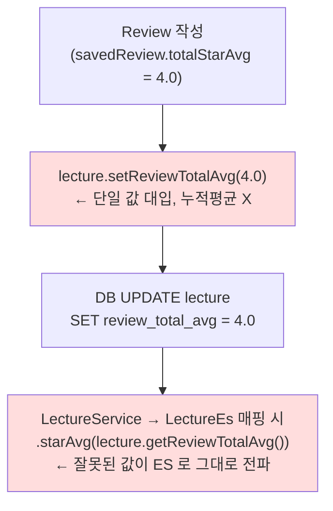

# 후기 (review)

## 한 줄 요약

예약을 가진 학생이 **마지막 일정이 지난 후** 강의에 별점 3종 (강사 / 강의 / 장소) + 본문 + 이미지 다중을 남길 수 있다. 단 **리뷰 통계 (`Lecture.reviewCount`, `Lecture.reviewTotalAvg`) 가 누적 평균이 아니라 마지막 리뷰 값으로 덮어쓰기 되는 버그**가 있어서, 현재 별점 / 리뷰 수 표시가 부정확. 리뷰 작성 시점의 핵심 invariant 들만 옳고, 그 이후 집계가 깨져 있음.

> **이 문서는 baseline.** [reservation.md](reservation.md) / [lecture.md](lecture.md) 와 동일한 의도로, 기획 변경 들어가기 전에 현재 상태를 박아둠. [§ 알려진 설계 간극](#알려진-설계-간극) 의 통계 버그가 가장 시급.

---

## 컴포넌트 지도



`review` 도메인은 외부 호출이 **단방향 in**: reservation / lecture 를 읽기만 하고 그쪽 상태를 변경하진 않음. 단 **`Lecture.reviewTotalAvg` 만은 직접 수정** — 이게 부분 동기화의 원인 ([§ 통계 갱신](#통계-갱신-현재-부정확)).

---

## 흐름 1: 후기 작성



**작성 가능 조건 (전부 통과해야 작성됨)**:

1. `Reservation` 이 존재
2. **마지막 `ScheduleDateTime` 의 `(date, endTime)` 이 현재 시각보다 앞** — 강의가 끝났어야 함
3. 예약의 소유자와 작성자가 동일
4. 같은 예약에 이미 리뷰가 없음 (`Reservation.review == null`)

**의도된 invariant**: 예약 1개 당 리뷰 최대 1개 (`Reservation.review` 가 `@OneToOne`).

---

## 흐름 2: 후기 이미지 업로드 (별도 호출)



**경로 규약**: S3 key 가 `review-image/{userEmail}{LocalDateTime.now()}.png` — **확장자 무조건 `.png`** (Content-Type 검증 없음). JPEG / WebP 등도 `.png` 확장자로 저장됨.

**이미지가 본 리뷰 POST 와 분리된 이유**: 본문 검증 (날짜 / 권한 / 중복) 을 먼저 통과해야 이미지 업로드 비용을 들임. 단 분리되어 있어서 **이미지 업로드 후 본문이 사라지면 (DB 삭제 등) S3 파일이 orphan** — 정리 로직 없음.

---

## 흐름 3: 조회



두 조회 경로의 차이: `/review/list` 는 한 강의의 모든 리뷰 (public), `/review/mine` 은 본인이 쓴 리뷰 + 강의 정보 조인 (auth).

---

## 데이터 모델



**`Reservation.review` (OneToOne)**:
- FK 가 reservation 측에 있음 → 1 예약 = 최대 1 리뷰 강제
- Review 측에는 역방향 매핑 없음 (단방향) → Review 만 보고선 어느 reservation 인지 모름. 보고 싶으면 ReviewService 가 별도 쿼리 필요

---

## 통계 갱신 (현재 부정확)



**현재 코드 (`ReviewService.saveReviewInfo`)**:

```java
lecture.setReviewTotalAvg(savedReview.getTotalStarAvg());
```

**문제**:

- 누적 평균 계산 없음 → 마지막에 작성된 리뷰의 별점이 lecture 전체 별점이 됨
- `Lecture.reviewCount` 는 어디서도 증감 안 됨 → 영원히 0
- ES 로 잘못된 값이 전파됨 (Garbage In Garbage Out)

**올바른 동작**:

```java
List<Review> all = reviewRepo.findByLecture(lecture);
double avg = all.stream().mapToDouble(Review::getTotalStarAvg).average().orElse(0.0);
lecture.setReviewTotalAvg((float) avg);
lecture.setReviewCount(all.size());
```

→ 단순한 수정이지만 **동시성 보호 (락) 도 같이** 들어가야 안전. [§ 알려진 설계 간극](#알려진-설계-간극) 의 1 / 2 번.

---

## 보안 / 권한 매트릭스

| 엔드포인트 | 인증 | 권한 / 검증 |
|---|---|---|
| `GET /review/list?lectureId=` | permitAll | — (public) |
| `GET /review/mine` | 필요 | 본인 작성 리뷰만 (`findByWriter`) |
| `POST /review` | 필요 | 본인 예약 + 마지막 일정 지남 + 중복 작성 X |
| `POST /review/image/list` | 필요 | 본인 예약 + 본인 리뷰 |

리뷰 **삭제 / 수정 엔드포인트 자체가 없음** — 일단 쓰면 영구.

---

## 알려진 설계 간극

### 심각도 🔴

1. **`Lecture.reviewTotalAvg` 가 누적 평균이 아닌 단일 값**
   - 마지막 리뷰의 totalStarAvg 가 강의 별점이 됨 → 검색 / 추천 / 표시 모두 부정확
   - **해결**: `ReviewService.saveReviewInfo` 에서 전체 리뷰 평균 재계산.

2. **`Lecture.reviewCount` 가 영원히 0**
   - 어디서도 증감 코드 없음. 인기 강의 정렬이 작동 안 함 (LectureJpaRepo.findPopularLectures 가 reviewCount 기준 정렬).
   - **해결**: 1번 해결과 함께 `lecture.setReviewCount(all.size())`.

3. **잘못된 통계가 ES (`LectureEs.starAvg`, `LectureEs.reviewCount`) 로 그대로 전파**
   - LectureService 의 Lecture → LectureEs 매핑 시 단순 복사.
   - **해결**: 통계 자체를 고치면 자동 해결.

### 심각도 🟡

4. **통계 갱신에 락 부재 (race condition)**
   - 동시에 두 학생이 리뷰 작성 → 한 쪽 값이 다른 쪽을 덮어씀.
   - **해결**: `Lecture` 에 `@Version` (optimistic) 또는 `@Lock(PESSIMISTIC_WRITE)` (pessimistic).

5. **이미지 형식 검증 부재**
   - 확장자가 무조건 `.png` 로 강제 저장 (Content-Type 무관). JPEG 도 png 로 인식되는 이상한 상태.
   - **해결**: S3Uploader 에서 MultipartFile.getContentType() 또는 originalFilename 으로 분기.

6. **리뷰 / 이미지 삭제 엔드포인트 부재**
   - 잘못 올린 리뷰 / 이미지 영구. 사용자가 자기 콘텐츠를 통제할 수 없음.
   - **해결**: `DELETE /review/{id}`, `DELETE /review/image/{id}` 추가 + S3 파일 정리.

7. **S3 orphan**
   - 이미지 업로드 후 리뷰 본문이 사라지면 S3 파일 남음. 비용 누적.
   - **해결**: 리뷰 삭제 시 S3 파일 같이 삭제 (deleteFileFromS3 가 S3Uploader 에 이미 있지만 호출처 없음).

### 심각도 🟢

8. **이미지 업로드가 리뷰 본문과 분리** — 호출 순서가 명확하지 않으면 클라이언트가 혼란. UI wizard 가 보장해야 함.

9. **`/review/list` 에 `isClosed` 강의 리뷰도 노출** — [lecture.md](lecture.md) 의 폐쇄 강의 검색 노출 문제와 같은 맥락.

---

## 더 깊게: 테스트로 보기

**use-case 테스트 없음** — [reservation.md](reservation.md) 와 동일. 기획 변경 후 추가 권장.

존재하는 테스트:

| 위치 | 검증 범위 |
|---|---|
| [`controller/review/ReviewControllerTest`](../../src/test/java/com/diving/pungdong/controller/review/ReviewControllerTest.java) | HTTP wiring + REST Docs (Mock 기반, 비즈니스 로직 검증 X) |
| [`service/ReviewServiceTest`](../../src/test/java/com/diving/pungdong/service/ReviewServiceTest.java) | `checkPossibleDate` 의 3 시나리오 (강의 종료 전 / 같은 날 종료 시간 전 / 정상 통과) |

**추가하면 좋을 use-case 시나리오** (기획 안정화 후):

- `W1`: 정상 작성 → 201 + lecture stats 갱신 (현재 buggy spec 캡처)
- `W2`: 마지막 일정 전 작성 시도 → 400
- `W3`: 본인 예약 아닌데 작성 시도 → 403
- `W4`: 같은 예약에 두 번 작성 → 400
- `S1`: 두 학생이 거의 동시에 작성 → 최종 reviewTotalAvg 가 누적 평균인가? (현 spec: 마지막 값으로 덮어쓰기)
- `S2`: 작성 후 lecture.reviewCount 증가? (현 spec: 0 유지)
- `I1`: 이미지 업로드 → S3 URL 반환 + DB 행 생성
- `I2`: JPEG 업로드 시 확장자가 png 로 저장됨 (현 buggy spec 캡처)
- `L1`: `/review/list` 가 polic 강의의 리뷰도 보여줌 (현 spec 캡처)
