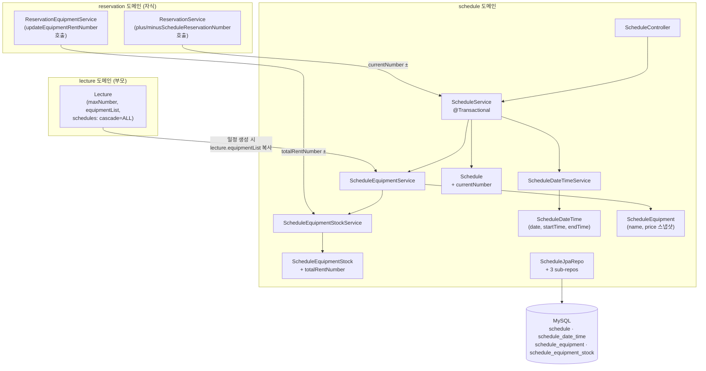
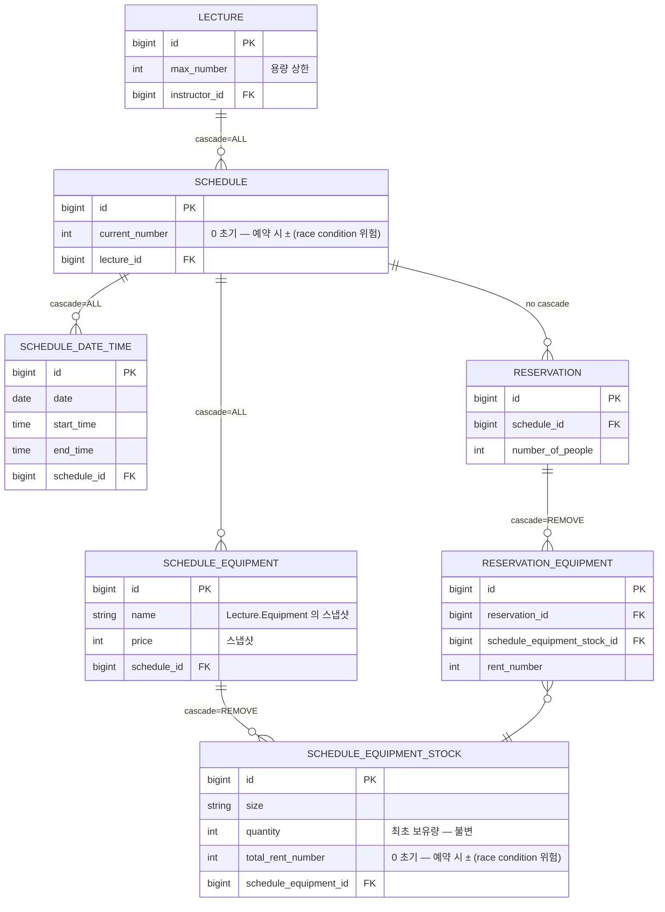
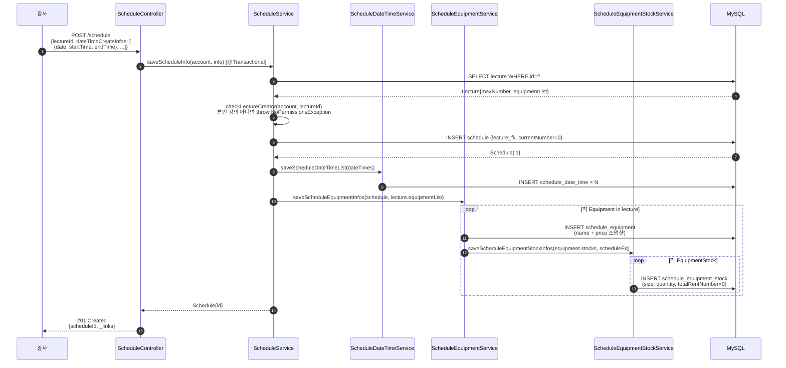
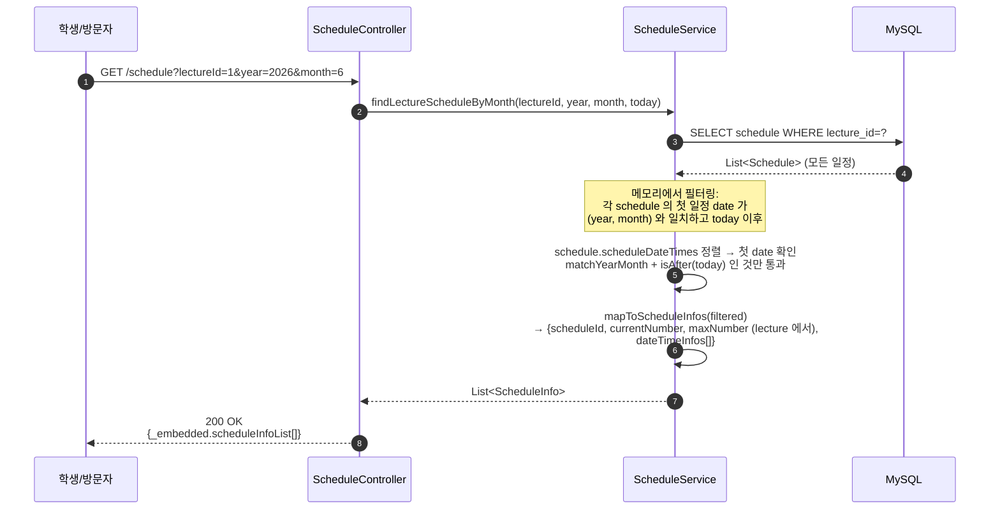
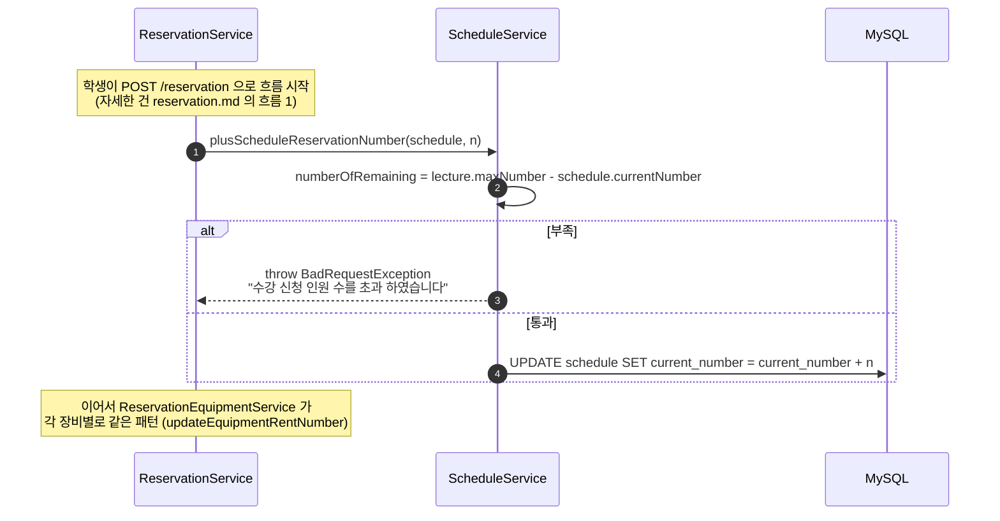
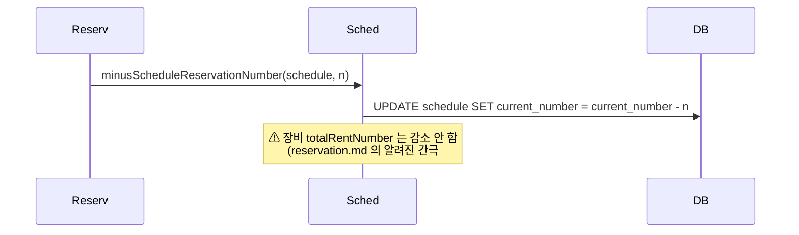
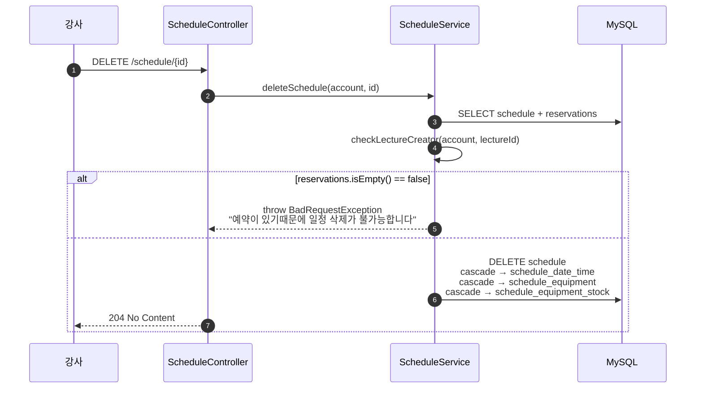

# 일정 (schedule)

## 한 줄 요약

**[lecture](lecture.md) 과 [reservation](reservation.md) 을 잇는 중간 도메인.** 강사가 강의 생성 후 별도로 일정 (날짜+시간 N개 + 렌탈 가능 장비 스냅샷) 을 만들면, 학생이 그 일정을 골라 예약한다. **`Schedule.currentNumber` 와 `ScheduleEquipmentStock.totalRentNumber` 가 모든 예약 흐름의 중심**이고, 이 둘에 대한 동시성 보호가 없어서 reservation 도메인의 race condition 도 사실은 이 도메인 책임.

> Lecture 가 "상품 정의", Schedule 이 "판매 가능한 시간 슬롯", Reservation 이 "구매" — 세 도메인의 분담을 이렇게 이해하면 흐름이 명확해진다.

---

## 컴포넌트 지도



**책임 경계**:

- **Schedule 자체는 자식 생성 / 조회 / 삭제만**. 수정 API 없음 (한 번 만들면 그대로).
- **현재 예약 인원 / 장비 재고 변경**은 reservation 도메인이 schedule 서비스 메서드를 호출해서 한다. schedule 도메인 내부에서는 트리거 안 됨.

---

## 데이터 모델



**의도된 / 의도되지 않은 설계**:

- **`ScheduleEquipment` 는 `Lecture.Equipment` 의 스냅샷.** 강의 생성 시점의 장비 / 가격이 일정에 박힘. 강사가 나중에 강의 장비를 수정해도 기존 일정은 영향 없음 — **데이터 일관성 측면에서는 좋고, UX 측면에서는 혼란 가능** (강사가 어느 시점 가격으로 받는지 모름).
- **`ScheduleEquipmentStock.quantity` 는 불변** (수정 엔드포인트 없음). 한 번 정한 재고로 끝.
- **`Reservation` 은 schedule 에 cascade 안 됨.** 일정 삭제하려면 예약이 0개여야 함 — 강사가 일정을 못 지우는 상황 방지.

---

## 흐름 1: 일정 생성 (강사)



**한 트랜잭션 안에서 다 수행** — schedule + N×ScheduleDateTime + M×ScheduleEquipment + 각 장비당 K×ScheduleEquipmentStock 까지 atomic.

**시간 충돌 검증 없음**: 같은 강사 / 같은 강의의 다른 일정과 시간이 겹쳐도 거부 안 됨. [§ 알려진 설계 간극](#알려진-설계-간극) 의 4번.

---

## 흐름 2: 월별 일정 조회 (학생 / 공개)



**메모리 필터링**: DB 에서 강의의 모든 일정을 가져온 후 in-memory 에서 월 / 미래 필터링. 일정이 많은 강의일수록 비효율. [§ 알려진 설계 간극](#알려진-설계-간극) 의 5번.

---

## 흐름 3: 예약 시 currentNumber 증가 (reservation 도메인이 호출)



**race condition (이 도메인의 가장 큰 부채)**:

```
maxNumber=10, currentNumber=8

  Thread A                 Thread B
  ─────────────            ─────────────
  SELECT (current=8)       SELECT (current=8)
  remaining = 2            remaining = 2
  check 2 >= 2 ✓           check 2 >= 2 ✓
  UPDATE current=10        UPDATE current=10
  COMMIT                   COMMIT

  → 실제로는 4명이 예약 시도했고 둘 다 통과
     최종 current=10 이지만 진짜로는 12 여야 함
```

**`ScheduleEquipmentStock.totalRentNumber` 도 동일 패턴 / 동일 위험.**

---

## 흐름 4: 예약 취소 시 감소



**부분 복구**: schedule.currentNumber 는 감소하지만 schedule_equipment_stock.total_rent_number 는 안 줄어듦 → 장비 재고가 영원히 차감된 상태로 남음. 이건 reservation 도메인의 버그로 잡혀있지만 실제 데이터는 이 도메인에 있음 — 양쪽에서 모두 보이는 부채.

---

## 흐름 5: 일정 삭제



**hard delete** + 예약 존재 시 거부. 안전한 설계 — 잘못해서 예약이 cascade 로 사라지진 않음.

---

## 보안 / 권한 매트릭스

| 엔드포인트 | 인증 | 권한 / 검증 |
|---|---|---|
| `POST /schedule` | 필요 | `checkLectureCreator` (본인 강의) |
| `GET /schedule?lectureId=&year=&month=` | permitAll | — |
| `GET /schedule/equipments?scheduleId=` | permitAll | — |
| `GET /schedule/reservation-info?scheduleId=` | 필요 | `checkLectureCreator` (강사만 자기 강의의 예약 보기) |
| `DELETE /schedule/{id}` | 필요 | `checkLectureCreator` + 예약 0개 |

읽기는 모두 public, 쓰기 / 강사용 조회는 강사 권한.

---

## 주요 서비스 메서드 (cross-domain reference)

`ScheduleService` 가 다른 도메인에 노출하는 표면:

| 메서드 | 호출자 | 역할 |
|---|---|---|
| `findScheduleById(id)` | ReservationService, ReviewService, LectureService | ID 로 일정 조회 |
| `plusScheduleReservationNumber(schedule, n)` | **ReservationService.saveReservation** | 용량 체크 + currentNumber 증가 |
| `minusScheduleReservationNumber(schedule, n)` | **ReservationService.deleteReservation** | currentNumber 감소 |
| `findLastScheduleDateTime(schedule)` | ReservationService.saveReservation | reservation.lastScheduleDateTime 채우기용 |
| `calcScheduleRemainingDate(schedule)` | LectureService (MyLectureInfo) | 다음 일정까지 남은 일 수 |

`ScheduleEquipmentStockService`:

| 메서드 | 호출자 | 역할 |
|---|---|---|
| `updateEquipmentRentNumber(stock, n)` | **ReservationEquipmentService** | 재고 체크 + totalRentNumber 증가 |
| `findById(id)` | ReservationEquipmentService | DTO 의 scheduleEquipmentStockId 해석 |

→ **예약 흐름이 schedule 도메인의 두 메서드 (`plus...`, `update...`) 에 데이터 정합성을 위탁하고 있음.** 이 도메인의 lock 추가가 reservation 전반의 안전성을 해결.

---

## 알려진 설계 간극

### 심각도 🔴

1. **`Schedule.currentNumber` 동시성 보호 없음 — 초과 예약 가능**
   - reservation.md 의 #1 과 같은 사실. 데이터는 schedule 에 있으니 해결도 schedule 서비스에서.
   - **해결**: `@Lock(LockModeType.PESSIMISTIC_WRITE)` 가 붙은 findByIdWithLock 추가 + `plusScheduleReservationNumber` 가 이걸 사용.

2. **`ScheduleEquipmentStock.totalRentNumber` 동시성 보호 없음**
   - 동일 패턴. 같은 장비 마지막 재고를 두 학생이 동시에 잡으면 양쪽 다 성공.
   - **해결**: 동일 lock 패턴.

3. **예약 취소 시 `totalRentNumber` 미복구**
   - reservation.md 의 #2 와 같은 사실, 실제 데이터는 schedule 도메인.
   - **해결**: `ReservationService.deleteReservation` 에서 각 `ReservationEquipment` 순회하며 `updateEquipmentRentNumber(stock, -rentNumber)` 호출. 또는 `ScheduleEquipmentStockService.releaseRent(stock, n)` 같은 명명된 메서드 추가가 더 명확.

### 심각도 🟡

4. **시간 충돌 검증 없음**
   - 같은 강사가 같은 강의에 겹치는 일정 두 개 만들어도 거부 안 됨. 강사 실수 가능.
   - **해결**: `saveScheduleInfo` 에서 같은 강의의 다른 일정의 ScheduleDateTime 들과 overlap 검사.

5. **월별 일정 조회가 메모리 필터링**
   - 강의의 모든 일정을 가져와서 in-memory 에서 month / year / future 검사.
   - **해결**: ScheduleDateTime JOIN 후 `WHERE schedule_date_time.date BETWEEN ? AND ?` 로 DB 단에서 필터. (`ScheduleService.findLectureScheduleByMonth` 가 깔끔해짐.)

6. **`ScheduleEquipmentStock.quantity` 가 불변**
   - 강사가 실제 재고 (예: 분실 / 추가 구매) 를 시스템에 반영 불가.
   - **해결**: `PATCH /schedule/equipment-stock/{id}` 추가. 단, 이미 예약된 totalRentNumber 보다 작게 줄이려는 시도는 거부 필요.

7. **`Schedule` 수정 API 자체가 없음**
   - 강사가 일정 시간 / 날짜를 바꿀 수 없음 (오타 / 변경 시 일정 삭제 후 재생성 — 예약 있으면 불가).
   - **해결**: PATCH 추가 — 예약자에게 알림 발송도 함께.

8. **`findLastScheduleDateTime` 이 in-memory sort**
   - 일정마다 매번 ScheduleDateTime 전체 정렬. 일정이 큰 강의에서 비효율.
   - **해결**: JPQL `SELECT MAX(...)` 또는 비정규화 컬럼.

### 심각도 🟢

9. **권한 검증이 매 엔드포인트마다 수동** — `checkLectureCreator` 를 컨트롤러 / 서비스에서 반복 호출. `@PreAuthorize` 또는 ArgumentResolver 로 선언적 처리 가능.

10. **`ScheduleEquipment` 가 lecture 장비의 스냅샷** — 의도된 설계지만 사용자 / 강사 모두 헷갈릴 수 있음. UI / 문서로 명확히 안내 필요.

---

## 더 깊게: 테스트로 보기

다른 도메인보다 **테스트가 비교적 충실** — 핵심 서비스 메서드는 ScheduleServiceTest 에서 unit 단위로 검증.

| 위치 | 검증 범위 |
|---|---|
| [`controller/schedule/ScheduleControllerTest`](../../src/test/java/com/diving/pungdong/controller/schedule/ScheduleControllerTest.java) | 5개 엔드포인트 HTTP wiring + REST Docs |
| [`service/ScheduleServiceTest`](../../src/test/java/com/diving/pungdong/service/ScheduleServiceTest.java) | 7개 시나리오 — 월별 필터링 / 남은 일수 / **plus / minus / 마지막 일정 조회 / 인원 초과 거부** |

**ScheduleServiceTest `@DisplayName` 발췌**:

- "오늘 이전 수업은 제외해서 해당 달의 강의 일정 목록 출력"
- "같은 달 연도가 다른 일정 조회되지 않음"
- "현재로부터 최근 강의 일정까지 남은 날짜"
- "예약 신청시 신청인원 증가"
- "예약 신청시 신청인원 초과 - 실패"  ← race condition 은 단일 스레드 시나리오만 검증함
- "예약 취소시 신청 인원 초기화"
- "일정의 마지막 강의 날짜 시간 조회"

**race condition 시나리오는 단일 스레드 unit 으로는 잡히지 않음**. 동시성 안전성을 검증하려면:

- 멀티 스레드 통합 테스트 (`CountDownLatch` + 동시 요청)
- 또는 pessimistic lock 도입 후 H2 / MySQL 격리 수준 검증

**추가하면 좋을 use-case 시나리오** (기획 안정화 후):

- `C1`: 강사가 일정 생성 → schedule + dateTime + equipment + stock 모두 atomic 생성
- `C2`: 다른 강사가 자기 강의 아닌 곳에 일정 만들기 시도 → NoPermissionsException
- `C3`: 시간 겹치는 일정 생성 → 현재 통과 (spec 캡처)
- `Q1`: 월별 조회 — 오늘 이전 일정 제외 / 다른 월 제외 검증
- `R1` (멀티 스레드): maxNumber=2, currentNumber=1 에서 2 명이 동시 예약 → 한 명만 성공해야 정상 (현재 둘 다 성공할 가능성)
- `D1`: 예약이 있는 일정 삭제 → 거부
- `D2`: 예약 없는 일정 삭제 → 자식 cascade 확인
