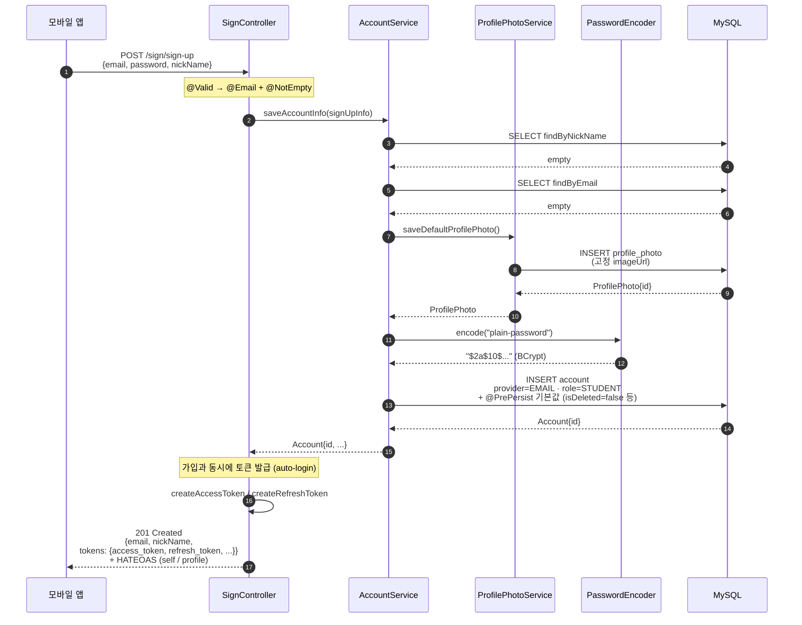
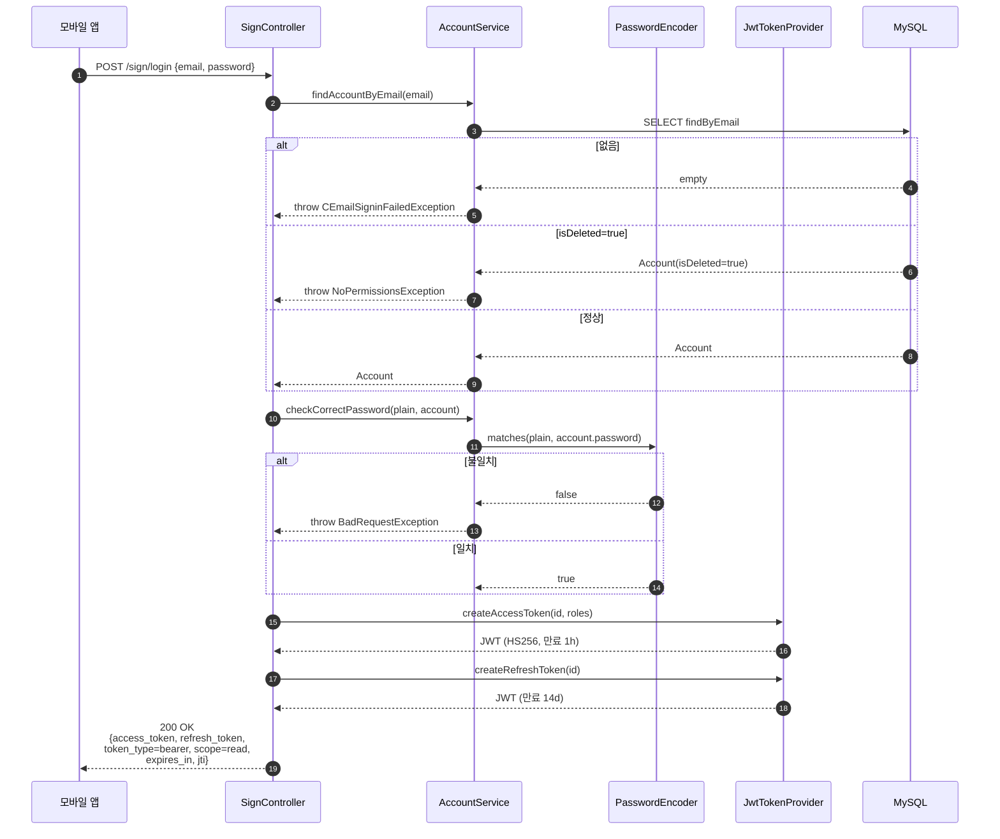
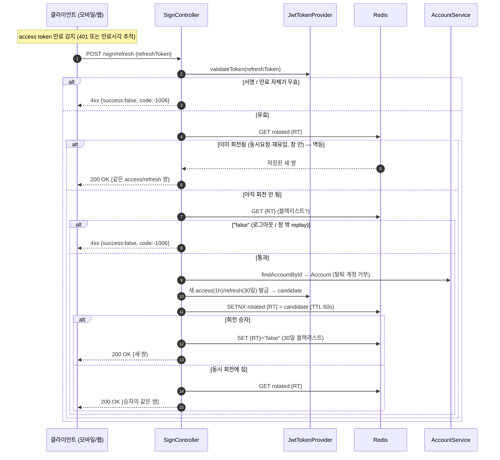
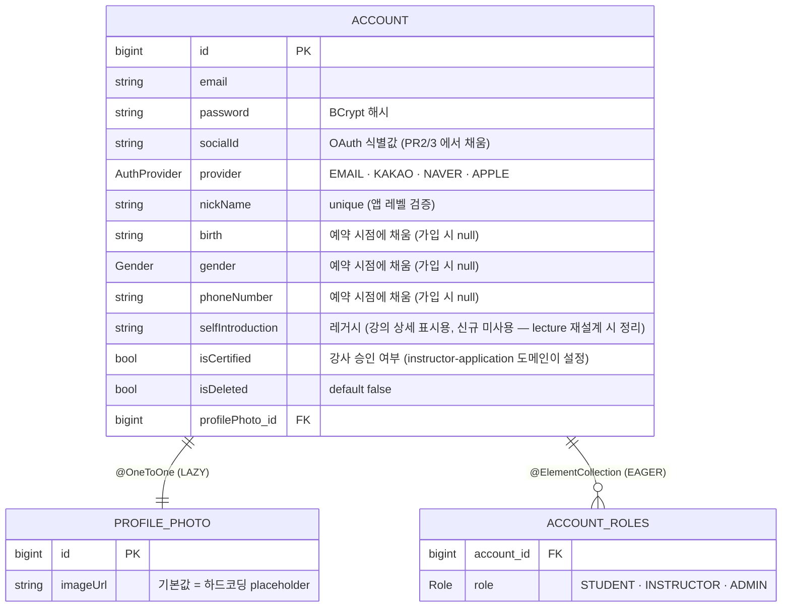

# 회원가입 + 로그인 (sign-up)

## 한 줄 요약

이메일 / 비밀번호 / 닉네임만 받고 즉시 **STUDENT** 권한으로 가입 완료. 본인인증(CI) 은 가입 단계가 아니라 **예약 직전 / 강사 등록 시점** 으로 분리한다 (PR #17 에서 정착).

**가입 응답에 access / refresh 토큰이 같이 떨어진다 (auto-login)** — 클라이언트는 별도 `/sign/login` 호출 없이 즉시 인증 상태로 진입.

---

## 컴포넌트 지도

```mermaid
flowchart LR
    Client["모바일 앱"]

    subgraph Domain["sign-up 도메인 (controller/sign + service/account)"]
        direction TB
        Ctrl["SignController"]
        Svc["AccountService"]
        Photo["ProfilePhotoService"]
        AccountRepo["AccountJpaRepo"]
        ProfileRepo["ProfilePhotoJpaRepo"]
    end

    subgraph Shared["공유 컴포넌트 (config/security)"]
        Encoder["PasswordEncoder<br/>(BCrypt)"]
        Jwt["JwtTokenProvider<br/>(HS256, 자체 발급)"]
        Filter["JwtAuthenticationFilter<br/>+ SecurityFilterChain"]
    end

    DB[("MySQL<br/>account · profile_photo<br/>+ account_roles")]

    Client -->|POST /sign/sign-up<br/>POST /sign/login<br/>POST /sign/check/email<br/>GET /sign/check/nickName| Filter
    Filter -->|permitAll<br/>(가입 / 로그인 / 중복체크)| Ctrl
    Ctrl --> Svc
    Svc --> Photo
    Svc --> Encoder
    Svc --> AccountRepo
    Photo --> ProfileRepo
    Ctrl -->|로그인 성공 시<br/>토큰 발급| Jwt
    AccountRepo --> DB
    ProfileRepo --> DB
```

이 그림에서 빠진 컴포넌트는 의도적: `SignController` 는 Firebase 토큰 등록 / 로그아웃도 가지고 있지만 그건 다른 도메인 문서에서 다룬다 (알림 / 인증). 강사 신청은 [instructor-application](instructor-application.md) 도메인으로 분리됨.

---

## 흐름 1: 일반 회원가입



**검증 거부 분기** (4xx 로 빠짐):

| 단계 | 거부 사유 | 응답 |
|---|---|---|
| ② @Valid | 이메일 형식 / 필수 필드 누락 | 4xx (`SignInInputException`) |
| ③ findByNickName | 닉네임 중복 | 4xx (`BadRequestException`) |
| ④ findByEmail | 이메일 중복 | 4xx (`EmailDuplicationException`) |

거부 시 ProfilePhoto / Account INSERT 모두 발생하지 않는다 — `AccountService` 가 `@Transactional` 이라 한 단계라도 throw 하면 전체 롤백.

---

## 흐름 2: 로그인



---

---

## 흐름 3: Refresh — access token 만료 시 갱신



매 갱신마다 **refresh token 을 새로 발급(rotation)하고 옛 token 을 블랙리스트** — 도난된 RT 의 replay 를 차단한다. 단, **같은 옛 RT 로 오는 동시/재유입 요청은 `rotated:` 캐시로 "같은 쌍"을 멱등 반환**해 동시 refresh 이중소비로 세션이 죽는 걸 막는다 (아래 "Rotation + 무효화" 참조).

---

## 토큰 정책 (TTL · rotation · 무효화)

| 토큰 | 유효기간 | 용도 |
|---|---|---|
| **Access (AT)** | **1시간** | `Authorization` 헤더에 raw JWT. 만료 시 refresh 로 갱신 |
| **Refresh (RT)** | **30일** | `/sign/refresh` 본문. 새 AT/RT 재발급용 |

값의 단일 출처는 `JwtTokenProvider` 의 `ACCESS_TOKEN_VALID_MS` / `REFRESH_TOKEN_VALID_MS`.

### 슬라이딩 윈도우 (자동로그인 지속)

RT 는 매 refresh 마다 새로 발급되므로 30일은 **"최대 비활성 허용 기간"** 으로 동작한다:

- 30일 안에 한 번이라도 접근(=refresh) → 새 30일 RT 발급 → **활성 사용자는 로그인 무한 유지**
- 30일 연속 미접근 → RT 만료 → 재로그인 필요

(보안 강화가 필요하면 향후 "절대 상한" — 최초 로그인 후 N일 초과 시 강제 재로그인 — 을 얹을 수 있다. 현재 미적용.)

### Rotation + 무효화 (동시성 멱등)

`/sign/refresh` 는 새 AT/RT 를 발급하면서 **옛 RT 를 Redis 블랙리스트(`"false"`)에 등록**한다 → 창 밖에서 같은 옛 RT 로 다시 refresh 하면 거부 (`AuthUseCaseTest.F6`). 탈취된 RT 의 replay 차단.

**동시성 멱등 (2026-07-07)**: 웹(Next.js)은 여러 인스턴스/탭이 같은 만료 access 로 **동시에** refresh 를 쏘기 쉽다. 옛 설계는 "블랙리스트 GET → SET" 이 비원자(TOCTOU)라 동시 요청의 진 쪽이 401/403 으로 튕겨 **세션이 죽는** 버그가 있었다 (앱은 인터셉터 single-flight 로 우연히 회피, 웹만 노출). 지금은:

- refresh 가 먼저 `rotated:{옛RT}` 캐시를 확인 — 이미 회전됐으면(동시/재유입) **같은 새 쌍을 그대로 반환**(멱등, `AuthUseCaseTest.F5`). 이 검사가 블랙리스트 거부보다 **먼저** 와야 막 회전된 RT 를 든 동시 요청이 안 튕긴다.
- 회전은 `setIfAbsent`(원자적 SETNX)로 **승자 하나만** 선출 → 동시 요청이 여럿이어도 토큰 패밀리가 갈라지지 않는다(진 쪽은 승자의 같은 쌍을 반환).
- 멱등 창 = `pungdong.auth.refresh-idempotency-window-seconds` (기본 **60초**, env `REFRESH_IDEMPOTENCY_WINDOW_SECONDS` 로 무재배포 튜닝). 동시 발사 스프레드만 덮으면 되므로 짧다. 창이 지나면 `rotated:` 는 TTL 로 사라지고 옛 RT 블랙리스트(30일)만 남아 replay 를 거부.
- Redis 키 2개/회전: `{옛RT}="false"`(블랙리스트 30일) + `rotated:{옛RT}`(새 쌍 60초) — 둘 다 TTL 자동 소멸(무한 증가 없음). → [redis.md](redis.md).

Auth0 "Rotation Overlap Period" / Okta "Grace Period" 와 같은 업계 표준을, stateless JWT + 블랙리스트 모델에 맞는 **멱등 응답** 형태로 구현한 것. FE 는 병렬로 요청스코프 single-flight(같은 RT 동시 401 을 1회 refresh 로 합침)를 둔다 — **BE 멱등이 근본, FE single-flight 가 1차 방어**.

> 🟢 결정: **reuse-detection(옛 RT 재유입 시 토큰 family 전체 폐기) 미채택** (2026-07-07, FE 상호 합의). 1인 1계정 + 저빈도(자격증) 서비스라 family 폐기는 "복귀 첫 화면의 정상 동시 refresh"를 도난으로 오판해 매번 재로그인시키는 역효과가 크다. RT 저장이 httpOnly(웹)/Keychain(앱)이라 도난 위험이 낮은 점을 근거로 **RT 도난 탐지를 포기**하는 트레이드오프를 택함. family 추적이 없으므로 멱등창이 grace window 의 관용 효과를 대신한다.

### 로그아웃 무효화

`/sign/logout` 은 AT·RT 를 모두 블랙리스트에 등록 (TTL = 각 토큰 유효기간과 일치, 만료 전 구멍 방지). `JwtAuthenticationFilter` 가 매 요청마다 블랙리스트를 확인해 무효화된 토큰을 거부 (`AuthUseCaseTest.L1/L2`).

### FE 가 직접 처리할 것 (테스트로 못 잡음)

- 401 인터셉터 → `/sign/refresh` → 원요청 재시도, refresh 실패 시 저장소 clear + 로그인 화면
- **요청스코프 single-flight**: 같은 RT 로 오는 동시 401 을 refresh 1회로 합침(멀티탭·SSR/CSR 수렴은 BE 멱등이 맡음). refresh 거부는 **403** 이므로 재시도 판정에서 403 도 refresh-fail 로 분기 (만료 access 는 **401** — 별개; `AuthUseCaseTest.T1`)
- 토큰 안전 저장(웹 httpOnly / 모바일 Keychain·Keystore) + 앱 재시작 시 복원 → 자동로그인 지속
- RT 도 매 refresh 마다 교체되므로 **새 RT 로 갱신 저장** 필수

---

## 데이터 모델



**의도적인 nullable 필드**: birth / gender / phoneNumber 는 **가입 단계에서 안 받는다**. 사용자가 "예약" 같은 책임이 발생하는 게이트에 도달했을 때 채워진다 (progressive profiling). 강사 신청 관련 데이터(본인확인·단체·자격증)는 별도 [instructor-application](instructor-application.md) 도메인으로 분리됨.

**`(provider, socialId)` DB 유니크 제약**: 아직 없다. PR 2 (Kakao) 에서 같이 추가 예정 — 첫 OAuth row 가 들어가는 PR 에서 함께 들어가야 의미가 있어서.

---

## 보안 / 권한 매트릭스

| 엔드포인트 | 인증 | 권한 | 비고 |
|---|---|---|---|
| `POST /sign/sign-up` | permitAll | — | 이 도메인의 진입점 — 응답에 토큰 동봉 (auto-login) |
| `POST /sign/login` | permitAll | — | JWT 발급 |
| `POST /sign/refresh` | permitAll | — | refresh token 본문 검증 → 새 토큰 쌍 발급 |
| `POST /sign/check/email` | permitAll | — | 가입 전 중복 사전체크 |
| `GET /sign/check/nickName` | permitAll | — | 가입 전 중복 사전체크 |
| `POST /sign/logout` | 인증 필요 | any | access + refresh 둘 다 Redis 블랙리스트 등록 → 이후 사용 시 401 (`AuthUseCaseTest.L1` / `L2`) |
| `POST /sign/firebase-token` | 인증 필요 | any | 알림 도메인으로 빠짐 |

**인증 / 권한 실패 시 응답** (JSON, 모바일/웹 클라이언트 직파싱용):

| 상황 | HTTP | 응답 body |
|---|---|---|
| 토큰 없음 / 만료 / 형식 깨짐 / 서명 불일치 | `401 Unauthorized` | `{success: false, code: -1002, msg: "해당 리소스에 접근하기 위한 권한이 없습니다."}` |
| 토큰은 유효하나 역할 부족 | `403 Forbidden` | `{success: false, code: -1003, msg: "보유한 권한으로 접근할 수 없는 리소스 입니다"}` |

(이전에는 `/exception/entrypoint` / `/exception/accessDenied` 로 302 redirect 했으나 JSON API 클라이언트가 처리하기 어려워 직접 응답으로 변경됨.)

**CORS**: `SecurityConfiguration.corsConfigurationSource` 가 `${cors.allowed-origins}` (env: `CORS_ALLOWED_ORIGINS`) 의 origin 들만 허용. dev 기본값 `http://localhost:3000,http://localhost:5173` (Next.js / Vite). `Authorization` / `Location` 헤더 노출, credentials 허용, preflight 캐시 1h.

**가입 시 부여되는 역할은 `STUDENT` 단 하나.** `INSTRUCTOR` 승격은 **[instructor-application](instructor-application.md) 도메인**이 담당한다 (신청 → 본인확인 → 어드민 승인 → INSTRUCTOR additive 부여 + isCertified=true). 레거시 `/sign/instructor/*` 흐름은 제거됨.

---

## 확장 자리 (예정)

| PR | 추가될 엔드포인트 | 추가될 동작 |
|---|---|---|
| PR 2 | `POST /sign/oauth/kakao` | Kakao 토큰 → kakaoId 추출 → `findByProviderAndSocialId(KAKAO, kakaoId)` → 있으면 로그인, 없으면 신규 Account row (provider=KAKAO, socialId=kakaoId) |
| PR 2 | (DB) | `(provider, socialId)` UNIQUE 제약 추가 |
| PR 3 | `POST /sign/oauth/naver` | PR 2 와 동일 패턴, Naver provider 만 다름 |

OAuth 가입은 이번 PR 에서 깔린 `Account.socialId` / `Account.provider` 필드를 그대로 쓴다 — **별도 사용자 테이블 없음**.

---

## 더 깊게: use-case 테스트로 보기

문서는 stale 될 수 있지만 테스트는 항상 현재 동작이다. 회원가입 / 로그인 동작의 **단일 출처는 다음 두 파일**:

- [`src/test/java/com/diving/pungdong/usecase/SignUpUseCaseTest.java`](../../src/test/java/com/diving/pungdong/usecase/SignUpUseCaseTest.java) — 회원가입 9 시나리오 (S1~S4 정상 / V1~V2 검증 / D1~D2 중복 / L1 가입→로그인)
- [`src/test/java/com/diving/pungdong/usecase/AuthUseCaseTest.java`](../../src/test/java/com/diving/pungdong/usecase/AuthUseCaseTest.java) — 토큰 / 권한 시나리오 (T1~T4 토큰 검증 / R1~R3 역할 매트릭스 / J1 클레임 / L1 로그아웃 no-op)

`@DisplayName` 만 위에서 아래로 읽어도 사양이 그대로 된다.
