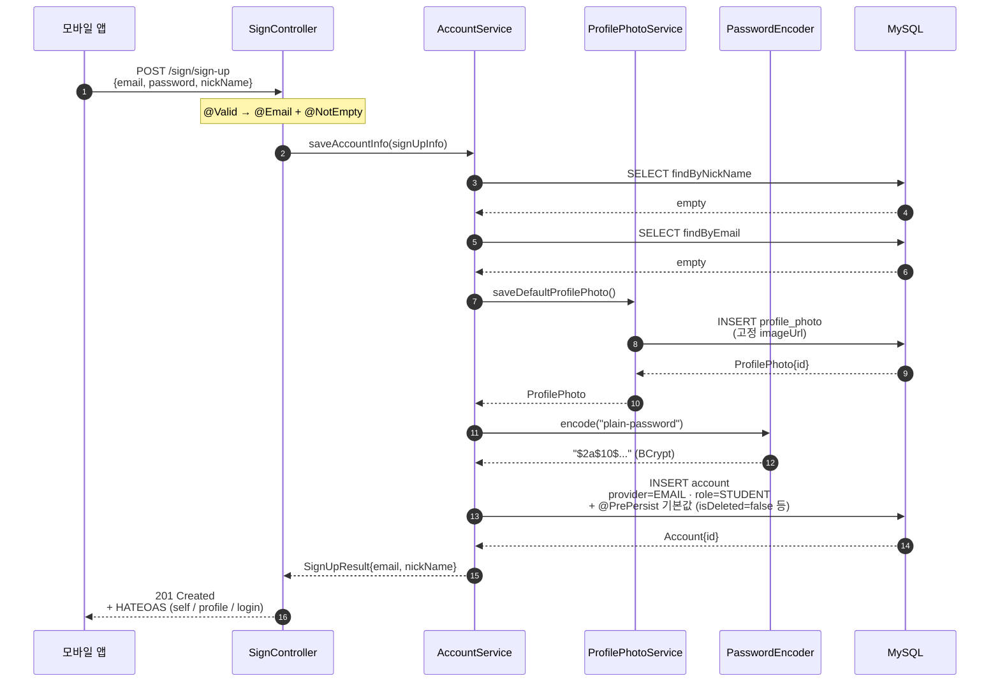
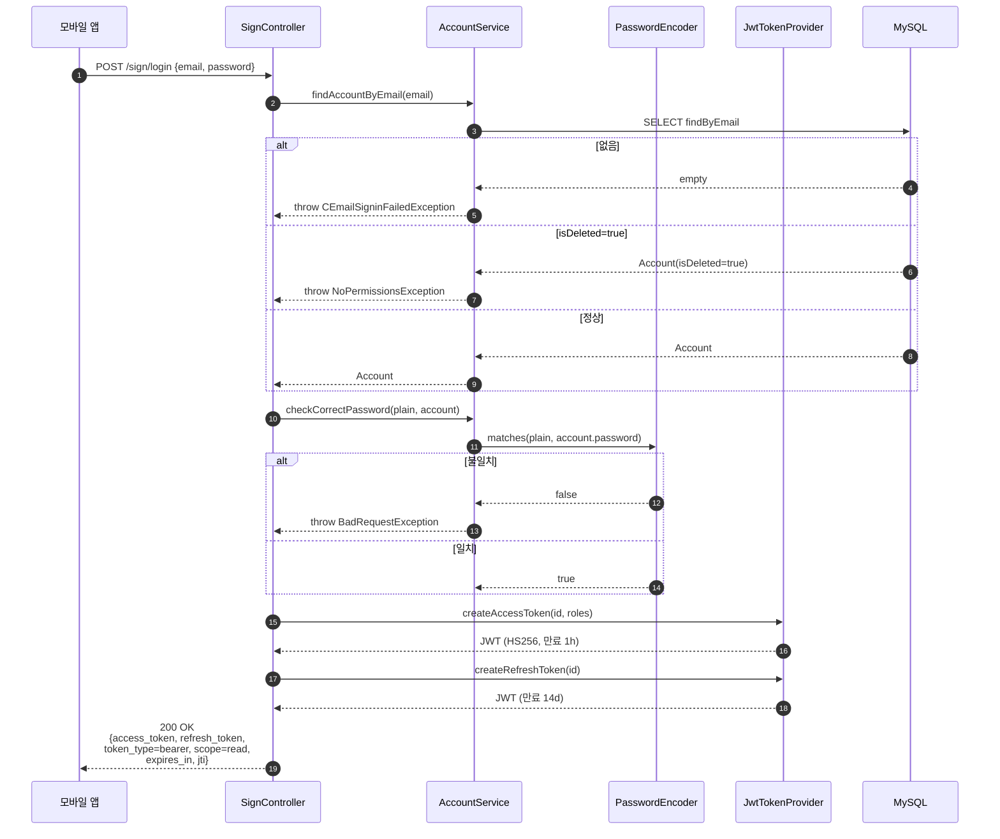
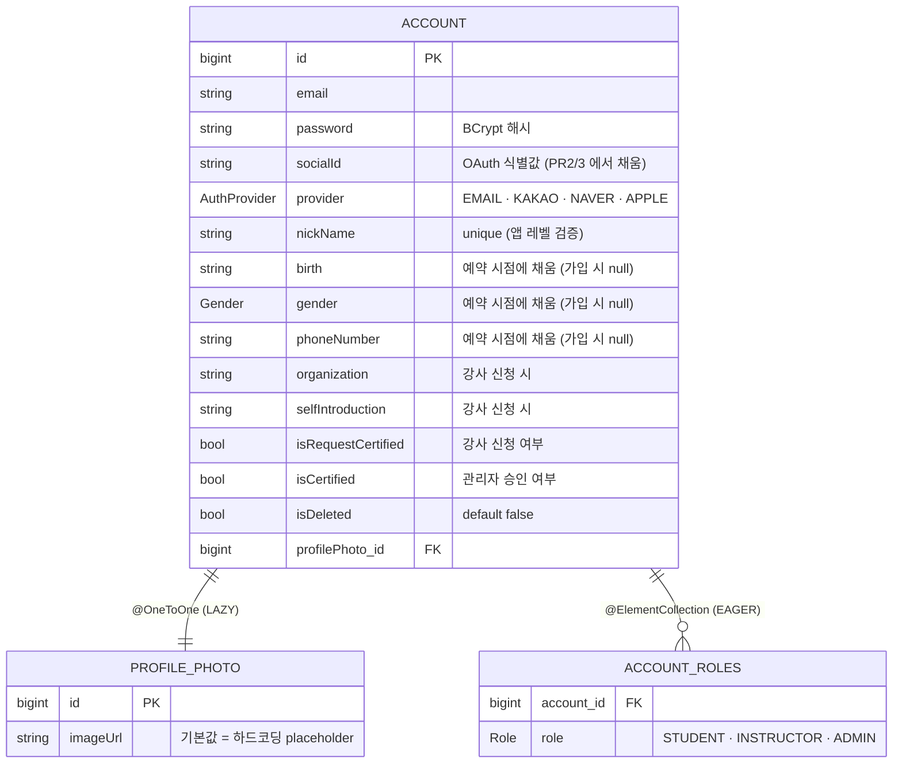

# 회원가입 + 로그인 (sign-up)

## 한 줄 요약

이메일 / 비밀번호 / 닉네임만 받고 즉시 **STUDENT** 권한으로 가입 완료. 본인인증(CI) 은 가입 단계가 아니라 **예약 직전 / 강사 등록 시점** 으로 분리한다 (PR #17 에서 정착).

가입 직후 같은 자격으로 `/sign/login` 에 던지면 access / refresh JWT 가 떨어진다.

---

## 컴포넌트 지도

```mermaid
flowchart LR
    Client["모바일 앱"]

    subgraph Domain["sign-up 도메인 (controller/sign + service/account)"]
        direction TB
        Ctrl["SignController"]
        Svc["AccountService"]
        Photo["ProfilePhotoService"]
        AccountRepo["AccountJpaRepo"]
        ProfileRepo["ProfilePhotoJpaRepo"]
    end

    subgraph Shared["공유 컴포넌트 (config/security)"]
        Encoder["PasswordEncoder<br/>(BCrypt)"]
        Jwt["JwtTokenProvider<br/>(HS256, 자체 발급)"]
        Filter["JwtAuthenticationFilter<br/>+ SecurityFilterChain"]
    end

    DB[("MySQL<br/>account · profile_photo<br/>+ account_roles")]

    Client -->|POST /sign/sign-up<br/>POST /sign/login<br/>POST /sign/check/email<br/>GET /sign/check/nickName| Filter
    Filter -->|permitAll<br/>(가입 / 로그인 / 중복체크)| Ctrl
    Ctrl --> Svc
    Svc --> Photo
    Svc --> Encoder
    Svc --> AccountRepo
    Photo --> ProfileRepo
    Ctrl -->|로그인 성공 시<br/>토큰 발급| Jwt
    AccountRepo --> DB
    ProfileRepo --> DB
```

이 그림에서 빠진 컴포넌트는 의도적: `SignController` 는 강사 등록 / Firebase 토큰 등록 / 로그아웃도 가지고 있지만 그건 다른 도메인 문서에서 다룬다 (예약 / 알림 / 인증).

---

## 흐름 1: 일반 회원가입



**검증 거부 분기** (4xx 로 빠짐):

| 단계 | 거부 사유 | 응답 |
|---|---|---|
| ② @Valid | 이메일 형식 / 필수 필드 누락 | 4xx (`SignInInputException`) |
| ③ findByNickName | 닉네임 중복 | 4xx (`BadRequestException`) |
| ④ findByEmail | 이메일 중복 | 4xx (`EmailDuplicationException`) |

거부 시 ProfilePhoto / Account INSERT 모두 발생하지 않는다 — `AccountService` 가 `@Transactional` 이라 한 단계라도 throw 하면 전체 롤백.

---

## 흐름 2: 로그인



---

## 데이터 모델



**의도적인 nullable 필드**: birth / gender / phoneNumber / organization / selfIntroduction 은 **가입 단계에서 안 받는다**. 사용자가 "예약" 또는 "강사 등록" 같은 책임이 발생하는 게이트에 도달했을 때 채워진다 (progressive profiling).

**`(provider, socialId)` DB 유니크 제약**: 아직 없다. PR 2 (Kakao) 에서 같이 추가 예정 — 첫 OAuth row 가 들어가는 PR 에서 함께 들어가야 의미가 있어서.

---

## 보안 / 권한 매트릭스

| 엔드포인트 | 인증 | 권한 | 비고 |
|---|---|---|---|
| `POST /sign/sign-up` | permitAll | — | 이 도메인의 진입점 |
| `POST /sign/login` | permitAll | — | JWT 발급 |
| `POST /sign/check/email` | permitAll | — | 가입 전 중복 사전체크 |
| `GET /sign/check/nickName` | permitAll | — | 가입 전 중복 사전체크 |
| `POST /sign/logout` | 인증 필요 | any | **현재 no-op** — `AuthUseCaseTest.L1` 참조 |
| `POST /sign/firebase-token` | 인증 필요 | any | 알림 도메인으로 빠짐 |

**가입 시 부여되는 역할은 `STUDENT` 단 하나.** `INSTRUCTOR` 승격은 별도 흐름:

```
가입 (STUDENT)
   ↓
POST /sign/instructor/info        — 본인 소개 / 소속 단체 등록
   ↓
POST /sign/instructor/certificate — 자격증 이미지 업로드 (S3)
   ↓
GET  /sign/instructor/request/list  (ADMIN)  — 신청 목록 조회
   ↓
PUT  /sign/instructor/confirm        (ADMIN)  — 승인 → STUDENT + INSTRUCTOR 권한
```

---

## 확장 자리 (예정)

| PR | 추가될 엔드포인트 | 추가될 동작 |
|---|---|---|
| PR 2 | `POST /sign/oauth/kakao` | Kakao 토큰 → kakaoId 추출 → `findByProviderAndSocialId(KAKAO, kakaoId)` → 있으면 로그인, 없으면 신규 Account row (provider=KAKAO, socialId=kakaoId) |
| PR 2 | (DB) | `(provider, socialId)` UNIQUE 제약 추가 |
| PR 3 | `POST /sign/oauth/naver` | PR 2 와 동일 패턴, Naver provider 만 다름 |

OAuth 가입은 이번 PR 에서 깔린 `Account.socialId` / `Account.provider` 필드를 그대로 쓴다 — **별도 사용자 테이블 없음**.

---

## 더 깊게: use-case 테스트로 보기

문서는 stale 될 수 있지만 테스트는 항상 현재 동작이다. 회원가입 / 로그인 동작의 **단일 출처는 다음 두 파일**:

- [`src/test/java/com/diving/pungdong/usecase/SignUpUseCaseTest.java`](../../src/test/java/com/diving/pungdong/usecase/SignUpUseCaseTest.java) — 회원가입 9 시나리오 (S1~S4 정상 / V1~V2 검증 / D1~D2 중복 / L1 가입→로그인)
- [`src/test/java/com/diving/pungdong/usecase/AuthUseCaseTest.java`](../../src/test/java/com/diving/pungdong/usecase/AuthUseCaseTest.java) — 토큰 / 권한 시나리오 (T1~T4 토큰 검증 / R1~R3 역할 매트릭스 / J1 클레임 / L1 로그아웃 no-op)

`@DisplayName` 만 위에서 아래로 읽어도 사양이 그대로 된다.
