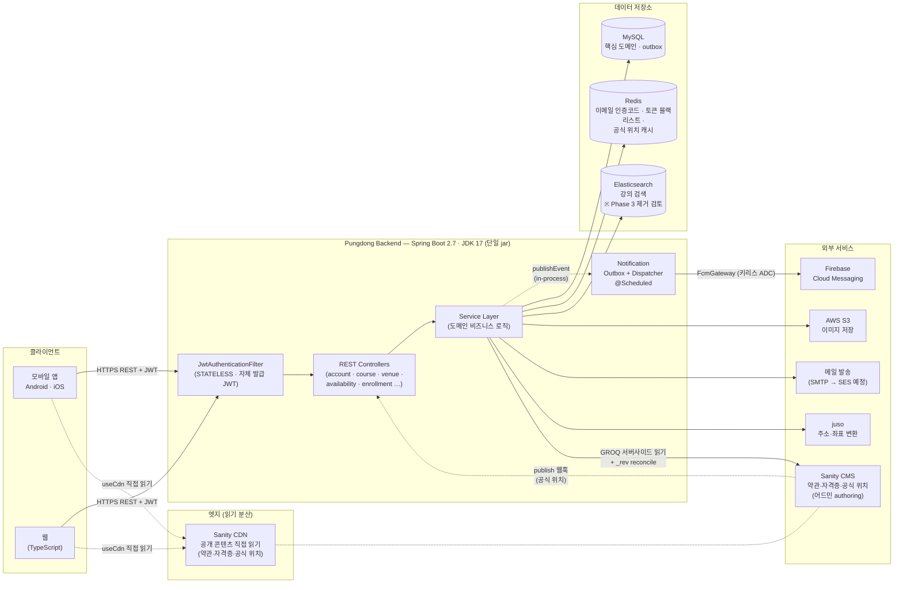
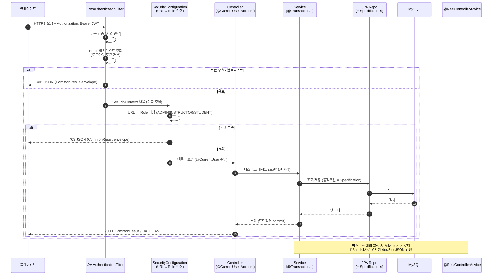
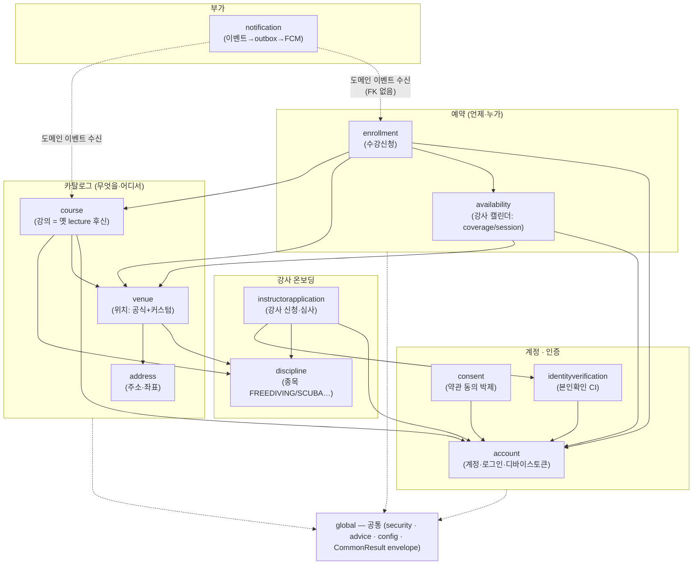
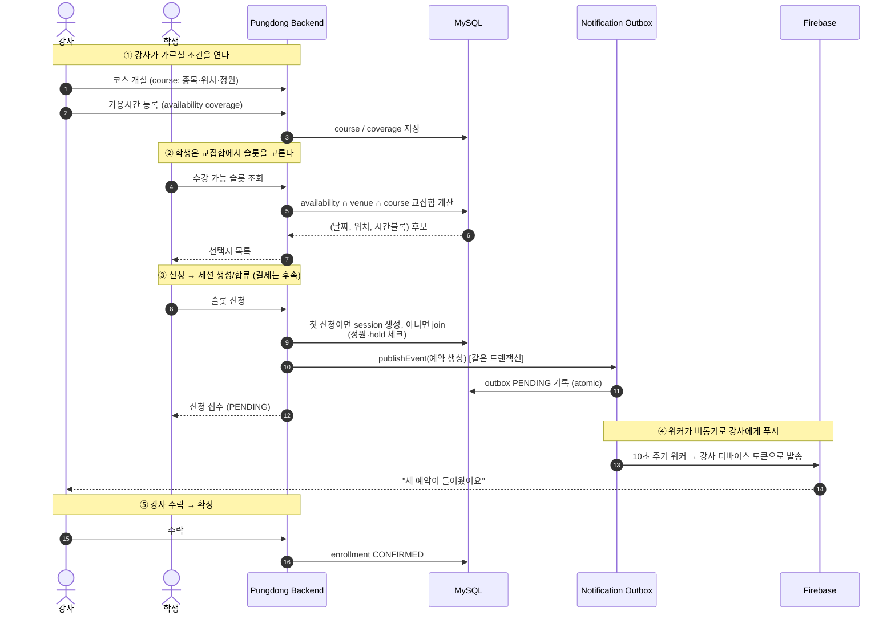
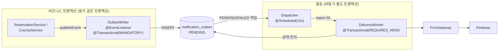
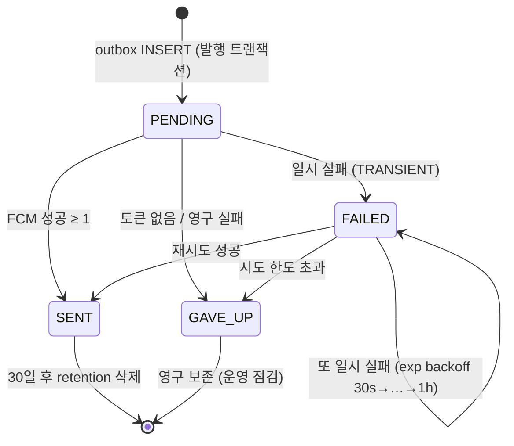
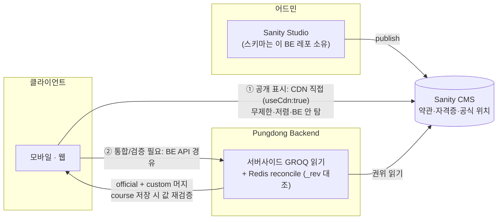

# Pungdong 시스템 아키텍처 한눈에 보기

> 발표·리뷰용 **전체 그림** 문서. 한 장씩 넘기며 "무엇이 어떻게 연결되어 있고, 왜 그렇게 설계했는지" 를 설명하는 순서로 구성했다.
> 도메인 하나로 더 들어가려면 [도메인별 문서](README.md), 여러 도메인에 걸친 정책·히스토리는 [피처 문서](../features/)를 본다.

목차

1. [시스템 토폴로지 — 전체 구성과 연결](#1-시스템-토폴로지--전체-구성과-연결)
2. [요청 처리 계층 — 하나의 요청이 흐르는 길](#2-요청-처리-계층--하나의-요청이-흐르는-길)
3. [도메인 맵 — package-by-feature 와 의존 방향](#3-도메인-맵--package-by-feature-와-의존-방향)
4. [핵심 유스케이스 — 강사 개설부터 수강신청·알림까지](#4-핵심-유스케이스--강사-개설부터-수강신청알림까지)
5. [알림 파이프라인 — 이벤트 → 아웃박스 → FCM](#5-알림-파이프라인--이벤트--아웃박스--fcm)
6. [Sanity 읽기 기조 — CDN 직접 vs BE 경유](#6-sanity-읽기-기조--cdn-직접-vs-be-경유)

---

## 1. 시스템 토폴로지 — 전체 구성과 연결

서비스 전체가 **하나의 Spring Boot 모놀리식 jar** 다. MSA 로 흩어져 있던 외부 OAuth 서버 · Eureka · Kafka 를 모두 흡수/제거하고, 외부 의존을 "정말 외부여야 하는 것" (DB · 캐시 · 푸시 · 파일 · 메일 · CMS) 으로만 좁혔다.

**이 그림이 보여주는 설계 결정**

| 결정 | 무엇 | 왜 |
|---|---|---|
| 모놀리식 통합 | 외부 OAuth·Eureka·Kafka 제거, 단일 jar | 솔로 개발 + 출시 임박 — 운영/디버깅 면적을 최소화. MSA 의 분산 비용 > 이득 |
| JWT 자체 발급 | `JwtTokenProvider` 가 in-process 로 토큰 발급, `STATELESS` | 외부 인증 서버 왕복 제거. 토큰 무효화는 Redis 블랙리스트로 |
| 읽기 분산 | 공개 콘텐츠는 클라이언트가 **Sanity CDN 직접** | 공개·잘 안 바뀌는 데이터의 트래픽을 BE 가 안 탐 (CDN 무제한·저렴). [6번 참고](#6-sanity-읽기-기조--cdn-직접-vs-be-경유) |
| 이벤트 기반 알림 | 비즈니스 트랜잭션 ↔ FCM 발송을 outbox 로 분리 | 롤백 시 "유령 알림" 방지 + 발송 실패 자동 재시도. [5번 참고](#5-알림-파이프라인--이벤트--아웃박스--fcm) |

---

## 2. 요청 처리 계층 — 하나의 요청이 흐르는 길

인증된 요청 하나가 들어와서 응답이 나가기까지. 보안 필터가 가장 앞단, 컨트롤러는 얇게, 비즈니스 로직은 서비스, 동적 쿼리는 Specification 으로.

**이 흐름의 규칙 (레포 컨벤션)**

- **PII 는 URL 에 안 싣는다** — 이메일·전화 등 개인정보가 입력인 "읽기" 는 `POST` 바디로 (로그·프록시·브라우저 히스토리 at-rest 누출 방지). 닉네임 같은 공개 핸들은 `GET` 유지.
- **HTTP 상태 = 요청 처리 결과, 비즈니스 답이 아님** — "닉네임 중복", "자격 없음" 같은 *정상 부정 응답* 은 `200 + 결과필드`. 4xx/5xx 는 진짜 실패에만.
- **컨트롤러는 얇게** — 인증 주체는 `@CurrentUser Account` 로 주입, `SecurityContextHolder` 직접 접근 금지.

---

## 3. 도메인 맵 — package-by-feature 와 의존 방향

레이어드(`controller/service/repo/...`) → **도메인 기반(package-by-feature)** 으로 전환 중. 새 도메인은 한 패키지 안에 그 도메인의 controller·service·repo·entity·dto 를 모은다. 의존은 **한 방향** — 모두가 `account` 를 참조하지만 `account` 는 누구도 참조 안 함.

**핵심 관계**

- **`account` = 중심 허브.** ~35개 파일이 creator/applicant 로 참조. 단, 의존은 단방향 — account 는 lecture/course 를 모름.
- **강사 온보딩 게이트.** 강사가 되려면 `instructorapplication` (종목 + 본인확인 보유) 통과. 단 *심사 대기 중에도* draft 강의·커스텀 위치·프로필 준비는 허용 (게이트 = 승인이 아니라 "그 종목 신청 보유").
- **예약의 교집합 모델.** 학생 선택지 = **강사 `availability` (coverage) ∩ `venue` 시간대 ∩ `course`**. 첫 신청이 (위치, 시간블록) session 을 만들고 같은 슬롯은 join.
- **레거시 전환 중.** `lecture·reservation·schedule·review·equipment·location` 은 아직 옛 레이어드 패키지에 있고, 각각 `course·enrollment·availability·venue` 로 흡수되는 중.

---

## 4. 핵심 유스케이스 — 강사 개설부터 수강신청·알림까지

서비스의 본질 가치 루프: 강사가 **언제·어디서** 가르칠지 열고 → 학생이 그 교집합에서 슬롯을 고르고 → 강사에게 알림이 가고 → 수락하면 확정.

> **참고**: 신청 시점에는 결제가 없다 — 강사 *수락* = `CONFIRMED`, 결제는 후속 단계. 만석 판정 = 확정 + hold ≥ 정원.

---

## 5. 알림 파이프라인 — 이벤트 → 아웃박스 → FCM

비즈니스 트랜잭션과 푸시 발송을 **트랜잭션 경계로 분리**한 것이 이 도메인의 핵심. 발행 측은 알림 인프라를 전혀 모르고(`publishEvent` 한 줄), 발송 측은 완전히 별도 스레드/트랜잭션이다.

**상태 전이 (재시도 내장)**

**왜 이렇게**

- **유령 알림 방지** — `@Transactional(MANDATORY)` 로 발행자의 트랜잭션에 합류. 비즈니스 롤백 시 outbox 행도 같이 사라짐 → "예약 안 됐는데 알림만 감" 불가.
- **발송 실패 격리** — 워커는 `REQUIRES_NEW`. FCM 장애가 비즈니스 트랜잭션에 영향 0, 실패는 백오프 재시도.
- **at-least-once + 멱등 토큰** — 죽은 토큰(UNREGISTERED)은 발송 시 DB 에서 정리, 같은 디바이스 토큰은 UNIQUE upsert.

세부(시퀀스·ER·이벤트 매트릭스)는 [notification.md](notification.md).

---

## 6. Sanity 읽기 기조 — CDN 직접 vs BE 경유

약관·자격증 카탈로그·공식 위치는 별도 headless CMS(Sanity)가 관리한다. 같은 데이터라도 **읽기 목적에 따라 경로를 둘로 나눈 것** 이 설계 포인트.

**갈림 기준**

| 경로 | 언제 | 예 |
|---|---|---|
| **FE → CDN 직접** (기본) | 공개·읽기 위주·잘 안 바뀜 | 약관 전문, 자격증 단체 목록, 공식 위치 브라우즈 |
| **FE → BE → Sanity** (예외) | 여러 소스 결합 / 권위 검증 / private 결합 | 코스 빌더의 공식+커스텀 위치 머지, 코스 저장 시 공식 값 재검증 |

- **하지 말 것**: 공개 표시까지 BE 프록시로 통일 = CDN 재발명(BE compute/대역폭 + 캐시 유지 비용 증가).
- **freshness 두 주인**: CDN 캐시는 publish 시 자동 flush (우리가 할 일 0), BE Redis 캐시만 `_rev` reconcile + liveness alert 로 우리가 관리.

세부 동기화 설계는 [venue.md](venue.md) · [consent-and-terms.md](../features/consent-and-terms.md).

---

*이 문서는 발표/오리엔테이션용 상위 그림이다. 각 다이어그램의 한 단계 아래(클래스·엔드포인트·ER·권한 매트릭스)는 [도메인별 문서](README.md)에, 실제 현재 동작의 단일 출처는 `src/test/java/.../usecase/` 의 시나리오 테스트에 있다.*
