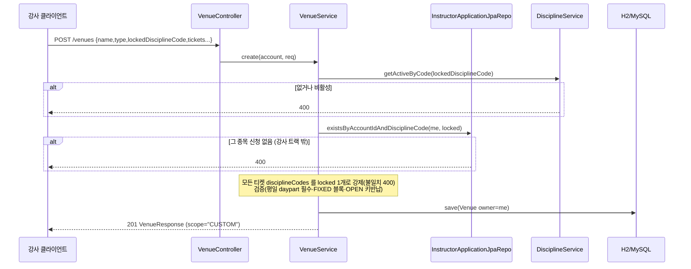
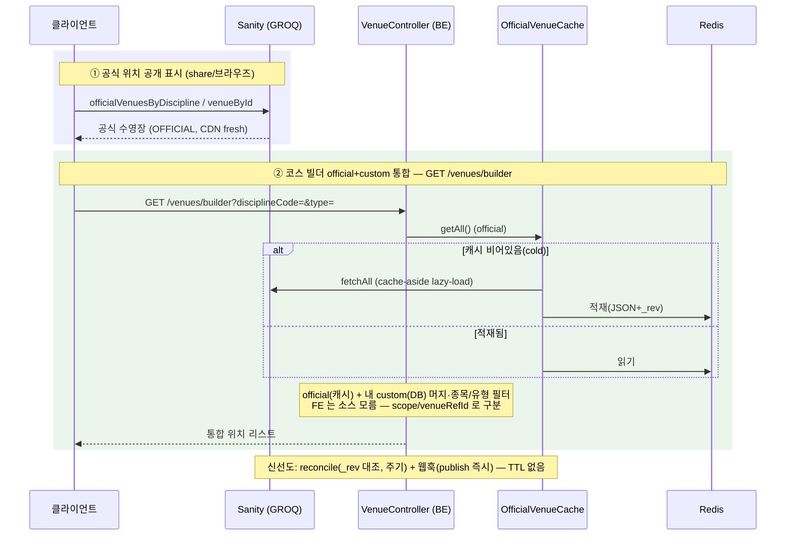
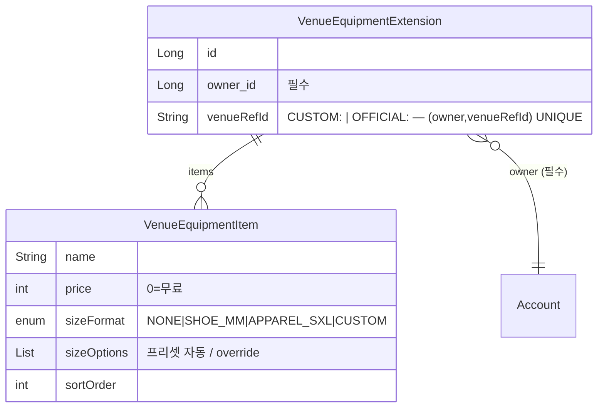

# 위치 (venue) 도메인

## 1. 한 줄 요약

**Venue(위치)** = 강의가 진행되는 장소(수영장·딥풀·해양 포인트). 장소 종속 정보(입장료·운영 시간대·이용 옵션·정기 휴무)를 강의에서 풀지 않고 위치에 모은다. **소유 분담**: 공식(OFFICIAL) 수영장은 **Sanity authoring**(`sanity/schemas/venue.ts`), 강사 커스텀(CUSTOM, 해양/다이브 포인트)은 **이 BE 도메인**. 이 문서는 BE(커스텀) 구현 + Sanity 가 어떻게 끼는지를 다룬다.

> 도메인 개념(멘탈 모델)·정책·왜·동기화 설계는 [docs/features/venue.md](../features/venue.md) 가 소유. 이 문서는 *어떻게(구현)*.

## 2. 컴포넌트 지도

```mermaid
flowchart TB
  subgraph venue["venue 패키지 (BE)"]
    VC[VenueController<br/>/venues/** · /venues/builder] --> VS[VenueService]
    VS --> VR[VenueJpaRepo]
    VS --> DS[DisciplineService<br/>종목 코드 검증]
    VS --> AR[InstructorApplicationJpaRepo<br/>생성 게이트]
    VR --> VE[(Venue + Ticket + Daypart<br/>+ TimeBlock + Closure)]
    subgraph sync["venue.sync (OFFICIAL 읽기·캐시·동기화)"]
      OVC[OfficialVenueCache<br/>cache-aside]
      SVCL[SanityVenueClient<br/>Http/Stub]
      REC[OfficialVenueReconciler<br/>_rev 대조]
      SCH[ReconcileScheduler<br/>@Scheduled !test]
      WH[SanityWebhookController<br/>POST /webhooks/sanity/venue]
      HI[ReconcileHealthIndicator<br/>/actuator/health]
    end
    VS --> OVC
    OVC --> SVCL
    REC --> SVCL
    REC --> OVC
    SCH --> REC
    WH --> REC
    HI -. lastReconciledAt .-> OVC
    subgraph equip["venue.equipment (장비 가격표 = equipment extension)"]
      VEQ[VenueEquipmentController<br/>/venue-equipment] --> VEQS[VenueEquipmentService]
      VEQS --> VEQR[VenueEquipmentExtensionJpaRepo]
      VEQR --> VEQE[(Extension + Item<br/>owner × venueRefId)]
    end
    VEQS -. "참조검증: 내 custom?" .-> VS
    VEQS -. "참조검증: 공식 존재?" .-> OVC
  end
  VS -. owner 단방향 .-> ACC[account.Account]
  OVC -. JSON+_rev .-> RD[(Redis)]
  subgraph sanity["Sanity (OFFICIAL authoring)"]
    SV[venue 스키마<br/>공식 수영장]
  end
  SVCL -- "GROQ 서버사이드 읽기" --> SV
  SV -. publish 웹훅 .-> WH
  FE["클라이언트"] -- "공개 표시: GROQ 직접" --> SV
  FE -- "내 custom 관리: GET /venues" --> VC
  FE -- "코스 빌더 통합: GET /venues/builder" --> VC
  FE -- "장비 가격표: GET/PUT /venue-equipment" --> VEQ

  classDef ext fill:#eef
  class DS,AR,ACC,SV,RD ext
```

- BE 는 **커스텀을 소유**하고 **공식을 캐시**(Sanity 서버사이드 읽기). 공식 위치 **공개 표시**는 여전히 FE 가 Sanity 직접 읽기(certOrganization·term 과 동일).
- **코스 빌더 official+custom 통합** = `GET /venues/builder` — BE 가 official(캐시)+custom(DB)을 합쳐 반환(FE 소스 무지, §3.2). 신선도는 `_rev` 대조 reconcile + 웹훅이 유지, 잡 생존은 health heartbeat 가 감시(§6 → 구현됨).
- **이용권 종목 필터 + ticketRef** — 빌더는 venue 뿐 아니라 **그 venue 의 이용권(ticket)도 `disciplineCode` 로 필터**(한 위치가 종목별 ticket 보유 가능 — 예: 딥스테이션 스쿠버 일반권 vs 프리 일반권). 각 ticket 은 코스 저장에 쓸 **안정 `ticketRef`**(CUSTOM=DB pk / OFFICIAL=Sanity `_key`)를 가진다 — FE 는 `id`(OFFICIAL 은 없음) 대신 이걸 쓴다. (관리용 `GET /venues` 는 ticket 필터 안 함.)

## 3. 핵심 흐름

### 3.1 강사 커스텀 위치 생성 (게이트 + 종목 잠금)



### 3.2 읽기 경로 — 목적별 둘 (FE 는 데이터 소스를 모른다)



## 4. 데이터 모델 (BE — CUSTOM)

```mermaid
erDiagram
  Venue ||--o{ VenueTicket : tickets
  Venue ||--o{ VenueClosure : closures
  VenueTicket ||--o{ VenueDaypart : "WEEKDAY 1 + WEEKEND 0..1"
  VenueDaypart ||--o{ VenueTimeBlock : "FIXED 모드 부 리스트"
  Venue }o--|| Account : "owner (필수)"

  Venue {
    Long id
    String name
    enum type "SWIMMING_POOL|DIVING_POOL|DEEP_POOL|OCEAN"
    Integer maxDepth "최대수심(m), 선택"
    String address "도로명(좌표 기준)"
    String addressDetail "세부주소, 선택"
    Double latitude
    Double longitude
    Long owner_id "필수"
    String lockedDisciplineCode "필수"
  }
  VenueTicket {
    String name
    int sortOrder
    Set disciplineCodes "= lockedDisciplineCode 1개"
  }
  VenueDaypart {
    enum kind "WEEKDAY|WEEKEND"
    boolean sold
    Integer fee
    enum timeMode "FIXED|OPEN|SAME(주말전용)"
    LocalTime openStart
    LocalTime openEnd
    Integer holdHours "키반납"
  }
  VenueTimeBlock { LocalTime startTime, LocalTime endTime, int sortOrder }
  VenueClosure {
    enum type "WEEKLY|MONTHLY"
    Set weekdays "WEEKLY DayOfWeek"
    Integer nth "MONTHLY 1~5 (atomic)"
    DayOfWeek monthlyWeekday "MONTHLY"
  }
```

**대여 장비 가격표 (equipment extension)** — 위치와는 별도 aggregate. 강사 × 위치 1장, 모든 코스 공유:



- **장비료는 위치별·강사 전역** — 코스에 복제하지 않고 `venueRefId` 로 위치를 가리켜 코스 읽을 때 합성. 가격이 위치마다 다른 현실(딥스테이션 무료포함↔5m풀 유료)을 코스가 아니라 여기서 흡수.
- 저장 시 `venueRefId` 검증 — CUSTOM=내 소유 위치(`VenueService.ownsCustomVenue`), OFFICIAL=Sanity 캐시 존재(`OfficialVenueCache.contains`). 아니면 400.

설계 의도:
- **이용시간 표기 = 이용권 name 의 "(N시간)"** (어드민 입력). 시간블록 자동 파생(`durationHours`)은 **제거** — 6h 블록·5h 이용 같은 운영 사례(딥스테이션 하프권)로 타임 계산이 name 과 어긋나 혼선. 권종은 티켓 카드 추가.
- **종목 = 코드 문자열 soft-ref**(`discipline.code`). CUSTOM 은 `lockedDisciplineCode` 1개로 강제.
- **수정 = 전량 교체 스냅샷**(`clearChildren()` + 재구성, orphanRemoval) — instructor-application 재제출과 동일.
- OFFICIAL(Sanity) 도 동형 모델(이용 옵션·daypart·휴무) — 스키마는 `sanity/schemas/venue.ts`.

## 5. 보안 / 권한 매트릭스

매처는 `global/security/SecurityConfiguration`.

| 엔드포인트 | 인증 | 소유권 |
|---|---|---|
| `POST /venues` | 필요(authenticated) | 그 종목 강사신청 보유(상태 무관) 게이트 — 서비스 강제 |
| `GET /venues?disciplineCode=&type=` | 필요 | 내 커스텀만 (남의 것 제외) |
| `GET /venues/builder?disciplineCode=&type=` | 필요 | OFFICIAL(전체 공개) + 내 CUSTOM(남의 것 제외) 머지 |
| `GET /venues/{id}` | 필요 | 내 커스텀만 — 아니면 400(존재 숨김) |
| `PUT/DELETE /venues/{id}` | 필요 | 내 커스텀만 — 아니면 400 |
| `GET /venue-equipment?venueRefId=` | 필요 | 내 가격표만 (owner=현재 계정) |
| `PUT /venue-equipment` | 필요 | 내 가격표 upsert — venueRefId 가 내 custom 또는 캐시된 official 이어야 (아니면 400) |
| `GET /actuator/health` | permitAll | reconcile heartbeat (외부 모니터용, 상태코드만) |
| `POST /webhooks/sanity/venue` | permitAll | HMAC 서명 검증(JWT 아님) — 시크릿 없으면 fail-closed |

`/venues/**` 를 `INSTRUCTOR` 역할이 아니라 `authenticated` 로 둔 이유: 리뷰 대기(SUBMITTED) 강사신청자는 아직 `STUDENT`. 근거는 [docs/features/venue.md](../features/venue.md). 없음/비소유는 **400**(`ResourceNotFoundException`) 통일.

## 6. 알려진 설계 간극 / 확장 자리

- ✅ **코스 빌더 통합 read 엔드포인트 + BE 의 OFFICIAL(Sanity) 읽기·캐시·동기화 — 구현됨** — `GET /venues/builder` 가 official(Sanity 서버사이드 읽기, Redis cache-aside)+custom(DB)을 합쳐 반환(FE 소스 무지). 신선도 = `OfficialVenueReconciler`(`_rev` 대조, `@Scheduled !test`) + `SanityWebhookController`(publish 즉시, HMAC) + `OfficialVenueReconcileHealthIndicator`(잡 생존 heartbeat, `/actuator/health`). TTL 없음. `venue.sync` 패키지. (실 알림 페이징은 Phase 4 ops.)
- 🟡 **어드민 custom 오버사이트 엔드포인트** — 어드민이 custom 위치를 조회·검색(빠진 수영장 official 승격·투어 패턴). custom 은 BE DB(private)라 Sanity 가 아니라 BE admin 에서 본다.
- 🟡 **코스 생성 연동 + availability 교차** — 위치 선택 → 티켓×daypart flatten, availability ∩ Venue. availability 도메인과 함께.
- 🟢 **종목 필터 in-memory** — `disciplineCodes` 가 `@ElementCollection` 이라 내 커스텀 목록을 메모리에서 좁힌다(개수 작음).
- 🟢 투어 상품화(OCEAN 다이빙 포인트 연동).

## 7. 더 깊게: 테스트로 보기

커스텀 CRUD 는 `usecase/VenueUseCaseTest` (실 H2 + 시큐리티, Redis 불필요), 통합·동기화는 `usecase/VenueBuilderUseCaseTest` · `VenueReconcileTest` · `SanityWebhookUseCaseTest` (임베디드 Redis + stub Sanity). `@DisplayName` 위→아래 = 사양:

- `S1` 강사가 리뷰 대기(SUBMITTED) 중 커스텀 생성 → owner=본인·종목 잠금·휴무·주소(도로명+세부)·최대수심 박힘
- `S2` 상시 입장(OPEN) → 응답 `holdHours` = 키반납 시간
- `G1` 그 종목 신청 없는 계정 → 400 (게이트)
- `V1`~`V3` 종목 잠금 누락 / FIXED 블록 0개 / 잠긴 종목 불일치 → 400
- `R1`·`R2` 남의 커스텀 비가시(400) / 남의 커스텀 수정·삭제(400)
- `L1` `GET /venues` = 내 커스텀만(남의 것 제외) + 종목 필터
- `B1`~`B5` `GET /venues/builder` = OFFICIAL 매핑(수심·이용시간 파생)·종목/유형 필터·custom 머지, `R1`(builder) 남의 custom 비가시
- `C1`~`C4` reconcile 초기적재 / 무변경 재fetch 안 함 / `_rev` 변경 refetch / 삭제 evict
- `W1`~`W3` 웹훅 유효서명 200+reconcile / 위조 401 / 재전송 dedup
- `VenueEquipmentUseCaseTest`: `E1` 커스텀 저장+사이즈 프리셋 / `E2` 스냅샷 교체 / `E3` 공식 위치 저장 / `V1`·`V2` 비소유 custom·없는 official·깨진 토큰 400 / `R1` 소유 격리

> 공식 위치 캐시는 임베디드 Redis(process-전역)라, 캐시를 읽는 테스트는 `@BeforeEach` 로 `venue:official:*` flush 해 순서 의존을 없앤다.

> ⚠️ 이 레포의 `Authorization` 헤더는 **raw JWT**(`Bearer ` prefix 없음 — `JwtTokenProvider.resolveToken`). prefix 붙이면 401.
