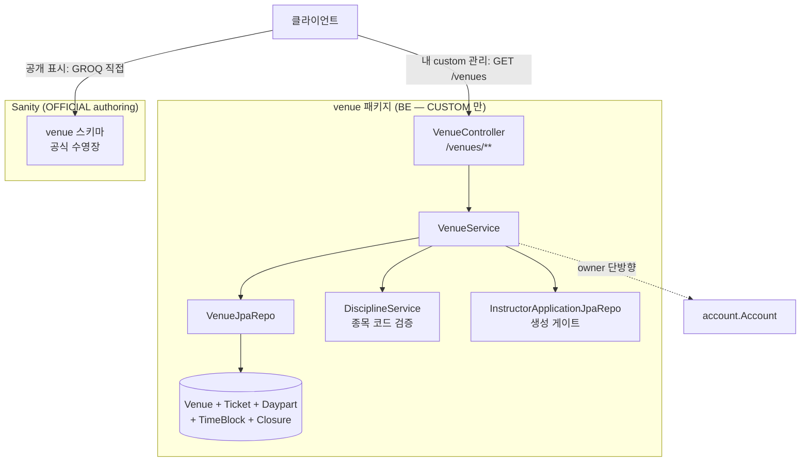
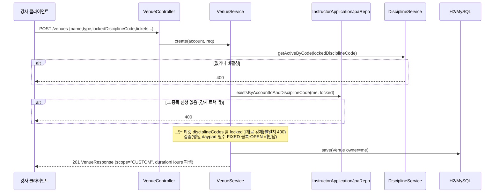
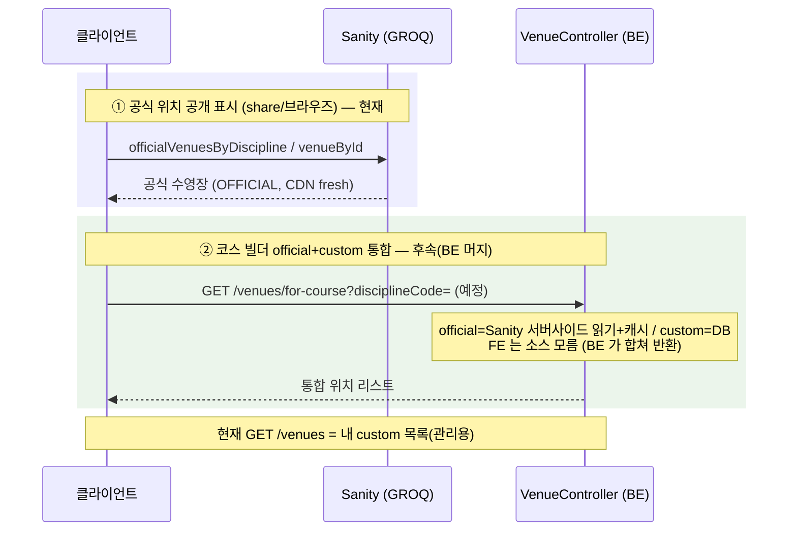

# 위치 (venue) 도메인

## 1. 한 줄 요약

**Venue(위치)** = 강의가 진행되는 장소(수영장·딥풀·해양 포인트). 장소 종속 정보(입장료·운영 시간대·이용권·정기 휴무)를 강의에서 풀지 않고 위치에 모은다. **소유 분담**: 공식(OFFICIAL) 수영장은 **Sanity authoring**(`sanity/schemas/venue.ts`), 강사 커스텀(CUSTOM, 해양/다이브 포인트)은 **이 BE 도메인**. 이 문서는 BE(커스텀) 구현 + Sanity 가 어떻게 끼는지를 다룬다.

> 도메인 개념(멘탈 모델)·정책·왜·동기화 설계는 [docs/features/venue.md](../features/venue.md) 가 소유. 이 문서는 *어떻게(구현)*.

## 2. 컴포넌트 지도



- BE 는 **커스텀만** 소유. 공식 위치 **공개 표시**는 FE 가 Sanity 에서 직접 읽는다(certOrganization·term 과 동일).
- **코스 빌더 official+custom 통합**은 후속 **BE 머지 엔드포인트**가 official(Sanity 서버사이드 읽기+캐시)+custom(DB)을 합쳐 반환 — FE 는 소스를 모른다. course 저장 시 official 검증과 같은 인프라라 course 생성과 함께(§3.2, §6).

## 3. 핵심 흐름

### 3.1 강사 커스텀 위치 생성 (게이트 + 종목 잠금)



### 3.2 읽기 경로 — 목적별 둘 (FE 는 데이터 소스를 모른다)



## 4. 데이터 모델 (BE — CUSTOM)

```mermaid
erDiagram
  Venue ||--o{ VenueTicket : tickets
  Venue ||--o{ VenueClosure : closures
  VenueTicket ||--o{ VenueDaypart : "WEEKDAY 1 + WEEKEND 0..1"
  VenueDaypart ||--o{ VenueTimeBlock : "FIXED 모드 부 리스트"
  Venue }o--|| Account : "owner (필수)"

  Venue {
    Long id
    String name
    enum type "POOL_5M|DEEP_POOL|OCEAN"
    String address
    Double latitude
    Double longitude
    Long owner_id "필수"
    String lockedDisciplineCode "필수"
  }
  VenueTicket {
    String name
    int sortOrder
    Set disciplineCodes "= lockedDisciplineCode 1개"
  }
  VenueDaypart {
    enum kind "WEEKDAY|WEEKEND"
    boolean sold
    Integer fee
    enum timeMode "FIXED|OPEN|SAME(주말전용)"
    LocalTime openStart
    LocalTime openEnd
    Integer holdHours "키반납"
  }
  VenueTimeBlock { LocalTime startTime, LocalTime endTime, int sortOrder }
  VenueClosure {
    enum type "WEEKLY|MONTHLY"
    Set weekdays "WEEKLY DayOfWeek"
    Set nths "MONTHLY 1~5"
    DayOfWeek monthlyWeekday "MONTHLY"
  }
```

설계 의도:
- **이용시간(3/5/9h)은 저장 안 함** — 시간블록/키반납에서 파생(`VenueResponse.Daypart.durationHours`). 권종은 티켓 카드 추가.
- **종목 = 코드 문자열 soft-ref**(`discipline.code`). CUSTOM 은 `lockedDisciplineCode` 1개로 강제.
- **수정 = 전량 교체 스냅샷**(`clearChildren()` + 재구성, orphanRemoval) — instructor-application 재제출과 동일.
- OFFICIAL(Sanity) 도 동형 모델(이용권·daypart·휴무) — 스키마는 `sanity/schemas/venue.ts`.

## 5. 보안 / 권한 매트릭스

매처는 `global/security/SecurityConfiguration`.

| 엔드포인트 | 인증 | 소유권 |
|---|---|---|
| `POST /venues` | 필요(authenticated) | 그 종목 강사신청 보유(상태 무관) 게이트 — 서비스 강제 |
| `GET /venues?disciplineCode=&type=` | 필요 | 내 커스텀만 (남의 것 제외) |
| `GET /venues/{id}` | 필요 | 내 커스텀만 — 아니면 400(존재 숨김) |
| `PUT/DELETE /venues/{id}` | 필요 | 내 커스텀만 — 아니면 400 |

`/venues/**` 를 `INSTRUCTOR` 역할이 아니라 `authenticated` 로 둔 이유: 리뷰 대기(SUBMITTED) 강사신청자는 아직 `STUDENT`. 근거는 [docs/features/venue.md](../features/venue.md). 없음/비소유는 **400**(`ResourceNotFoundException`) 통일.

## 6. 알려진 설계 간극 / 확장 자리

- 🟡 **코스 빌더 통합 read 엔드포인트(BE 머지) 미구현** — `GET /venues/for-course` 류로 official(Sanity 서버사이드 읽기)+custom(DB)을 BE 가 합쳐 반환(FE 소스 무지). course 저장 시 official 검증과 같은 인프라를 쓰므로 **course 생성과 함께** 구축. 지금 `GET /venues` 는 내 custom 목록(관리용)이고, 공식 위치 공개 표시는 FE 가 Sanity 직접 읽기로 충분.
- 🟡 **BE 의 OFFICIAL(Sanity) 읽기·캐시·동기화** — 위 통합 엔드포인트/availability 가 필요로 할 때: `HttpSanityVenueClient`(읽기) + Redis 캐시 + **read-side `_rev` 대조 reconcile**(정합성 바닥) + 선택 webhook. **reconcile 잡 liveness alert 필수.** 설계 상세는 [docs/features/venue.md](../features/venue.md) "캐싱·동기화·모니터링 설계".
- 🟡 **어드민 custom 오버사이트 엔드포인트** — 어드민이 custom 위치를 조회·검색(빠진 수영장 official 승격·투어 패턴). custom 은 BE DB(private)라 Sanity 가 아니라 BE admin 에서 본다.
- 🟡 **코스 생성 연동 + availability 교차** — 위치 선택 → 티켓×daypart flatten, availability ∩ Venue. availability 도메인과 함께.
- 🟢 **종목 필터 in-memory** — `disciplineCodes` 가 `@ElementCollection` 이라 내 커스텀 목록을 메모리에서 좁힌다(개수 작음).
- 🟢 투어 상품화(OCEAN 다이빙 포인트 연동).

## 7. 더 깊게: 테스트로 보기

`usecase/VenueUseCaseTest` (실 H2 + 시큐리티 체인, Redis 불필요) 가 단일 출처. `@DisplayName` 위→아래 = 사양:

- `S1` 강사가 리뷰 대기(SUBMITTED) 중 커스텀 생성 → owner=본인·종목 잠금·휴무 박힘
- `S2` 상시 입장(OPEN) → 응답 `durationHours` = 키반납 시간 파생
- `G1` 그 종목 신청 없는 계정 → 400 (게이트)
- `V1`~`V3` 종목 잠금 누락 / FIXED 블록 0개 / 잠긴 종목 불일치 → 400
- `R1`·`R2` 남의 커스텀 비가시(400) / 남의 커스텀 수정·삭제(400)
- `L1` `GET /venues` = 내 커스텀만(남의 것 제외) + 종목 필터(다른 종목이면 빈 목록)

> ⚠️ 이 레포의 `Authorization` 헤더는 **raw JWT**(`Bearer ` prefix 없음 — `JwtTokenProvider.resolveToken`). prefix 붙이면 401.
